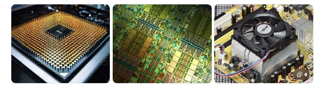
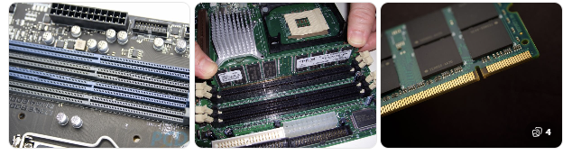
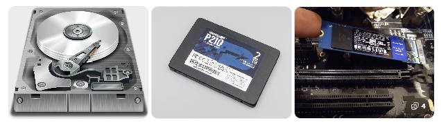
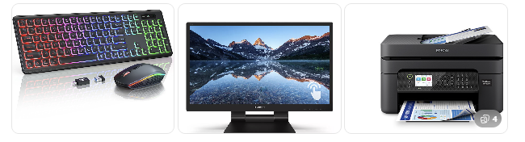

## 1. CPU (중앙처리장치, Central Processing Unit)

- 컴퓨터의 두뇌 역할
- 프로그램 명령을 해석하고 실행
- ALU(산술논리장치), 제어장치, 레지스터로 구성
- 메모리에서 명령을 가져와 처리

## 2. 메모리 (주기억장치, RAM)

- 일시적 작업 공간
- 프로그램과 데이터를 빠르게 읽고 쓰기
- 전원이 꺼지면 내용이 사라짐 (휘발성)
- CPU가 가장 빠르게 접근할 수 있는 저장 공간

## 3. 보조기억장치 (Storage)

- 대용량 장기 저장 공간
- 파일, 운영체제, 프로그램 저장
- 종류
    - HDD: 회전 디스크 기반, 저렴, 느림
    - SSD: 플래시 메모리 기반, 빠름

## 4. 입출력장치 (I/O Devices)

- 외부와 데이터를 주고 받는 장치
- 입력장치: 키보드, 마우스, 터치스크린 등
- 출력장치: 모니터, 프린터, 스피커 등
- 입출력 장치는 컴퓨터가 외부와 상호작용하는 창구