# 🧠 2강 컴퓨터 구조의 큰 그림

컴퓨터는 **데이터(재료)** 와 **명령어(행동 지시)** 를 0과 1로 표현하고,  
**CPU·메모리·보조기억장치·입출력장치**가 협력해서 명령어를 실행한다.

---

## 📌 목차
- [🧠 컴퓨터 구조의 큰 그림](#-컴퓨터-구조의-큰-그림)
  - [📌 목차](#-목차)
  - [🌍 컴퓨터는 종류가 달라도 본질은 같다](#-컴퓨터는-종류가-달라도-본질은-같다)
  - [🧩 컴퓨터 구조 큰 흐름](#-컴퓨터-구조-큰-흐름)
  - [🧾 컴퓨터가 이해하는 정보](#-컴퓨터가-이해하는-정보)
    - [🔢 데이터](#-데이터)
    - [🧩 명령어](#-명령어)
  - [🧱 컴퓨터의 네 가지 핵심 부품](#-컴퓨터의-네-가지-핵심-부품)
  - [🧩 메인보드와 시스템 버스](#-메인보드와-시스템-버스)
  - [🚌 시스템 버스의 내부 구성](#-시스템-버스의-내부-구성)
    - [🧭 주소 버스 / 📦 데이터 버스 / 🎛 제어 버스](#-주소-버스---데이터-버스---제어-버스)
    - [🔁 메모리 읽기/쓰기에서 버스가 하는 일](#-메모리-읽기쓰기에서-버스가-하는-일)
      - [✅ 메모리 값 읽기 (Memory Read)](#-메모리-값-읽기-memory-read)
      - [✅ 메모리 값 쓰기 (Memory Write)](#-메모리-값-쓰기-memory-write)
  - [🧠 메모리](#-메모리)
  - [⚙️ CPU](#️-cpu)
  - [🔁 CPU ↔ 메모리 동작 예시](#-cpu--메모리-동작-예시)
    - [1) 명령어를 메모리에서 읽어옴 (Fetch)](#1-명령어를-메모리에서-읽어옴-fetch)
    - [2) 다음 명령어도 읽고, “무엇을 해야 하는지” 파악](#2-다음-명령어도-읽고-무엇을-해야-하는지-파악)
    - [3) 필요한 데이터(3번지, 4번지)를 읽어와 계산](#3-필요한-데이터3번지-4번지를-읽어와-계산)
    - [4) 계산 결과(220)를 메모리에 기록](#4-계산-결과220를-메모리에-기록)
    - [5) 메모리 관점 정리: “명령어 / 데이터”가 함께 저장됨](#5-메모리-관점-정리-명령어--데이터가-함께-저장됨)
    - [(요약) 전체 흐름 한 장으로 보기](#요약-전체-흐름-한-장으로-보기)
  - [✅ 정리](#-정리)

---

## 🌍 컴퓨터는 종류가 달라도 본질은 같다

작은 컴퓨터(임베디드)부터 스마트폰, 노트북, 서버까지 형태는 달라도  
**컴퓨터가 작동하는 기본 구조(큰 그림)** 는 동일하다.

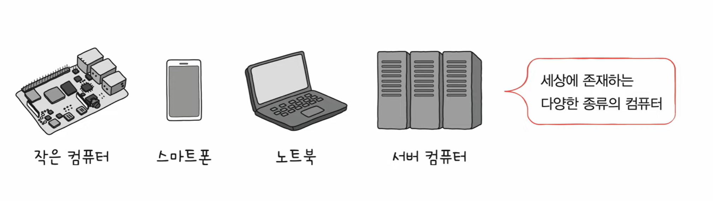

- **설명:** 다양한 형태의 컴퓨터(임베디드/스마트폰/노트북/서버)를 보여준다.
- **포인트:** 겉모습은 달라도 “정보(데이터/명령어) + 핵심 부품”이라는 구조는 같다.

---

## 🧩 컴퓨터 구조 큰 흐름

컴퓨터 구조를 큰 틀로 보면 다음 두 덩어리로 잡으면 된다.

1) **컴퓨터가 이해하는 정보**: 데이터 / 명령어  
2) **컴퓨터의 네 가지 핵심 부품**: CPU / 메모리 / 보조기억장치 / 입출력장치  

- **설명:** 컴퓨터 구조를 “정보”와 “핵심 부품” 두 갈래로 나눈 개요도.
- **포인트:** 앞으로의 학습이 이 두 축으로 전개된다는 걸 먼저 잡고 간다.

---

## 🧾 컴퓨터가 이해하는 정보

컴퓨터가 처리하는 정보는 **데이터(Data)** 와 **명령어(Instruction)** 로 나뉜다.

### 🔢 데이터
- 숫자, 문자, 이미지, 동영상 같은 **정적인 정보**
- 컴퓨터와 주고받거나 내부에 저장되는 정보도 넓게 “데이터”라고 부르기도 함
- 데이터 표현의 핵심
  - **0과 1로 숫자 표현**
  - **0과 1로 문자 표현**

### 🧩 명령어
- 컴퓨터는 결국 **명령어를 처리하는 기계**
- 명령어
  - 컴퓨터를 실질적으로 움직이는 정보
  - 데이터는 명령어가 처리할 **재료** 역할
- 학습 포인트
  - **명령어의 생김새**
  - **명령어의 동작 방식(읽기/해석/실행 흐름)**

---

## 🧱 컴퓨터의 네 가지 핵심 부품

- **CPU**: 명령어를 읽고 해석하고 실행
- **메모리**: 실행 중인 프로그램의 **명령어/데이터** 저장
- **보조기억장치**: 전원이 꺼져도 보관되는 정보 저장
- **입출력장치**: 컴퓨터 밖과 정보를 주고받는 장치

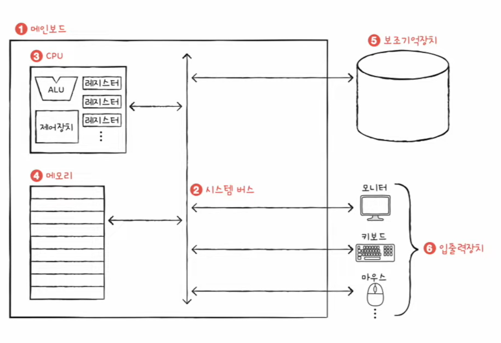

- **설명:** CPU/메모리/입출력장치/보조기억장치가 서로 연결되어 동작하는 큰 구조.
- **포인트:** “CPU 혼자”가 아니라, 주변 부품들과 **정보를 주고받으며** 실행이 일어난다.

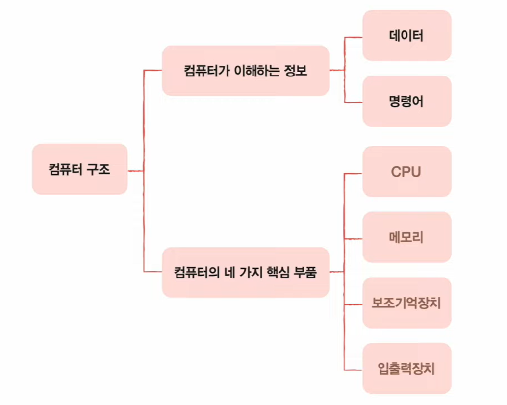

- **설명:** 네 가지 핵심 부품을 목록처럼 정리한 구조도(트리 형태).
- **포인트:** 앞으로 각 부품을 하나씩 깊게 들어갈 때 기준점이 된다.

---

## 🧩 메인보드와 시스템 버스

- **메인보드**는 CPU/메모리/입출력장치/보조기억장치를 연결하는 판이다.
- 이 부품들은 메인보드 위에서 **시스템 버스(System Bus)** 를 통해 정보를 주고받는다.

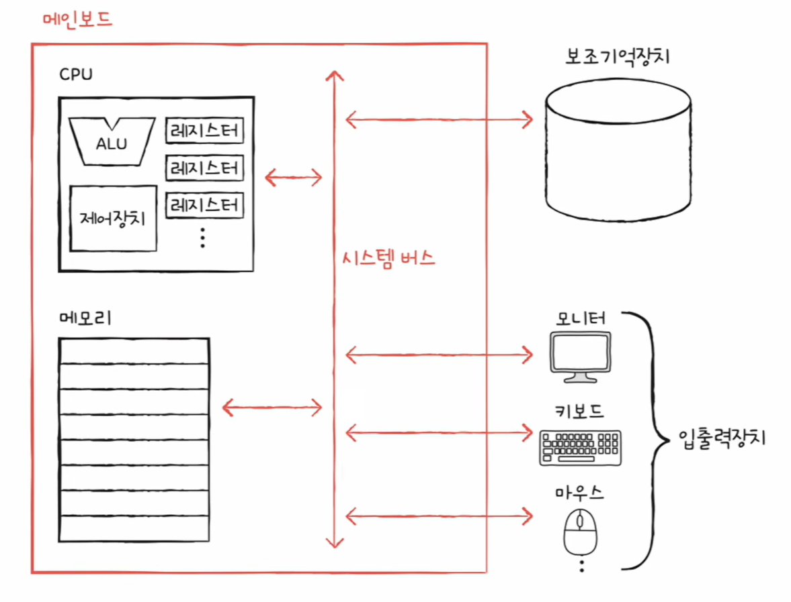

- **설명:** 메인보드 위에서 CPU/메모리와 외부 장치(입출력/보조기억장치)가 연결되는 모습.
- **포인트:** “연결 통로” 역할이 **시스템 버스**이며, 이 통로를 통해 데이터/명령어/제어가 오간다.

---

## 🚌 시스템 버스의 내부 구성

시스템 버스는 “한 줄짜리 통로”가 아니라, 역할에 따라 나뉜 통로들의 묶음으로 이해하면 된다.

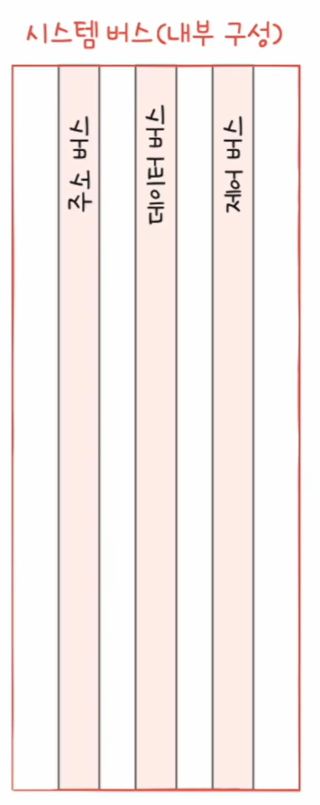

- **설명:** 시스템 버스가 내부적으로 어떤 구성(종류)을 갖는지 보여준다.
- **포인트:** 주소/데이터/제어는 “같이 움직이지만 역할은 분리”되어 있다.

### 🧭 주소 버스 / 📦 데이터 버스 / 🎛 제어 버스

- **주소 버스(Address Bus)**  
  - *어디(어느 주소/번지)를 읽거나 쓸지* 전달
- **데이터 버스(Data Bus)**  
  - *실제로 오가는 값(명령어/데이터)* 전달
- **제어 버스(Control Bus)**  
  - *읽기/쓰기 같은 제어 신호* 전달 (예: “메모리 읽기”, “메모리 쓰기”)

---

### 🔁 메모리 읽기/쓰기에서 버스가 하는 일

#### ✅ 메모리 값 읽기 (Memory Read)

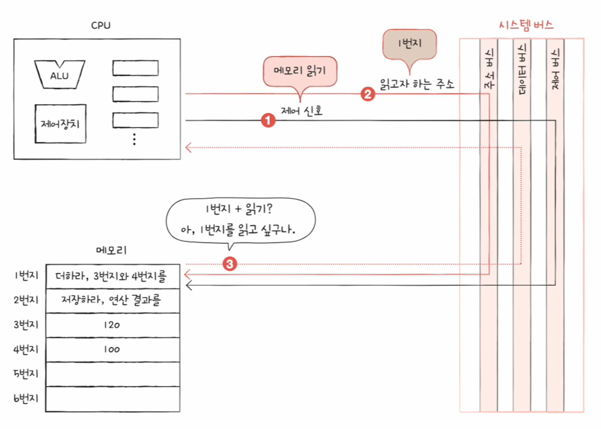

- **설명:** CPU가 메모리에서 값을 “읽어오는” 과정을 버스 관점에서 분해한 그림.
- **포인트(핵심 3개):**
  1. **제어 버스**로 “읽기” 신호를 보냄  
  2. **주소 버스**로 “읽을 번지(주소)”를 보냄  
  3. **데이터 버스**로 “해당 주소의 값”이 CPU로 들어옴

#### ✅ 메모리 값 쓰기 (Memory Write)

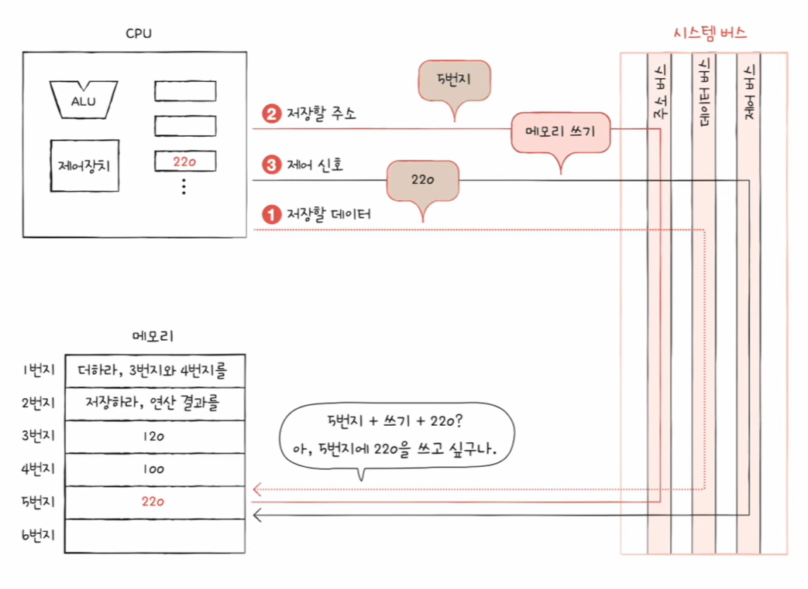

- **설명:** CPU가 메모리에 값을 “저장(쓰기)”하는 과정을 버스 관점에서 분해한 그림.
- **포인트(핵심 3개):**
  1. **데이터 버스**로 “저장할 값”을 보냄  
  2. **주소 버스**로 “저장할 번지(주소)”를 보냄  
  3. **제어 버스**로 “쓰기” 신호를 보냄

---

## 🧠 메모리

- 프로그램이 실행되려면, 실행에 필요한 **명령어와 데이터가 메모리에 올라와야** 한다.
- 메모리는 보통 **주소(번지)** 로 구분된 칸에 정보를 저장한다.
- 특징: **휘발성** (전원이 꺼지면 저장 내용이 사라짐)

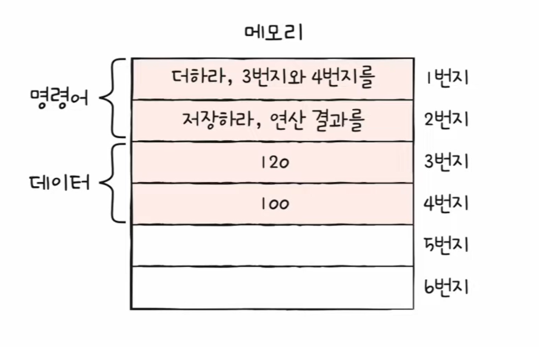

- **설명:** 메모리에 “명령어 영역”과 “데이터 영역”이 함께 존재하는 예시.
- **포인트:** CPU는 명령어를 실행하면서 필요할 때 데이터 영역의 값을 읽어 계산한다.

---

## ⚙️ CPU

- CPU는 메모리에 있는 명령어를 **읽어 들이고(Fetch)** → **해석(Decode)** → **실행(Execute)** 한다.
- CPU 내부 핵심 구성요소(개념)
  - **ALU**: 계산 담당
  - **레지스터**: CPU 내부의 임시 저장 공간
  - **제어장치**: 제어 신호를 내보내고 명령어 실행 흐름을 조정

---

## 🔁 CPU ↔ 메모리 동작 예시

아래 예시는 “메모리에 저장된 값”을 CPU가 읽어서 계산하고, 결과를 다시 메모리에 저장하는 흐름이다.

- 메모리(예시)
  - 1번지: `더하라, 3번지와 4번지를`
  - 2번지: `저장하라, 연산 결과를`
  - 3번지: `120`
  - 4번지: `100`
  - (결과) 5번지에 `220` 저장

---

### 1) 명령어를 메모리에서 읽어옴 (Fetch)
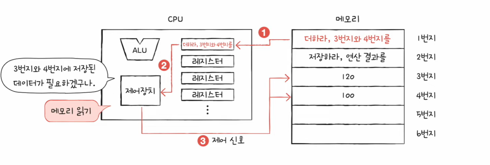

- **설명:** CPU가 메모리에서 “실행할 명령어”를 읽어온다.
- **포인트:** 실행의 시작은 항상 **명령어 fetch**부터다.

### 2) 다음 명령어도 읽고, “무엇을 해야 하는지” 파악
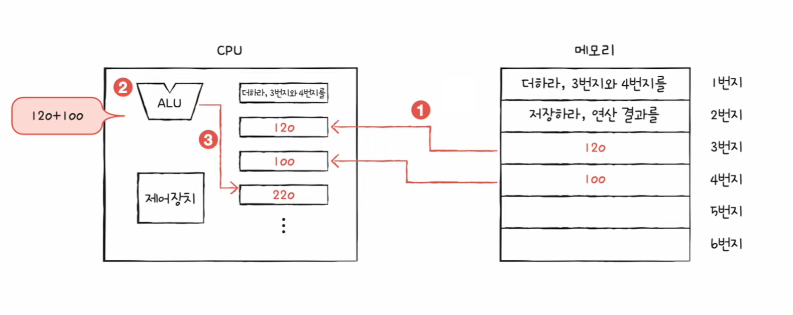

- **설명:** 읽어온 명령어를 보고 “다음에 할 일”을 파악하는 단계.
- **포인트:** 어떤 데이터가 필요한지(예: 3번지, 4번지)를 이 단계에서 알게 된다.

### 3) 필요한 데이터(3번지, 4번지)를 읽어와 계산
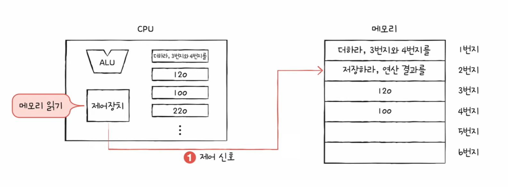

- **설명:** 메모리에서 피연산자(120, 100)를 읽고 ALU로 계산한다.
- **포인트:** **데이터 읽기 + ALU 연산**이 결합된 실행 단계.

### 4) 계산 결과(220)를 메모리에 기록
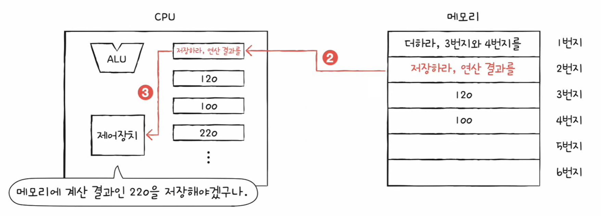

- **설명:** 계산 결과를 메모리의 특정 주소(예: 5번지)에 저장한다.
- **포인트:** 결과를 저장할 때도 버스를 통해 **주소/데이터/제어 신호**가 함께 움직인다.

### 5) 메모리 관점 정리: “명령어 / 데이터”가 함께 저장됨
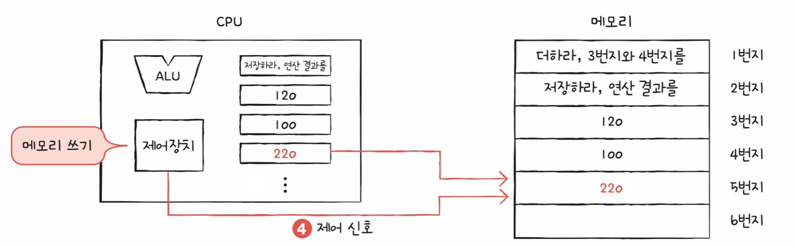

- **설명:** 메모리에는 명령어와 데이터가 함께 있으며, CPU는 둘 다를 가져다 쓴다.
- **포인트:** “명령어만 읽는 곳”이 아니라 **명령어/데이터가 공존**한다.

---

### (요약) 전체 흐름 한 장으로 보기
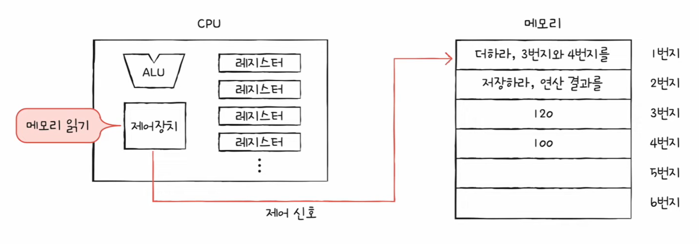

- **설명:** 위 1~5 흐름을 한 장으로 묶은 전체 요약 그림.
- **포인트:** CPU↔메모리 상호작용의 큰 흐름을 빠르게 복습할 때 사용.

---

## ✅ 정리

- 컴퓨터는 **명령어를 실행**하는 기계이고, 명령어는 **데이터를 재료로** 사용한다.
- 실행은 **CPU**, 실행 중 저장은 **메모리**, 장기 보관은 **보조기억장치**, 외부와 교환은 **입출력장치**가 담당한다.
- 핵심 부품들은 메인보드의 **시스템 버스(주소/데이터/제어)** 를 통해 정보를 주고받는다.
- CPU는 메모리에서 **명령어/데이터를 읽고**, 계산 후 **결과를 다시 메모리에 저장**한다.
