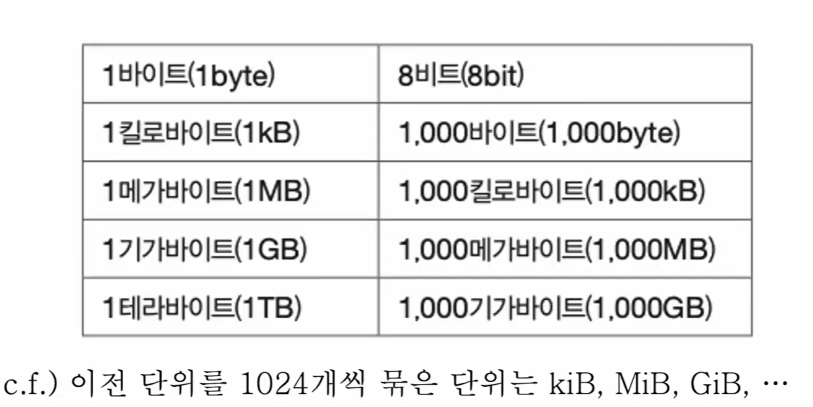
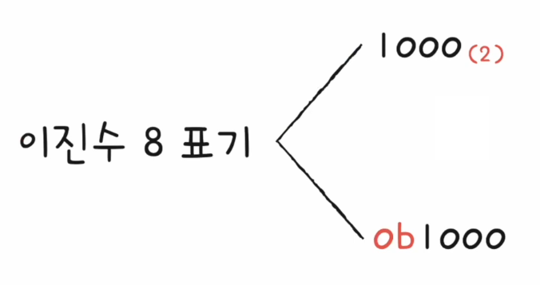
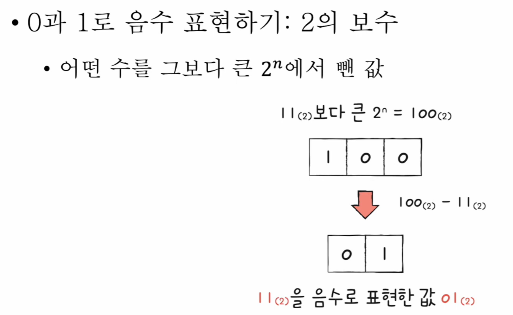
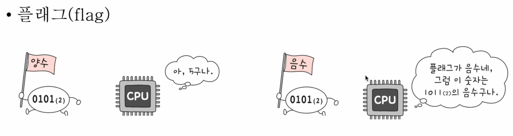
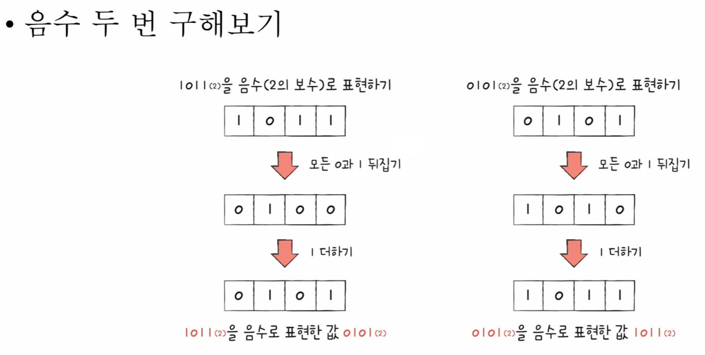
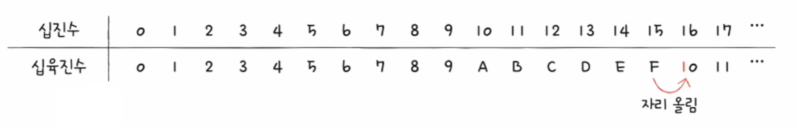
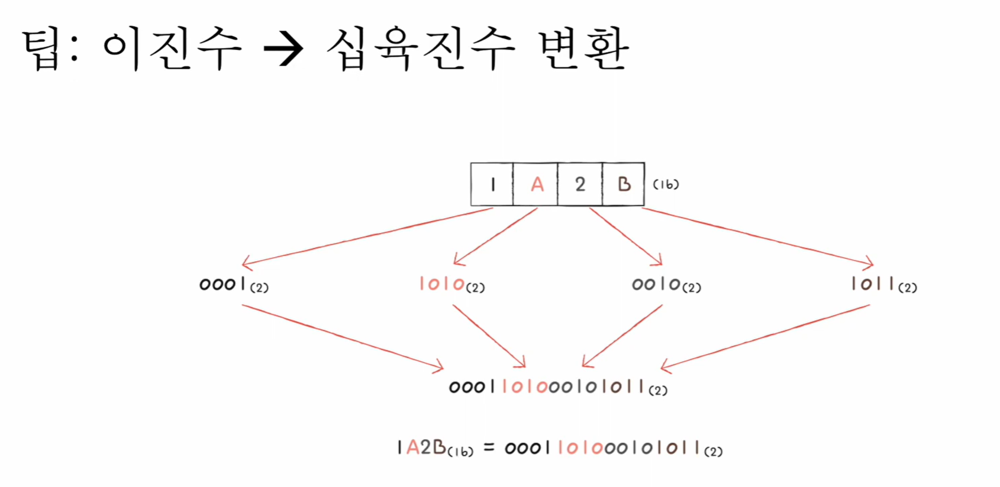
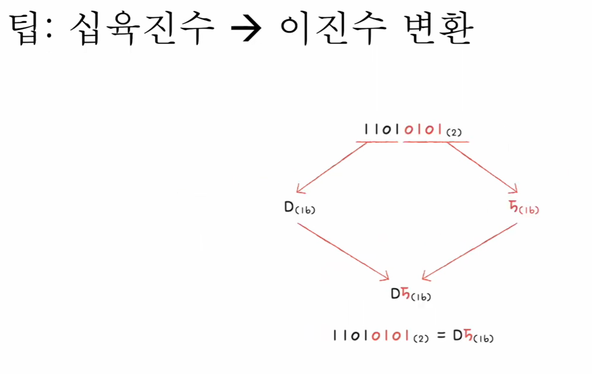

## 🧠 4강. 0과 1로 숫자를 표현하는 방법

컴퓨터는 모든 정보를 **0과 1**로 표현한다.  
이번 장에서는 0과 1이 **숫자(특히 음수 포함)** 를 어떻게 표현하는지, 그리고 그 과정에서 등장하는 **정보 단위 / 진법 / 표기법 / 플래그 / 2의 보수 / 16진수 변환 팁**까지 한 번에 정리한다.

---

## 📌 목차
- [🧠 4강. 0과 1로 숫자를 표현하는 방법](#-4강-0과-1로-숫자를-표현하는-방법)
- [📌 목차](#-목차)
- [📦 정보 단위](#-정보-단위)
  - [🧩 비트(bit)](#-비트bit)
  - [🧠 워드(word)](#-워드word)
- [🔢 이진법: 0과 1로 숫자 표현하기](#-이진법-0과-1로-숫자-표현하기)
  - [🧮 이진법(binary)](#-이진법binary)
  - [✍️ 이진수 표기법](#️-이진수-표기법)
- [➖ 0과 1로 음수 표현하기](#-0과-1로-음수-표현하기)
  - [🧠 2의 보수(개념)](#-2의-보수개념)
  - [🚩 플래그(flag)로 해석 구분](#-플래그flag로-해석-구분)
  - [🙂 2의 보수 쉽게 이해하기](#-2의-보수-쉽게-이해하기)
- [🔷 16진법](#-16진법)
  - [📌 왜 16진법을 쓰나](#-왜-16진법을-쓰나)
  - [✍️ 16진수 표기법](#️-16진수-표기법)
  - [🔁 변환 팁: 이진수 ↔ 16진수](#-변환-팁-이진수--16진수)
    - [✅ 이진수 → 16진수](#-이진수--16진수)
    - [✅ 16진수 → 이진수](#-16진수--이진수)
- [✅ 핵심 요약](#-핵심-요약)

---

## 📦 정보 단위

### 🧩 비트(bit)

- 0과 1을 표현하는 **가장 작은 정보 단위**
- n비트로 2n가지의 정보 표현 가능
- 프로그램/데이터는 수많은 비트로 이루어져 있음
- 다만 현실에서는 보통 “비트”가 아니라 더 큰 단위를 사용  
  - 바이트(Byte), 킬로바이트(KB), 메가바이트(MB), 기가바이트(GB), 테라바이트(TB) …

---

### 🧠 워드(word)

- CPU가 한 번에 처리할 수 있는 정보의 크기 단위
- 하프 워드(half word): 워드의 절반
- 풀 워드(full word): 워드 크기
- 더블 워드(double word): 워드의 두 배

---

## 🔢 이진법: 0과 1로 숫자 표현하기

### 🧮 이진법(binary)

- 0과 1로 수를 표현하는 방법
- 숫자가 1을 넘어가는 시점에 **자리올림**
- 우리가 일상적으로 쓰는 진법은 9를 넘어갈 때 자리올림하는 **십진법(decimal)**

---

### ✍️ 이진수 표기법

같은 `1000`이라도 “2진수인지”가 명시되지 않으면 헷갈릴 수 있다.  
그래서 보통 아래처럼 **표기**를 함께 쓴다.

- **수학적 표기(진법 표기):** 1000(2)
- **코드 표기(프로그래밍 표기):** 0b1000

---

## ➖ 0과 1로 음수 표현하기

### 🧠 2의 보수(개념)

컴퓨터는 음수를 표현할 때 **2의 보수(two’s complement)** 방식을 많이 사용한다.

- 핵심 아이디어: **모든 0과 1을 뒤집고, 1을 더한 값**으로 음수를 표현

---

### 🚩 플래그(flag)로 해석 구분

0101(2) 같은 **비트 패턴**은 똑같아 보이지만,  
CPU는 **플래그(flag)** 같은 상태값(또는 해석 규칙)에 따라 “양수/음수”로 **해석을 달리**할 수 있다.

---

### 🙂 2의 보수 쉽게 이해하기

처음엔 “왜 굳이 뒤집고 1을 더하지?”가 낯설 수 있어서,  
강의 흐름처럼 **직관 버전 → 예시**로 한 번 더 정리한다.

---

## 🔷 16진법

### 📌 왜 16진법을 쓰나

이진수는 숫자가 커질수록 **자리수가 너무 길어져** 읽고 쓰기 불편하다.

- 예: 십진수 32 = 이진수 `100000`

그래서 컴퓨터 분야에서는 데이터를 표현할 때 **16진법(hex)** 도 매우 자주 사용한다.

---

### ✍️ 16진수 표기법

- **수학적 표기(진법 표기):** 15(16)
- **코드 표기(프로그래밍 표기):** 0x15

---

### 🔁 변환 팁: 이진수 ↔ 16진수

16진수는 “한 자리”가 이진수 **4비트**와 1:1로 대응한다.  
그래서 변환할 때는 **4비트씩 끊어 묶기**가 핵심이다.

#### ✅ 이진수 → 16진수
- 이진수를 **오른쪽부터 4비트씩** 끊는다
- 각 4비트를 16진수 한 자리로 바꿔 붙인다

#### ✅ 16진수 → 이진수
- 16진수 한 자리를 **4비트 이진수**로 바꾼 뒤,
- 그대로 이어 붙이면 된다

---

## ✅ 핵심 요약

- **비트(bit)**: 0/1을 표현하는 최소 단위, n비트 → 2n가지 표현
- **워드(word)**: CPU가 한 번에 처리하는 데이터 크기 단위
- **이진법**: 0과 1로 숫자를 표현하며 자리올림 규칙이 있음
- **이진수 표기**: 1000(2) 또는 0b1000
- **음수 표현(2의 보수)**: “모든 비트 반전 + 1 더하기”
- **플래그(flag)**: 같은 비트 패턴도 **해석 규칙/상태**에 따라 의미가 달라질 수 있음
- **16진수 표기**: 15(16) 또는 0x15
- **이진수↔16진수 변환**: 16진수 한 자리는 **이진수 4비트**와 대응 → “4비트씩 끊기”가 핵심
