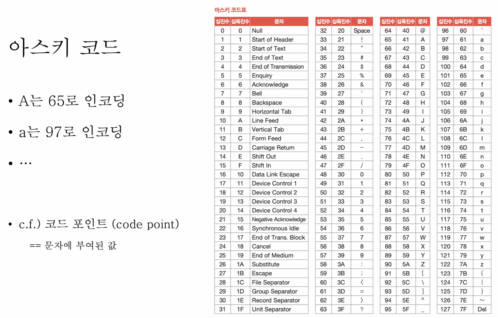
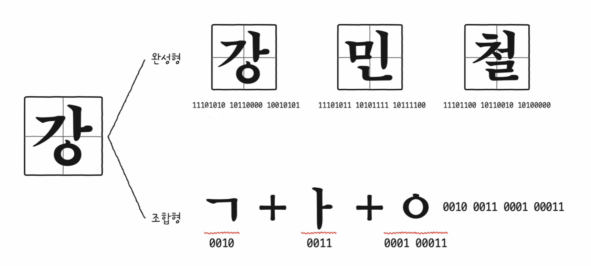
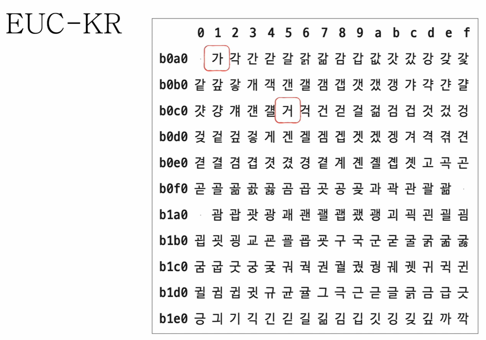
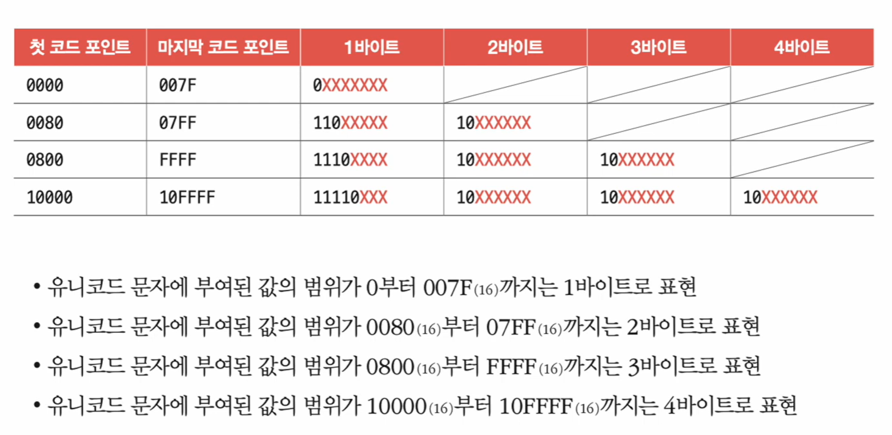
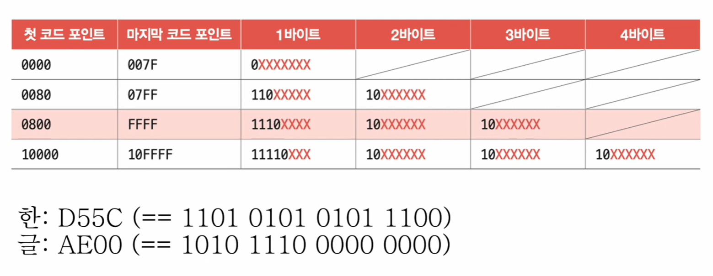

# 🧠 5강 0과 1로 문자를 표현하는 방법

컴퓨터는 문자를 **직접** 이해하지 못하고, 결국 **0과 1(비트)** 로 바꿔 저장/전송/처리한다.  
이때 핵심은 다음 2가지다.

- 🧩 **문자 집합(Character Set)**: 어떤 문자들을 “문자”로 취급할 것인가?
- 🧷 **인코딩(Encoding)**: 그 문자를 어떤 규칙으로 0과 1로 바꿀 것인가?

---

## 📌 목차
- [🧠 5강 0과 1로 문자를 표현하는 방법](#-5강-0과-1로-문자를-표현하는-방법)
  - [📌 목차](#-목차)
  - [🧩 문자 집합과 인코딩](#-문자-집합과-인코딩)
    - [문자 집합(Character Set)](#문자-집합character-set)
    - [인코딩(Encoding)](#인코딩encoding)
    - [디코딩(Decoding)](#디코딩decoding)
  - [🔤 아스키 코드(ASCII)](#-아스키-코드ascii)
  - [🔁 🇰🇷 한글 인코딩: 완성형 vs 조합형](#--한글-인코딩-완성형-vs-조합형)
  - [📎 EUC-KR](#-euc-kr)
  - [🌍 유니코드(Unicode)와 UTF-8](#-유니코드unicode와-utf-8)
    - [유니코드(Unicode)](#유니코드unicode)
    - [UTF-8](#utf-8)
  - [✅ 정리](#-정리)

---

## 🧩 문자 집합과 인코딩

### 문자 집합(Character Set)
- 컴퓨터가 이해할 수 있는 **문자의 모음**

### 인코딩(Encoding)
- 문자를 0과 1로 이루어진 **문자 코드**로 변환하는 과정

### 디코딩(Decoding)
- 0과 1로 표현된 문자 코드를 다시 **문자**로 변환하는 과정

> 개발 중 글자가 깨지면 **인코딩/디코딩 방식 불일치** 또는 **문자 집합에 없는 문자 사용**을 먼저 의심할 수 있다.

---

## 🔤 아스키 코드(ASCII)

- 초창기 문자 집합 중 하나
- 알파벳, 아라비아 숫자, 일부 특수 문자 및 제어 문자 포함
- **7비트로 문자 1개 표현**
  - (8비트 환경에서 남는 1비트는 오류 검출용 패리티 비트로 쓰이기도 함)
- 표현 가능한 문자 수: `2^7 = 128`

> 🧾 *ASCII 코드 예시: 문자에 숫자(코드)가 매핑됨*

✅ 장점  
- 인코딩 방식이 단순함

❌ 한계  
- 🇰🇷 한글 포함 다양한 언어 문자 표현 불가
- 확장 아스키(Extended ASCII)가 등장했지만 여전히 제한적

---

## 🔁 🇰🇷 한글 인코딩: 완성형 vs 조합형

한글은 **초성/중성/종성** 조합으로 글자가 만들어진다.
그래서 한글을 표현하는 방식도 크게 2가지가 있다.

- **완성형 인코딩**: “가, 강, …” 같은 *완성된 글자* 단위로 코드 부여
- **조합형 인코딩**: 초성/중성/종성을 *조합*하여 글자 구성

> *완성형 vs 조합형 개념 예시*

---

## 📎 EUC-KR

- **KS X 1001 / KS X 1003** 문자 집합 기반 한글 인코딩
- **완성형 인코딩 방식**
- 글자 하나에 **2바이트(16비트)** 코드 부여
  - 2바이트 = 16비트 = 16진수 4자리로 표현 가능
- 약 **2300여 개 한글** 표현 가능

> *EUC-KR에서 특정 글자가 배치(코드화)되는 방식 예시*

❌ 한계  
- 모든 한글 표현 불가 (예: `쀏`, `뙠`, `휔` 등)
- 국가/언어별 인코딩이 달라지면 다국어 프로그램 개발/호환이 어려워짐

🔎 참고(인코딩 확인): https://dencode.com/

---

## 🌍 유니코드(Unicode)와 UTF-8

“언어별로 따로 인코딩을 만들지 말고, **통일된 문자 집합**을 만들자”는 흐름에서 등장.

### 유니코드(Unicode)
- 통일된 문자 집합
- 🇰🇷 한글/🇺🇸 영어/특수문자/이모지까지 표현 가능
- 각 문자에는 고유한 16진수 값이 부여됨 → 🏷 **유니코드 코드 포인트(Code Point)**

### UTF-8
- UTF(Unicode Transformation Format): 유니코드를 0과 1(바이트열)로 바꾸는 인코딩 규칙
- **가변 길이 인코딩(1~4바이트)**
- 몇 바이트가 되는지는 코드 포인트 범위에 따라 달라짐

> *코드 포인트 범위에 따라 UTF-8 바이트 수가 달라짐*

> *UTF-8 인코딩 예시(코드 포인트/비트 패턴)*

---

## ✅ 정리

- 문자는 결국 **0과 1로 변환(인코딩)** 되어 저장/처리된다.
- 핵심 개념 3가지
  - **문자 집합**: 다룰 수 있는 문자 목록
  - **인코딩**: 문자 → 0과 1
  - **디코딩**: 0과 1 → 문자
- 개발 중 글자가 깨지면
  - 인코딩/디코딩 불일치
  - 문자 집합 미지원
  - 이 두 가지를 우선 의심할 수 있어야 한다.
