# 🧠 7강 명령어의 구조와 주소 지정 방식

컴퓨터는 사람이 작성한 코드를 **명령어(instruction)** 형태로 실행한다.  
명령어는 크게 **“무엇을(대상) / 어떻게(행동)”** 를 담는 구조로 되어 있고,  
CPU는 **오퍼랜드를 해석(주소 지정)** 해서 필요한 데이터를 찾아 연산을 수행한다.

---

## 📌 목차
- [🧠 7강 명령어의 구조와 주소 지정 방식](#-7강-명령어의-구조와-주소-지정-방식)
  - [📌 목차](#-목차)
  - [🧩 1) 명령어의 구조](#-1-명령어의-구조)
  - [🧷 2) 오퍼랜드(Operand)](#-2-오퍼랜드operand)
  - [🧠 3) 연산 코드(OP-code)](#-3-연산-코드op-code)
    - [🧾 연산 코드의 대표 분류](#-연산-코드의-대표-분류)
  - [🧰 4) 대표적인 연산 코드 종류](#-4-대표적인-연산-코드-종류)
    - [📦 4-1. 데이터 전송](#-4-1-데이터-전송)
      - [🧺 참고: 스택 vs 큐](#-참고-스택-vs-큐)
    - [➕ 4-2. 산술 / 논리 연산](#-4-2-산술--논리-연산)
    - [🧭 4-3. 제어 흐름 변경](#-4-3-제어-흐름-변경)
    - [🔌 4-4. 입출력 제어](#-4-4-입출력-제어)
  - [🗺️ 5) 명령어 주소 지정 방식(Addressing Mode)](#️-5-명령어-주소-지정-방식addressing-mode)
    - [❓ 5-1. 왜 “데이터”를 직접 안 쓰고 “주소”를 쓰는가?](#-5-1-왜-데이터를-직접-안-쓰고-주소를-쓰는가)
      - [🧮 예시 개념 (비트 수가 줄어들면 표현 가능한 값도 줄어듦)](#-예시-개념-비트-수가-줄어들면-표현-가능한-값도-줄어듦)
    - [🎯 5-2. 유효 주소(Effective Address)](#-5-2-유효-주소effective-address)
    - [🧭 5-3. 주소 지정 방식(Addressing Modes)](#-5-3-주소-지정-방식addressing-modes)
  - [🧪 6) 대표적인 주소 지정 방식들](#-6-대표적인-주소-지정-방식들)
    - [⚡ 6-1. 즉시 주소 지정 방식 (Immediate Addressing Mode)](#-6-1-즉시-주소-지정-방식-immediate-addressing-mode)
    - [📍 6-2. 직접 주소 지정 방식 (Direct Addressing Mode)](#-6-2-직접-주소-지정-방식-direct-addressing-mode)
    - [🪆 6-3. 간접 주소 지정 방식 (Indirect Addressing Mode)](#-6-3-간접-주소-지정-방식-indirect-addressing-mode)
    - [🧱 6-4. 레지스터 주소 지정 방식 (Register Addressing Mode)](#-6-4-레지스터-주소-지정-방식-register-addressing-mode)
    - [🧲 6-5. 레지스터 간접 주소 지정 방식 (Register Indirect Addressing Mode)](#-6-5-레지스터-간접-주소-지정-방식-register-indirect-addressing-mode)
  - [📊 7) 주소 지정 방식 비교표 (속도 / 메모리 접근 / 장단점)](#-7-주소-지정-방식-비교표-속도--메모리-접근--장단점)
  - [✅ 한 줄 요약](#-한-줄-요약)

---

## 🧩 1) 명령어의 구조

명령어는 보통 아래 2가지로 구성된다.

- **연산 코드(OP-code)**: “무엇을 수행할지”
- **오퍼랜드(Operand)**: “무엇을 대상으로 수행할지”
  - 데이터 자체일 수도 있고
  - **데이터가 저장된 위치(주소)** 일 수도 있다.

> ✅ 정리:  
> 명령어 = **연산 코드** + **오퍼랜드(들)**

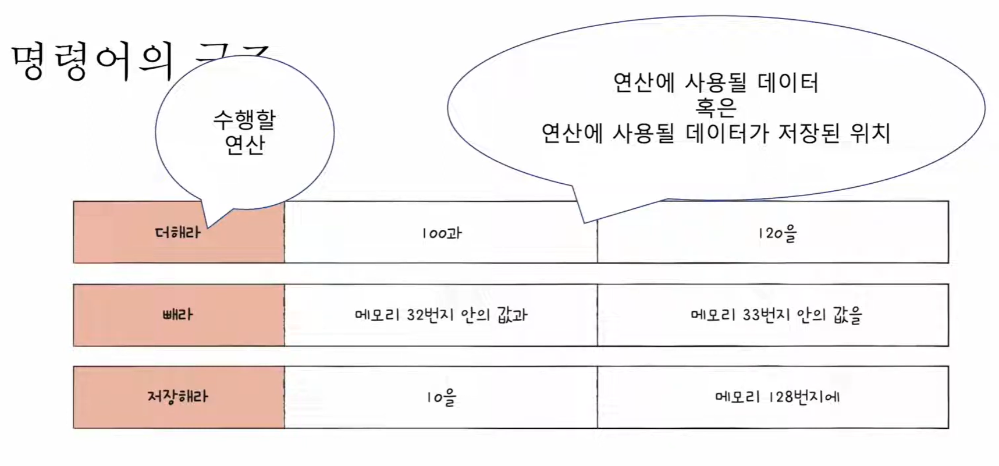
> 🖼️ 그림 설명  
> - 왼쪽(연산 코드): “수행할 연산(더해라/빼라/저장해라…)”  
> - 오른쪽(오퍼랜드): “연산에 사용될 데이터” 또는 “데이터가 저장된 위치(주소)”

---

## 🧷 2) 오퍼랜드(Operand)

오퍼랜드는 다음 중 하나를 의미한다.

- **연산에 사용할 데이터**
- **연산에 사용할 데이터가 저장된 위치(주소 필드)**

그리고 실제로는 **데이터 자체보다 “데이터가 저장된 위치(주소)”가 더 많이 저장된다.**  
그래서 오퍼랜드 필드를 **주소 필드(Address field)** 라고도 부른다.

또한 오퍼랜드는
- **없을 수도 있고**
- **1개 이상일 수도 있다.**

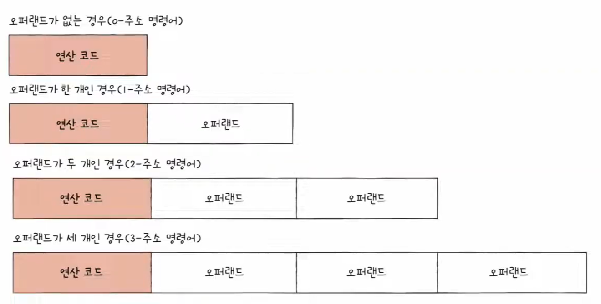
> 🖼️ 그림 설명  
> - 0-주소 명령어: 오퍼랜드 없음(연산 코드만)  
> - 1-주소/2-주소/3-주소 명령어: 오퍼랜드 필드가 1~3개로 늘어남  
> - 오퍼랜드 개수가 늘면 명령어 안에서 “각 오퍼랜드가 가질 수 있는 비트 수”는 줄어드는 경향이 있음

---

## 🧠 3) 연산 코드(OP-code)

연산 코드는 “수행할 연산”을 의미한다.

- 연산 코드의 종류 & 형태는 **CPU마다 다르다.**

### 🧾 연산 코드의 대표 분류
- 데이터 전송
- 산술/논리 연산
- 제어 흐름 변경
- 입출력 제어

---

## 🧰 4) 대표적인 연산 코드 종류

### 📦 4-1. 데이터 전송
- `MOVE` : 데이터를 옮겨라
- `STORE` : 메모리에 저장하라
- `LOAD(FETCH)` : 메모리 → CPU로 데이터를 가져와라
- `PUSH` : 스택에 데이터를 저장하라
- `POP` : 스택의 최상단 데이터를 가져와라

#### 🧺 참고: 스택 vs 큐
- **스택(Stack)**: 양쪽이 막혀있고 **후입선출(LIFO)**
- **큐(Queue)**: 양쪽 끝이 뚫려있고 **선입선출(FIFO)**

🖼️ 스택 / 큐 이미지 보기

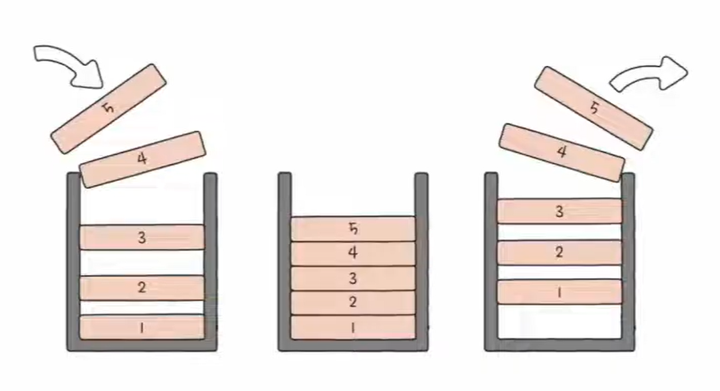
> 🖼️ 그림 설명: 스택은 **나중에 들어간 게 먼저 나온다(LIFO)** → `PUSH`/`POP`과 함께 자주 등장

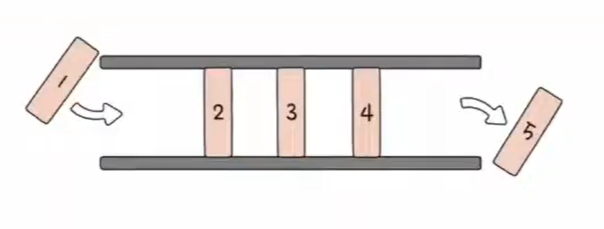
> 🖼️ 그림 설명: 큐는 **먼저 들어간 게 먼저 나온다(FIFO)** → 대기열/버퍼 같은 구조에 자주 사용

---

### ➕ 4-2. 산술 / 논리 연산
- `ADD / SUBTRACT / MULTIPLY / DIVIDE` : 덧셈 / 뺄셈 / 곱셈 / 나눗셈
- `INCREMENT / DECREMENT` : 오퍼랜드에 1을 더하라 / 1을 빼라
- `AND / OR / NOT` : 논리 연산
- `COMPARE` : 두 값(또는 TRUE/FALSE)을 비교하라

---

### 🧭 4-3. 제어 흐름 변경
- `JUMP` : 특정 주소로 실행 순서를 옮겨라
- `CONDITIONAL JUMP` : 조건일 때 특정 주소로 옮겨라
- `HALT` : 프로그램 실행을 멈춰라
- `CALL` : 되돌아올 주소 저장 후, 특정 주소로 옮겨라
- `RETURN` : `CALL`에서 저장한 주소로 돌아가라

---

### 🔌 4-4. 입출력 제어
- `READ(INPUT)` : 특정 장치로부터 데이터를 읽어라
- `WRITE(OUTPUT)` : 특정 장치로 데이터를 써라
- `START IO` : 입출력 장치를 시작하라
- `TEST IO` : 입출력 장치의 상태를 확인하라

---

## 🗺️ 5) 명령어 주소 지정 방식(Addressing Mode)

### ❓ 5-1. 왜 “데이터”를 직접 안 쓰고 “주소”를 쓰는가?

오퍼랜드에 연산에 사용할 데이터를 **직접** 쓰면 직관적이지만, 현실적으로는 한계가 있다.

- 명령어 내에서 표현할 수 있는 **데이터 크기가 제한**되기 때문

#### 🧮 예시 개념 (비트 수가 줄어들면 표현 가능한 값도 줄어듦)
명령어 크기가 16bit이고,
- 연산 코드(OP-code)가 4bit,
- 오퍼랜드가 2개라면

오퍼랜드가 가질 수 있는 비트는 제한된다.

- 오퍼랜드(2개)라면 각 6bit 가능 → `2^6 = 64`개 표현
- 오퍼랜드가 1개 더 늘어나면 각 비트는 더 줄어든다 (예: 4bit 수준) → `2^4 = 16`개 표현

즉, 오퍼랜드에 `1000`, `50000` 같은 큰 값을 **직접** 넣는 건 어렵다.

✅ 해결: 오퍼랜드에 **데이터 자체가 아니라 “데이터가 있는 위치(주소)”** 를 넣는다.  
그러면 명령어가 표현할 수 있는 범위를 훨씬 넓힐 수 있다.

또한 데이터는
- 메모리 주소에 있을 수도 있고
- 레지스터에 있을 수도 있다.

🖼️ 비트 수 제한 예시 이미지(1~4)

> 🖼️ 그림 설명: 16bit 중 OP-code 4bit, 오퍼랜드 2개면 각 6bit → `2^6 = 64`

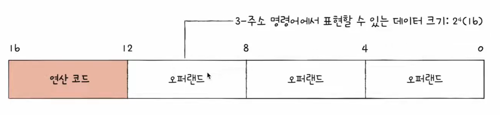
> 🖼️ 그림 설명: 오퍼랜드가 3개로 늘면 각 필드 비트가 더 줄어듦 → `2^4 = 16`

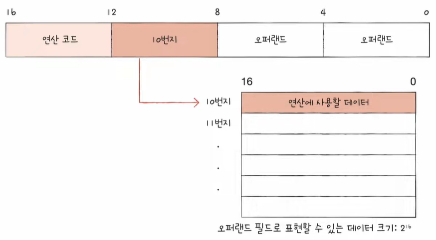
> 🖼️ 그림 설명: 오퍼랜드 필드에는 “10번지” 같은 **주소**를 넣고, 실제 큰 데이터는 메모리에 둔다

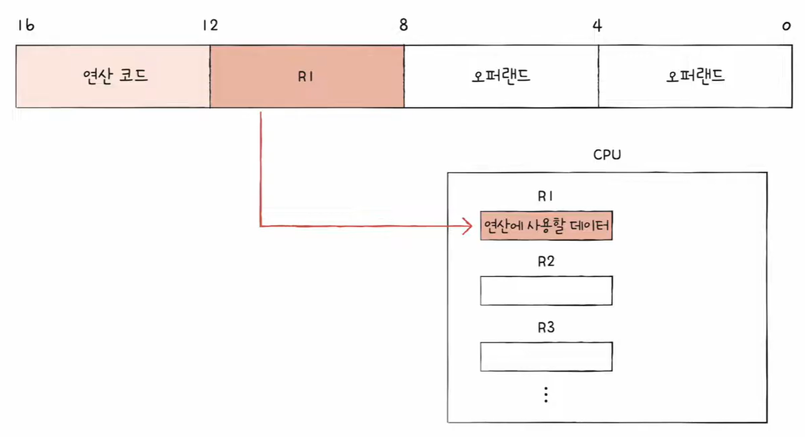
> 🖼️ 그림 설명: 오퍼랜드에 `R1` 같은 **레지스터**를 넣어, 메모리보다 빠르게 데이터 접근 가능

---

### 🎯 5-2. 유효 주소(Effective Address)
- **연산에 사용할 데이터가 실제로 저장된 위치**

---

### 🧭 5-3. 주소 지정 방식(Addressing Modes)
- **유효 주소(Effective Address)를 찾는 방법**
- CPU가 오퍼랜드를 해석해서 “데이터 위치”를 찾아내는 규칙

> ✅ CPU 입장에서는  
> 데이터가 메모리에 있든, 레지스터에 있든, 명령어에 직접 있든  
> **어쨌든 찾아서 실행할 수 있어야 한다.**  
> 그 “찾는 방법”이 주소 지정 방식이다.

---

## 🧪 6) 대표적인 주소 지정 방식들

### ⚡ 6-1. 즉시 주소 지정 방식 (Immediate Addressing Mode)
- 오퍼랜드 필드에 **데이터를 직접 명시**
- 가장 단순한 방식
- **빠르다**
- 단점: 명령어에서 표현 가능한 데이터 크기가 제한될 수 있다

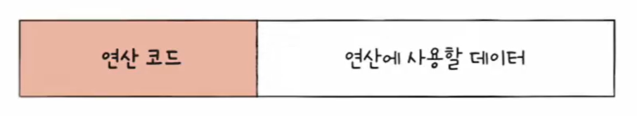
> 🖼️ 그림 설명  
> - 오퍼랜드에 “연산에 사용할 데이터”가 그대로 들어간다.  
> - 주소 해석 과정이 거의 없어 빠르지만, 큰 데이터를 직접 넣기 어렵다.

---

### 📍 6-2. 직접 주소 지정 방식 (Direct Addressing Mode)
- 오퍼랜드 필드에 **유효 주소를 직접 명시**
- 단점: 유효 주소를 표현할 수 있는 크기가 **연산 코드만큼 줄어든다**  
  (즉, 주소 필드 비트 수가 제한됨)

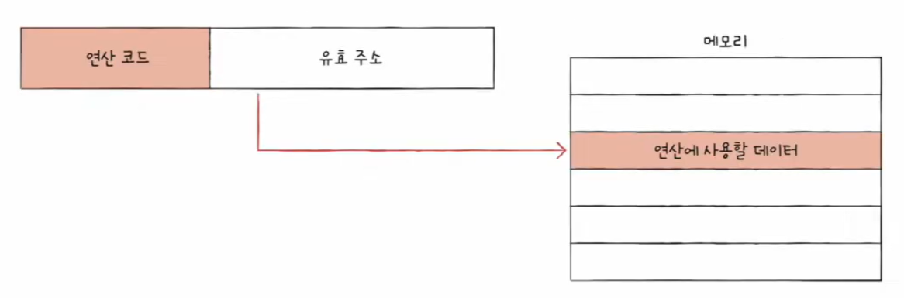
> 🖼️ 그림 설명  
> - 오퍼랜드에 “유효 주소(EA)”가 들어간다.  
> - CPU는 해당 주소로 메모리에 1번 접근해서 데이터를 가져온다.

---

### 🪆 6-3. 간접 주소 지정 방식 (Indirect Addressing Mode)
- 오퍼랜드 필드에 **유효 주소의 주소(= 유효 주소가 저장된 위치)** 를 명시
- 장점: 유효 주소 범위를 크게 확보 가능
- 단점: **느리다** (메모리 접근이 늘어남)

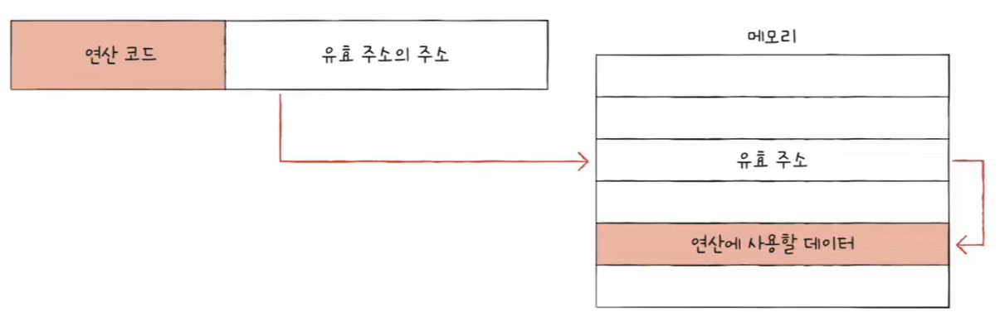
> 🖼️ 그림 설명  
> - 오퍼랜드에는 “유효 주소(EA)”가 아니라, **EA가 들어있는 메모리 위치**가 들어간다.  
> - CPU는 **(1) 메모리에서 EA를 읽고 → (2) 다시 그 EA로 가서 데이터**를 읽는다.  
> - 즉, 메모리 접근이 2번이라 느릴 수 있다.

---

### 🧱 6-4. 레지스터 주소 지정 방식 (Register Addressing Mode)
- 오퍼랜드에 **레지스터**를 명시
- 장점: 메모리 접근보다 **레지스터 접근이 훨씬 빠르다**

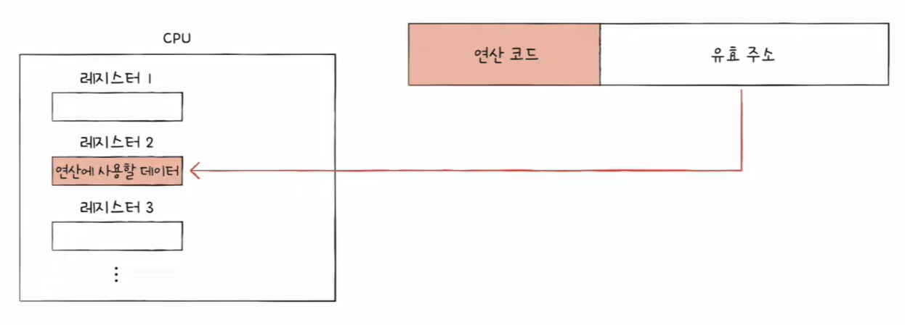
> 🖼️ 그림 설명  
> - 오퍼랜드에 `R1` 같은 레지스터를 적는다.  
> - 데이터가 이미 CPU 내부 레지스터에 있으므로 매우 빠르다.

---

### 🧲 6-5. 레지스터 간접 주소 지정 방식 (Register Indirect Addressing Mode)
- 연산에 사용할 데이터는 **메모리에 저장**
- 그 주소를 저장한 **레지스터를 오퍼랜드 필드에 명시**
- “주소는 레지스터에 있고, 실제 데이터는 메모리에 있다” 구조

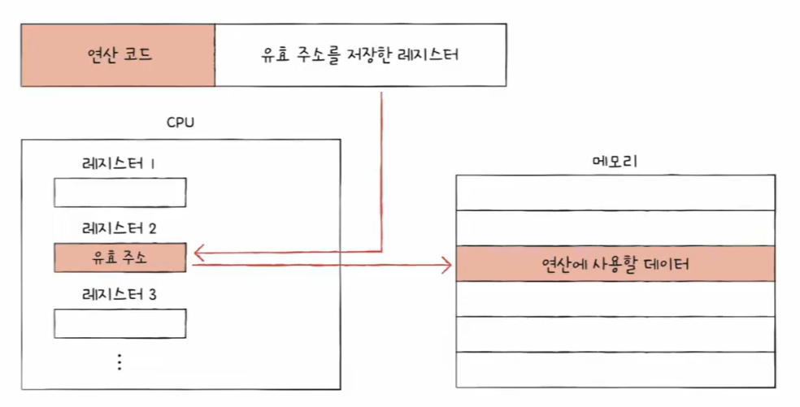
> 🖼️ 그림 설명  
> - 오퍼랜드에 “주소를 들고 있는 레지스터(R2 등)”를 적는다.  
> - CPU는 **레지스터에서 EA를 바로 얻고**, 그 EA로 메모리에 1번 접근해 데이터를 읽는다.  
> - 간접 주소 지정(메모리 2번)보다 보통 빠르고, 레지스터만 쓰는 방식보단 느리다.

---

## 📊 7) 주소 지정 방식 비교표 (속도 / 메모리 접근 / 장단점)

> 기준: **메모리 접근은 느리고**, **레지스터 접근은 빠르다**  
> (일반적으로 메모리 접근 횟수가 늘수록 성능이 떨어짐)

| 주소 지정 방식 | 오퍼랜드에 들어가는 것 | 유효 주소(EA) 구하는 과정 | 메모리 접근(추가) | 속도(상대) | 장점 | 단점 |
|---|---|---|---:|---|---|---|
| **즉시 (Immediate)** | **데이터 자체** | EA 계산 없음 (데이터를 바로 사용) | 0회 | ⭐⭐⭐⭐⭐ | 구조가 단순, 실행이 빠름 | 명령어가 표현 가능한 **데이터 크기 제한** |
| **직접 (Direct)** | **유효 주소(EA)** | 오퍼랜드 값 = EA | 1회 *(데이터 읽기)* | ⭐⭐⭐⭐ | 구조가 단순, 이해 쉬움 | 주소 필드 비트 수가 제한되면 **표현 가능한 주소 범위 제한** |
| **간접 (Indirect)** | **EA가 저장된 주소** | 메모리에서 EA를 한 번 더 읽어옴 → EA | 2회 *(EA 읽기 + 데이터 읽기)* | ⭐⭐ | **큰 주소 범위 확보** 가능 | 메모리 접근이 2번이라 **느림** |
| **레지스터 (Register)** | **레지스터 번호** | 레지스터가 곧 데이터 위치 | 0회 *(메모리 기준)* | ⭐⭐⭐⭐⭐ | 메모리보다 훨씬 빠름 | 사용할 수 있는 레지스터 수가 제한됨 |
| **레지스터 간접 (Register Indirect)** | **주소를 가진 레지스터 번호** | 레지스터 값 = EA → 메모리에서 데이터 읽음 | 1회 *(데이터 읽기)* | ⭐⭐⭐ | **주소 계산은 빠르고**, 데이터는 메모리에서 읽는 방식 | 결국 메모리 접근이 필요해 레지스터 방식보단 느림 |

---

## ✅ 한 줄 요약

- 명령어는 **연산 코드 + 오퍼랜드**로 구성된다.  
- 오퍼랜드는 보통 **데이터가 아닌 ‘데이터 위치(주소)’** 를 담는다.  
- CPU는 오퍼랜드를 해석해 유효 주소를 찾는데, 그 규칙이 **주소 지정 방식**이다.
