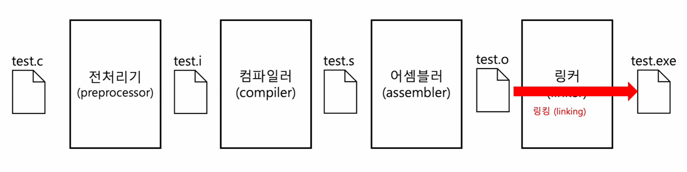
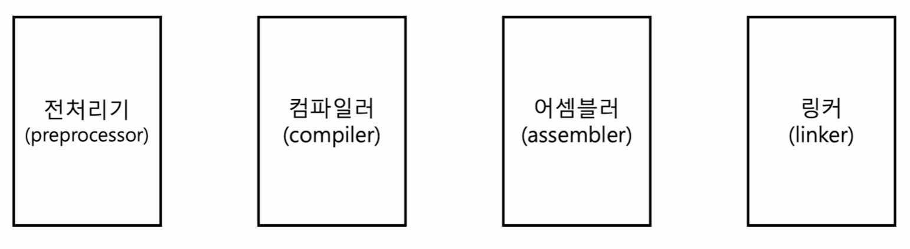
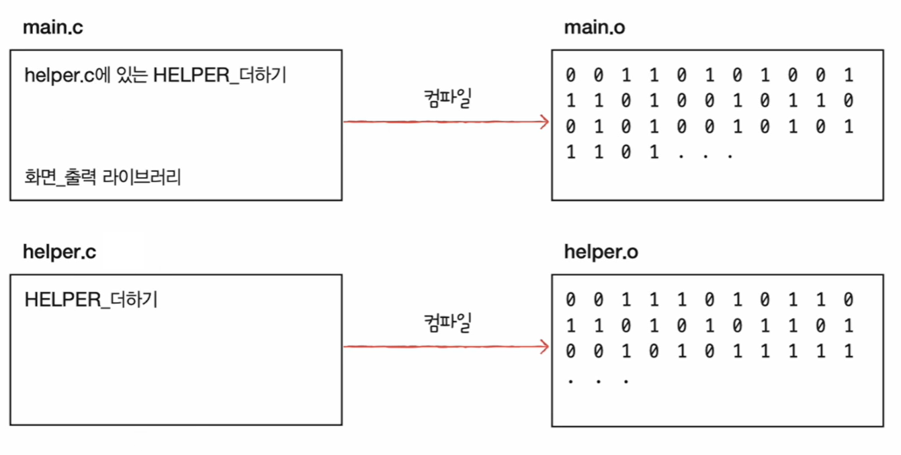
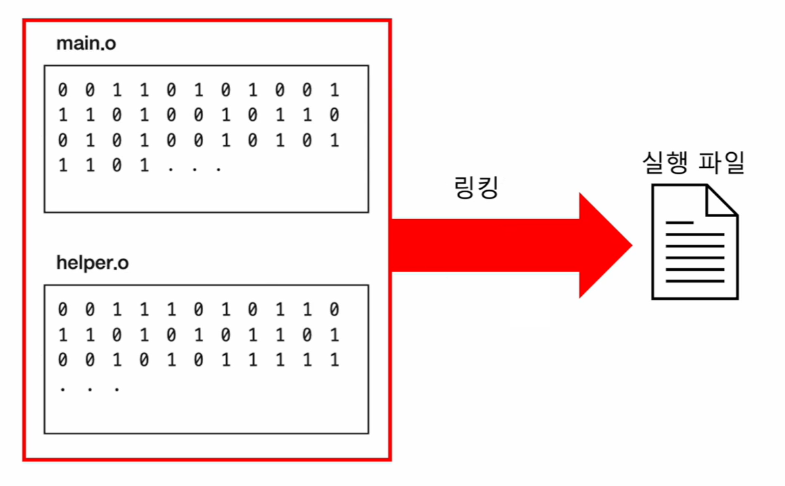

# 🧠 8강 C언어의 컴파일 과정

C언어로 작성한 소스 코드(`.c`)는 컴퓨터가 **바로 실행할 수 없다.**  
그래서 소스 코드는 아래 단계를 거쳐 **기계어(0과 1)** 로 변환되고, 마지막에 **링킹(linking)** 을 통해 실행 파일이 된다.

---

## 목차 📚
- [🧠 8강 C언어의 컴파일 과정](#-8강-c언어의-컴파일-과정)
  - [목차 📚](#목차-)
  - [🧭 전체 흐름 한눈에 보기](#-전체-흐름-한눈에-보기)
  - [🧩 4단계 구성 요소](#-4단계-구성-요소)
  - [🧹 1) 전처리기 (Preprocessor)](#-1-전처리기-preprocessor)
    - [하는 일](#하는-일)
    - [결과물](#결과물)
    - [예시 명령어](#예시-명령어)
  - [🛠️ 2) 컴파일러 (Compiler)](#️-2-컴파일러-compiler)
    - [하는 일](#하는-일-1)
    - [결과물](#결과물-1)
    - [예시 명령어](#예시-명령어-1)
  - [🧱 3) 어셈블러 (Assembler)](#-3-어셈블러-assembler)
    - [하는 일](#하는-일-2)
    - [결과물](#결과물-2)
    - [예시 명령어](#예시-명령어-2)
  - [🔗 4) 링커 (Linker)](#-4-링커-linker)
  - [🧲 링킹이 필요한 이유 (이미지 예시로 이해하기)](#-링킹이-필요한-이유-이미지-예시로-이해하기)
    - [예시 1) 각각의 .c 파일은 먼저 목적 파일(.o)로 “따로” 만들어진다](#예시-1-각각의-c-파일은-먼저-목적-파일o로-따로-만들어진다)
    - [예시 2) 링커가 main.o + helper.o를 “연결”해서 실행 파일을 만든다](#예시-2-링커가-maino--helpero를-연결해서-실행-파일을-만든다)
  - [📦 목적 파일 vs 실행 파일](#-목적-파일-vs-실행-파일)
  - [🧪 실습용 요약 명령어 (단계별로 생성하기)](#-실습용-요약-명령어-단계별로-생성하기)
  - [자주 헷갈리는 포인트 ⚠️](#자주-헷갈리는-포인트-️)

---

## 🧭 전체 흐름 한눈에 보기

> 전처리기(Preprocessor) → 컴파일러(Compiler) → 어셈블러(Assembler) → 링커(Linker)


> **그림 설명**: `test.c`가 전처리→컴파일→어셈블→링킹을 거치며  
> `test.i → test.s → test.o → test.exe`로 변환되는 “결과 파일” 흐름을 보여준다.  
> 특히 빨간 화살표는 **링킹(linking)** 으로 **실행 파일이 만들어지는 순간**을 강조한다.

---

## 🧩 4단계 구성 요소


> **그림 설명**: 컴파일 과정은 크게 **전처리기 / 컴파일러 / 어셈블러 / 링커** 4개 구성요소로 나뉜다.  
> “소스 코드 → 저급 언어 → 기계어 → 실행 파일”의 단계별 역할이 각각 다르다.

---

## 🧹 1) 전처리기 (Preprocessor)

### 하는 일
전처리는 “컴파일 전에 준비 작업”이다.

- `#include` 같은 **헤더 파일 포함**
- `#define` 같은 **매크로 치환**
- `#if`, `#ifdef` 같은 **조건부 컴파일 처리**
- 주석 제거 등(환경에 따라 추가 처리)

즉, **외부에 선언된 코드/설정들을 내 코드에 합쳐서** 컴파일하기 쉬운 형태로 만든다.

### 결과물
- 확장자: **`.i`**
- 특징: 전처리된 결과지만 **여전히 사람이 읽는 소스 코드 형태**

### 예시 명령어
```c
gcc -E hello.c -o hello.i
```

---

## 🛠️ 2) 컴파일러 (Compiler)

### 하는 일
전처리된 C 코드를 **어셈블리어(.s)** 로 바꾼다.

- C → Assembly 변환
- 최적화(옵션에 따라)
- CPU/아키텍처에 따라 결과가 달라질 수 있음  
  (예: x86-64 vs ARM)

### 결과물
- 확장자: **`.s`**
- 특징: CPU가 이해하기 쉬운 형태로 내려간 **어셈블리 코드**

### 예시 명령어
```c
gcc -S hello.i -o hello.s
```

---

## 🧱 3) 어셈블러 (Assembler)

### 하는 일
어셈블리어를 **기계어로 변환**하여 목적 파일을 만든다.

- Assembly → Machine Code(0과 1)
- **목적 코드(object code)** 포함
- 링킹을 위한 심볼/재배치 정보 등 포함 가능

### 결과물
- 확장자: **`.o`** (Linux/macOS), **`.obj`** (Windows 계열에서 자주)
- 특징: 기계어지만 **아직 실행 파일은 아님**

### 예시 명령어
```c
gcc -c hello.s -o hello.o
```

---

## 🔗 4) 링커 (Linker)

링커는 여러 목적 파일과 라이브러리를 **하나의 실행 파일로 묶어주는 단계**다.

- `main.o`, `helper.o` 같은 여러 목적 파일 결합
- `printf` 같은 표준 라이브러리(또는 외부 라이브러리) 연결
- “어떤 함수/변수가 어디에 있는지”를 찾아서 참조를 해결(심볼 해결)

---

## 🧲 링킹이 필요한 이유 (이미지 예시로 이해하기)

### 예시 1) 각각의 .c 파일은 먼저 목적 파일(.o)로 “따로” 만들어진다


> **그림 설명**:  
> - `main.c`는 `helper.c`에 있는 기능(예: HELPER_더하기)을 “사용”한다.  
> - 컴파일하면 각각 **`main.o`, `helper.o`** 로 “따로” 만들어진다.  
> - 이 상태에서는 **아직 서로 연결되지 않았기 때문에** 실행 파일이 아니다.

### 예시 2) 링커가 main.o + helper.o를 “연결”해서 실행 파일을 만든다


> **그림 설명**:  
> - 링커는 `main.o` 안의 “helper 기능을 호출하는 부분”과  
>   `helper.o` 안의 “실제 helper 구현”을 찾아서 **서로 이어준다(링킹)**  
> - 그 결과 **실행 파일**이 만들어진다.

---

## 📦 목적 파일 vs 실행 파일

둘 다 “기계어가 들어 있다”는 점은 같지만, **실행 가능 여부**가 다르다.

- **목적 파일(.o)**  
  - 기계어 코드 포함(＋심볼/재배치 등 링킹용 정보도 포함)
  - 단독 실행 불가(보통 엔트리 포인트/외부 참조가 해결되지 않음)
  - 다른 코드/라이브러리와 **연결(링킹)** 되어야 실행 파일이 됨

- **실행 파일(.exe / a.out)**  
  - 링킹 완료된 결과물
  - OS 로더가 로딩하여 **바로 실행 가능**

---

## 🧪 실습용 요약 명령어 (단계별로 생성하기)

```c
gcc -E hello.c -o hello.i   // 전처리
gcc -S hello.i -o hello.s   // 컴파일 (C -> asm)
gcc -c hello.s -o hello.o   // 어셈블 (asm -> object)
gcc hello.o -o hello        // 링킹 (object -> executable)
```

---

## 자주 헷갈리는 포인트 ⚠️

- 전처리 후(`.i`)에도 **아직 소스 코드**다.
- 컴파일 결과(`.s`)는 **기계어가 아니라 어셈블리어**다.
- `.o`는 **기계어가 들어있어도 실행 파일이 아니다**(링킹 전).
- 링커의 핵심은 “여러 조각(목적 파일/라이브러리)을 연결해 실행 가능하게 만들기”다.
