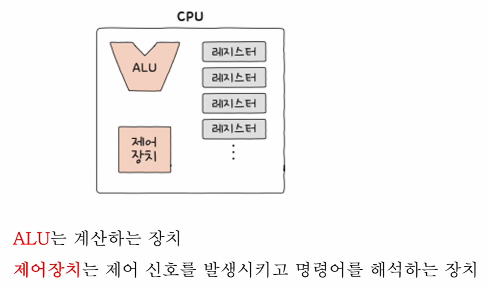
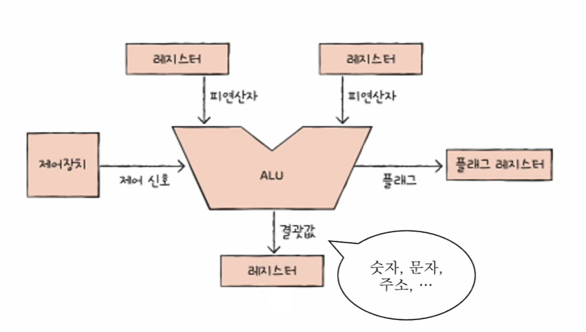
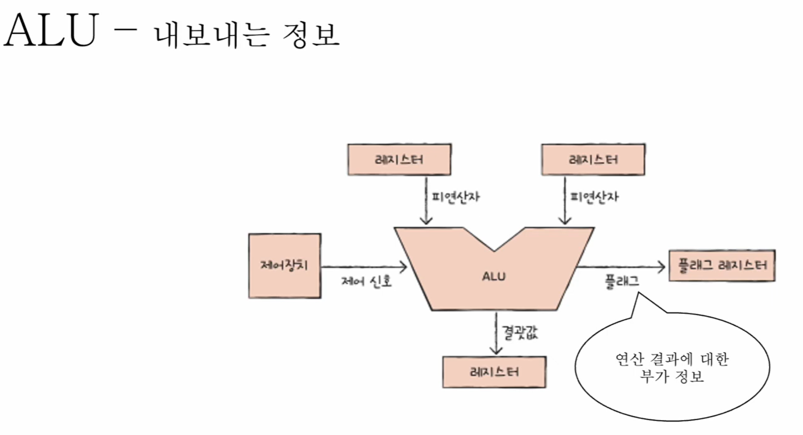
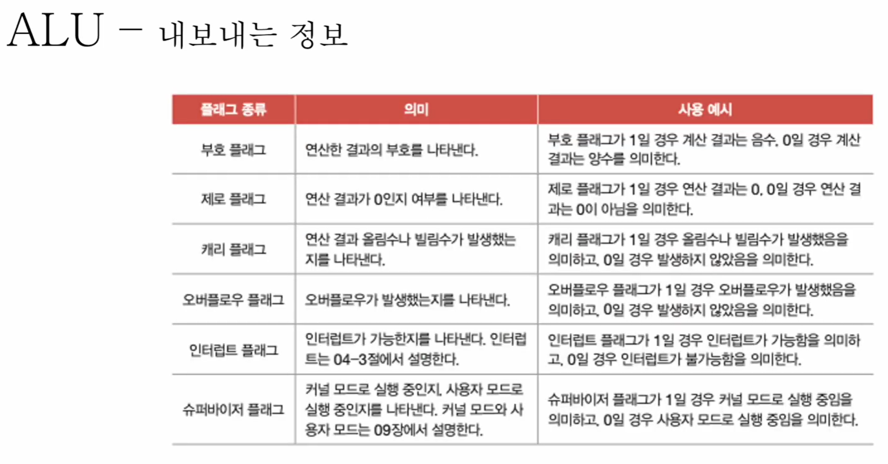
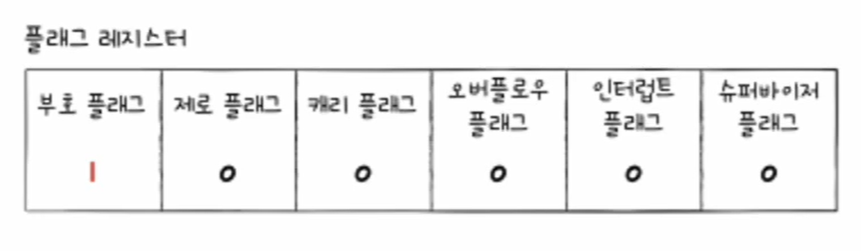
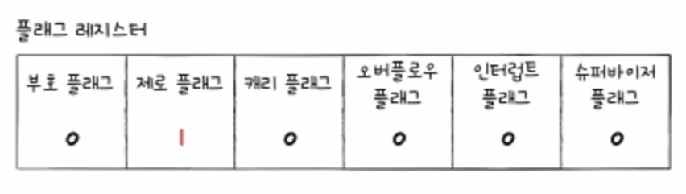
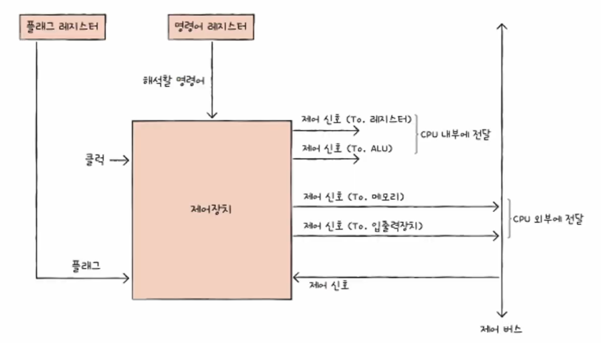
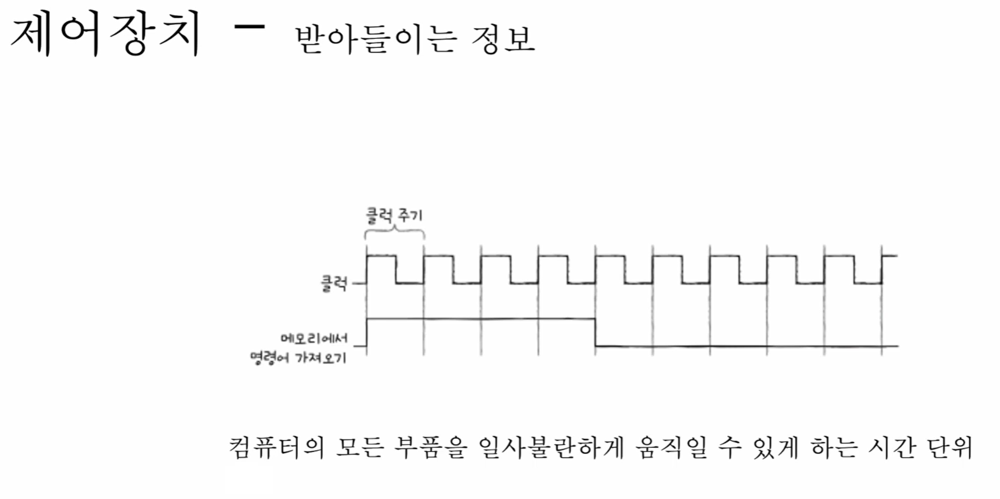

# 🧠 9강 CPU의 내부 구성 - ALU와 제어장치

CPU는 크게 **연산을 담당하는 ALU**와 **명령어를 해석하고 각 부품을 지휘하는 제어장치**로 구성된다.  
둘은 서로 맞물려 **명령어를 실행**하는 전체 흐름을 만든다.

---

## 목차
- [🧠 9강 CPU의 내부 구성 - ALU와 제어장치](#-9강-cpu의-내부-구성---alu와-제어장치)
  - [목차](#목차)
  - [✨ 한 줄 요약](#-한-줄-요약)
  - [🧭 전체 구조 한눈에 보기](#-전체-구조-한눈에-보기)
    - [이미지로 보는 전체 구성](#이미지로-보는-전체-구성)
    - [제어 흐름 ASCII 다이어그램](#제어-흐름-ascii-다이어그램)
    - [데이터 흐름 ASCII 다이어그램](#데이터-흐름-ascii-다이어그램)
  - [1) ALU](#1-alu)
    - [ALU가 연산하려면 필요한 것](#alu가-연산하려면-필요한-것)
    - [연산 결과를 레지스터에 저장하는 이유](#연산-결과를-레지스터에-저장하는-이유)
  - [2) ALU가 내보내는 정보](#2-alu가-내보내는-정보)
    - [결과값과 플래그](#결과값과-플래그)
    - [플래그 종류](#플래그-종류)
    - [플래그 레지스터 예시](#플래그-레지스터-예시)
  - [3) 제어장치](#3-제어장치)
  - [4) 제어장치가 받아들이는 정보](#4-제어장치가-받아들이는-정보)
    - [클럭(Clock)](#클럭clock)
    - [명령어 레지스터(IR)](#명령어-레지스터ir)
    - [플래그 레지스터](#플래그-레지스터)
    - [외부 제어 신호](#외부-제어-신호)
  - [5) 제어장치가 내보내는 정보](#5-제어장치가-내보내는-정보)
    - [CPU 내부로 보내는 제어 신호](#cpu-내부로-보내는-제어-신호)
    - [CPU 외부로 보내는 제어 신호](#cpu-외부로-보내는-제어-신호)
  - [✅ 키워드 정리](#-키워드-정리)

---

## ✨ 한 줄 요약

- **ALU(Arithmetic Logic Unit)**: 계산/논리 연산을 수행하고 **결과 + 플래그(부가정보)** 를 만든다.
- **제어장치(Control Unit)**: 명령어를 해석해 **제어 신호**를 발생시키고 CPU 내부/외부를 움직인다.

---

## 🧭 전체 구조 한눈에 보기

### 이미지로 보는 전체 구성



> **설명**: CPU 내부에서 ALU와 제어장치가 어떤 역할을 갖는지 큰 그림으로 보여준다.

---

### 제어 흐름 ASCII 다이어그램

> “누가 누구를 움직이나?” 관점 (제어 신호의 흐름)

```
                (Clock)
                  |
                  v
+------------------------+
|      제어장치 (CU)     |
|  - 명령어 해석 (IR)    |
|  - 제어 신호 생성      |
+------------------------+
   |        |         |
   |        |         |
   v        v         v
[레지스터]  [ALU]    [메모리/입출력]
 (이동/저장) (연산)   (Read/Write)
```

---

### 데이터 흐름 ASCII 다이어그램

> “값(피연산자/결과)은 어디로 오가나?” 관점

```
피연산자(값)
[레지스터] ---------> [ALU] ---------> [레지스터]
                        |
                        v
                  [플래그 레지스터]
      (연산 결과에 대한 부가 정보: 부호/제로/캐리/오버플로우/...)
```

---

## 1) ALU

ALU는 **계산/논리 연산을 실제로 수행**하는 장치다.



> **설명**: ALU는 제어장치의 “연산 지시(제어 신호)”와 레지스터의 “피연산자(값)”를 받아 실제 연산을 수행한다.

---

### ALU가 연산하려면 필요한 것

- **피연산자(Operand)**: 레지스터로부터 입력받는 값(계산 재료)
- **제어 신호(Control Signal)**: 제어장치가 보내는 “어떤 연산을 수행할지” 지시

즉, ALU는
- **레지스터로부터 값(피연산자)을 받고**
- **제어장치로부터 연산 종류(제어 신호)를 받아**
연산을 수행한다.

---

### 연산 결과를 레지스터에 저장하는 이유

ALU가 계산한 결과를 곧바로 메모리에 쓰지 않고 **레지스터에 저장**하는 이유는 다음과 같다.

- CPU는 **메모리(RAM)보다 레지스터(Register)에 더 빠르게 접근**할 수 있다.
- 그래서 결과를 레지스터에 임시로 담아두면:
  - 바로 다음 연산에 재사용하거나
  - 다른 레지스터 값과 추가 연산을 하거나
  - 필요할 때만 메모리에 기록하는 방식으로 효율적으로 처리할 수 있다.

---

## 2) ALU가 내보내는 정보

### 결과값과 플래그

ALU는 연산을 수행한 뒤 다음 정보를 내보낸다.

- **결과값**: 연산 결과(보통 레지스터에 저장)
- **플래그(Flag)**: 연산 결과에 대한 **부가 정보(상태 정보)**  
  → **플래그 레지스터**에 저장됨



> **설명**: ALU는 “결과값”뿐 아니라 “결과가 0인지/음수인지/범위를 넘었는지” 같은 **상태 정보**를 플래그로 함께 남긴다.

---

### 플래그 종류

아래 표는 대표적인 플래그 종류를 정리한 이미지이다.



> **설명**: 부호/제로/캐리/오버플로우/인터럽트/슈퍼바이저 플래그 등, 연산 및 CPU 상태를 나타내는 주요 플래그를 요약한다.

---

### 플래그 레지스터 예시

- **부호 플래그(Sign Flag)가 1인 예시**  
  → 연산 결과가 음수임을 의미



- **제로 플래그(Zero Flag)가 1인 예시**  
  → 연산 결과가 0임을 의미



---

## 3) 제어장치

제어장치는 CPU 내부에서 **명령어를 해석**하고, 해석 결과에 따라 **제어 신호를 발생**시켜 각 부품을 움직이게 한다.



> **설명**: 제어장치는 (클럭/명령어/플래그 등) 여러 입력을 바탕으로 레지스터·ALU·메모리·입출력장치에 “무엇을 언제 할지” 제어 신호를 보낸다.

---

## 4) 제어장치가 받아들이는 정보

### 클럭(Clock)

- **클럭(Clock)** 은 컴퓨터의 모든 부품을 **타이밍에 맞춰 동작**시키는 시간 기준이다.
- 명령어 수행은 보통 **클럭 주기 단위**로 진행된다.



> **설명**: 클럭은 “CPU가 박자 맞춰 움직이게 하는 신호”라고 보면 된다.

---

### 명령어 레지스터(IR)

- 제어장치가 해석할 **명령어가 저장**되어 있는 레지스터다.
- 제어장치는 IR의 명령을 해석해 “무엇을 실행할지” 결정한다.

---

### 플래그 레지스터

- ALU가 만든 플래그(상태 정보)가 저장되어 있다.
- 제어장치는 명령어를 해석/수행하는 과정에서 **연산 결과의 부가 정보(플래그)** 가 필요할 수 있으므로 이를 입력으로 받아 활용한다.

---

### 외부 제어 신호

- CPU 외부에서 제어 신호가 발생하여 CPU로 전달되면,
- 제어장치는 이를 받아들여 “어떤 신호인지”를 해석하고 동작에 반영한다.

---

## 5) 제어장치가 내보내는 정보

제어장치가 내보내는 핵심은 **제어 신호(Control Signal)** 이다.  
제어 신호는 크게 **CPU 내부로 보내는 신호**와 **CPU 외부로 보내는 신호**로 나뉜다.

### CPU 내부로 보내는 제어 신호

- **레지스터로 보내는 제어 신호**
  - 레지스터 간 정보 이동
  - 값 저장
  - 특정 동작 수행 지시
- **ALU로 보내는 제어 신호**
  - 어떤 연산(덧셈/뺄셈/논리 연산 등)을 수행할지 지시

---

### CPU 외부로 보내는 제어 신호

- **메모리로 보내는 제어 신호**
  - 메모리 **읽기(Read)**
  - 메모리 **쓰기(Write)**
- **입출력장치로 보내는 제어 신호**
  - 입출력 장치를 읽기/쓰기/테스트 등

---

## ✅ 키워드 정리

- **ALU**: 연산 수행 + 결과값 생성 + 플래그 생성  
- **제어장치**: 명령어 해석 + 제어 신호 생성/전달  
- **플래그 레지스터**: 연산 결과의 상태 정보(플래그) 저장  
- **클럭**: 컴퓨터 부품들을 맞춰 움직이게 하는 시간 단위  
- **제어 신호**: “누가 무엇을 언제/어떻게 하게 할지” 지정하는 신호  
