# 🧠 10강 CPU의 내부 구성 - 레지스터

CPU는 명령어를 “바로 메모리에서 꺼내서 바로 실행”하는 것처럼 보이지만, 실제로는 **레지스터(Register)** 라는 **아주 빠른 임시 저장 공간**을 사이에 두고 일을 처리한다.  
즉, **명령어와 데이터는 실행 전/중/후에 레지스터를 거쳐** CPU 내부에서 이동한다.

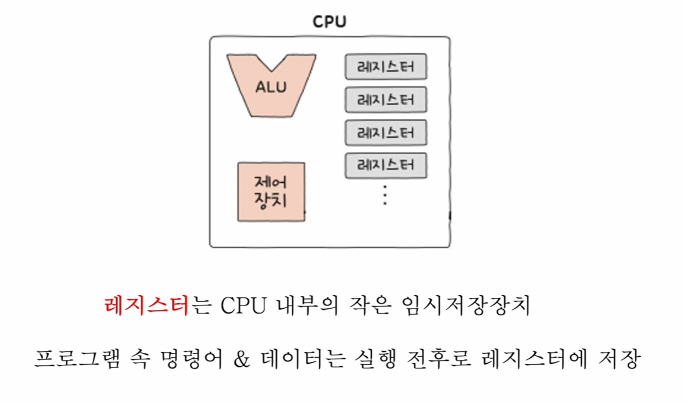

---

## 📚 목차
- [🧠 10강 CPU의 내부 구성 - 레지스터](#-10강-cpu의-내부-구성---레지스터)
  - [� 목차](#-목차)
  - [📌 레지스터란?](#-레지스터란)
  - [🧩 CPU 내부에는 어떤 레지스터가 있을까?](#-cpu-내부에는-어떤-레지스터가-있을까)
  - [✅ 반드시 알아야 할 레지스터의 종류 (8개)](#-반드시-알아야-할-레지스터의-종류-8개)
  - [🧭 프로그램 카운터 (PC)](#-프로그램-카운터-pc)
  - [🧾 명령어 레지스터 (IR)](#-명령어-레지스터-ir)
  - [📍 메모리 주소 레지스터 (MAR)](#-메모리-주소-레지스터-mar)
  - [📦 메모리 버퍼 레지스터 (MBR / MDR)](#-메모리-버퍼-레지스터-mbr--mdr)
  - [🚩 플래그 레지스터 (Flag Register)](#-플래그-레지스터-flag-register)
  - [🧰 범용 레지스터 (General Purpose Register)](#-범용-레지스터-general-purpose-register)
  - [🧱 스택 포인터 (SP)](#-스택-포인터-sp)
  - [🧭 베이스 레지스터 (BR)](#-베이스-레지스터-br)
  - [🔁 레지스터로 보는 “명령어 인출(Fetch)” 6단계 예시](#-레지스터로-보는-명령어-인출fetch-6단계-예시)
  - [🔥 순차적인 실행 흐름이 끊기는 경우](#-순차적인-실행-흐름이-끊기는-경우)
  - [🧠 특정 레지스터를 이용한 주소 지정 방식](#-특정-레지스터를-이용한-주소-지정-방식)
    - [🧺 스택 주소 지정 방식 (Stack Addressing)](#-스택-주소-지정-방식-stack-addressing)
    - [📏 변위 주소 지정 방식 (Displacement Addressing)](#-변위-주소-지정-방식-displacement-addressing)
      - [➡️ 상대 주소 지정 방식 (Relative Addressing)](#️-상대-주소-지정-방식-relative-addressing)
      - [🧭 베이스 레지스터 주소 지정 방식 (Base Register Addressing)](#-베이스-레지스터-주소-지정-방식-base-register-addressing)
  - [🧾 한 줄 요약](#-한-줄-요약)

---

## 📌 레지스터란?

- **CPU 내부의 작은 임시 저장 장치**
- 프로그램 속 **명령어 & 데이터**는 실행 전후로 **레지스터에 저장**됨
- 메모리보다 훨씬 빠르지만, 용량은 매우 작음

---

## 🧩 CPU 내부에는 어떤 레지스터가 있을까?

CPU 내부에는 다양한 레지스터들이 있고, 각기 다른 역할을 가진다.  
특히 아래 레지스터들은 “CPU가 명령어를 가져오고(Fetch) 실행(Execute)하는 흐름”을 이해하는 데 핵심이다.

---

## ✅ 반드시 알아야 할 레지스터의 종류 (8개)

- **프로그램 카운터 (PC)**: 다음에 가져올 **명령어 주소**
- **명령어 레지스터 (IR)**: 방금 가져온 **명령어**
- **메모리 주소 레지스터 (MAR)**: 메모리에 보내는 **주소**
- **메모리 버퍼 레지스터 (MBR/MDR)**: 메모리와 주고받는 **데이터(명령어/값)**
- **플래그 레지스터**: 연산 결과/상태(Zero, Carry 등) 같은 **부가 정보**
- **범용 레지스터**: 일반적인 임시 저장/연산 중간값 저장
- **스택 포인터 (SP)**: 스택의 **꼭대기**
- **베이스 레지스터 (BR)**: 주소 계산의 **기준 주소**

---

## 🧭 프로그램 카운터 (PC)

- **메모리에서 가져올 명령어의 주소**
- “다음으로 메모리에서 뭘 읽어들일지”를 결정하는 레지스터

✅ 핵심: 실행 흐름이 “순차적”일 때는 보통 PC가 다음 주소로 이동한다.

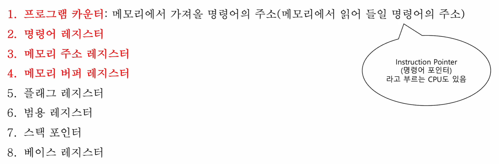

> 참고  
> 어떤 CPU/자료에서는 프로그램 카운터(PC)를 **Instruction Pointer(명령어 포인터)** 라고 부르기도 한다.

---

## 🧾 명령어 레지스터 (IR)

- **해석할 명령어**(방금 메모리에서 읽어 들인 명령어)
- 제어 장치가 IR의 명령어를 받아 **해석하고 제어 신호를 내보낸다**

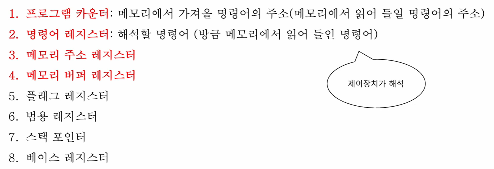

---

## 📍 메모리 주소 레지스터 (MAR)

- **메모리의 주소**를 저장
- CPU가 메모리로부터 읽거나 쓰려면 “주소 버스”로 주소를 내보내야 하는데,  
  그때 **주소 버스로 나갈 주소가 MAR을 거친다**

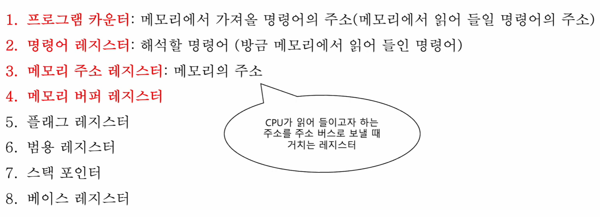

---

## 📦 메모리 버퍼 레지스터 (MBR / MDR)

- **메모리와 주고받을 값(데이터/명령어)** 을 저장
- CPU가 데이터 버스로 값을 주고받을 때 **거치는 레지스터**

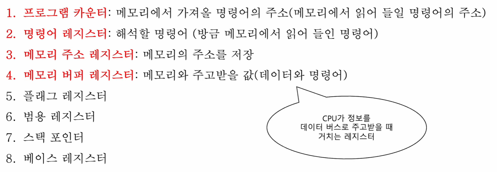

> 참고: 자료에 따라 MBR(Memory Buffer Register) / MDR(Memory Data Register)라고 부르며,  
> 여기서는 “메모리와 주고받는 값이 잠깐 머무는 레지스터”로 이해하면 된다.

---

## 🚩 플래그 레지스터 (Flag Register)

- **연산 결과** 또는 **CPU 상태**에 대한 부가적인 정보 저장
- 플래그를 보면 현재 연산 결과/상태를 간접적으로 파악 가능  
  (예: 결과가 0인지, 자리올림이 있었는지 등)

---

## 🧰 범용 레지스터 (General Purpose Register)

- 다양하고 일반적인 상황에서 자유롭게 사용
- “연산 중간값 저장”, “임시 변수 저장” 같은 용도

---

## 🧱 스택 포인터 (SP)

- **스택의 꼭대기(top)** 를 가리킴
- 스택에 push/pop 할 때 “어디가 맨 위인지”를 알려주는 역할

---

## 🧭 베이스 레지스터 (BR)

- **기준 주소**를 저장
- 기준 주소를 잡아두고, 오퍼랜드(변위/오프셋)를 더해서 실제 주소(EA)를 만든다

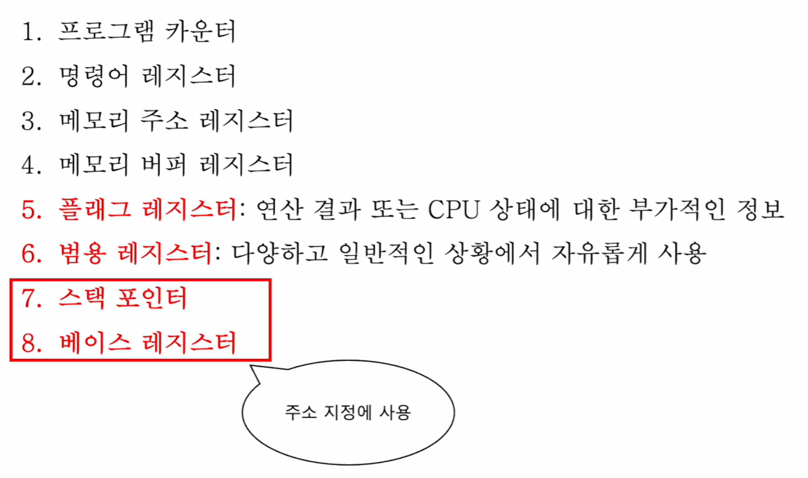

---

## 🔁 레지스터로 보는 “명령어 인출(Fetch)” 6단계 예시

아래 그림은 “메모리에서 명령어를 가져오는 과정”을 레지스터 관점에서 6단계로 보여준다.  
(PC, MAR, MBR, IR이 **어떤 순서로 값이 이동하는지**가 포인트)

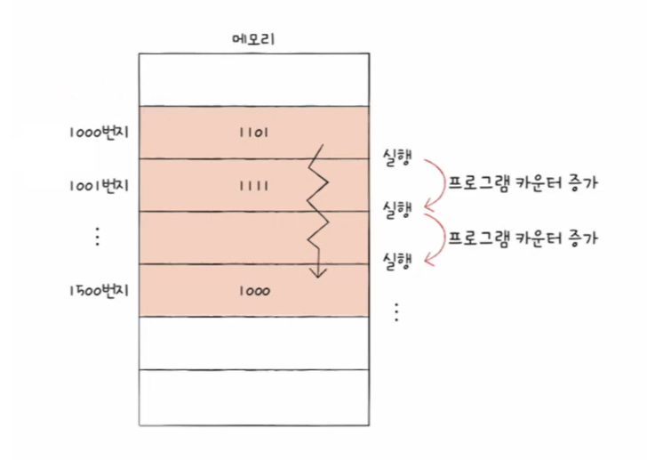

> 예시 상황(그림 기준)  
> - PC = 1000 (다음에 가져올 명령어 주소)  
> - 메모리 1000번지에 1101 같은 명령어가 저장되어 있음

  
✅ 1단계: 실행할 프로그램이 메모리에 올라가 있음

  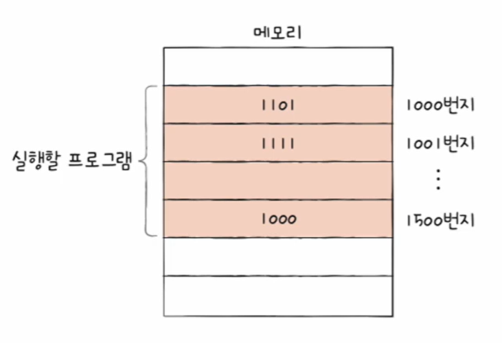

  - 메모리에는 여러 명령어가 주소에 저장되어 있다.

  
✅ 2단계: PC가 “다음에 가져올 주소(1000)”를 가리킴

  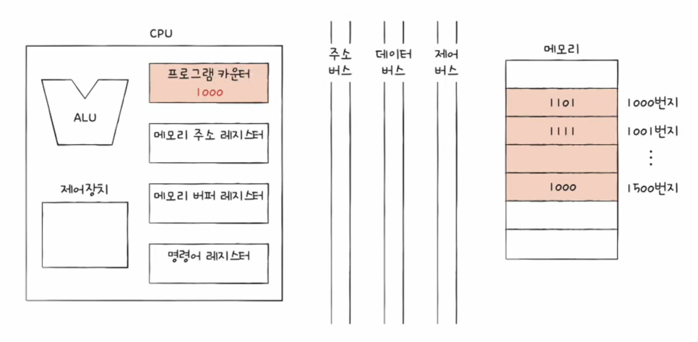

  - 프로그램 카운터(PC)에 **1000**이 들어있다 → 다음으로 1000번지의 명령어를 가져오려는 상태

  
✅ 3단계: PC 값이 MAR로 이동 (읽을 주소 준비)

  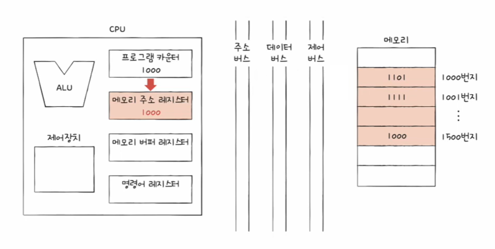

  - PC의 값(1000)을 **메모리 주소 레지스터(MAR)** 로 옮긴다
  - “메모리에 보낼 주소”가 MAR에 준비된 상태

  
✅ 4단계: 주소 버스로 1000을 보내고, 제어 신호로 “메모리 읽기” 요청

  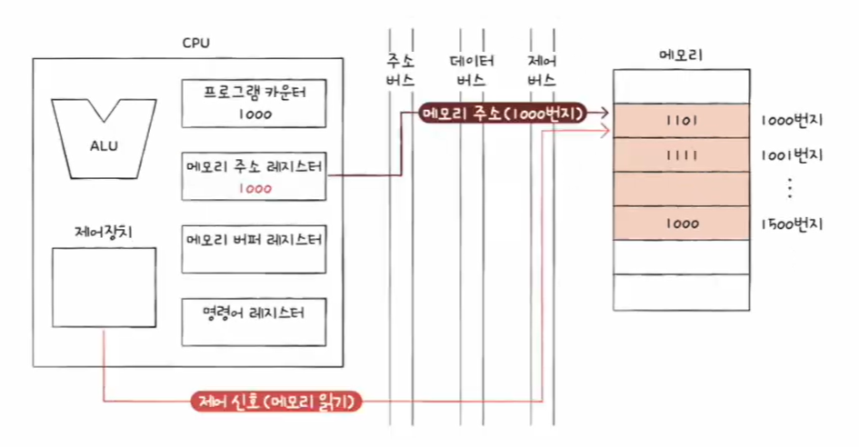

  - MAR의 주소(1000)를 **주소 버스**로 내보낸다
  - 제어 버스로 “메모리 읽기” 신호를 보낸다

  
✅ 5단계: 메모리가 1000번지의 값(1101)을 데이터 버스로 보내고, MBR에 저장 + PC 증가

  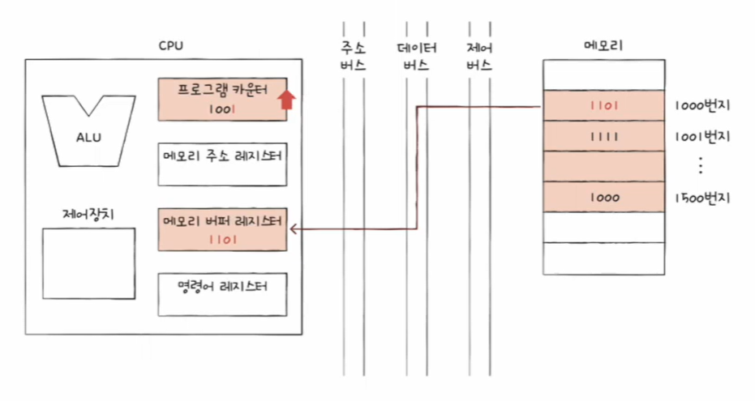

  - 메모리 1000번지의 값(예: **1101**)이 **데이터 버스**를 타고 CPU로 들어온다
  - 들어온 값은 **MBR(MDR)** 에 저장된다
  - 동시에 다음 명령어를 위해 PC가 **1001**로 증가한다

  
✅ 6단계: MBR의 명령어(1101)가 IR로 이동 (이제 “해석할 준비” 완료)

  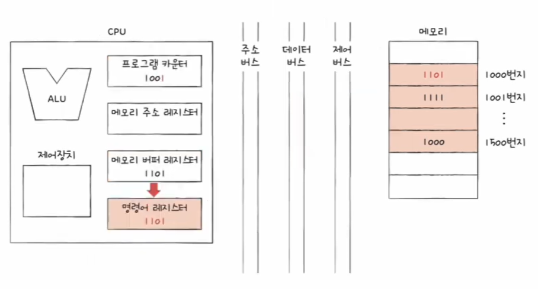

  - MBR에 있던 명령어(1101)를 **명령어 레지스터(IR)** 로 옮긴다
  - 이제 제어 장치가 IR을 해석(Decode)하고 실행(Execute) 단계로 넘어갈 수 있다

---

## 🔥 순차적인 실행 흐름이 끊기는 경우

- 특정 메모리 주소로 실행 흐름을 이동하는 명령어 실행 시  
  (예: `JUMP`, `CONDITIONAL JUMP`, `CALL`, `RET`)
- 인터럽트 발생 시
- 이 외의 경우

✅ 포인트: 이런 상황에서는 보통 **PC 값이 “다음 주소”가 아니라 “다른 주소”로 바뀐다.**

---

## 🧠 특정 레지스터를 이용한 주소 지정 방식

주소 지정 방식(Addressing Mode)은  
**오퍼랜드가 가리키는 실제 데이터의 위치(유효 주소 EA)** 를 구하는 방법이다.

---

### 🧺 스택 주소 지정 방식 (Stack Addressing)

- **스택 + 스택 포인터(SP)** 를 이용한 주소 지정 방식
- SP가 가리키는 위치를 기준으로 push/pop이 동작한다고 이해하면 된다

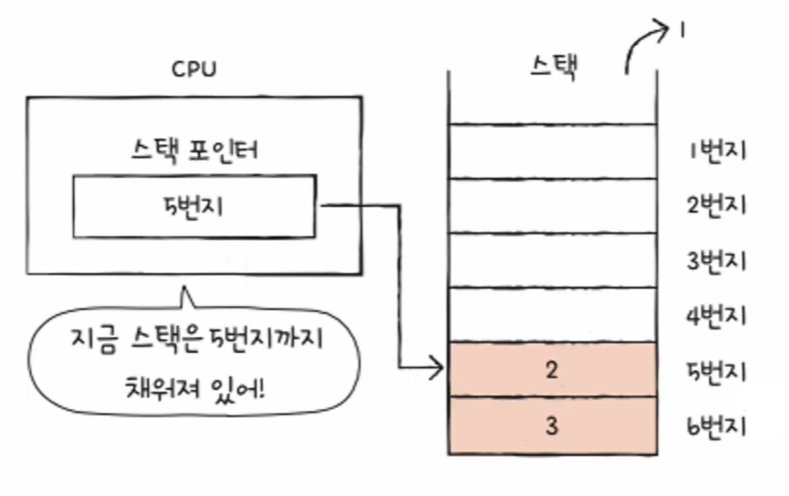

- (그림 예시) 스택 포인터가 특정 번지를 가리키면 “현재 스택은 그 번지까지 채워짐”
- push/pop에 따라 스택 포인터가 이동하며, **스택의 꼭대기 위치**가 바뀐다

---

### 📏 변위 주소 지정 방식 (Displacement Addressing)

오퍼랜드 필드의 값(변위, displacement)과  
특정 레지스터 값(PC 또는 BR 등)을 더해 **유효 주소(EA)** 를 만든다.

- **EA = 변위 + (특정 레지스터 값)**

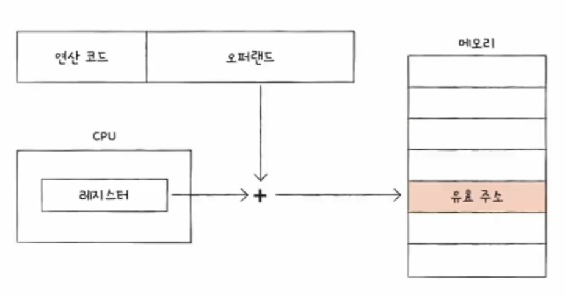

✅ 핵심: “기준점(레지스터)” + “거리(변위)” 로 실제 주소를 만든다.

---

#### ➡️ 상대 주소 지정 방식 (Relative Addressing)

- **EA = 변위 + PC**
- “현재 PC를 기준으로 상대적으로 이동하는 방식”

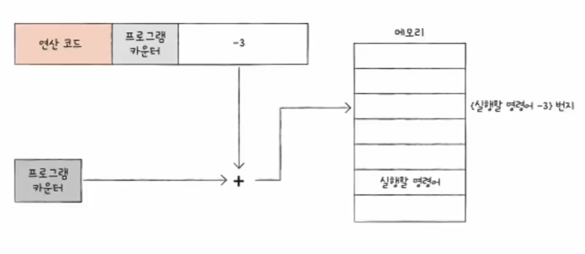
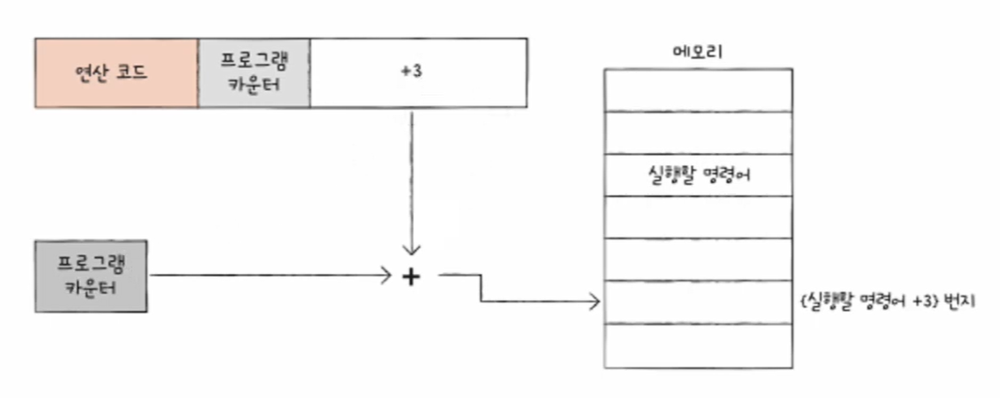

- (그림 예시) PC + (-3) → “현재 위치에서 3만큼 이전 주소로”
- (그림 예시) PC + (+3) → “현재 위치에서 3만큼 이후 주소로”

---

#### 🧭 베이스 레지스터 주소 지정 방식 (Base Register Addressing)

- **EA = 변위 + BR**
- BR(베이스 레지스터)에 “기준 주소”가 들어있고, 오퍼랜드(변위)는 “기준에서 얼마나 떨어졌는지”를 담는다

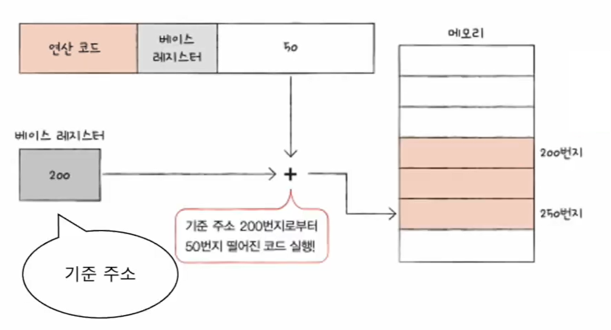

- (그림 예시) 기준 주소가 200이고 변위가 50이면 → 실제 접근 주소는 250

---

## 🧾 한 줄 요약

- 레지스터는 **CPU 내부의 초고속 임시 저장소**
- PC→MAR→(주소/제어버스)→MBR→IR 흐름으로 **명령어를 메모리에서 가져온다**
- MAR은 **주소**, MBR은 **값**, IR은 **해석할 명령어**를 담당한다
- SP/BR 같은 레지스터는 **주소 지정 방식**에서 핵심 역할을 한다
- 주소 지정 방식은 결국 **유효 주소(EA)를 어떻게 계산하느냐**의 문제
