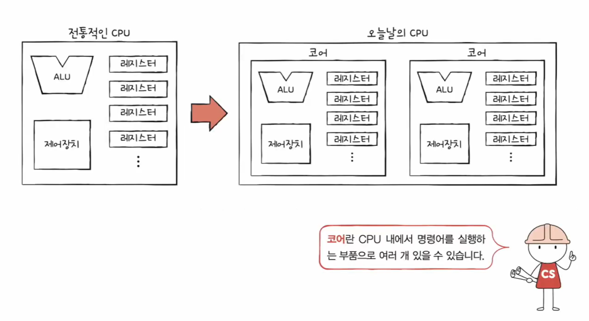
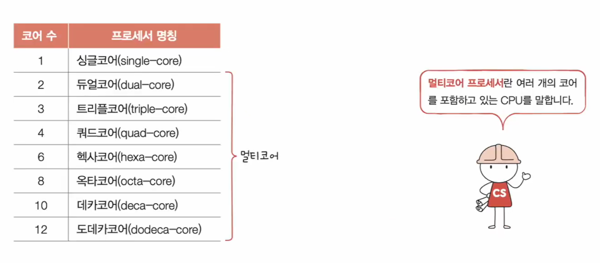
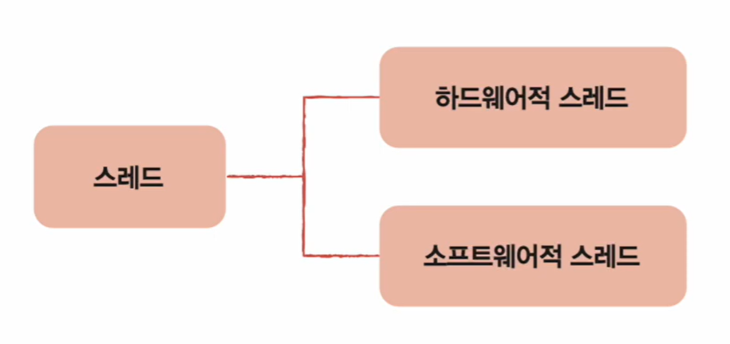
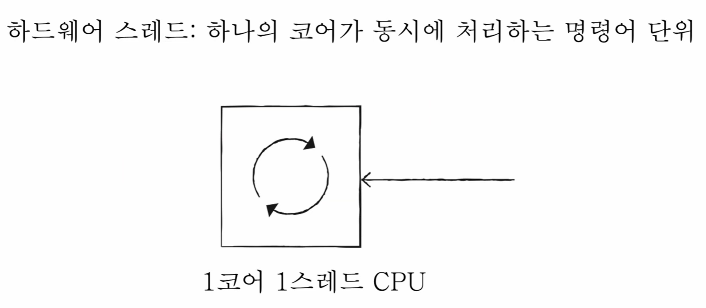
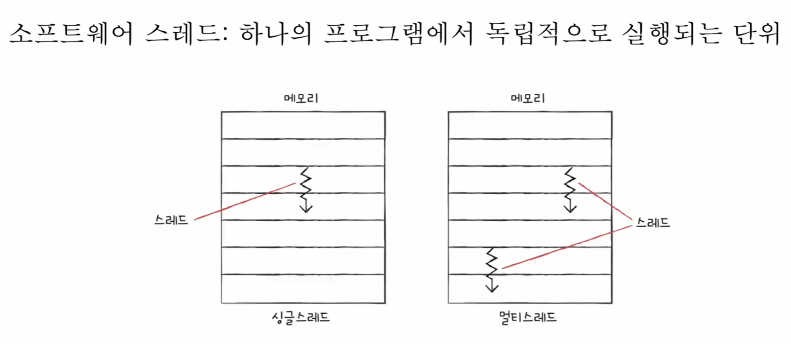
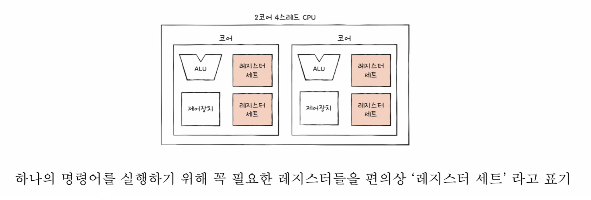
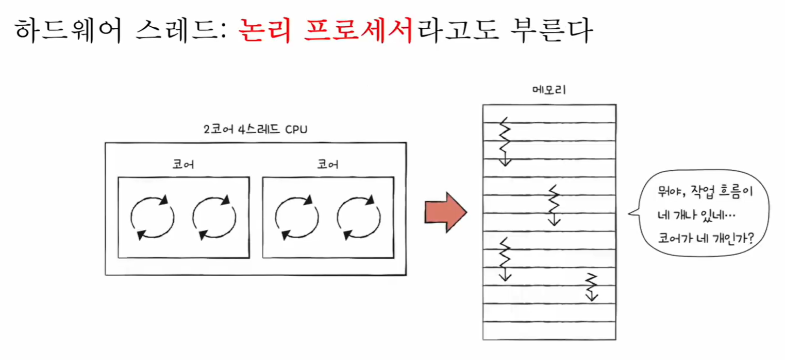

# 🧠 12강 빠른 CPU를 위한 설계 기법

## 📌 목차
- [🧠 12강 빠른 CPU를 위한 설계 기법](#-12강-빠른-cpu를-위한-설계-기법)
  - [📌 목차](#-목차)
  - [✅ CPU의 속도를 빠르게 만들려면](#-cpu의-속도를-빠르게-만들려면)
  - [⏱️ 클럭 속도(Clock Speed)](#️-클럭-속도clock-speed)
    - [예시 (GHz 표기 해석)](#예시-ghz-표기-해석)
    - [클럭을 무작정 올리면?](#클럭을-무작정-올리면)
  - [🧩 코어(Core) \& 멀티 코어(Multi-Core)](#-코어core--멀티-코어multi-core)
    - [코어란?](#코어란)
    - [멀티 코어 프로세서란?](#멀티-코어-프로세서란)
    - [코어 수가 늘면 속도도 비례해서 빨라질까?](#코어-수가-늘면-속도도-비례해서-빨라질까)
  - [🧵 스레드(Thread) \& 멀티 스레드(Multi-Thread)](#-스레드thread--멀티-스레드multi-thread)
  - [1) 하드웨어 스레드(Hardware Thread)](#1-하드웨어-스레드hardware-thread)
  - [2) 소프트웨어 스레드(Software Thread)](#2-소프트웨어-스레드software-thread)
  - [📚 멀티스레드 프로세서(Multi-Threaded Processor)의 핵심: 레지스터 세트](#-멀티스레드-프로세서multi-threaded-processor의-핵심-레지스터-세트)
  - [🧾 논리 프로세서(Logical Processor)](#-논리-프로세서logical-processor)
  - [✅ 정리: CPU 성능을 올리는 3가지 축](#-정리-cpu-성능을-올리는-3가지-축)
  - [🔥 한 줄 결론](#-한-줄-결론)

CPU 성능을 올리는 대표 전략은 크게 3가지로 정리할 수 있습니다.

- **클럭을 더 빠르게** (Clock Frequency ↑)
- **코어를 더 많이** (Core Count ↑)
- **스레드를 더 많이** (Thread Count ↑)

> 단, 이 3가지는 “무작정 늘린다 = 성능이 비례한다”가 아닙니다.  
> 작업 분배(병렬화), 발열/전력, 자원 공유 구조 등에 따라 체감 성능이 달라집니다.

---

## ✅ CPU의 속도를 빠르게 만들려면

1. 컴퓨터 부품들은 보통 **클럭 신호(Clock Signal)** 에 맞춰 일사불란하게 움직입니다.
2. CPU는 **명령어 사이클(Instruction Cycle)** 이라는 정해진 흐름에 따라 명령어를 실행합니다.

즉, CPU를 빠르게 만들려면 결국:

- “박자(클럭)”를 빠르게 하거나
- “동시에 처리(코어/스레드)”할 수 있게 구조를 바꾸는 것이 핵심입니다.

---

## ⏱️ 클럭 속도(Clock Speed)

- 클럭 속도는 **Hz(헤르츠)** 단위로 측정합니다.
- **Hz = 1초에 반복되는 클럭 횟수**
  - 1초에 1번 반복 → 1Hz  
  - 1초에 100번 반복 → 100Hz

> 실제 CPU 스펙 표기는 보통 **GHz(기가헤르츠)** 를 씁니다. (예: 2.5GHz)

### 예시 (GHz 표기 해석)
예: **Base 2.5GHz / Max 4.9GHz** 라면

- 기본적으로 1초에 **25억 번**(2.5 × 10⁹) 클럭 반복
- 순간적으로 최대 1초에 **49억 번**(4.9 × 10⁹) 클럭 반복

### 클럭을 무작정 올리면?
- 클럭을 높이면 **발열/전력 소모**가 크게 증가합니다.
- 그래서 단순히 “클럭만 올리는 방식”에는 한계가 있고,
  그 대안으로 **코어 수/스레드 수**를 늘리는 방향이 중요해졌습니다.

---

## 🧩 코어(Core) & 멀티 코어(Multi-Core)

### 코어란?
현대 CPU에서 **명령어를 실행하는 중심 실행 단위**를 **코어(Core)** 라고 부릅니다.

- 과거(전통적 CPU): 실행부가 사실상 “1개”
- 현재(오늘날 CPU): 실행부가 “여러 개(코어 여러 개)”

> 💡 왼쪽은 전통적인 CPU(하나의 실행부), 오른쪽은 오늘날 CPU(코어가 여러 개 존재) 관점을 보여줍니다.

### 멀티 코어 프로세서란?
- **여러 개의 코어를 포함하는 CPU**를 멀티 코어 프로세서라고 합니다.

> 💡 코어 수에 따라 싱글/듀얼/쿼드/옥타… 처럼 부르며, “멀티코어”는 여러 코어를 가진 CPU를 의미합니다.

### 코어 수가 늘면 속도도 비례해서 빨라질까?
꼭 그렇지 않습니다.

- 코어 수가 늘어도 **작업이 코어에 잘 분배되지 않으면** 성능이 비례하지 않습니다.
- 핵심은 “코어가 몇 개냐”보다 **병렬화(분배) 설계가 잘 되었냐**입니다.

✅ 결론  
> 멀티 코어 성능의 핵심은 **코어 수 + 작업 분배 품질**입니다.

---

## 🧵 스레드(Thread) & 멀티 스레드(Multi-Thread)

스레드(Thread)는 **실행 흐름의 단위**입니다.  
스레드는 보통 다음 두 관점으로 나눠 이해합니다.

> 💡 스레드는 크게 “하드웨어적 스레드”와 “소프트웨어적 스레드”로 구분해서 이해하면 정리가 쉽습니다.

---

## 1) 하드웨어 스레드(Hardware Thread)

하드웨어 스레드는 **CPU 관점**의 스레드입니다.

- **하나의 코어가 동시에 처리하는 명령 흐름(명령어 단위)의 개수**

> 💡 예: 1코어가 동시에 1개의 흐름만 처리하면 “1코어 1스레드 CPU”라고 볼 수 있습니다.

하드웨어 스레드는 “논리적으로 존재하는 CPU”라는 의미로
**논리 프로세서(Logical Processor)** 라고도 부릅니다.

---

## 2) 소프트웨어 스레드(Software Thread)

소프트웨어 스레드는 **프로그램 관점**의 스레드입니다.

- 하나의 프로그램 안에서 **독립적으로 실행되는 작업 흐름(단위)**

예를 들어 아래 기능을 “동시에” 수행하는 프로그램이라면:

1. 사용자 입력을 화면에 출력  
2. 맞춤법 검사  
3. 자동 저장  

각각을 별도 실행 흐름으로 두면, 프로그램은 스레드 3개로 동작할 수 있습니다.

> 💡 왼쪽은 싱글 스레드(흐름 1개), 오른쪽은 멀티 스레드(흐름 여러 개)를 직관적으로 보여줍니다.

> ✅ 포인트: 1코어 1스레드 CPU에서도 소프트웨어 스레드는 여러 개 만들 수 있습니다.  
> CPU가 매우 빠르게 번갈아 실행(시분할)해서 “동시에 되는 것처럼” 보이기 때문입니다.

---

## 📚 멀티스레드 프로세서(Multi-Threaded Processor)의 핵심: 레지스터 세트

멀티스레드 CPU 설계는 복잡하지만, 강의의 핵심은 **레지스터(Register)** 입니다.

- 하나의 실행 흐름(스레드)을 유지하려면
  - PC(프로그램 카운터), SP(스택 포인터) 같은 **상태 레지스터**가 필요합니다.
- 이런 “스레드 실행에 필요한 레지스터 묶음”을 편의상 **레지스터 세트**라고 부를 수 있습니다.

> 💡 그림처럼 한 코어 내부에 “레지스터 세트”가 여러 개 있으면,  
> 스레드별 상태를 각각 유지할 수 있어 한 코어가 여러 실행 흐름을 동시에 처리(멀티스레드)하는 구조가 됩니다.

✅ 결론  
> 한 코어에 **레지스터 세트가 여러 개** 있으면, 한 코어가 **여러 스레드의 상태를 보관**하면서 동시에 처리할 수 있습니다.

---

## 🧾 논리 프로세서(Logical Processor)

CPU 내부에서
- 코어가 몇 개인지
- 하드웨어 스레드가 몇 개인지

이 정보는 **CPU 구조 관점**이고, 프로그램은 보통 이를 “직접” 알기보다는  
“동시에 처리되는 흐름이 몇 개인지(논리 프로세서 개수)” 형태로 체감합니다.

> 💡 2코어 4스레드 CPU처럼, 물리 코어는 2개인데 작업 흐름이 4개처럼 보일 수 있습니다.  
> 이때 보이는 흐름(하드웨어 스레드)을 “논리 프로세서”라고 부르기도 합니다.

---

## ✅ 정리: CPU 성능을 올리는 3가지 축

| 방법 | 키워드 | 핵심 포인트 |
|---|---|---|
| 클럭 올리기 | GHz | 성능↑ 가능하지만 발열/전력 한계 큼 |
| 코어 늘리기 | Multi-Core | 작업 분배(병렬화)가 성능을 좌우 |
| 스레드 늘리기 | Multi-Thread | 레지스터 세트/논리 프로세서 개념이 핵심 |

---

## 🔥 한 줄 결론

> CPU를 빠르게 만드는 건 단순히 “클럭만 올리는 것”이 아니라,  
> **동시에 처리할 수 있는 흐름(코어/스레드)을 늘리고, 그 분배를 잘하는 구조**가 핵심이다.
