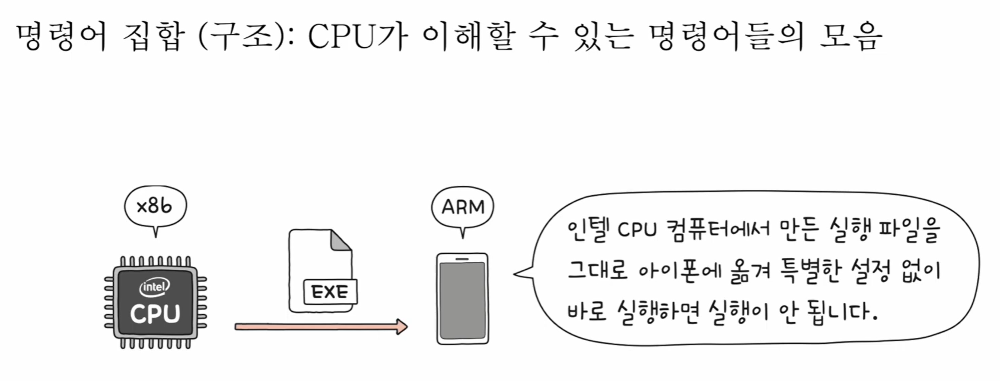
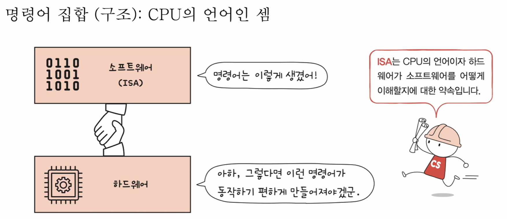
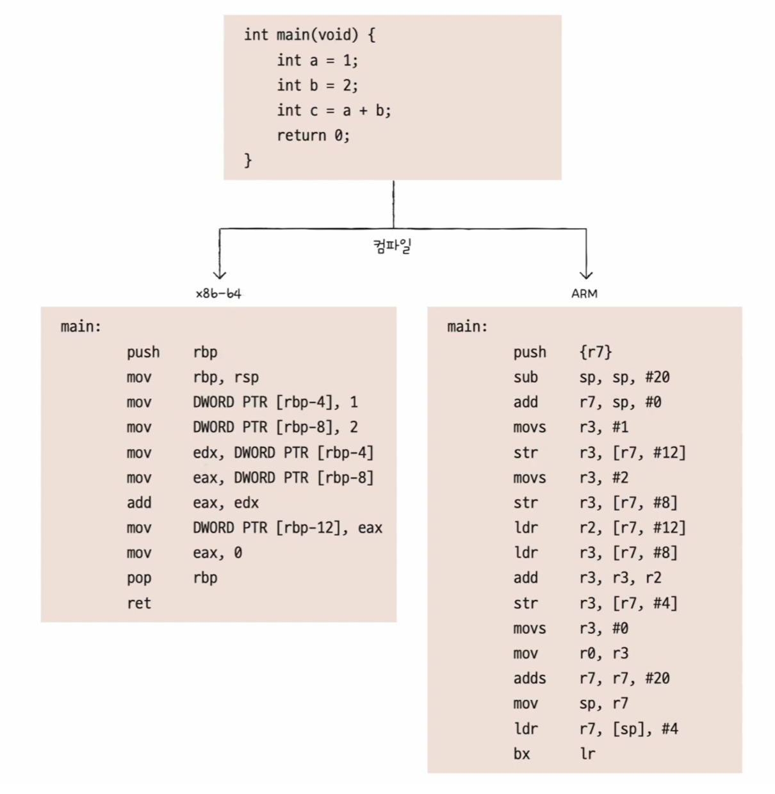
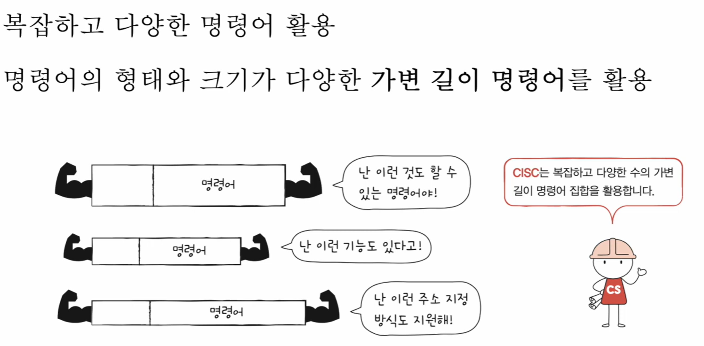
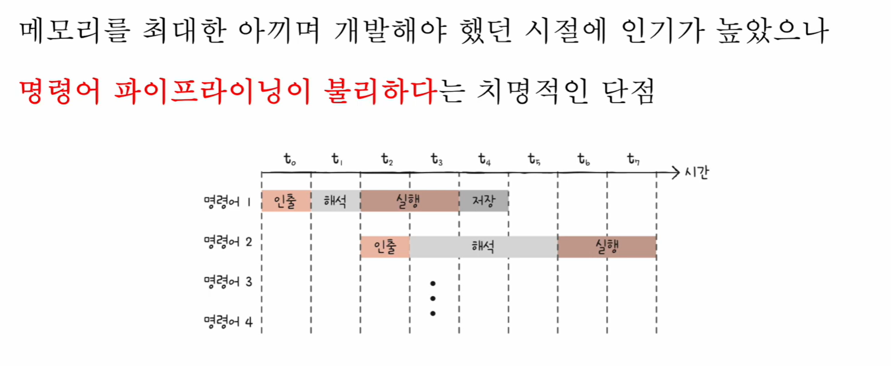
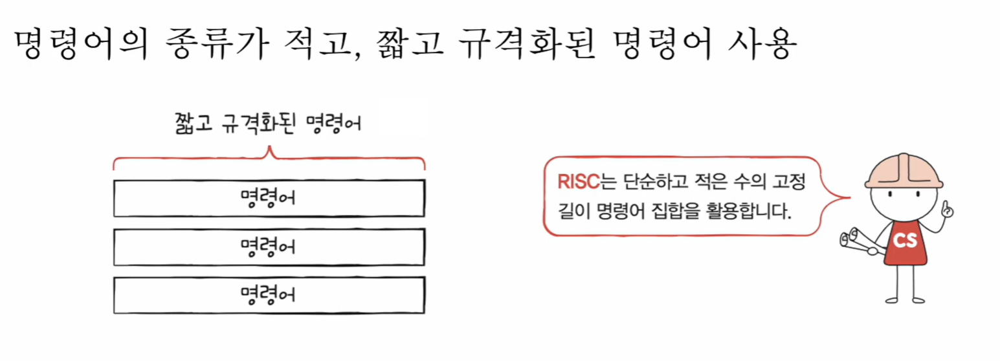
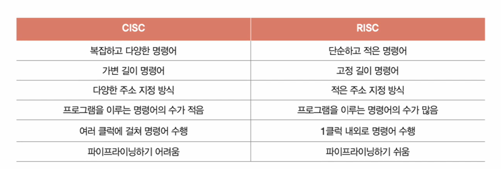

# 🧠 14강 명령어 집합 구조, CISC와 RISC

CPU는 “명령어”를 실행한다.  
하지만 세상의 모든 CPU가 **똑같은 명령어**를 실행하는 건 아니다. CPU마다 **명령어의 생김새**, **연산 종류**, **주소 지정 방식**, **레지스터 구성** 등이 달라지고, 이 차이를 정의하는 약속이 **ISA(Instruction Set Architecture)** 다.

---

## 📚 목차
- [🧠 14강 명령어 집합 구조, CISC와 RISC](#-14강-명령어-집합-구조-cisc와-risc)
  - [📚 목차](#-목차)
  - [1. 명령어 집합(ISA)이란?](#1-명령어-집합isa이란)
  - [2. ISA가 바뀌면 무엇이 달라질까?](#2-isa가-바뀌면-무엇이-달라질까)
  - [3. CISC란?](#3-cisc란)
    - [3.1 CISC의 장점](#31-cisc의-장점)
    - [3.2 CISC의 단점](#32-cisc의-단점)
    - [3.3 현대 CISC는 내부적으로 RISC처럼 동작](#33-현대-cisc는-내부적으로-risc처럼-동작)
  - [4. RISC란?](#4-risc란)
    - [4.1 RISC의 장점](#41-risc의-장점)
    - [4.2 RISC의 특징](#42-risc의-특징)
  - [5. CISC vs RISC 한눈에 비교](#5-cisc-vs-risc-한눈에-비교)
  - [6. 요약](#6-요약)

---

## 1. 명령어 집합(ISA)이란?

- **ISA(Instruction Set Architecture)**  
  → CPU가 이해할 수 있는 **명령어들의 규칙/약속(= CPU의 언어)**

- 같은 소스 코드라도, ISA가 다르면 컴파일 결과로 나오는 **어셈블리/기계어가 달라질 수 있다.**
  - 예: x86용 실행 파일을 ARM(iPhone 등)에서 그대로 실행하면 동작하지 않는다.

> ✅ **명령어 집합(ISA)** = CPU가 이해할 수 있는 명령어들의 모음

> ✅ ISA는 “CPU의 언어”이자, 하드웨어가 소프트웨어를 어떻게 이해할지에 대한 약속

---

## 2. ISA가 바뀌면 무엇이 달라질까?

ISA는 단순히 “명령어 목록”만 바꾸는 게 아니다. **CPU 설계 전반**에 나비효과가 생긴다.

- ✅ **명령어 해석 방식**
- ✅ **레지스터의 종류와 개수**
- ✅ **주소 지정 방식**
- ✅ **파이프라이닝의 용이성**
- ✅ 컴파일러 최적화 방향(코드 생성 방식) 등

> 💡 같은 C 코드라도 **x86-64**로 컴파일한 결과와 **ARM**으로 컴파일한 결과가 다르게 나올 수 있다.  
> (즉, ISA가 다르면 “CPU가 알아듣는 말” 자체가 달라진다.)

---

## 3. CISC란?

**CISC(Complex Instruction Set Computer)**  
→ “복잡한 명령어 집합”을 활용하는 CPU 구조

- 대표 ISA: **x86, x86-64**
- **가변 길이 명령어**(길이가 제각각)
- **다양하고 강력한 명령어** 제공
- **상대적으로 적은 명령어 수**로 프로그램 구성 가능

> ✅ CISC는 “이런 것도 하고 저런 것도 하는” **복잡하고 다양한 명령어**를 폭넓게 제공하는 방향

### 3.1 CISC의 장점

- 한 명령어가 할 수 있는 일이 많아  
  → 프로그램을 **상대적으로 적은 명령어 수**로 구성 가능
- 과거처럼 **메모리가 비싸고 제한적**이던 시절에는  
  → 코드 길이를 줄이는 데 유리해서 인기가 높았음

### 3.2 CISC의 단점

- **명령어 파이프라이닝에 불리**한 점이 치명적
  - 명령어가 복잡해 **실행 시간(클럭 수)이 일정하지 않음**
  - 명령어 길이도 가변이라 **디코딩/처리 흐름이 들쑥날쑥**
  - 어떤 명령어는 1클럭, 어떤 건 여러 클럭…  
    → 파이프라인이 “정형화된 흐름”으로 안정적으로 돌기 어려움

- 또한 **복잡한 명령어 중 다수는 사용 빈도가 낮음**
  - 제공은 하지만 실제 프로그램에서 자주 쓰이지 않는 명령어가 많다

> 💡 파이프라이닝은 각 단계가 “비슷한 시간”으로 흘러야 유리한데,  
> CISC는 명령어마다 실행 시간이 들쑥날쑥해서 파이프라인 효율이 떨어질 수 있다.

### 3.3 현대 CISC는 내부적으로 RISC처럼 동작

현대 CISC CPU는 겉으로는 CISC 명령어를 받지만, 내부에서는 종종 명령어를 더 작은 단위로 쪼개서 실행한다.

- 이를 **마이크로 명령어(μops)** 라고 부름
- 복잡한 CISC 명령어 → 내부적으로 잘게 분해 → 단순한 동작 단위로 실행  
  → 결과적으로 **내부 실행은 RISC스럽게** 되는 경우가 많다

---

## 4. RISC란?

**RISC(Reduced Instruction Set Computer)**  
→ “단순하고 규격화된 명령어 집합”을 활용하는 CPU 구조

- **고정 길이 명령어**(규격화)
- **단순하고 적은 수의 명령어**
- 파이프라이닝에 유리

> ✅ RISC는 “짧고 규격화된 명령어”로 파이프라이닝을 잘 돌리기 좋은 방향

### 4.1 RISC의 장점

- 명령어가 짧고 규격화되어  
  → **디코딩이 쉽고**, **파이프라이닝에 유리**
- “명령어 실행 시간”이 비교적 일정하게 설계되기 쉬움  
  → 파이프라인이 안정적으로 동작

### 4.2 RISC의 특징

- 메모리 접근 최소화 + 레지스터 적극 활용
  - **Load / Store 구조**
  - 메모리 접근은 보통 Load/Store로만 처리
- CISC에 비해 **범용 레지스터가 많은 편**
- 단점: 명령어 하나가 단순하므로  
  → 같은 일을 하려면 **더 많은 명령어 수**가 필요할 수 있음

---

## 5. CISC vs RISC 한눈에 비교

| 구분 | CISC | RISC |
|---|---|---|
| 명령어 | 복잡하고 다양함 | 단순하고 적음 |
| 명령어 길이 | 가변 길이 | 고정 길이 |
| 주소 지정 방식 | 다양한 편 | 상대적으로 적음 |
| 프로그램 명령어 수 | 적은 편 | 많은 편 |
| 실행 클럭 | 여러 클럭에 걸칠 수 있음 | 1클럭 내외 지향 |
| 파이프라이닝 | 어렵다(불리) | 쉽다(유리) |

---

## 6. 요약

- **ISA**: CPU의 언어이자 하드웨어-소프트웨어 약속
- **CISC**
  - 강력하고 다양한(가변 길이) 명령어
  - 과거 메모리 제약 시대에 유리
  - 파이프라이닝에 불리할 수 있음
  - 현대 CISC는 내부적으로 μops로 쪼개 **RISC처럼 실행**하는 경우가 많음
- **RISC**
  - 단순하고 규격화된(고정 길이) 명령어
  - 파이프라이닝에 유리
  - Load/Store 중심 + 레지스터 적극 활용
  - 같은 작업에 더 많은 명령어가 필요할 수 있음
