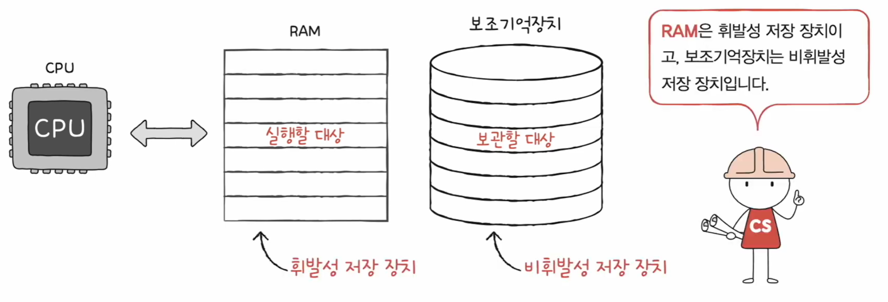
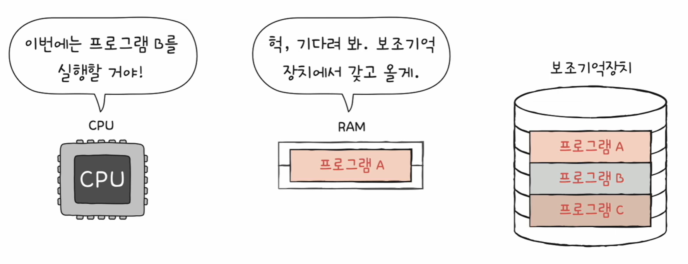
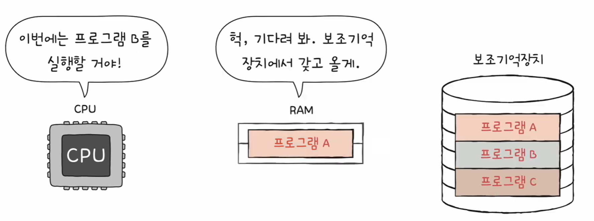
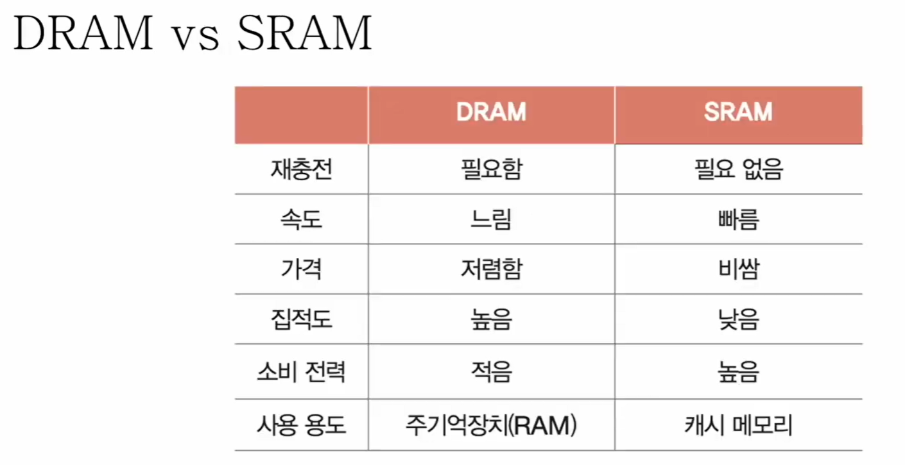
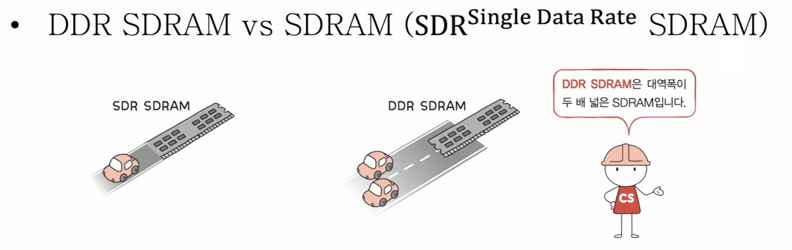
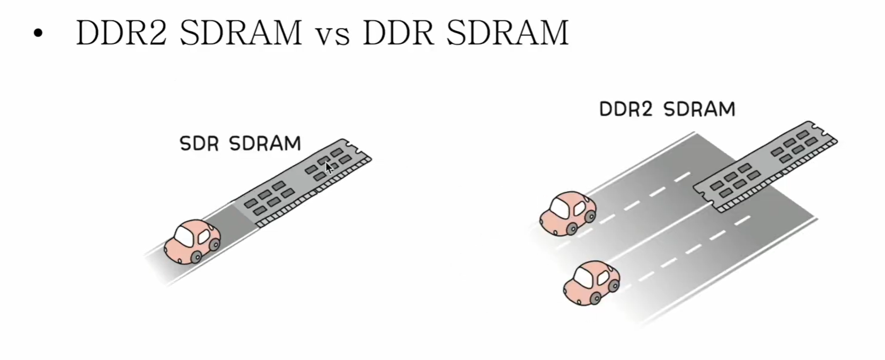

# 🧠 15강 RAM의 특성과 종류

## 📚 목차
- [🧠 15강 RAM의 특성과 종류](#-15강-ram의-특성과-종류)
  - [📚 목차](#-목차)
  - [🧩 개요](#-개요)
  - [⚡ RAM의 특성](#-ram의-특성)
  - [🏎️ RAM의 용량과 성능](#️-ram의-용량과-성능)
    - [✅ RAM이 작을 때(체감 느려질 수 있음)](#-ram이-작을-때체감-느려질-수-있음)
    - [✅ RAM이 클 때(체감 빨라질 수 있음)](#-ram이-클-때체감-빨라질-수-있음)
  - [🧠 RAM의 종류](#-ram의-종류)
    - [💧 DRAM (Dynamic RAM)](#-dram-dynamic-ram)
    - [🧱 SRAM (Static RAM)](#-sram-static-ram)
    - [⏱️ SDRAM (Synchronous DRAM)](#️-sdram-synchronous-dram)
    - [⚡ DDR SDRAM (Double Data Rate SDRAM)](#-ddr-sdram-double-data-rate-sdram)
  - [✅ 요약 정리](#-요약-정리)

---

## 🧩 개요

- 주기억장치의 종류에는 크게 **RAM**과 **ROM** 두 가지가 있다.
- 보통 일상/학습에서 “메모리”라고 하면, 대개 **RAM을 지칭**하는 경우가 많다.

---

## ⚡ RAM의 특성

- **CPU는 메모리(RAM)로부터 명령어와 데이터를 가져와 실행**한다.
- RAM은 “지금 실행할 대상”을 저장하는 공간이다.
- 하지만 RAM은 **휘발성(volatile)** 저장 장치이므로,
  - **전원이 꺼지면 저장 내용이 사라진다.**
- 그래서 전원이 꺼져도 데이터를 보관할 수 있는 **보조기억장치(비휘발성, non-volatile)** 가 필요하다.

✅ 정리

- **RAM**: 실행할 대상 저장(빠르게 꺼내 써야 함)
- **보조기억장치**: 보관할 대상 저장(전원 꺼져도 유지)

> 💡 그림 포인트: RAM에는 “실행할 대상”, 보조기억장치에는 “보관할 대상”이 들어가며, RAM은 전원이 꺼지면 내용이 사라진다.

---

## 🏎️ RAM의 용량과 성능

RAM 용량이 충분하지 않으면, CPU가 실행에 필요한 프로그램/데이터를 그때그때 **보조기억장치에서 가져오느라** 성능이 떨어질 수 있다.

### ✅ RAM이 작을 때(체감 느려질 수 있음)
- RAM에 올려둘 수 있는 프로그램이 적다.
- CPU가 “다음에 실행할 프로그램”을 요청하면 RAM이 보조기억장치에서 가져오느라 **기다림(지연)** 이 생긴다.

> 💡 그림 포인트: CPU가 “프로그램 B 실행”을 원하지만, RAM에는 프로그램 A만 있어서 보조기억장치에서 다시 가져와야 한다.

### ✅ RAM이 클 때(체감 빨라질 수 있음)
- 더 많은 프로그램/데이터를 RAM에 미리 올려둘 수 있다.
- CPU가 필요로 하는 것들이 이미 RAM에 있으면 **바로 가져와 실행**할 수 있다.

> 💡 그림 포인트: RAM에 더 많은 프로그램이 올라가 있을수록, CPU가 보조기억장치를 덜 기다리게 된다.

---

## 🧠 RAM의 종류

---

### 💧 DRAM (Dynamic RAM)

- **Dynamic = 동적**
- 전원이 연결되어 있어도 저장된 데이터가 **시간이 지나면 사라질 수 있는 RAM**
- 데이터 유지를 위해 **주기적으로 재활성화(리프레시, refresh)** 가 필요하다.
- 일반적으로 우리가 말하는 “메모리(RAM)”는 보통 **DRAM 기반**이다.

✅ DRAM이 메인 메모리로 많이 쓰이는 이유
- 상대적으로 **저렴**
- 상대적으로 **소비 전력 낮음**
- **집적도 높음**(오밀조밀하게 설계 가능 → 대용량에 유리)

---

### 🧱 SRAM (Static RAM)

- **Static = 정적**
- 전원이 연결된 동안에는 저장된 데이터가 **상대적으로 잘 유지되는 RAM**
  - (단, 전원을 끄면 RAM이므로 데이터는 사라짐)
- 일반적으로 **DRAM보다 입출력 속도가 빠르다.**
- 보통 **캐시 메모리**에 사용된다.

✅ SRAM이 캐시에 쓰이는 이유
- “**대용량일 필요는 없지만 매우 빨라야 하는 곳**”에 적합
- 다만 DRAM 대비
  - **비쌈**
  - **소비 전력 높음**
  - **집적도 낮음**(대용량에 불리)

> 💡 그림 포인트: DRAM은 리프레시가 필요하지만 저렴/고집적이라 메인 메모리에 적합하고, SRAM은 빠르지만 비싸/저집적이라 캐시에 적합하다.

---

### ⏱️ SDRAM (Synchronous DRAM)

- DRAM의 발전된 형태
- **클럭 신호와 동기화(Synchronous)** 되어 동작하는 DRAM
- 클럭에 맞춰 데이터를 주고받는다.

📌 대표 형태
- **SDR(Single Data Rate) SDRAM**
  - 클럭 신호 **한 번에 한 번** 데이터 전송

---

### ⚡ DDR SDRAM (Double Data Rate SDRAM)

- SDRAM의 발전된 형태
- 최근 가장 대중적으로 메모리로 사용되는 RAM 계열
- **대역폭(데이터를 주고받는 길의 너비)** 을 넓혀 속도를 끌어올린 방식

📌 DDR 계열(세대가 올라갈수록 더 빠름)
- **DDR2 SDRAM**
- **DDR3 SDRAM**
- **DDR4 SDRAM**

> 💡 그림 포인트: DDR은 “대역폭이 2배 넓다”는 비유로 속도 향상을 설명한다.

> 💡 그림 포인트: 길(대역폭)이 넓어질수록 한 번에 더 많은 데이터가 오갈 수 있어 전송 효율이 좋아진다.

---

## ✅ 요약 정리

- RAM은 **CPU가 실행할 대상(명령어/데이터)** 을 저장하는 주기억장치이며 **휘발성**이다.
- RAM이 충분하면 필요한 프로그램을 RAM에 더 많이 올려둘 수 있어, CPU가 보조기억장치를 덜 기다리게 되어 **체감 성능이 좋아질 수 있다.**
- 종류별 핵심
  - **DRAM**: 리프레시 필요 / 느리지만 저렴·고집적 → **메인 메모리**
  - **SRAM**: 리프레시 불필요 / 빠르지만 비쌈·저집적 → **캐시 메모리**
  - **SDRAM**: 클럭과 동기화된 DRAM
  - **DDR SDRAM**: 대역폭을 넓혀 더 빠르게 만든 SDRAM 계열(DDR2→DDR3→DDR4)
