# 🧠 16강 메모리의 주소 공간-물리 주소와 논리 주소

> 실행 중인 프로그램은 “진짜 메모리 번지(물리 주소)”를 직접 다루지 않는다.  
> 프로그램은 **논리 주소(0부터 시작)**만 사용하고, 실제 접근은 **MMU가 물리 주소로 변환**한다.

---

## 📌 목차
- [🧠 16강 메모리의 주소 공간-물리 주소와 논리 주소](#-16강-메모리의-주소-공간-물리-주소와-논리-주소)
  - [📌 목차](#-목차)
  - [1. 개요](#1-개요)
  - [2. 주소 체계](#2-주소-체계)
    - [2.1 물리 주소(Physical Address)](#21-물리-주소physical-address)
    - [2.2 논리 주소(Logical Address)](#22-논리-주소logical-address)
    - [2.3 왜 논리 주소가 필요할까? (프로그램별 0번지 문제)](#23-왜-논리-주소가-필요할까-프로그램별-0번지-문제)
      - [📷 논리 주소 vs 물리 주소(프로그램별 매핑)](#-논리-주소-vs-물리-주소프로그램별-매핑)
  - [3. 논리 주소 → 물리 주소 변환](#3-논리-주소--물리-주소-변환)
    - [3.1 MMU(메모리 관리 장치)](#31-mmu메모리-관리-장치)
      - [📷 MMU에 의해 변환되는 흐름(개념)](#-mmu에-의해-변환되는-흐름개념)
    - [3.2 베이스 레지스터 + 논리 주소](#32-베이스-레지스터--논리-주소)
      - [📷 “기준주소(베이스 레지스터) + 논리 주소”로 변환](#-기준주소베이스-레지스터--논리-주소로-변환)
    - [3.3 주소 변환 예시(같은 논리 주소도 프로그램마다 다른 물리 주소로)](#33-주소-변환-예시같은-논리-주소도-프로그램마다-다른-물리-주소로)
  - [4. 메모리 보호](#4-메모리-보호)
    - [4.1 한계 레지스터(Limit Register)](#41-한계-레지스터limit-register)
      - [📷 보호 범위 개념(베이스/한계)](#-보호-범위-개념베이스한계)
    - [4.2 보호 범위 조건](#42-보호-범위-조건)
    - [4.3 “이런 명령어는 실행돼도 안전할까?” (물리/논리 주소 혼동)](#43-이런-명령어는-실행돼도-안전할까-물리논리-주소-혼동)
    - [4.4 보호가 없으면 생기는 문제(침범 예시)](#44-보호가-없으면-생기는-문제침범-예시)
      - [📷 CPU의 검사 흐름(개념 요약)](#-cpu의-검사-흐름개념-요약)
  - [5. 핵심 요약](#5-핵심-요약)

---

## 1. 개요

- CPU와 실행 중인 프로그램은 메모리의 “몇 번지에 무엇이 저장되어 있는지”를 **고정적으로** 다 알지 못함
- 메모리에 저장된 값들은 계속 변함
  - 새 프로그램 실행 → 메모리에 **새로 적재**
  - 실행 종료 → 메모리에서 **삭제**
  - 같은 프로그램이라도 실행할 때마다 **적재 위치(물리 주소)가 달라질 수 있음**

---

## 2. 주소 체계

### 2.1 물리 주소(Physical Address)

- **메모리(RAM) 입장에서** 바라본 주소
- 정보가 실제로 저장된 **하드웨어상의 주소**
- **겹치는 주소 번지가 없음(유일함)**

### 2.2 논리 주소(Logical Address)

- **CPU와 실행 중인 프로그램 입장에서** 바라본 주소
- 프로그램마다 **0번지부터 시작**하는 주소 공간을 부여
- 여러 프로그램이 동시에 실행되면
  - 각 프로그램의 논리 주소는 **서로 겹칠 수 있음** (각자 0번지 보유 가능)

---

### 2.3 왜 논리 주소가 필요할까? (프로그램별 0번지 문제)

아래 그림처럼, 각 프로그램은 자기 관점에서 **0번지부터 시작**해도 된다.  
하지만 실제 메모리(물리 주소)에서는 서로 다른 위치에 올라가므로, **논리 → 물리 변환**이 필요하다.

#### 📷 논리 주소 vs 물리 주소(프로그램별 매핑)
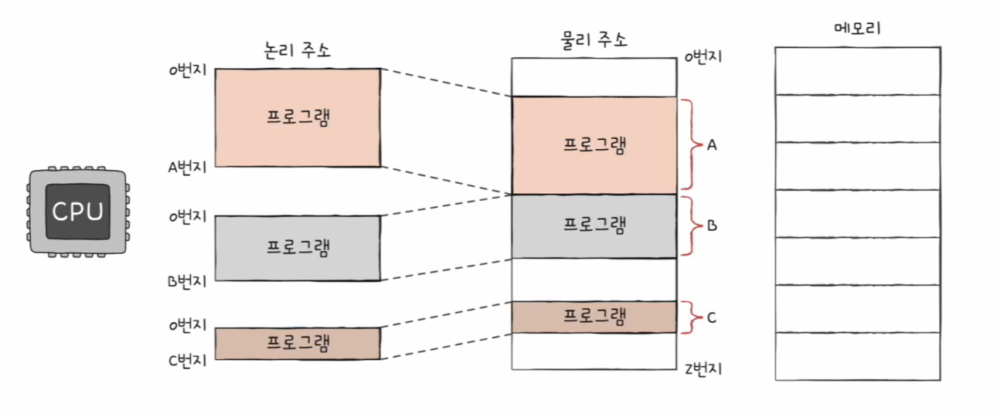

🖼️ (예시) 브라우저/게임/메모장이 각각 0번지를 갖는 상황

- 논리 주소 관점: 세 프로그램 모두 “0번지”가 존재 (겹침)
- 물리 주소 관점: 세 프로그램은 메모리의 서로 다른 구간(A/B/C)에 적재됨

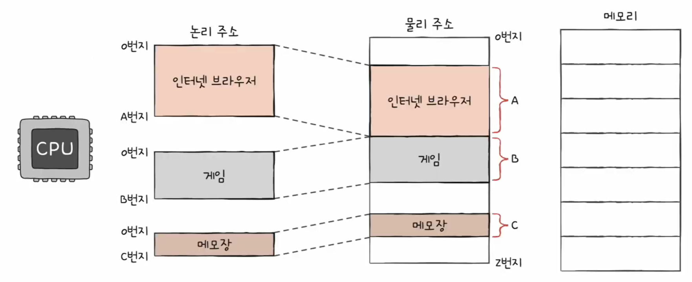

🖼️ (왜 변환이 필요한가?) “0번지는 하나뿐인데?” 같은 혼란

- CPU(프로그램)가 “브라우저의 0번지에 A 저장” 같은 명령을 내려도,
  실제 물리 메모리에서는 브라우저가 올라간 구간(A)을 찾아가야 함.
- 게임도 “게임의 0번지 삭제”가 가능한 이유는,
  게임의 논리 0번지가 **다른 물리 구간(B)**에 매핑되기 때문

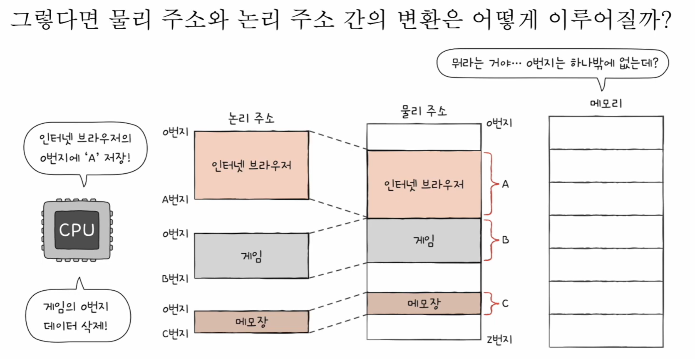

---

## 3. 논리 주소 → 물리 주소 변환

CPU가 메모리에 접근하려면 주소 체계가 맞아야 한다.

- CPU가 쓰는 주소: **논리 주소**
- 실제 RAM이 쓰는 주소: **물리 주소**
- 따라서 **논리 주소를 물리 주소로 변환**해야만 메모리에 접근 가능

---

### 3.1 MMU(메모리 관리 장치)

논리 주소를 물리 주소로 바꾸는 하드웨어가 **MMU(Memory Management Unit)** 이다.

#### 📷 MMU에 의해 변환되는 흐름(개념)
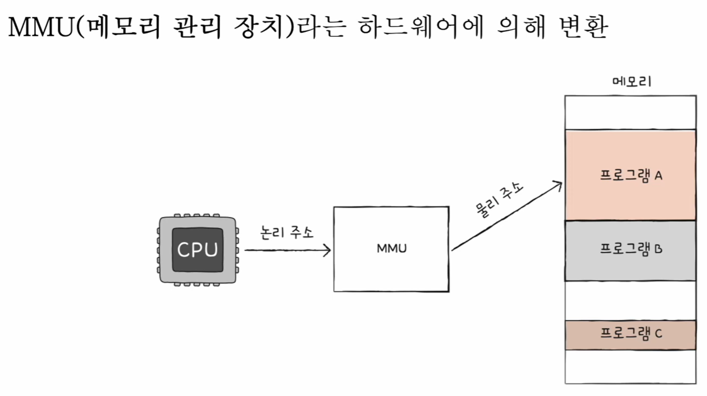

✅ 핵심
- CPU는 논리 주소를 내보냄
- MMU가 이를 변환해 물리 주소로 만들어 메모리에 접근

---

### 3.2 베이스 레지스터 + 논리 주소

가장 단순한 변환 방식(베이스 레지스터 기반)은 아래처럼 동작한다.

> **물리 주소 = 베이스 레지스터 값 + 논리 주소(오프셋)**

- **베이스 레지스터(Base Register)**: 프로그램이 적재된 **시작 물리 주소(기준주소)**
- **논리 주소**: 프로그램 시작점(논리 0번지)에서부터의 **거리(오프셋)**

#### 📷 “기준주소(베이스 레지스터) + 논리 주소”로 변환

---

### 3.3 주소 변환 예시(같은 논리 주소도 프로그램마다 다른 물리 주소로)

아래 예시는 “논리 주소 100번지” 같은 **똑같은 숫자**를 쓰더라도,  
프로그램의 **베이스 레지스터(적재 시작 위치)** 가 다르면 **실제로 접근되는 물리 주소가 완전히 달라진다**는 걸 보여준다.

🖼️ 예시 1) 프로그램 A의 논리 주소 100 → 물리 주소 15100

- 프로그램 A의 베이스 레지스터 = 15000
- 논리 주소 = 100
- 물리 주소 = 15000 + 100 = **15100**

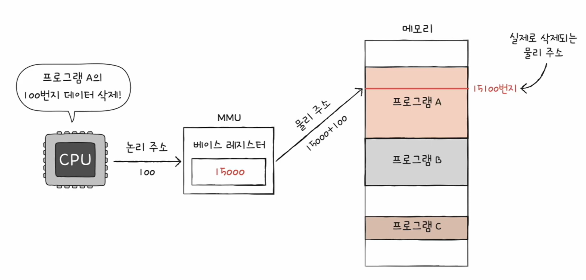

🖼️ 예시 2) 프로그램 C의 논리 주소 100 → 물리 주소 45100

- 프로그램 C의 베이스 레지스터 = 45000
- 논리 주소 = 100
- 물리 주소 = 45000 + 100 = **45100**

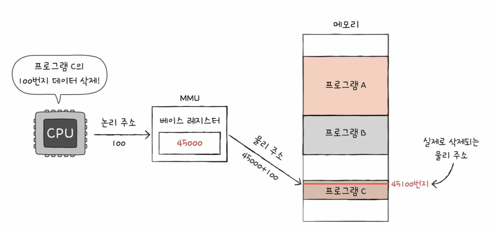

✅ 정리  
- 프로그램은 “자기 기준(논리)”로만 주소를 쓰고  
- 실제 메모리 위치(물리)는 **MMU + 베이스 레지스터**가 알아서 맞춰준다.

---

## 4. 메모리 보호

멀티프로그램 환경에서는, 한 프로그램이 다른 프로그램 영역을 침범하면 안 된다.  
그래서 CPU는 메모리에 접근하기 전 **접근하려는 논리 주소가 안전한 범위인지 검사**한다.

---

### 4.1 한계 레지스터(Limit Register)

- **한계 레지스터(limit register)** 는 “프로그램이 접근 가능한 논리 주소의 최대 크기”를 저장
- CPU는 메모리 접근 전 항상 확인한다:

> **접근하려는 논리 주소 < 한계 레지스터 값** 이어야 한다.

#### 📷 보호 범위 개념(베이스/한계)
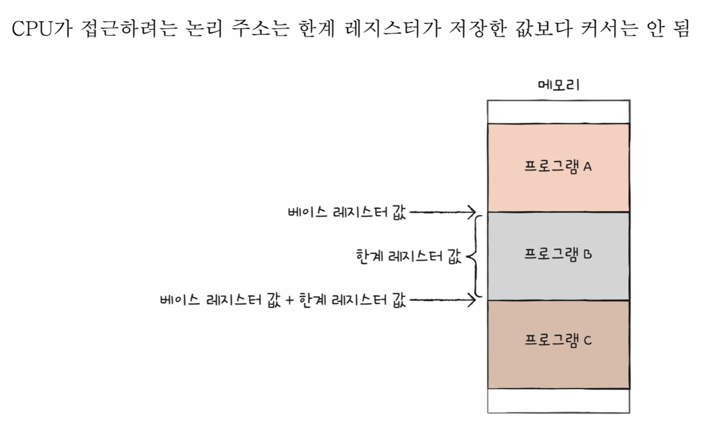

---

### 4.2 보호 범위 조건

프로그램이 접근 가능한 물리 주소 범위는 보통 이렇게 표현한다.

> **베이스 레지스터 값 ≤ 물리 주소 < 베이스 레지스터 값 + 한계 레지스터 값**

즉,
- 시작점: 베이스 레지스터
- 끝점(직전): 베이스 + 한계

---

### 4.3 “이런 명령어는 실행돼도 안전할까?” (물리/논리 주소 혼동)

아래 그림들은 “명령어에 들어 있는 주소”가 **물리 주소처럼 해석되거나**,  
혹은 **논리 주소라도 범위 검사가 없으면** 얼마나 위험해질 수 있는지 보여준다.

🖼️ (상황) 메모장 1500번지에 저장하라 — 이게 안전한가?

- 실행 중인 프로그램(메모장)은 논리 주소 공간을 써야 하는데,
  만약 명령어가 “1500번지”처럼 **절대 주소(물리 주소)** 를 직접 다루는 식이면,
  프로그램이 메모리의 실제 배치에 종속되어 **실행 시점/적재 위치에 따라 결과가 달라질 수 있음**  
- “어떤 주소를 쓰는지” 자체가 위험해지는 출발점

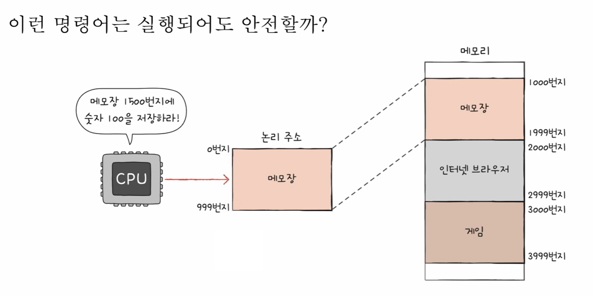

🖼️ (상황) “인터넷 브라우저 1100번지 데이터를 삭제하라” — 더 위험한 이유

- 특정 프로그램의 특정 번지를 콕 집는 명령이 가능해지면,
  악성/오류 프로그램이 **다른 프로그램 영역을 직접 건드리는 시도** 자체가 생김
- 즉, “프로그램 간 침범”이 가능해질 수 있음(보호 필요)

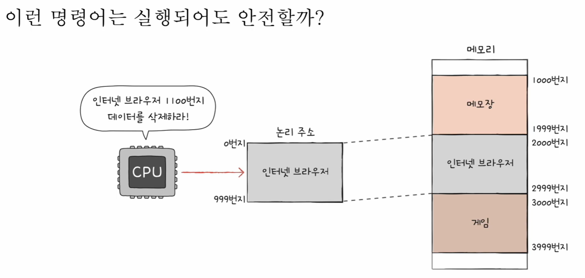

🖼️ (핵심) 논리 주소라도 ‘범위 검사’ 없으면 다른 프로그램 영역으로 튈 수 있음

- 브라우저의 베이스 레지스터가 2000이라면,
  논리 주소 1100을 변환하면 물리 주소 3100이 됨 (2000 + 1100)
- 그런데 브라우저가 차지하는 범위가 2000~2999라면,
  3100은 **브라우저 범위 밖**이고, 실제로는 **게임 영역(3000~3999)** 이 될 수 있음
- 그래서 **한계 레지스터 검사(논리 < 한계)** 가 반드시 필요함

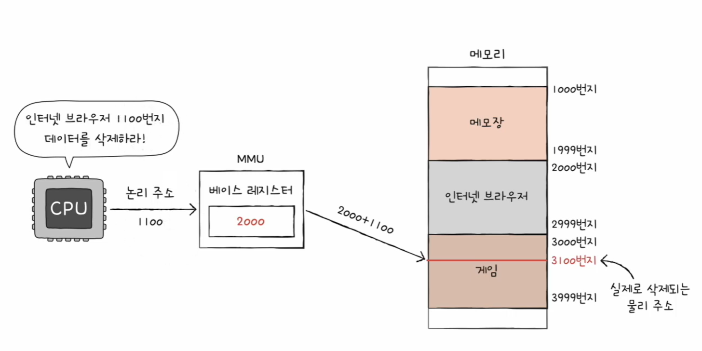

✅ 결론  
- **논리 주소 + 베이스 변환만으로는 충분하지 않다.**  
- 논리 주소가 프로그램 크기(한계)를 넘어가면, 변환된 물리 주소가 다른 프로그램 영역이 될 수 있으므로  
  **한계 레지스터로 먼저 검사 → 범위 밖이면 트랩(인터럽트)** 로 막는다.

---

### 4.4 보호가 없으면 생기는 문제(침범 예시)

한계 검사 없이 “베이스 + 논리 주소”만으로 물리 주소를 만들면,  
논리 주소가 너무 큰 경우 **다른 프로그램 영역**으로 튈 수 있다.

🖼️ (침범 예시 1) 프로그램 A가 범위를 넘어 접근하면, 프로그램 B 영역을 건드릴 수 있음

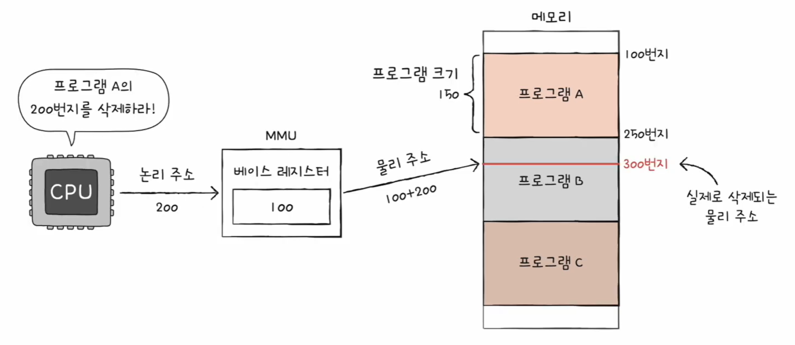

🖼️ (침범 예시 2) 프로그램 B가 범위를 넘어 접근하면, 프로그램 C 영역을 건드릴 수 있음

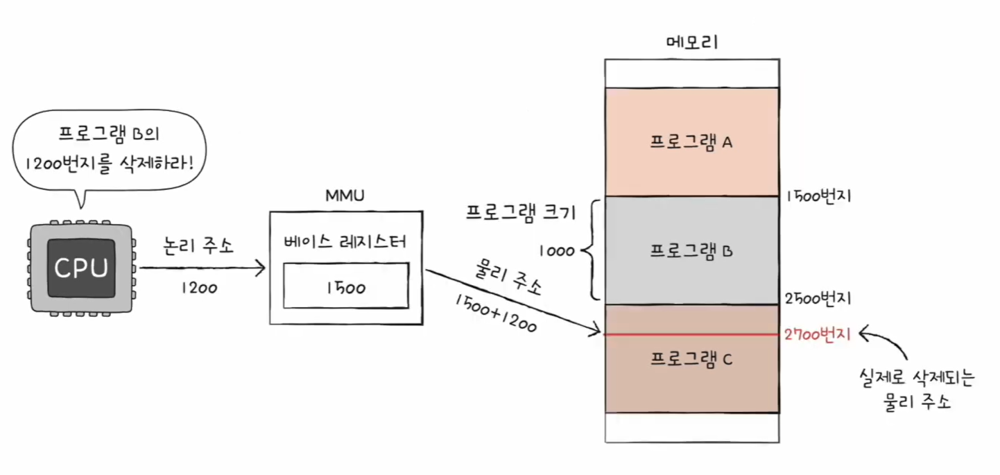

#### 📷 CPU의 검사 흐름(개념 요약)

CPU는 메모리 접근 전 아래처럼 검사한다.

- 논리 주소가 한계 레지스터보다 작다 → OK → (베이스+논리)로 물리 주소 생성 후 접근
- 논리 주소가 한계 레지스터 이상이다 → **트랩(인터럽트)** → 접근 차단(침범 방지)

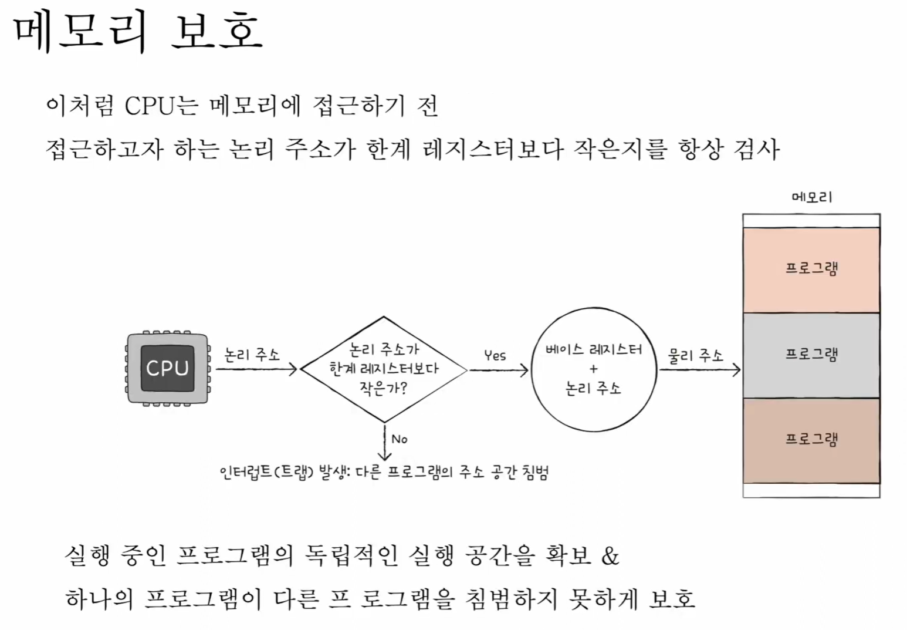

---

## 5. 핵심 요약

- **물리 주소**: 실제 RAM 주소(유일)
- **논리 주소**: 프로그램 기준 주소(0부터 시작, 프로그램끼리 겹칠 수 있음)
- **MMU**: 논리 주소를 물리 주소로 변환하는 하드웨어
- 변환 기본 형태: **물리 = 베이스 + 논리(오프셋)**
- **메모리 보호**: 한계 레지스터로 논리 주소 범위를 검사해 **다른 프로그램 침범 방지**
- 범위 밖 접근 시: **트랩(인터럽트) 발생** → OS가 처리(보호)
