# 🧠 17강 캐시 메모리

## 📚 목차
- [🧠 17강 캐시 메모리](#-17강-캐시-메모리)
  - [📚 목차](#-목차)
  - [🧩 개요](#-개요)
  - [🗂 저장 장치 계층 구조(Memory hierarchy)](#-저장-장치-계층-구조memory-hierarchy)
    - [✅ 핵심 원칙 2가지](#-핵심-원칙-2가지)
    - [🔎 이미지로 계층 구조 이해하기](#-이미지로-계층-구조-이해하기)
  - [⚡ 캐시 메모리](#-캐시-메모리)
    - [🛒 비유로 이해하기 (마트 vs 편의점)](#-비유로-이해하기-마트-vs-편의점)
    - [✅ 캐시가 성능을 올리는 이유](#-캐시가-성능을-올리는-이유)
    - [🧱 캐시의 대표적인 구조](#-캐시의-대표적인-구조)
      - [1) 계층적 캐시 (L1–L2–L3 캐시)](#1-계층적-캐시-l1l2l3-캐시)
      - [2) 멀티코어 프로세서의 캐시 메모리](#2-멀티코어-프로세서의-캐시-메모리)
      - [3) 분리형 캐시 (명령어/데이터 캐시 분리)](#3-분리형-캐시-명령어데이터-캐시-분리)
  - [🎯 참조 지역성의 원리(Locality)](#-참조-지역성의-원리locality)
    - [🎯 캐시 히트 / 캐시 미스 / 캐시 적중률](#-캐시-히트--캐시-미스--캐시-적중률)
      - [✅ 캐시 히트(Cache hit)](#-캐시-히트cache-hit)
      - [❌ 캐시 미스(Cache miss)](#-캐시-미스cache-miss)
      - [📈 캐시 적중률(Cache hit ratio)](#-캐시-적중률cache-hit-ratio)
    - [🕒 시간 지역성](#-시간-지역성)
    - [📍 공간 지역성](#-공간-지역성)
  - [✅ 핵심 요약](#-핵심-요약)

---

## 🧩 개요

- CPU의 **연산 속도**에 비해, CPU가 **메모리(RAM)에 접근**하는 시간은 상대적으로 **느리다**.
- 이 속도 차이(병목)를 줄이기 위해 CPU는 “자주 쓸 것 같은 데이터/명령어”를 **가까운 곳에 미리 저장**해두는 전략을 사용한다.
- 이 역할을 하는 대표적인 장치가 **캐시 메모리(Cache Memory)** 이다.

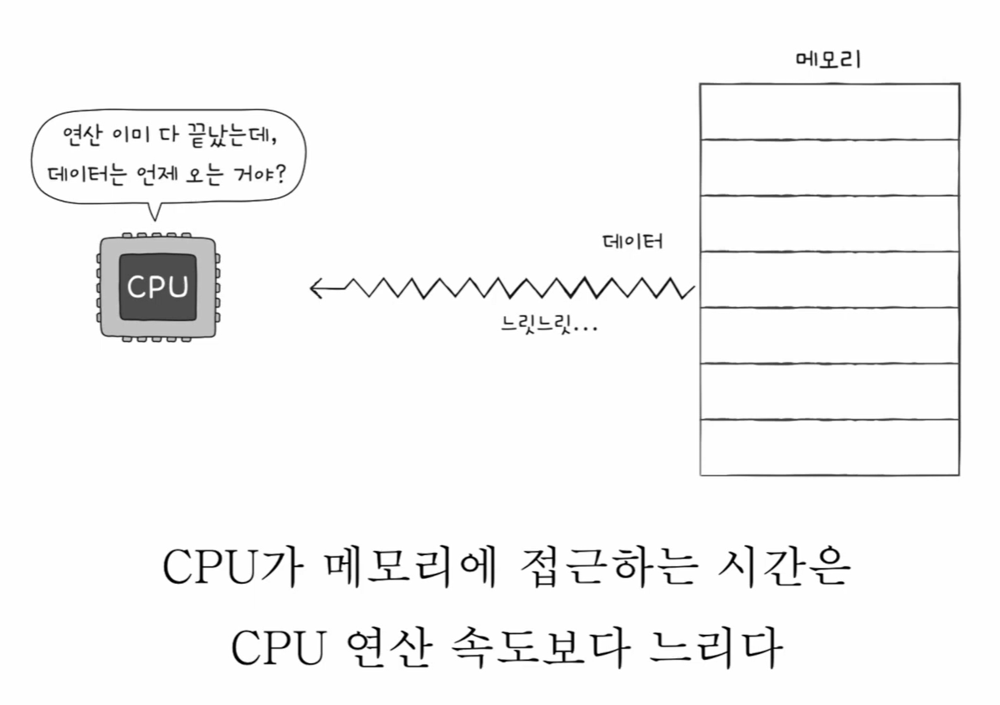
> 📝 그림 설명: CPU는 연산을 빨리 끝내도, **메모리에서 데이터가 오는 시간이 오래 걸리면** 전체 실행 시간이 늘어난다.

---

## 🗂 저장 장치 계층 구조(Memory hierarchy)

> 여기서 ‘메모리’는 RAM만이 아니라 **레지스터 ~ 보조기억장치까지 포함한 저장 장치 전체**를 의미한다.

### ✅ 핵심 원칙 2가지
1. **CPU와 가까운 저장 장치는 빠르고**, 멀리 있는 저장 장치는 느리다.
2. **빠른 저장 장치는 용량이 작고 가격이 비싸다.**

### 🔎 이미지로 계층 구조 이해하기

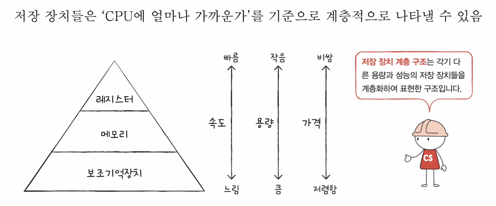
> 📝 그림 설명: 저장 장치를 **CPU와의 거리** 기준으로 정리하면, 속도/용량/가격 특성이 자연스럽게 계층을 이룬다.

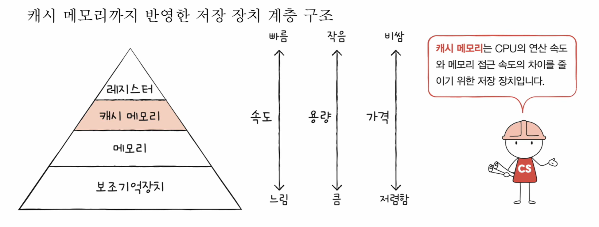
> 📝 그림 설명: 레지스터와 메모리(RAM) 사이에 **캐시 메모리**가 추가되어 속도 격차를 줄인다.

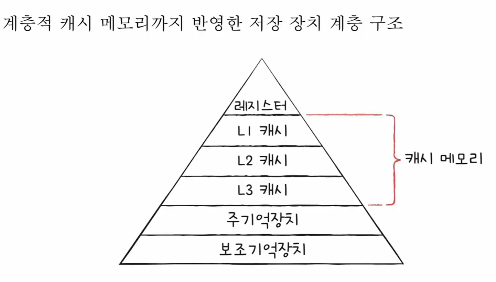
> 📝 그림 설명: 캐시는 보통 **L1 → L2 → L3**처럼 여러 단계로 구성되어, “더 빠른 대신 더 작은 캐시”를 CPU 가까이 둔다.

---

## ⚡ 캐시 메모리

- 캐시 메모리는 **CPU와 메모리(RAM) 사이**에 위치한 저장 장치
- 일반적으로 **SRAM 기반** (빠르지만 비싸고 용량이 작음)
- 역할:
  - CPU가 매번 RAM까지 왕복하지 않도록,
  - **CPU가 곧 사용할 가능성이 높은 데이터**를 미리 저장해두고 빠르게 제공한다.

---

### 🛒 비유로 이해하기 (마트 vs 편의점)

- 메모리에 접근 ≒ 물건을 사러 가는 것  
- 메모리 ≒ 물건은 많지만 멀리 있는 **대형 마트**  
- 캐시 메모리 ≒ 물건은 적어도 가까운 **편의점**  

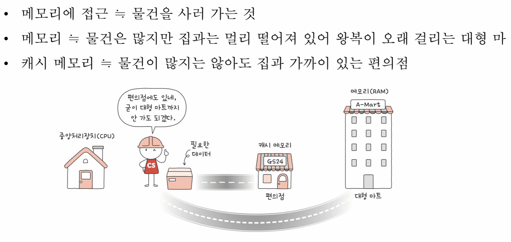
> 📝 그림 설명: 멀리 있는 대형 마트(메모리)를 매번 왕복하기보다, 가까운 편의점(캐시)에 자주 쓰는 물건을 미리 둔다.

---

### ✅ 캐시가 성능을 올리는 이유

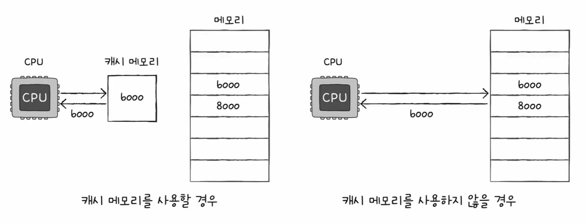
> 📝 그림 설명: 같은 데이터(b000)를 가져오더라도,  
> **캐시가 있으면** CPU↔캐시로 짧게 오가고,  
> **캐시가 없으면** CPU↔메모리를 길게 왕복하게 된다.

---

### 🧱 캐시의 대표적인 구조

#### 1) 계층적 캐시 (L1–L2–L3 캐시)
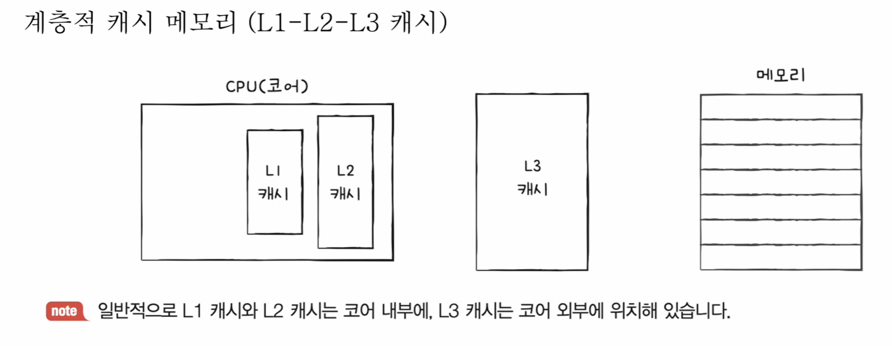
> 📝 그림 설명: 보통 **L1/L2는 코어 내부**, **L3는 코어 외부(공유)**에 위치하는 형태가 많다.

#### 2) 멀티코어 프로세서의 캐시 메모리
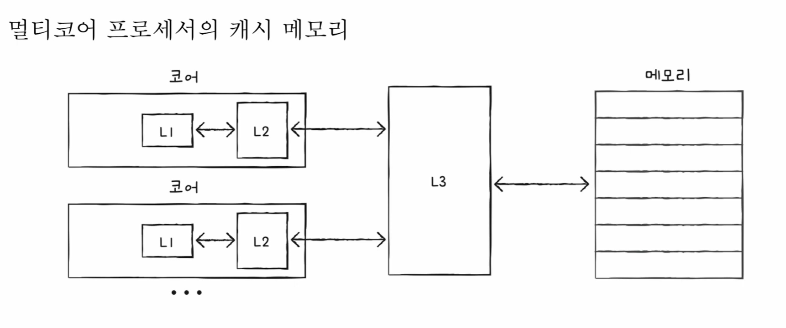
> 📝 그림 설명: 여러 코어가 있을 때 **L1/L2는 코어별로**, **L3는 공유**하는 구조로 표현되는 경우가 많다.

#### 3) 분리형 캐시 (명령어/데이터 캐시 분리)
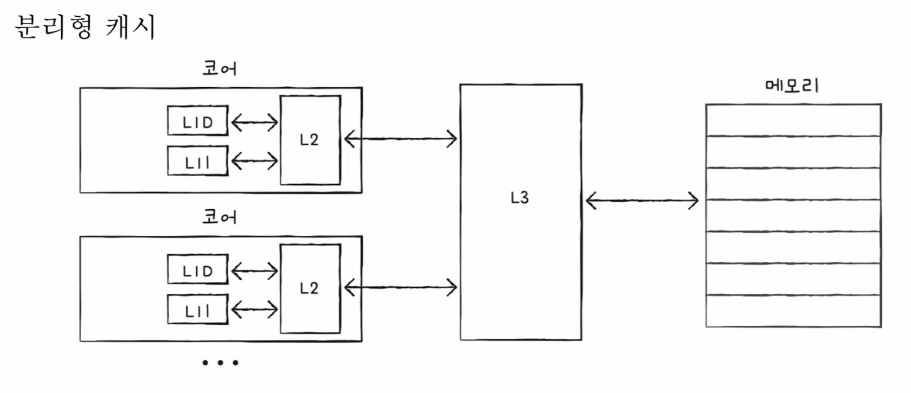
> 📝 그림 설명: L1을 **I-Cache(명령어)** / **D-Cache(데이터)**로 분리해 효율을 높인다.

---

## 🎯 참조 지역성의 원리(Locality)

- 캐시는 빠르지만 **용량이 작다** → 메모리의 모든 내용을 담을 수 없다.
- 그래서 캐시는 “CPU가 자주 사용할 법한 내용”을 **예측해서** 저장한다.
- 이 예측이 잘 맞는 이유는, 프로그램이 메모리를 접근하는 방식에 **경향(패턴)** 이 있기 때문이다.
- 이 경향을 정리한 개념이 **참조 지역성(Locality)** 이다.


> 📝 그림 설명: 캐시는 메모리 전체를 담을 수 없으니, CPU가 자주 쓸 법한 데이터를 **선별(예측)**해서 저장한다.

---

### 🎯 캐시 히트 / 캐시 미스 / 캐시 적중률

#### ✅ 캐시 히트(Cache hit)
- 예측이 들어맞은 경우  
- CPU가 필요한 데이터를 **캐시에서 바로 찾음**

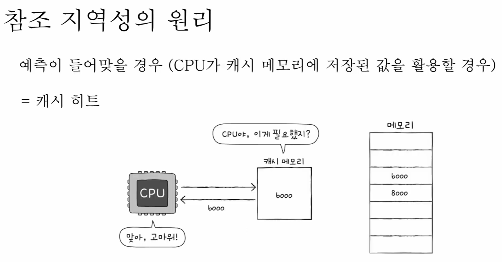
> 📝 그림 설명: CPU가 필요한 값(b000)이 캐시에 있어서 **바로 가져옴** → 빠름.

#### ❌ 캐시 미스(Cache miss)
- 예측이 틀린 경우  
- CPU가 필요한 데이터를 캐시에서 못 찾아 **메모리(RAM)까지 가야 함**


> 📝 그림 설명: 캐시에 없어서 메모리로 왕복 → **성능 하락**.

#### 📈 캐시 적중률(Cache hit ratio)
```
캐시 적중률 = 캐시 히트 횟수 / (캐시 히트 횟수 + 캐시 미스 횟수)
```
> ✅ 캐시의 실전 성능은 **적중률이 높을수록** 좋아진다.

---

### 🕒 시간 지역성

- CPU는 **최근에 접근했던 메모리 공간에 다시 접근하려는 경향**이 있다.
- 예) 반복문에서 같은 변수/데이터를 여러 번 사용

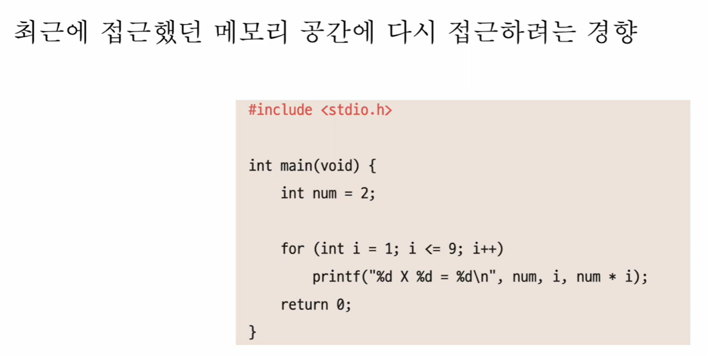
> 📝 그림 설명: 최근에 접근한 데이터가 다시 필요해지는 경향 → **시간 지역성**.

---

### 📍 공간 지역성

- CPU는 **접근한 메모리 공간 “근처(인접 주소)”를 접근하려는 경향**이 있다.
- 예) 배열/연속 데이터 구조, 프로그램 코드의 순차 실행

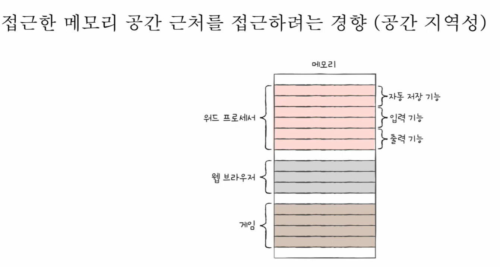
> 📝 그림 설명: 한 주소를 읽으면 근처 주소도 이어서 읽을 확률이 높다 → **공간 지역성**.

---

## ✅ 핵심 요약

- 저장 장치 계층 구조:
  - **CPU와 가까울수록 빠름**
  - **빠를수록 용량이 작고 비쌈**
- 캐시 메모리:
  - CPU와 RAM 사이에서 **속도 격차를 완화**
  - **자주 사용할 가능성이 높은 데이터**를 미리 저장해 접근 시간 단축
- 참조 지역성(Locality):
  - **시간 지역성**: 최근에 접근한 데이터를 다시 사용할 확률 ↑
  - **공간 지역성**: 접근한 주소 근처를 이어서 접근할 확률 ↑
- 그래서 캐시는 **적중률을 높여 성능 향상에 기여**한다
