# 🧠 18강 다양한 보조기억장치 (하드 디스크와 플래시 메모리)

보조기억장치는 전원이 꺼져도 데이터가 남는 **비휘발성 저장장치**로, 대표적으로 **하드 디스크(HDD)**와 **플래시 메모리(SSD/USB/SD 등)**가 있다.

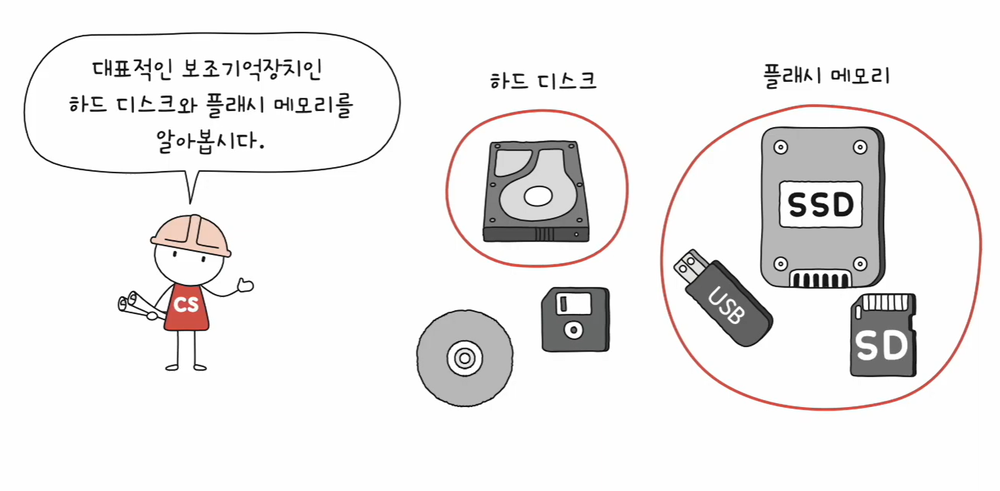

---

## 📚 목차

- [🧠 18강 다양한 보조기억장치 (하드 디스크와 플래시 메모리)](#-18강-다양한-보조기억장치-하드-디스크와-플래시-메모리)
  - [📚 목차](#-목차)
  - [💽 하드 디스크(HDD)](#-하드-디스크hdd)
    - [🧩 구성 요소](#-구성-요소)
    - [🗂 저장 단위](#-저장-단위)
      - [✅ 트랙(track)과 섹터(sector)](#-트랙track과-섹터sector)
      - [✅ 블록(block)](#-블록block)
      - [✅ 실린더(cylinder)](#-실린더cylinder)
    - [⏱ 데이터 접근 과정과 시간](#-데이터-접근-과정과-시간)
      - [✅ 탐색 시간(seek time)](#-탐색-시간seek-time)
      - [✅ 회전 지연(rotational latency)](#-회전-지연rotational-latency)
      - [✅ 전송 시간(transfer time)](#-전송-시간transfer-time)
    - [📌 참고: Jeff Dean - Numbers Every Programmer Should Know](#-참고-jeff-dean---numbers-every-programmer-should-know)
  - [⚡ 플래시 메모리(Flash Memory)](#-플래시-메모리flash-memory)
    - [🔀 종류: NAND vs NOR](#-종류-nand-vs-nor)
    - [🧬 기본 단위: 셀(Cell)](#-기본-단위-셀cell)
    - [🏠 SLC / MLC / TLC / QLC](#-slc--mlc--tlc--qlc)
    - [🧱 저장 단위 구조](#-저장-단위-구조)
    - [✍️ 읽기/쓰기 단위 vs 삭제 단위](#️-읽기쓰기-단위-vs-삭제-단위)
    - [🗑 페이지 상태: Free / Valid / Invalid](#-페이지-상태-free--valid--invalid)
    - [🧹 덮어쓰기 불가 \& 가비지 컬렉션](#-덮어쓰기-불가--가비지-컬렉션)
    - [🧪 플래시 메모리 동작 예시](#-플래시-메모리-동작-예시)
      - [1) 새로운 데이터 저장 (예: C 저장)](#1-새로운-데이터-저장-예-c-저장)
      - [2) 기존 데이터 일부만 수정 (예: A → A’)](#2-기존-데이터-일부만-수정-예-a--a)
  - [🔍 한눈에 비교](#-한눈에-비교)
  - [🧷 키워드 정리](#-키워드-정리)

---

## 💽 하드 디스크(HDD)

하드 디스크는 **자기적인 방식**으로 데이터를 저장한다.  
플래터(원판)가 회전하고, 헤드가 움직이면서 데이터를 읽고 쓴다.

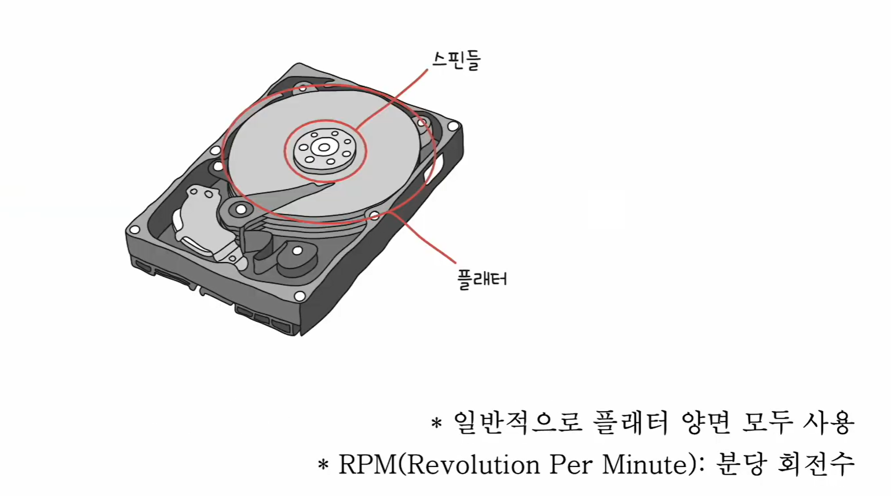

### 🧩 구성 요소

- **플래터(Platter)**
  - 자기 물질로 코팅된 원판
  - 일반적으로 **플래터 양면 모두 사용**
- **스핀들(Spindle)**
  - 플래터를 회전시키는 축
  - **RPM(Revolutions Per Minute)**: 분당 회전수
- **헤드(Head)**
  - 플래터 표면의 데이터를 읽고/쓰는 장치
- **디스크 암(Disk Arm)**
  - 일반적으로 모든 헤드가 디스크 암에 부착되어 **함께 이동**

아래 그림처럼, 디스크 암이 움직이며 헤드 위치가 바뀐다(여러 헤드가 같이 이동).

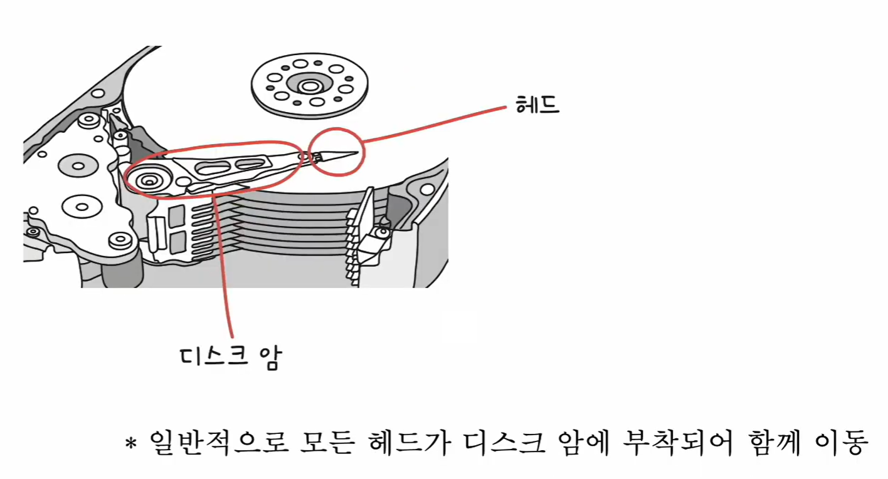
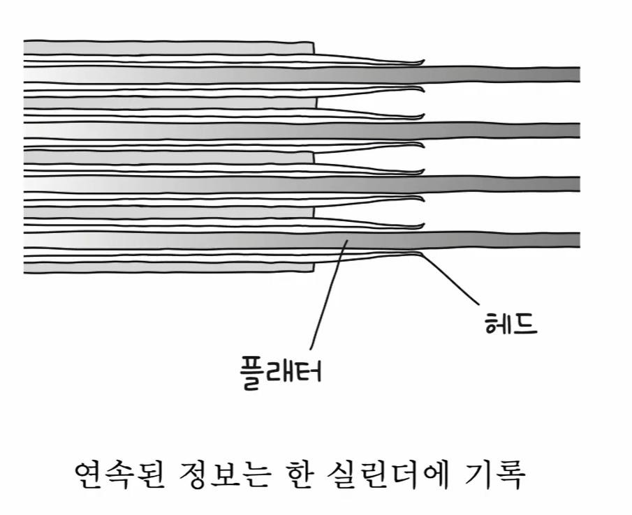

---

### 🗂 저장 단위

기본적으로 **트랙(track)**과 **섹터(sector)** 단위로 데이터를 저장한다.

- **섹터(sector)** 크기: **512B ~ 4096B**
- 하나 이상의 섹터를 묶어 **블록(block)** 이라고 표현하기도 한다.

#### ✅ 트랙(track)과 섹터(sector)

#### ✅ 블록(block)

- HDD에서 “블록”은 **하나 이상의 섹터를 묶은 단위**
- 운영체제/파일시스템 관점에서는 보통 **블록 단위로 읽고 쓰는 경우가 많다**  
  (디스크 물리 단위(섹터)와 OS 단위(블록)가 다를 수 있음)

#### ✅ 실린더(cylinder)

- 여러 겹의 플래터 상에서 **같은 트랙이 위치한 곳을 모아 연결한 논리적 단위**
- 관련 데이터를 한 실린더에 모으면  
  → **헤드를 움직일 필요 없이**(큰 이동 없이) 연속적으로 읽기 유리

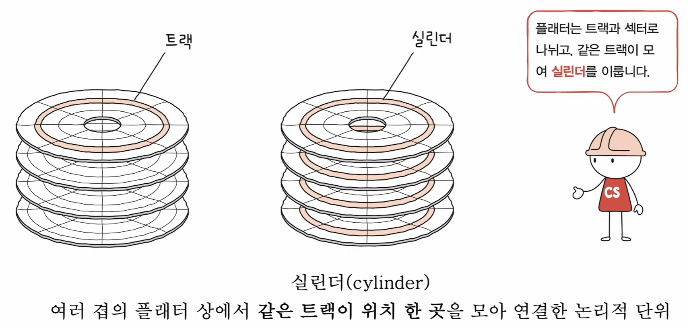

---

### ⏱ 데이터 접근 과정과 시간

하드 디스크가 저장된 데이터에 접근하는 시간은 보통 아래 3가지로 나눠 이해한다.

- **탐색 시간(seek time)**
  - 접근하려는 데이터가 저장된 트랙까지 **헤드를 이동**시키는 시간
- **회전 지연(rotational latency)**
  - 원하는 섹터가 헤드 아래로 올 때까지 **플래터가 회전**하는 대기 시간
- **전송 시간(transfer time)**
  - 하드 디스크와 컴퓨터 간에 데이터를 **전송**하는 시간

#### ✅ 탐색 시간(seek time)

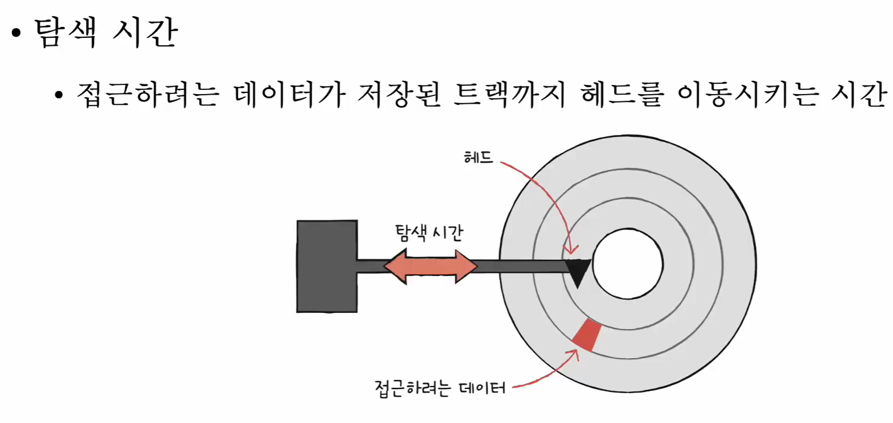

#### ✅ 회전 지연(rotational latency)

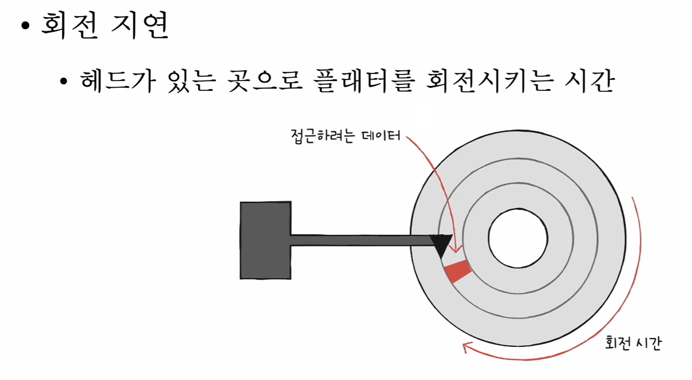

#### ✅ 전송 시간(transfer time)

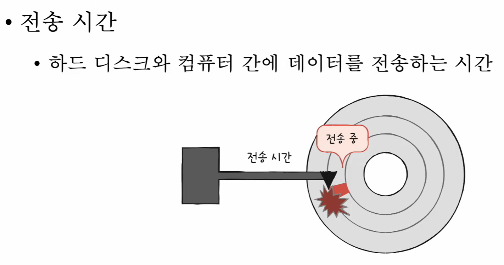

---

### 📌 참고: Jeff Dean - Numbers Every Programmer Should Know

“대략 어느 정도 시간이 걸리는지”를 감으로라도 알고 있으면, 병목(느려지는 지점)을 추측하고 최적화 방향을 잡는 데 도움이 된다.

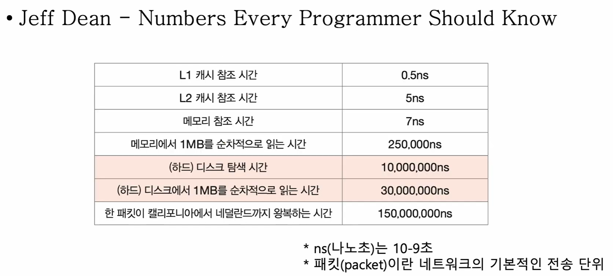

> 결론: **디스크/네트워크로 넘어가는 순간 비용이 급격히 커질 수 있다.**

---

## ⚡ 플래시 메모리(Flash Memory)

플래시 메모리는 **전기적으로 데이터를 읽고 쓰는 반도체 기반 저장 장치**다.  
USB, SSD, SD 카드 등으로 널리 쓰이며 범용성이 넓다.

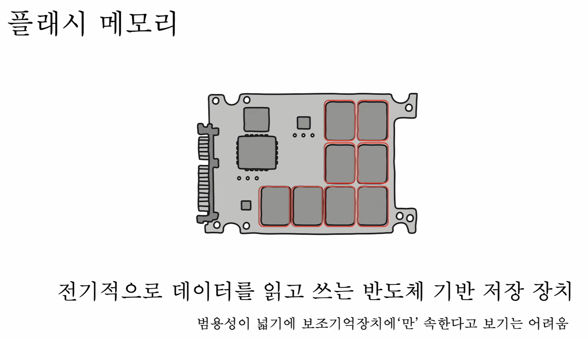

### 🔀 종류: NAND vs NOR

- **NAND 플래시 메모리**
  - NAND 게이트 기반
  - 오늘날 **대용량 저장 장치(SSD/USB 등)**에 많이 사용
- **NOR 플래시 메모리**
  - NOR 게이트 기반

---

### 🧬 기본 단위: 셀(Cell)

- **셀(cell)**: 플래시 메모리에서 데이터를 저장하는 가장 작은 단위
- 이 셀들이 모여 수 MB/GB/TB 저장 장치가 된다.

한 셀에 저장 가능한 비트 수에 따라 구분:

- **SLC**: 1비트
- **MLC**: 2비트
- **TLC**: 3비트
- **QLC**: 4비트

---

### 🏠 SLC / MLC / TLC / QLC

같은 플래시 메모리라도 **수명, 가격, 성능**이 달라진다.

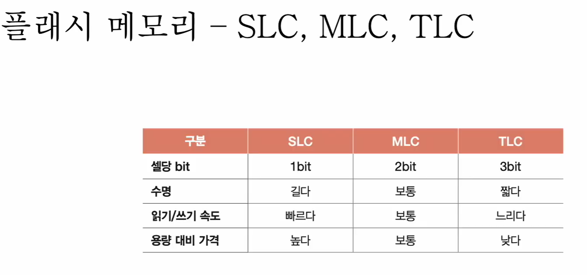

- **SLC(1bit)**: 빠름 / 수명 김 / 비쌈
- **MLC(2bit)**: 보통 / 보통 / 중간
- **TLC(3bit)**: 느림 / 짧음 / 저렴
- **QLC(4bit)**: (개념상) 더 많은 비트를 담는 대신 부담 증가

---

### 🧱 저장 단위 구조

- **셀(Cell)** → **페이지(Page)** → **블록(Block)** → **플레인(Plane)** → **다이(Die)**

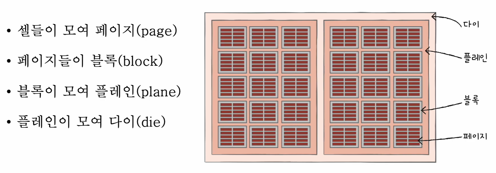

---

### ✍️ 읽기/쓰기 단위 vs 삭제 단위

- **읽기/쓰기(Read/Write)**: **페이지(Page)** 단위
- **삭제(Erase)**: **블록(Block)** 단위 (페이지보다 큼)

즉, 플래시는 HDD처럼 “원하는 위치를 바로 지우고 덮어쓰기”가 간단하지 않다.

---

### 🗑 페이지 상태: Free / Valid / Invalid

- **Free**
  - 비어 있어서 새 데이터를 저장할 수 있는 상태
- **Valid**
  - 유효한 데이터가 저장된 상태
- **Invalid**
  - 유효하지 않은 데이터(쓰레기값)가 남아 있는 상태  
  (예: 업데이트로 인해 예전 데이터가 무효가 된 경우)

---

### 🧹 덮어쓰기 불가 & 가비지 컬렉션

플래시 메모리는 하드 디스크와 달리 **덮어쓰기가 곧바로 불가능**하다(삭제가 블록 단위이기 때문).  
그래서 Invalid가 쌓이면 **가비지 컬렉션(GC)** 으로 공간을 정리한다.

- 유효한(Valid) 페이지들만 **새 블록으로 복사**
- 기존 블록을 **삭제**
- 결과적으로 “유효한 데이터만 남기고 공간을 정리”하게 된다

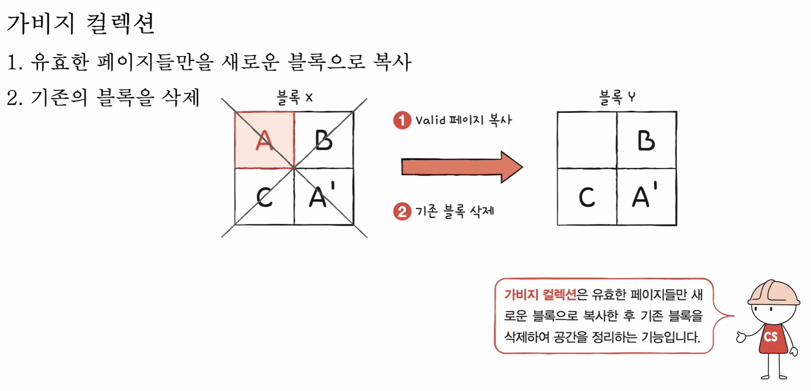

---

### 🧪 플래시 메모리 동작 예시

#### 1) 새로운 데이터 저장 (예: C 저장)

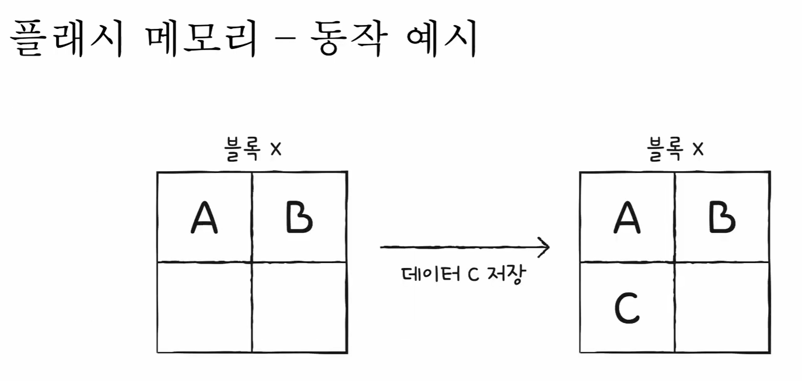

#### 2) 기존 데이터 일부만 수정 (예: A → A’)

- 일부만 바꾸고 싶어도, 보통 **새 위치에 기록 + 기존 데이터는 Invalid 처리** 흐름이 생긴다.

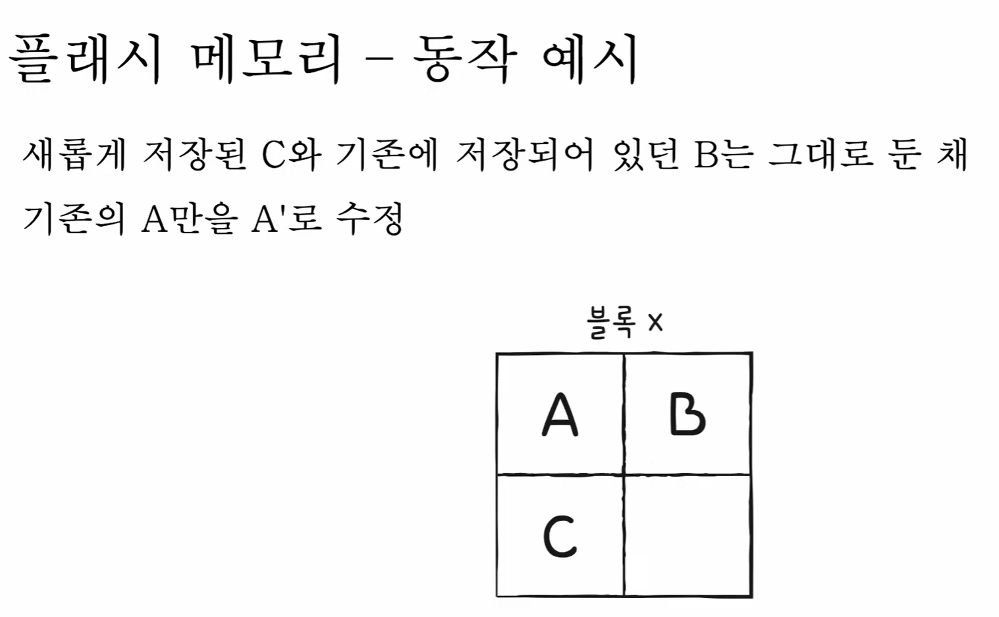

---

## 🔍 한눈에 비교

| 구분 | HDD(하드 디스크) | Flash(SSD/USB/SD) |
|---|---|---|
| 저장 방식 | 자기(플래터 회전) | 전기(반도체 셀) |
| 구조 키워드 | 플래터/헤드/디스크암, 트랙/섹터/실린더 | 셀/페이지/블록/플레인/다이 |
| 주요 지연/특성 | 탐색/회전 지연 영향 큼 | 덮어쓰기/삭제 단위 차이로 관리 로직 중요 |
| 읽기/쓰기 vs 삭제 | 비교적 직접적 | **읽기/쓰기=페이지**, **삭제=블록** |
| 대표 관리 기능 | (상대적으로 단순) | **가비지 컬렉션** 등 필요 |

---

## 🧷 키워드 정리

- HDD: **플래터, RPM, 스핀들, 헤드, 디스크 암, 트랙, 섹터, 블록, 실린더**
- 시간: **탐색 시간(Seek Time), 회전 지연(Rotational Latency), 전송 시간(Transfer Time)**
- Flash: **NAND/NOR, 셀, SLC/MLC/TLC/QLC, 페이지/블록/플레인/다이, Free/Valid/Invalid, 가비지 컬렉션**
