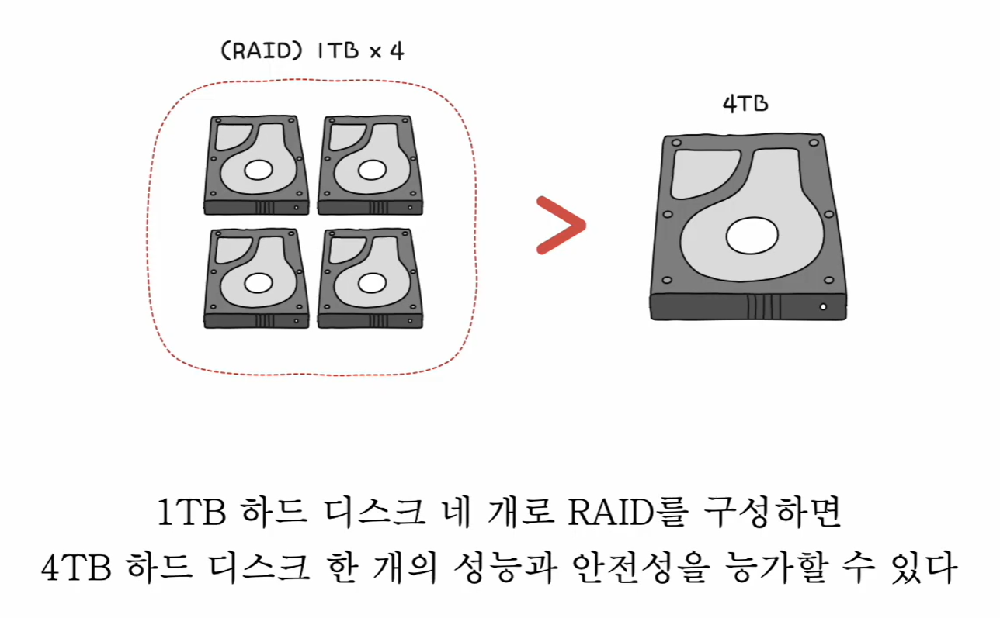
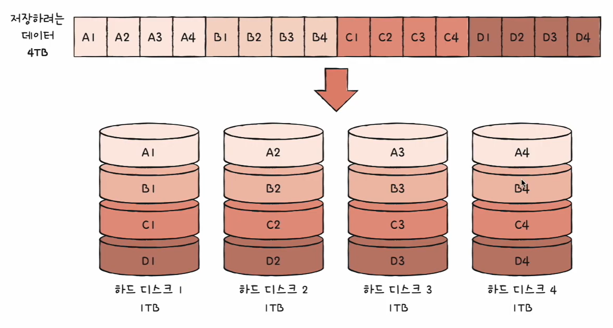
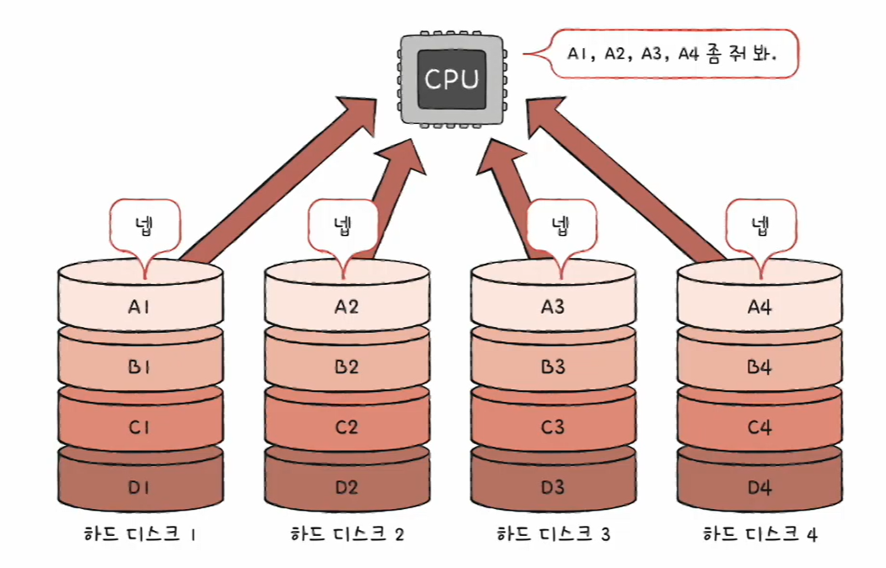
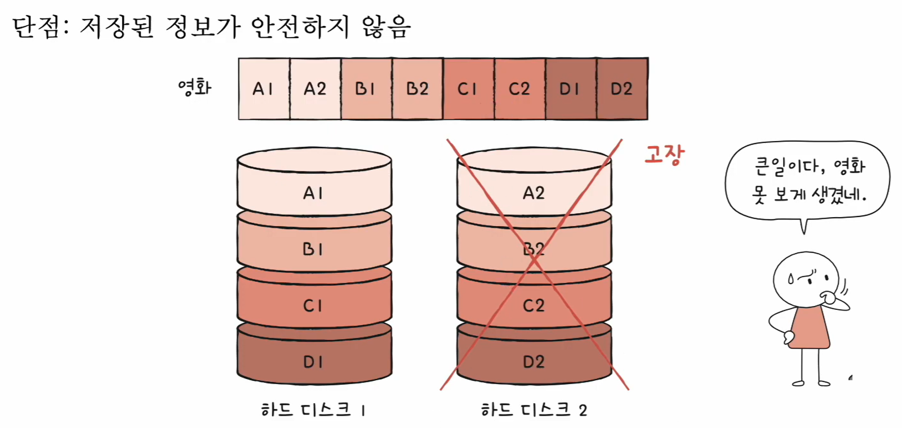
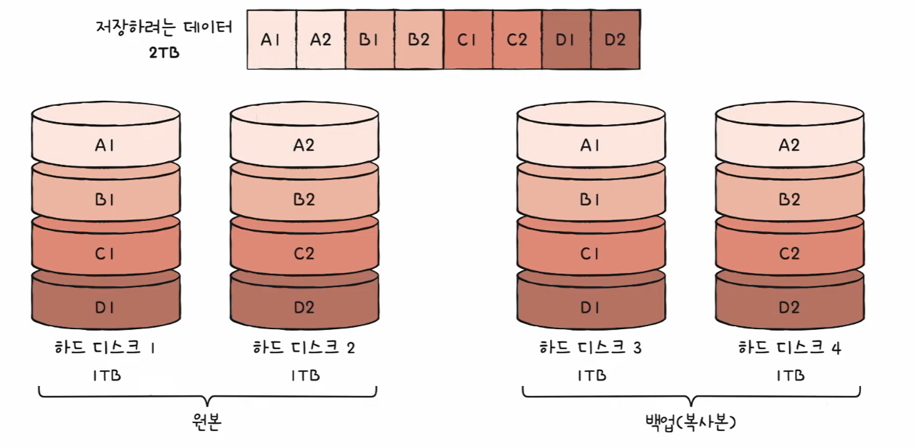
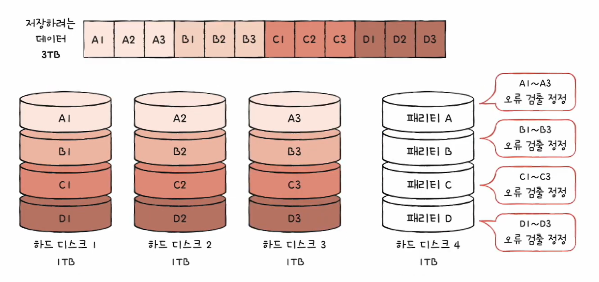
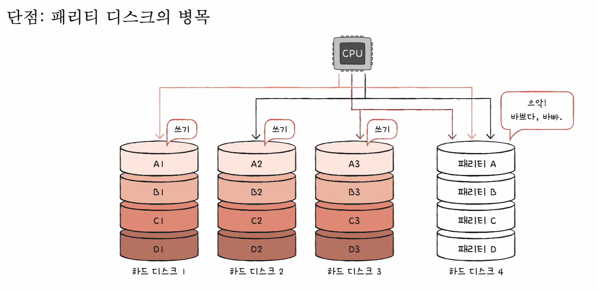
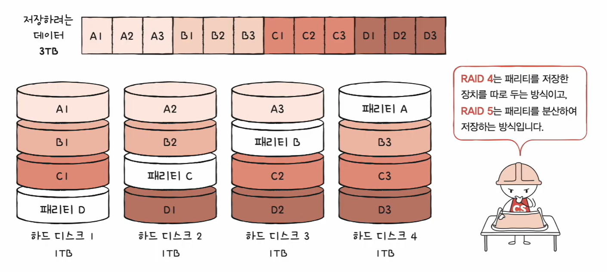
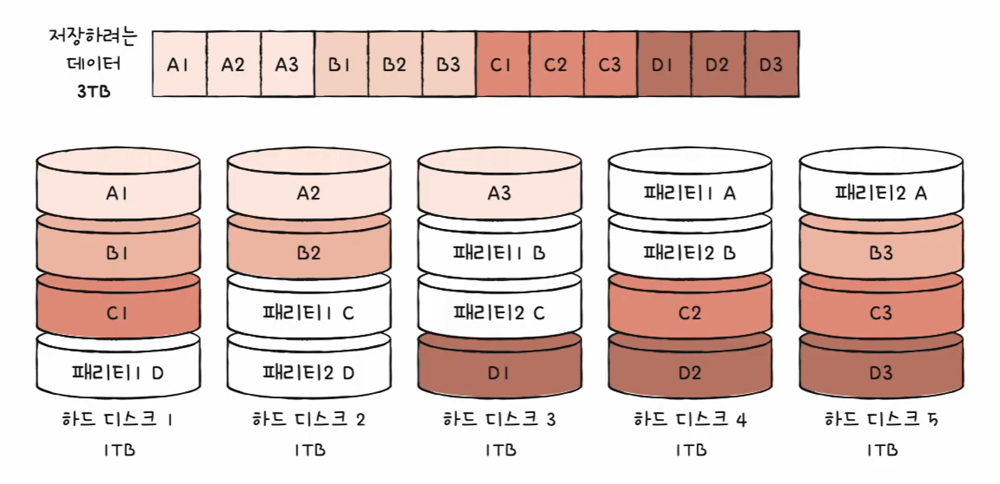

# 🧠 19강 RAID의 정의와 종류

여러 개의 물리 디스크(HDD/SSD)를 **하나의 논리 디스크처럼 묶어**  
**성능(속도)** 또는 **안정성(장애 대비)** 을 얻는 기술이 RAID입니다.

---

## 📌 목차
- [🧠 19강 RAID의 정의와 종류](#-19강-raid의-정의와-종류)
  - [📌 목차](#-목차)
  - [🧩 개요](#-개요)
  - [💾 RAID란 (Redundant Array of Independent Disks)](#-raid란-redundant-array-of-independent-disks)
  - [🗂 RAID 레벨](#-raid-레벨)
  - [⚡ RAID 0](#-raid-0)
    - [개념 (Stripe / Striping)](#개념-stripe--striping)
    - [용어](#용어)
    - [장점: 속도 향상](#장점-속도-향상)
    - [단점: 안정성 낮음](#단점-안정성-낮음)
  - [🪞 RAID 1](#-raid-1)
    - [개념 (Mirroring)](#개념-mirroring)
    - [장점](#장점)
    - [단점](#단점)
  - [🧮 RAID 4](#-raid-4)
    - [개념 (Dedicated Parity)](#개념-dedicated-parity)
    - [단점: 패리티 디스크 병목](#단점-패리티-디스크-병목)
  - [🧩 RAID 5](#-raid-5)
    - [개념 (Distributed Parity)](#개념-distributed-parity)
  - [🛡 RAID 6](#-raid-6)
    - [개념 (Dual Parity)](#개념-dual-parity)
  - [✅ 정리](#-정리)

---

## 🧩 개요

- 예: **1TB 하드 디스크 4개**로 RAID를 구성하면, 단일 4TB 하드 디스크 1개보다  
  **더 높은 성능** 또는 **더 나은 안정성**을 얻을 수 있다(구성 방식에 따라 달라짐).

> **설명**: “여러 디스크를 묶어서 하나처럼 쓰면 성능/안정성을 더 끌어올릴 수 있다”는 RAID의 핵심 목적을 보여줍니다.

---

## 💾 RAID란 (Redundant Array of Independent Disks)

- 하드 디스크와 SSD로 사용하는 기술
- 데이터의 안정성 혹은 높은 성능을 위해 여러 물리적 보조기억장치를 **마치 하나의 논리적 보조기억장치처럼** 사용하는 기술
- 각 RAID 레벨마다 장단점이 있음
- 어떤 상황에서 무엇을 최우선으로 원하는지에 따라 최적의 RAID 레벨은 달라질 수 있음
- 각 RAID 레벨의 대략적인 구성과 특징을 아는 것이 중요

---

## 🗂 RAID 레벨

- RAID를 구성하는 기술(구성 방식)
- RAID 0, RAID 1, RAID 2, RAID 3, RAID 4, RAID 5, RAID 6
- 그로부터 파생된 RAID 10, RAID 50 등

> 이 문서에서는 핵심 이해를 위해 **RAID 0/1/4/5/6** 중심으로 정리합니다.

---

## ⚡ RAID 0

### 개념 (Stripe / Striping)
- 데이터를 **단순히 나누어 저장**하는 구성 방식
- 각 하드 디스크는 **번갈아 가며** 데이터를 저장
- 저장되는 데이터가 **하드 디스크 개수만큼 분산**되어 저장됨

> **설명**: A1, A2, A3… 같은 데이터 조각을 디스크들에 **나눠 담는 구조(스트라이핑)** 를 나타냅니다.

### 용어
- **스트라입(stripe)**: 마치 줄무늬처럼 분산되어 저장된 데이터(조각)
- **스트라이핑(striping)**: 분산하여 저장하는 것

### 장점: 속도 향상
- 여러 디스크가 동시에 읽기/쓰기를 수행 → **입출력 성능 향상**

> **설명**: CPU가 A1~A4를 요청하면 여러 디스크가 동시에 응답해서 **처리가 빨라지는** 상황을 보여줍니다.

### 단점: 안정성 낮음
- 디스크 하나만 고장 나도 **데이터 일부가 사라져 전체 복구가 어렵거나 불가능**해질 수 있음

> **설명**: 한 디스크에 A2/B2/C2/D2 같은 조각이 들어있을 때, 그 디스크가 고장 나면 파일이 **조각난 채로 완성 불가**가 됩니다.

---

## 🪞 RAID 1

### 개념 (Mirroring)
- **미러링(mirroring)**: 동일한 데이터의 **복사본(미러)** 을 만드는 방식
- 데이터를 쓸 때 원본과 복사본 **둘 다** 기록 (쓰기 속도는 손해가 날 수 있음)

> **설명**: 원본 디스크와 백업 디스크가 같은 내용을 갖도록 저장해, 한쪽이 고장 나도 데이터를 지킬 수 있습니다.

### 장점
- 디스크 하나가 고장 나도 **완전한 복사본**으로 데이터 유지 가능 → 안정성 높음

### 단점
- 하드 디스크 개수가 한정되었을 때 **사용 가능한 용량이 줄어듦**
  - 복사본이 만들어지는 용량만큼 실사용 불가 → 디스크 더 필요 → 비용 증가

---

## 🧮 RAID 4

### 개념 (Dedicated Parity)
- RAID 1처럼 “통째 복사” 대신  
  **오류 검출/복구를 위한 정보(패리티)** 를 별도의 디스크에 저장
- RAID 1보다 적은 디스크로도 **데이터 안정성**을 확보 가능

> **설명**: 데이터 디스크들과 별개로 “패리티 전용 디스크”가 존재하며, 여기에 패리티(A/B/C/D)가 모여 저장됩니다.

### 단점: 패리티 디스크 병목
- 데이터를 쓸 때마다 패리티도 갱신해야 해서  
  **패리티 전용 디스크에 쓰기 작업이 몰림 → 병목 발생 가능**

> **설명**: 모든 쓰기 작업이 패리티 디스크를 반드시 거치면서 “바쁘다 바빠” 상태가 되어 전체 성능을 떨어뜨릴 수 있습니다.

---

## 🧩 RAID 5

### 개념 (Distributed Parity)
- RAID 4의 병목 문제를 줄이기 위해  
  **패리티 정보를 여러 디스크에 분산해서 저장**하는 방식

> **설명**: 패리티가 특정 디스크에 몰리지 않고 (A/B/C/D 패리티가) **디스크들에 돌아가며** 저장됩니다.  
> → RAID 4의 “패리티 디스크 병목”을 완화하려는 의도입니다.

---

## 🛡 RAID 6

### 개념 (Dual Parity)
- **두 종류의 패리티**를 저장하는 방식
- RAID 5보다 더 안전하지만, 패리티 계산/기록이 더 많아 **쓰기 성능은 더 느릴 수 있음**

> **설명**: 패리티가 1개가 아니라 2개(패리티1/패리티2)라서 RAID 5보다 **장애 대응력이 더 큽니다.**  
> 대신 쓰기 시 해야 할 작업이 늘어 속도가 손해 볼 수 있습니다.

---

## ✅ 정리

- **RAID 0**: 속도 ↑ / 안정성 ↓ (스트라이핑)
- **RAID 1**: 안정성 ↑ / 용량 효율 ↓ (미러링)
- **RAID 4**: 패리티로 안정성 확보 / **패리티 전용 디스크 병목** 가능
- **RAID 5**: 패리티 **분산**으로 병목 완화 + 균형형
- **RAID 6**: 패리티 2개로 더 안전 / 쓰기 성능은 RAID 5보다 느릴 수 있음
