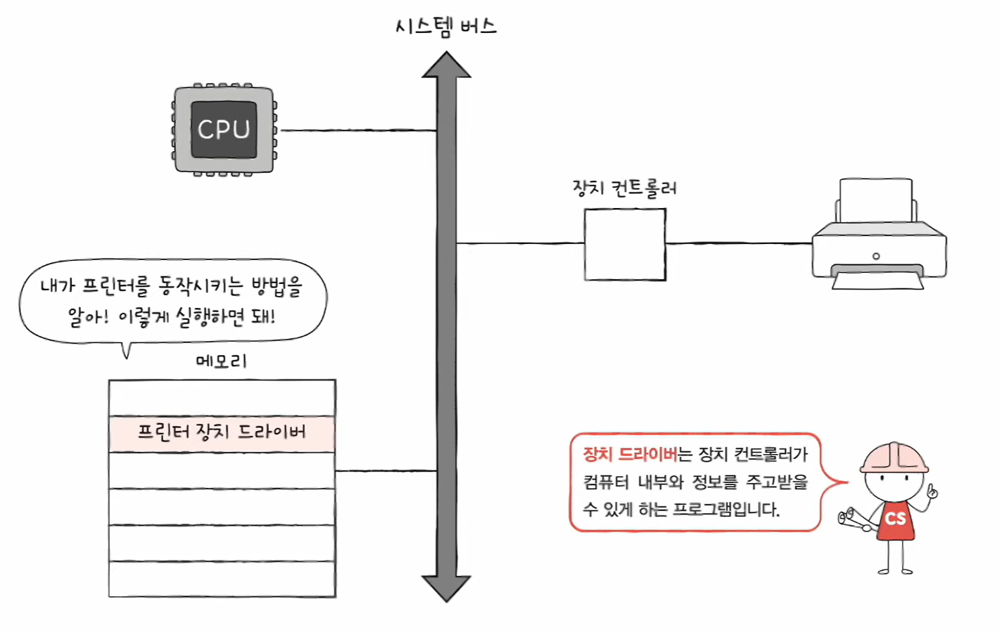
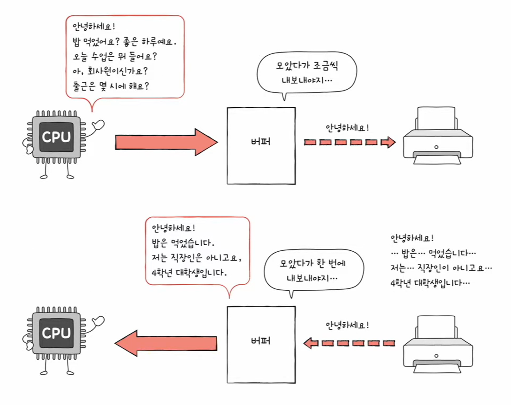
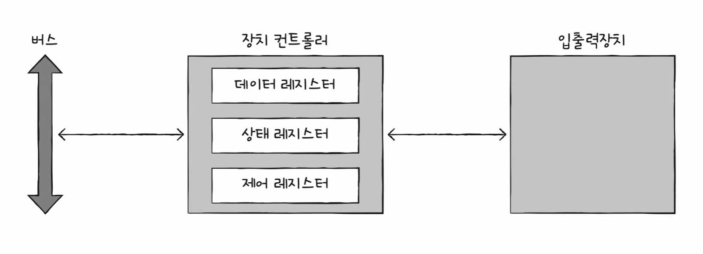

# 🧠 20강 장치 컨트롤러와 장치 드라이버

> **핵심 한 줄 요약**  
> CPU/메모리처럼 빠르고 규격화된 세계와, 종류도 많고 느린 입출력장치 세계를 ‘장치 컨트롤러(하드웨어)’ + ‘장치 드라이버(소프트웨어)’가 이어준다.

---

## 📚 목차
- [🧠 20강 장치 컨트롤러와 장치 드라이버](#-20강-장치-컨트롤러와-장치-드라이버)
  - [📚 목차](#-목차)
  - [🧩 CPU-입출력장치 정보 주고 받기](#-cpu-입출력장치-정보-주고-받기)
    - [1) 입출력장치 종류가 너무 많다](#1-입출력장치-종류가-너무-많다)
    - [2) CPU/메모리와 입출력장치의 전송률 차이](#2-cpu메모리와-입출력장치의-전송률-차이)
  - [⚡ 장치 컨트롤러](#-장치-컨트롤러)
    - [장치 컨트롤러의 역할](#장치-컨트롤러의-역할)
  - [🧮 장치 드라이버](#-장치-드라이버)
  - [🪞 (예시) 버퍼링이 필요한 이유](#-예시-버퍼링이-필요한-이유)
  - [🗂 장치 컨트롤러 구조](#-장치-컨트롤러-구조)
    - [데이터 레지스터](#데이터-레지스터)
    - [상태 레지스터](#상태-레지스터)
    - [제어 레지스터](#제어-레지스터)
  - [✅ 정리](#-정리)

---

## 🧩 CPU-입출력장치 정보 주고 받기

입출력장치(I/O 장치)는 CPU, 메모리보다 다루기가 더 까다롭다.

### 1) 입출력장치 종류가 너무 많다
- 입출력장치에는 종류가 너무나도 많다.
  - 장치가 다양하면 장치마다 속도, 데이터 전송 형식 등도 다양하다.
  - 다양한 입출력장치와 정보를 주고받는 방식을 **규격화하기 어렵다.**

### 2) CPU/메모리와 입출력장치의 전송률 차이
- 일반적으로 CPU와 메모리의 데이터 전송률은 높지만 입출력장치의 데이터 전송률은 낮다.
- **전송률(transfer rate)**: 데이터를 얼마나 빨리 교환할 수 있는지를 나타내는 지표

---

## ⚡ 장치 컨트롤러

- 입출력장치는 **장치 컨트롤러(Device Controller)** 를 통해 컴퓨터와 연결된다.
  - 장치 컨트롤러를 통해 컴퓨터 내부와 정보를 주고 받는다.

### 장치 컨트롤러의 역할
장치 컨트롤러는 CPU/메모리와 입출력장치 사이에서 다음을 수행한다.

- **CPU와 입출력장치 간의 통신 중개**
  - 장치마다 다른 신호/규칙을 CPU가 직접 처리하지 않도록, 중간에서 “번역”한다.
- **오류 검출**
  - 장치에 문제가 있는지 확인하고 상태로 알려준다.
- **데이터 버퍼링**
  - 전송률이 높은 장치(CPU/메모리)와 낮은 장치(입출력장치) 사이에서
    데이터를 **버퍼(임시 저장 공간)**에 담아 속도 차이를 완충한다.

---

## 🧮 장치 드라이버

- **장치 컨트롤러의 동작을 감지하고 제어하는 프로그램**
- 장치 컨트롤러가 입출력장치를 연결하기 위한 **하드웨어적인 통로**라면,  
  장치 드라이버는 입출력장치를 연결하기 위한 **소프트웨어적인 통로**

> **그림 설명**  
> 메모리에는 “프린터 장치 드라이버”가 있고, CPU는 이 드라이버를 실행해 **장치 컨트롤러를 올바르게 제어**한다.  
> 즉, **드라이버는 운영체제가 장치 컨트롤러를 다룰 수 있게 해주는 프로그램**이다.

- 컴퓨터(운영체제)가 연결된 장치의 드라이버를 인식하고 실행할 수 있다면 컴퓨터 내부와 정보를 주고받을 수 있음
- 반대로 컴퓨터(운영체제)가 장치 드라이버를 인식하거나 실행할 수 없다면 그 장치는 컴퓨터 내부와 정보를 주고받을 수 없음

---

## 🪞 (예시) 버퍼링이 필요한 이유

CPU는 빠르게 데이터를 만들거나 요청하지만, 입출력장치는 상대적으로 느리다.  
그래서 중간에 **버퍼**를 두고 “모았다가” 전송하면 전체 흐름이 훨씬 안정적이다.

> **그림 설명**  
> CPU가 프린터로 보낼 데이터를 한 번에 쏟아내기보다는,  
> **버퍼에 모아두고 → 조금씩/한 번에 전송**해서 속도 차이를 맞춘다.  
> (빠른 쪽은 빨리 처리하고, 느린 쪽은 자기 속도에 맞춰 가져가게 만드는 방식)

---

## 🗂 장치 컨트롤러 구조

- 기본 구조: **버스 - 장치 컨트롤러 - 입출력장치**
- 장치 컨트롤러 내부 구성(대표 예):
  - **데이터 레지스터**
  - **상태 레지스터**
  - **제어 레지스터**
- 참고: 상태 레지스터와 제어 레지스터는 하나의 레지스터(상태/제어 레지스터)로 사용되기도 한다.

> **그림 설명**  
> CPU는 “버스”를 통해 장치 컨트롤러의 레지스터를 읽고/쓰며 장치를 제어한다.  
> - **데이터 레지스터**: 실제 데이터(또는 버퍼 역할)  
> - **상태 레지스터**: 준비/완료/오류 같은 상태 정보  
> - **제어 레지스터**: 장치에게 내리는 명령(제어 정보)

### 데이터 레지스터
- CPU와 입출력장치 사이에 주고받을 데이터가 담기는 레지스터(버퍼)
- RAM을 사용하기도 함

### 상태 레지스터
- 상태 정보 저장
  - 입출력장치가 입출력 작업을 할 준비가 되었는지
  - 입출력 작업이 완료되었는지
  - 입출력장치에 오류는 없는지 등의 상태 정보

### 제어 레지스터
- 입출력장치가 수행할 내용에 대한 제어 정보

---

## ✅ 정리

- 입출력장치는 종류가 많고 전송률이 제각각이라 CPU가 직접 다루기 어렵다.
- 그래서:
  - **장치 컨트롤러(하드웨어)** 가 통신 중개/오류 검출/버퍼링을 담당하고
  - **장치 드라이버(소프트웨어)** 가 OS가 장치 컨트롤러를 제어할 수 있게 해준다.

결론: **컨트롤러(하드웨어) + 드라이버(소프트웨어)** 가 합쳐져야 장치가 “정상적으로” 동작한다.
