# 🧠 21강 다양한 입출력 방법

> **핵심 한 줄 요약**  
> 입출력은 크게 **프로그램 입출력**, **인터럽트 기반 입출력**, **DMA 입출력**으로 나뉘며, 핵심 차이는 **CPU가 데이터 이동에 얼마나 관여하느냐**이다.

---

## 📌 목차
- [🧠 21강 다양한 입출력 방법](#-21강-다양한-입출력-방법)
  - [📌 목차](#-목차)
  - [🧩 개요](#-개요)
  - [🖥 프로그램 입출력](#-프로그램-입출력)
    - [✅ 동작 예시: 하드 디스크에 백업(쓰기)](#-동작-예시-하드-디스크에-백업쓰기)
    - [✅ 메모리 맵 입출력 vs 고립형 입출력](#-메모리-맵-입출력-vs-고립형-입출력)
  - [🔔 인터럽트 기반 입출력](#-인터럽트-기반-입출력)
    - [✅ 하드웨어 인터럽트](#-하드웨어-인터럽트)
    - [✅ 동시다발적인 인터럽트와 우선순위](#-동시다발적인-인터럽트와-우선순위)
    - [✅ PIC(Programmable Interrupt Controller)](#-picprogrammable-interrupt-controller)
  - [🤝 프로그램 입출력과 인터럽트 기반 입출력의 공통점](#-프로그램-입출력과-인터럽트-기반-입출력의-공통점)
  - [🚀 DMA(Direct Memory Access) 입출력](#-dmadirect-memory-access-입출력)
    - [✅ DMA 동작 과정](#-dma-동작-과정)
    - [✅ 시스템 버스와 Cycle stealing](#-시스템-버스와-cycle-stealing)
  - [🧷 입출력 버스](#-입출력-버스)
  - [📊 한눈에 비교 표](#-한눈에-비교-표)
    - [✅ 최종 정리](#-최종-정리)

---

## 🧩 개요

- 대표적인 입출력 방식 3가지
  1. **프로그램 입출력(Programmed I/O)**
  2. **인터럽트 기반 입출력(Interrupt-driven I/O)**
  3. **DMA 입출력(Direct Memory Access, DMA)**

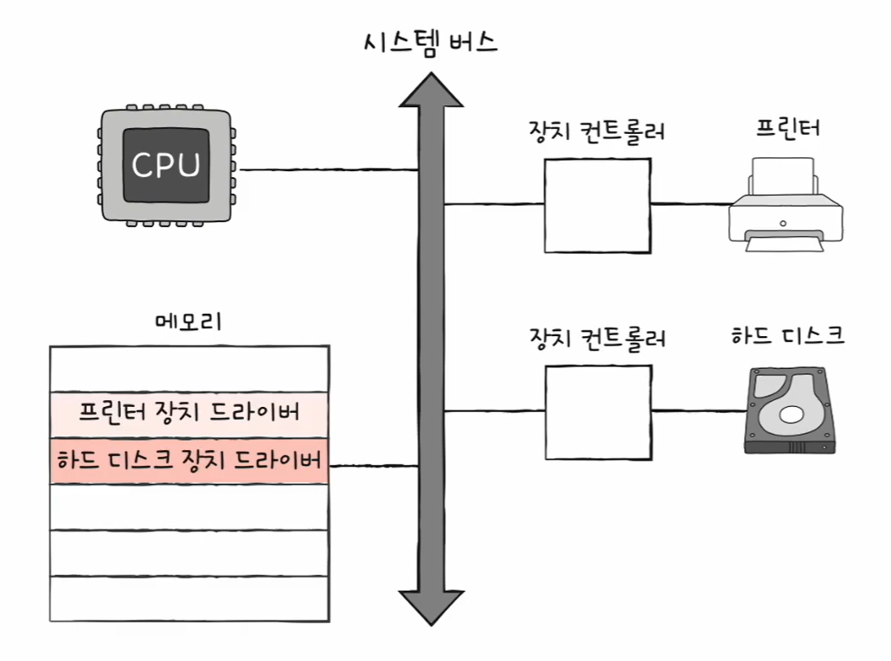

> 그림 설명: 시스템 버스 관점에서 프로그램 입출력/인터럽트/DMA가 어떻게 다른지 큰 그림으로 정리

---

## 🖥 프로그램 입출력

- **프로그램 속 명령어로** 입출력 장치를 제어하는 방식
- CPU가 **입출력 명령어**로 **장치 컨트롤러의 레지스터**와 상호작용한다.
  - 제어 레지스터(control register): “무슨 작업을 해라” 같은 명령
  - 상태 레지스터(status register): 장치가 준비됐는지/바쁜지 같은 상태
  - 데이터 레지스터(data register): 실제 데이터가 오가는 통로

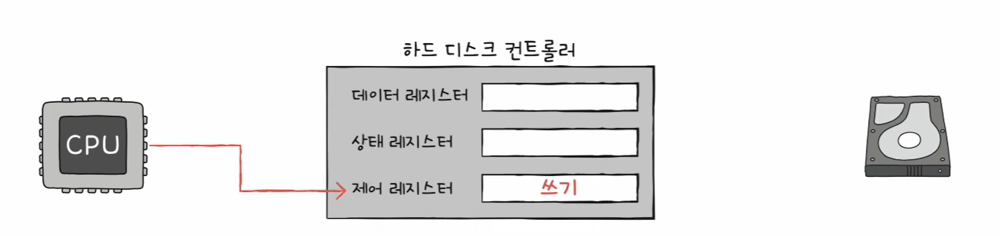

> 그림 설명: CPU가 장치 컨트롤러의 **제어 레지스터**에 ‘쓰기’ 같은 명령을 내리는 단계

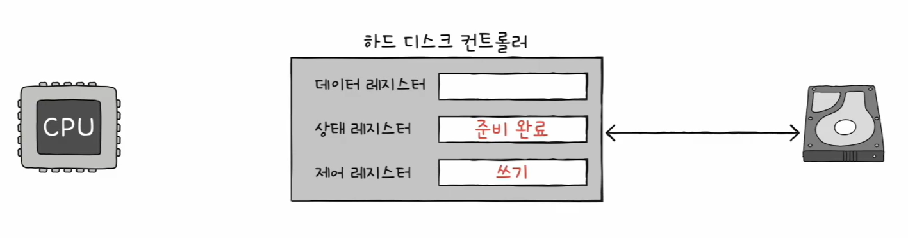

> 그림 설명: 장치 컨트롤러가 장치 상태를 확인하고, **상태 레지스터**에 ‘준비 완료’를 표시하는 단계

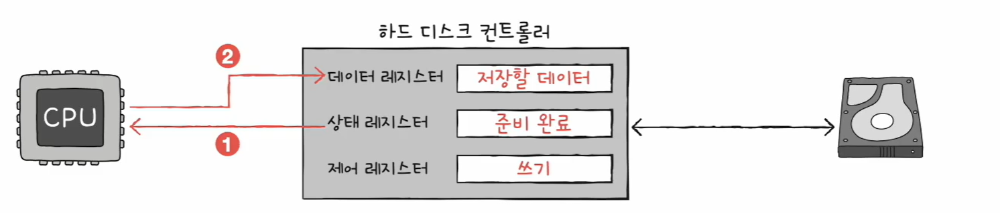

> 그림 설명: CPU가 상태 레지스터를 계속 확인(폴링)하다가, 준비되면 **데이터 레지스터**에 “저장할 데이터”를 써서 전송하는 단계

---

### ✅ 동작 예시: 하드 디스크에 백업(쓰기)

메모리에 있는 데이터를 하드 디스크에 저장한다고 가정하면 흐름은 아래와 같다.

1. **CPU → 하드 디스크 컨트롤러의 제어 레지스터**에 “쓰기 명령” 전달  
2. 하드 디스크 컨트롤러가 상태를 확인한 뒤  
   **상태 레지스터**에 “준비 완료(ready)” 표시  
3. CPU가 작업 완료까지 반복
   - CPU는 **상태 레지스터를 주기적으로 확인(폴링, polling)**  
   - 준비되면 CPU가 백업할 데이터를 **데이터 레지스터에 기록**
   - 아직 작업이 끝나지 않았다면 다시 상태 확인 → 반복

> 📌 포인트: CPU가 “계속 확인하면서 기다리는(폴링)” 시간이 생길 수 있어 비효율적이다.

---

### ✅ 메모리 맵 입출력 vs 고립형 입출력

- **메모리 맵 입출력(Memory-mapped I/O)**
  - 메모리 주소 공간과 I/O 주소 공간을 **하나의 주소 공간**으로 취급
  - 결과적으로 **메모리 접근 명령어 = I/O 접근 명령어**로 접근 가능

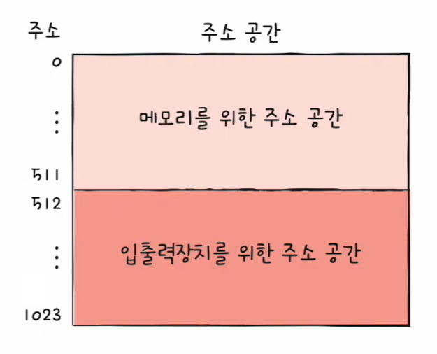

> 그림 설명: 메모리 주소 공간 안에 입출력장치 주소가 포함되어 “같은 주소 공간”처럼 접근 가능

- **고립형 입출력(Isolated I/O)**
  - 메모리용 주소 공간과 I/O용 주소 공간을 **분리**
  - I/O 전용 명령어(또는 I/O 읽기/쓰기 제어선)를 사용해 장치 접근

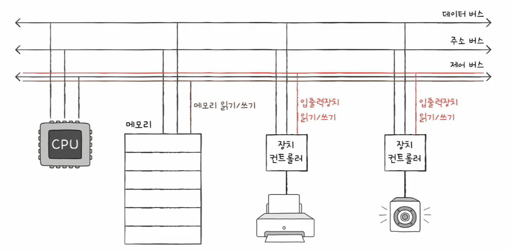

> 그림 설명: 메모리와 I/O가 서로 다른 주소 공간을 쓰도록 분리하는 개념

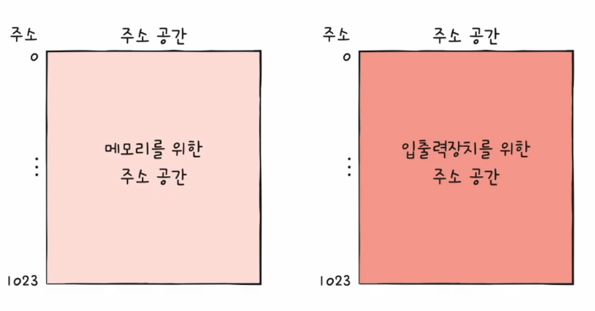

> 그림 설명: ‘메모리 주소 공간’과 ‘입출력장치 주소 공간’이 완전히 나뉘어 있음을 강조

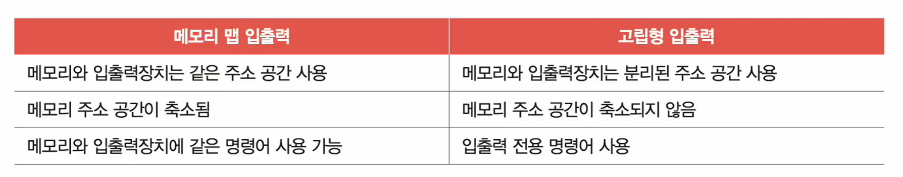

> 그림 설명:  
> - 메모리 맵 입출력: 같은 주소 공간 사용 → 메모리 공간이 일부 줄어들 수 있음, 같은 명령어로 접근 가능  
> - 고립형 입출력: 주소 공간 분리 → 메모리 공간 유지, 입출력 전용 명령어 사용

---

## 🔔 인터럽트 기반 입출력

- 하드웨어 인터럽트는 보통 **장치 컨트롤러**가 발생시킨다.
- CPU는 “계속 상태를 확인(폴링)”하지 않아도 되고,  
  **필요할 때만 인터럽트가 와서 처리**하면 된다.

### ✅ 하드웨어 인터럽트

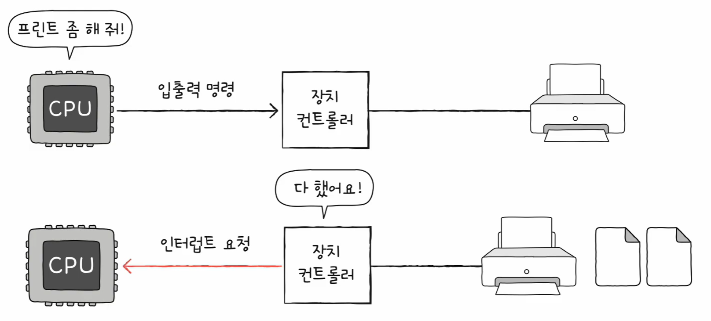

> 그림 설명: 장치 컨트롤러가 작업 완료/처리 필요 상황을 CPU에 **인터럽트 요청**으로 알리는 기본 구조

---

### ✅ 동시다발적인 인터럽트와 우선순위

- 장치가 많아지면 인터럽트도 동시에 많이 발생할 수 있다.
- 기본적으로는 **발생 순서대로 처리**하지만, 특정 상황에서는 우선순위가 필요하다.
  - CPU가 인터럽트 처리 중 **인터럽트 비트(플래그 레지스터)를 비활성화**한 경우
  - 혹은 비활성화해도 무시할 수 없는 **NMI(Non-Maskable Interrupt)**가 발생한 경우  
  → CPU는 **우선순위가 높은 인터럽트부터** 처리하게 된다.

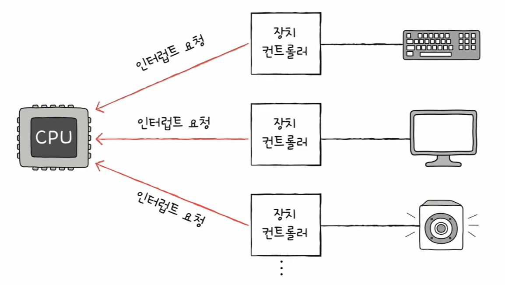

> 그림 설명: 여러 장치 컨트롤러가 CPU에 동시에 인터럽트를 요청하는 상황(경합)

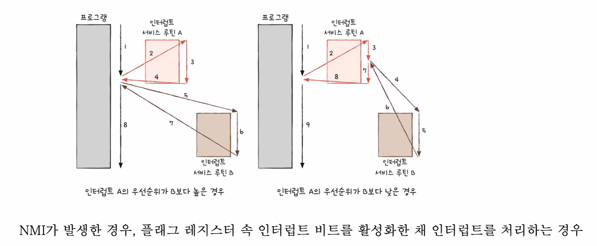

> 그림 설명: 인터럽트 우선순위에 따라 어떤 서비스 루틴을 먼저 처리할지 달라지는 흐름

---

### ✅ PIC(Programmable Interrupt Controller)

PIC는 여러 장치에서 올라오는 인터럽트를 **정리/우선순위 판단**해서 CPU에 전달하는 하드웨어다.

- 역할
  1. 여러 장치 컨트롤러에 연결되어
  2. 인터럽트의 **우선순위**를 판단한 뒤
  3. CPU에게 “지금 처리해야 할 인터럽트”를 알려준다
- 주의
  - 일반적으로 **NMI의 우선순위까지는 판단하지 않음**

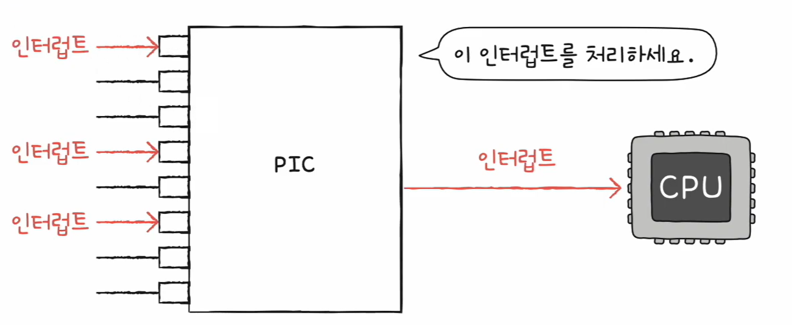

> 그림 설명: 여러 인터럽트 입력을 PIC가 받아 정리한 후 CPU에 전달

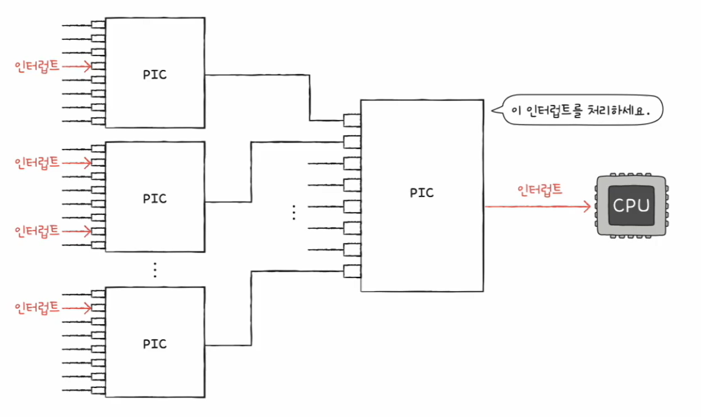

> 그림 설명: 장치 수가 많아 인터럽트 입력이 늘어나면 PIC를 여러 개로 확장(다중 PIC)하는 구조

---

## 🤝 프로그램 입출력과 인터럽트 기반 입출력의 공통점

- **입출력장치 ↔ 메모리** 간 데이터 이동은 **CPU가 주도**
- 이동하는 데이터는 **반드시 CPU를 거친다**

> 📌 결론: CPU가 “데이터 운반”까지 맡는 구조라, I/O가 많으면 CPU 부담이 커질 수 있다.

---

## 🚀 DMA(Direct Memory Access) 입출력

- CPU를 거치지 않고 **입출력장치가 메모리에 직접 접근**하게 하는 방식
- DMA를 위해서는 **DMA 컨트롤러**라는 하드웨어가 필요하다.

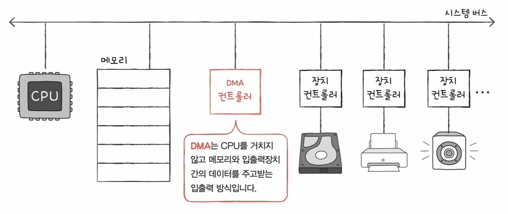

> 그림 설명: DMA 컨트롤러가 전송을 담당해 데이터가 CPU를 거치지 않게 된다

### ✅ DMA 동작 과정

1. CPU가 DMA 컨트롤러에게 **입출력 작업을 명령**
2. DMA 컨트롤러가 CPU 대신 **장치 컨트롤러와 상호작용**하며 전송 수행  
   - 필요하면 **메모리에 직접 접근**해서 데이터 이동
3. 작업이 끝나면 DMA 컨트롤러가 **인터럽트**로 CPU에 완료를 알림

> ✅ 포인트: CPU는 **시작(명령)**과 **끝(완료 통지)**만 관여한다.

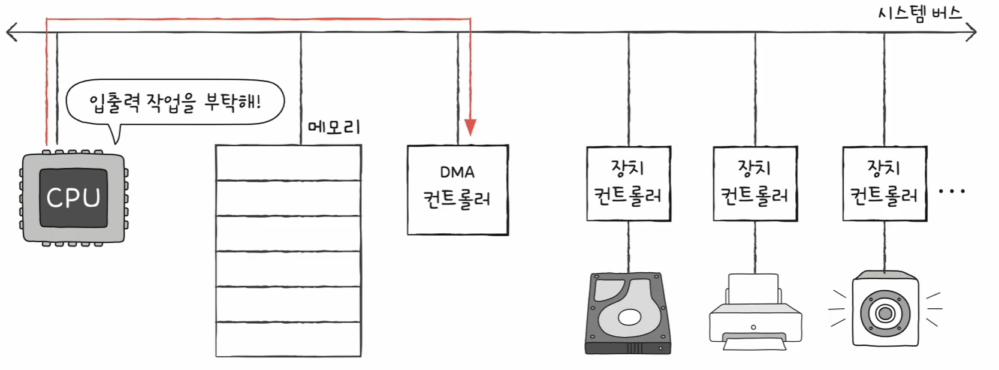

> 그림 설명: CPU가 DMA 컨트롤러에 “입출력 작업”을 맡기는 시작 단계

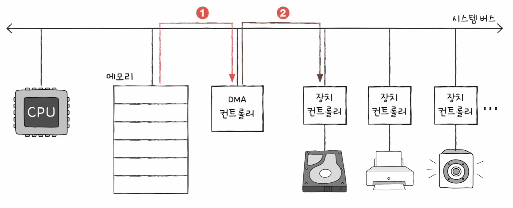

> 그림 설명: DMA가 장치 컨트롤러와 상호작용하며 데이터 전송을 진행(필요 시 메모리 직접 접근)

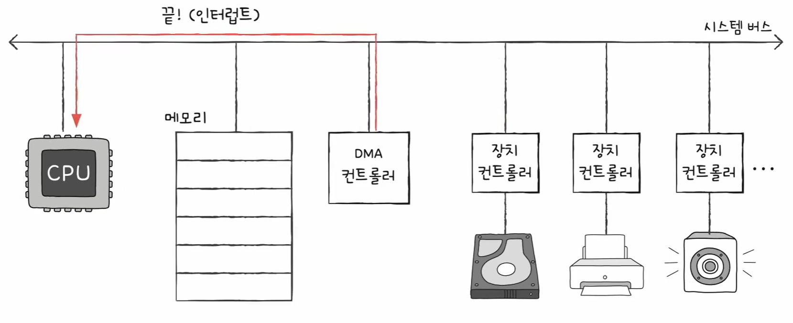

> 그림 설명: 전송 완료 시 DMA 컨트롤러가 인터럽트로 CPU에 “끝남”을 알리는 단계

---

### ✅ 시스템 버스와 Cycle stealing

- DMA도 데이터 전송을 위해 **시스템 버스**를 사용한다.
- 시스템 버스는 **공용 자원**이라 동시에 사용할 수 없다.

이를 완화하는 개념이 **Cycle stealing**이다.

- Cycle stealing
  1. CPU가 시스템 버스를 사용하지 않을 때 DMA가 조금씩 사용
  2. 또는 CPU가 잠깐 버스를 양보하도록 하고 DMA가 사용

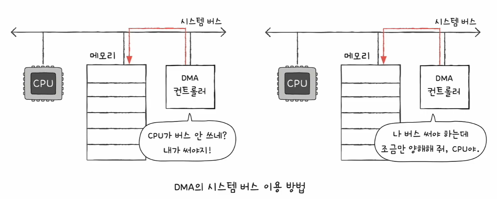

> 그림 설명: DMA가 버스를 “틈틈이” 쓰거나 “잠깐 양보”를 받아 사용해 경합을 줄이는 방식

---

## 🧷 입출력 버스

- DMA가 시스템 버스를 자주 사용하면 시스템 버스가 병목이 될 수 있다.
- 이를 줄이기 위해 **입출력 버스(I/O bus)**를 두어  
  **시스템 버스 사용 빈도**를 낮춘다.

- 예시: **PCI**, **PCIe**
- 구조 예: `슬롯 → 입출력 버스 → 시스템 버스`

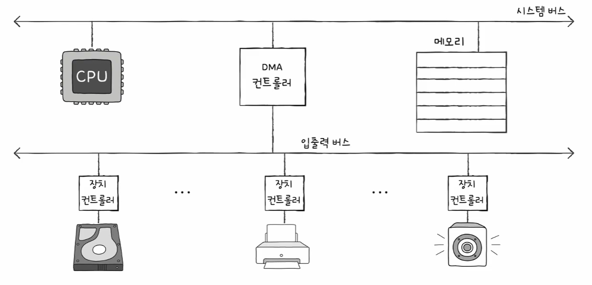

> 그림 설명: 장치 쪽은 입출력 버스로 묶고, 필요한 경우에만 시스템 버스로 올라가 병목을 줄이는 구조

---

## 📊 한눈에 비교 표

| 구분 | CPU 관여 | 데이터 이동 경로 | 장점 | 단점 |
|---|---:|---|---|---|
| 프로그램 입출력 | 매우 큼 | 장치 ↔ **CPU** ↔ 메모리 | 구현 단순 | 폴링으로 CPU 낭비 발생 가능 |
| 인터럽트 기반 입출력 | 큼 | 장치 ↔ **CPU** ↔ 메모리 | 폴링 감소, 효율 개선 | 데이터가 여전히 CPU를 거침 |
| DMA 입출력 | 적음 | 장치 ↔ **메모리** (DMA가 중개) | CPU 부담 크게 감소 | 버스 경합(공용 자원) 고려 필요 |

---

### ✅ 최종 정리
- **프로그램/인터럽트 기반**: CPU가 데이터 이동까지 맡음 → CPU 부담 ↑  
- **DMA**: 데이터 이동을 DMA가 맡음 → CPU 부담 ↓, 대신 버스 경합 관리 필요
