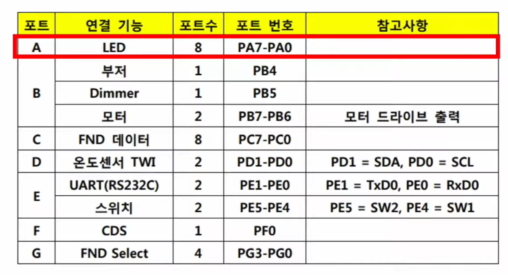
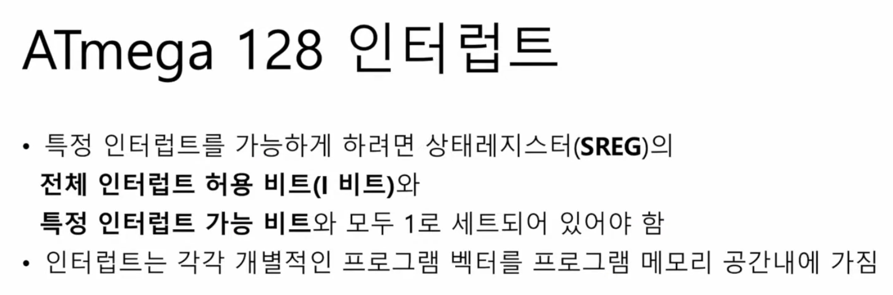
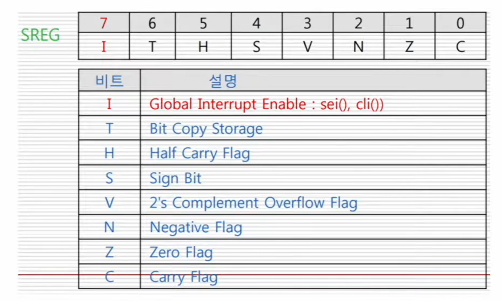
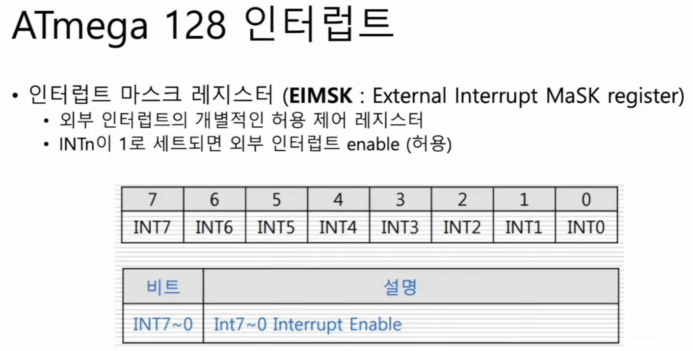

# 🧠 22강 레지스터 조작 입출력 실습

[▶ 강의 바로가기](https://www.youtube.com/watch?v=wKQgERMe2pk)

## 목차
- [🧠 22강 레지스터 조작 입출력 실습](#-22강-레지스터-조작-입출력-실습)
  - [목차](#목차)
  - [개요](#개요)
  - [1) GPIO 핵심 레지스터 (DDRx / PORTx / PINx)](#1-gpio-핵심-레지스터-ddrx--portx--pinx)
    - [✅ DDRx (Data Direction Register)](#-ddrx-data-direction-register)
    - [✅ PORTx (Port Output Register)](#-portx-port-output-register)
    - [✅ PINx (Port Input Register)](#-pinx-port-input-register)
  - [2) 실습 보드 포트 연결(매핑) 요약](#2-실습-보드-포트-연결매핑-요약)
  - [3) 인터럽트 Enable 조건 (핵심)](#3-인터럽트-enable-조건-핵심)
  - [4) SREG (Status Register) 핵심 비트 정리](#4-sreg-status-register-핵심-비트-정리)
  - [5) EIMSK (External Interrupt Mask Register)](#5-eimsk-external-interrupt-mask-register)

## 개요
이번 강의는 **ATmega128의 레지스터(특히 GPIO/인터럽트 관련)를 직접 조작**하면서 입출력을 실습하는 내용이다.  
아래는 실습에 바로 써먹을 수 있도록 **핵심 레지스터/포트 매핑/인터럽트 Enable 조건**을 정리한 것이다.

---

## 1) GPIO 핵심 레지스터 (DDRx / PORTx / PINx)

### ✅ DDRx (Data Direction Register)
- 각 포트 핀의 **입출력 방향**을 지정하는 레지스터
- **DDRA ~ DDRG** 각 비트 기준
  - `1` → 출력(Output)
  - `0` → 입력(Input)

### ✅ PORTx (Port Output Register)
- 출력용 레지스터
- 출력하고 싶은 값을 `PORTx`에 쓰면 해당 핀에 출력됨

### ✅ PINx (Port Input Register)
- 입력용 레지스터
- `PINx` 값을 읽으면 **현재 핀에 들어온 입력 값**을 읽을 수 있음

---

## 2) 실습 보드 포트 연결(매핑) 요약

아래 표는 위 이미지를 그대로 읽어서 정리한 매핑이다.

| 포트 | 연결 기능 | 포트수 | 포트 번호 | 참고사항 |
|---|---|---:|---|---|
| A | LED | 8 | PA7~PA0 |  |
| B | 부저 | 1 | PB4 |  |
| B | Dimmer | 1 | PB5 |  |
| B | 모터 | 2 | PB7~PB6 | 모터 드라이브 출력 |
| C | FND 데이터 | 8 | PC7~PC0 |  |
| D | 온도센서 TWI | 2 | PD1~PD0 | PD1=SDA, PD0=SCL |
| E | UART(RS232C) | 2 | PE1~PE0 | PE1=TxD0, PE0=RxD0 |
| E | 스위치 | 2 | PE5~PE4 | PE5=SW2, PE4=SW1 |
| F | CDS | 1 | PF0 |  |
| G | FND Select | 4 | PG3~PG0 |  |

> 실습에서 “어느 장치가 어느 포트/핀에 붙어있는지”가 헷갈리면, 위 표부터 확인하면 됨.

---

## 3) 인터럽트 Enable 조건 (핵심)

특정 인터럽트를 동작시키려면 **두 가지가 동시에 1로 세팅**되어 있어야 한다.

- ✅ **SREG 상태 레지스터의 전체 인터럽트 허용 비트(I bit)**  
- ✅ **해당(특정) 인터럽트의 Enable 비트**

또한 인터럽트는 각각 **개별적인 인터럽트 벡터(프로그램 메모리 공간 내)**를 가진다.

---

## 4) SREG (Status Register) 핵심 비트 정리

SREG 비트 구성(7~0):

| 비트 | 이름 | 의미 |
|---:|---|---|
| 7 | I | Global Interrupt Enable (`sei()`, `cli()`) |
| 6 | T | Bit Copy Storage |
| 5 | H | Half Carry Flag |
| 4 | S | Sign Bit |
| 3 | V | 2’s Complement Overflow Flag |
| 2 | N | Negative Flag |
| 1 | Z | Zero Flag |
| 0 | C | Carry Flag |

> 실습 관점에서 가장 중요한 건 보통 **I 비트(전체 인터럽트 허용)**.

---

## 5) EIMSK (External Interrupt Mask Register)

- **EIMSK**는 외부 인터럽트(INT0~INT7)의 개별 Enable 제어 레지스터
- 해당 비트가 `1`이면 외부 인터럽트 허용(Enable)

비트 구성(7~0):
- `INT7 INT6 INT5 INT4 INT3 INT2 INT1 INT0`
