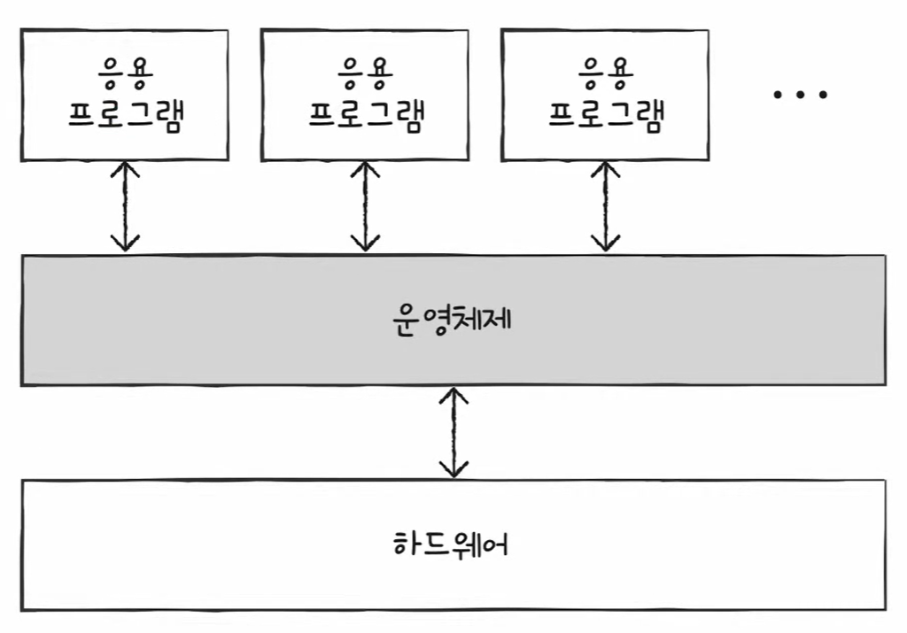
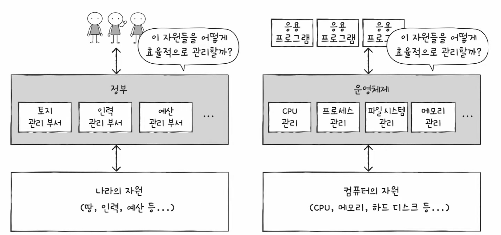
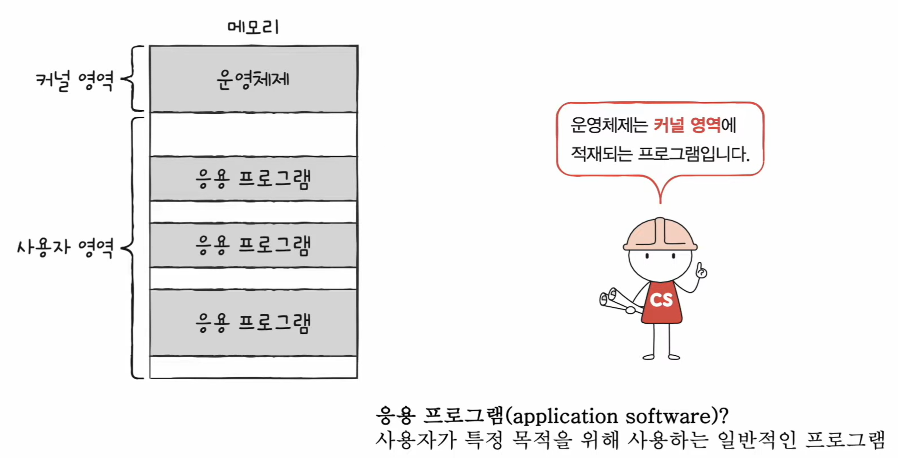
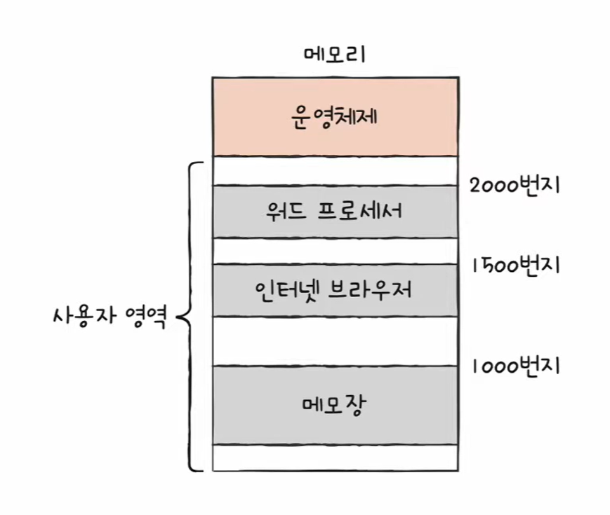
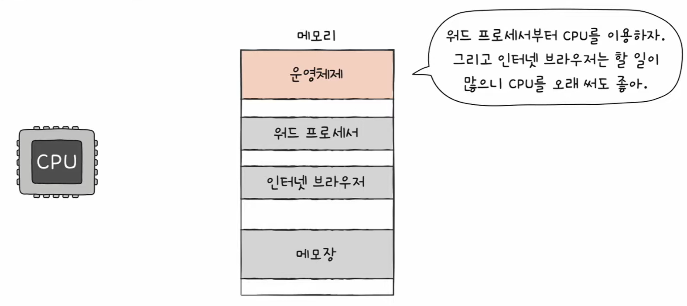
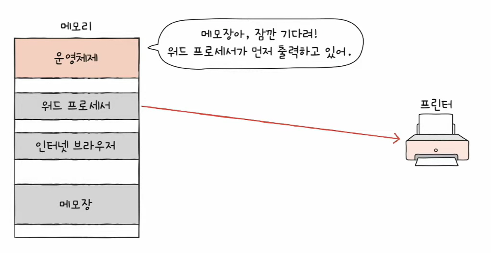
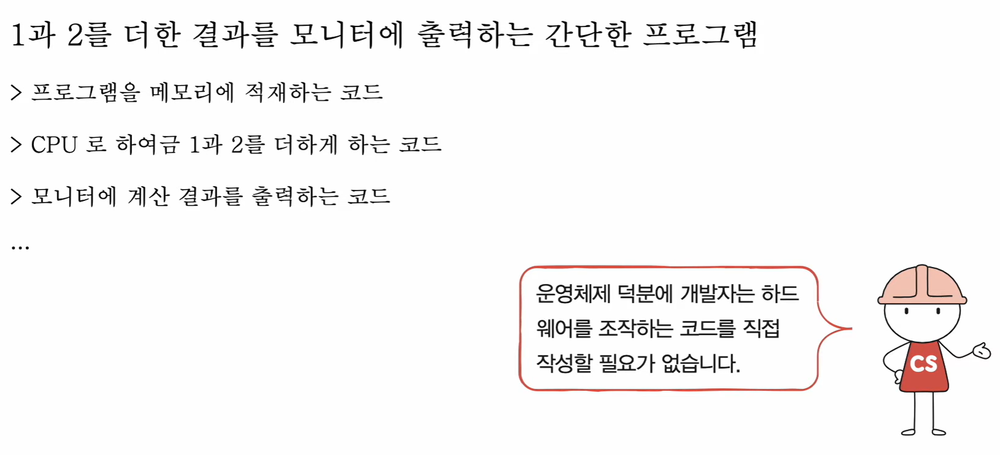
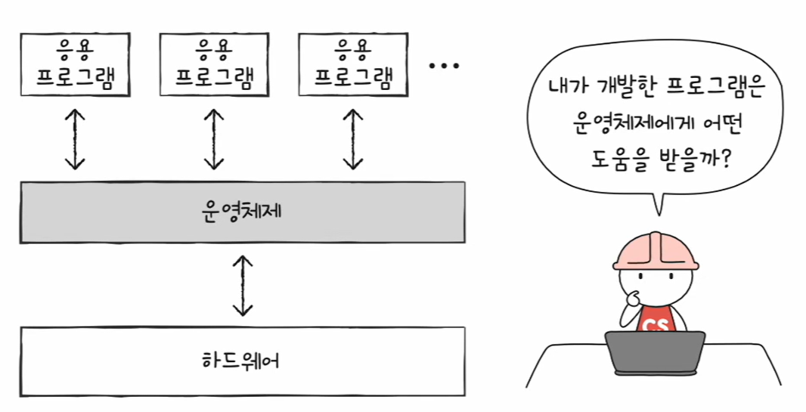
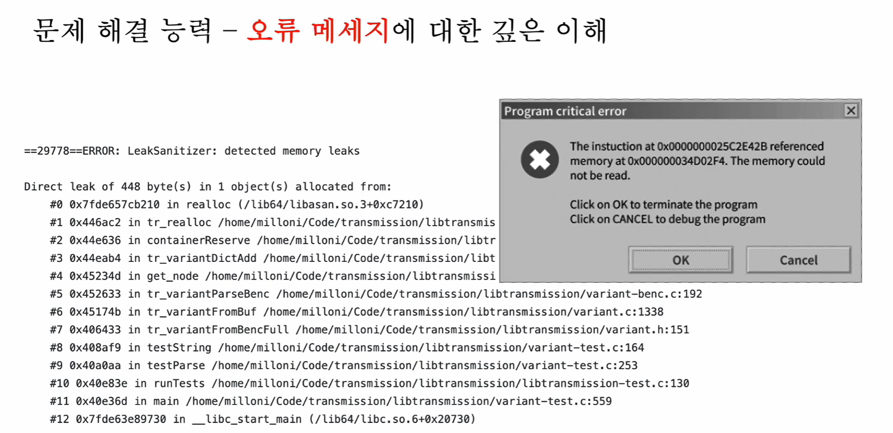

# 🧠 23강 운영체제를 알아야 하는 이유

> 운영체제(OS)는 **컴퓨터 자원(CPU/메모리/디스크/I/O 등)을 관리**하고,  
> 응용 프로그램이 **안전하고 올바르게 실행**되도록 도와주는 가장 근원적인 시스템 프로그램이다.  
> 개발자는 결국 OS 위에서 프로그램을 만들기 때문에, OS를 이해할수록 **오류 분석/성능 개선/문제 해결**이 강해진다.

---

## 🎯 이 강의에서 얻어야 할 핵심
- 운영체제는 **자원 관리자(Resource Manager)** 다.
- 운영체제는 **응용 프로그램 ↔ 하드웨어** 사이에서 요청을 중재한다.
- 운영체제를 알면 **에러 메시지, 시스템 로그, 성능 병목**을 더 빠르게 읽을 수 있다.

---

## 📌 목차
- [🧠 23강 운영체제를 알아야 하는 이유](#-23강-운영체제를-알아야-하는-이유)
  - [🎯 이 강의에서 얻어야 할 핵심](#-이-강의에서-얻어야-할-핵심)
  - [📌 목차](#-목차)
  - [1) 운영체제란?](#1-운영체제란)
  - [2) 자원(System Resource) 개념](#2-자원system-resource-개념)
  - [3) 커널 영역 vs 사용자 영역](#3-커널-영역-vs-사용자-영역)
  - [4) 운영체제가 하는 일](#4-운영체제가-하는-일)
    - [4.1 메모리 관리](#41-메모리-관리)
    - [4.2 CPU 관리(스케줄링)](#42-cpu-관리스케줄링)
    - [4.3 입출력장치(I/O) 관리](#43-입출력장치io-관리)
    - [4.4 파일/디렉토리 관리](#44-파일디렉토리-관리)
  - [5) 운영체제가 없다면?](#5-운영체제가-없다면)
  - [6) 그래서 왜 운영체제를 알아야 할까?](#6-그래서-왜-운영체제를-알아야-할까)
  - [7) 개발자 관점 체크리스트](#7-개발자-관점-체크리스트)
  - [8) 한 줄 요약](#8-한-줄-요약)

---

## 1) 운영체제란?

- 모든 프로그램은 실행을 위해 **자원**이 필요하다.
- 운영체제는 실행할 프로그램에 필요한 자원을 **할당**하고,
  프로그램이 **올바르게 실행되도록 관리**하는 특별한 프로그램이다.
- 운영체제 또한 하나의 프로그램이므로 **메모리에 적재되어 실행**된다.

> *운영체제는 응용 프로그램과 하드웨어 사이의 “중간 다리” 역할을 한다.*

✅ 정리하면 운영체제는 아래를 담당한다.
- (1) 자원 제공: “필요한 자원 줌”
- (2) 충돌 방지: “여러 프로그램이 동시에 쓰려는 자원을 조정함”
- (3) 안전/보호: “프로그램이 시스템을 망가뜨리지 못하게 막음”

---

## 2) 자원(System Resource) 개념

**자원**이란 프로그램 실행에 있어 “마땅히 필요한 요소”를 뜻한다.

- 대표 자원: **CPU, 메모리, 보조기억장치(디스크), 입출력장치**
- 하드웨어만 자원이 아니다.
  - 예: **파일**, **네트워크**, **프로세스의 실행 시간**, **장치 접근 권한** 등도 자원으로 볼 수 있다.

> *정부가 나라의 자원(땅/예산/인력)을 관리하듯, 운영체제는 컴퓨터 자원(CPU/메모리/디스크 등)을 관리한다.*

---

## 3) 커널 영역 vs 사용자 영역

운영체제는 중요한 프로그램이기 때문에 보통 메모리에서 **별도의 영역**에 적재된다.

- **커널 영역(Kernel Space)**
  - 운영체제 핵심 기능이 동작하는 영역
  - 자원 할당/보호/드라이버/I/O 제어 등 시스템 핵심 작업 수행
- **사용자 영역(User Space)**
  - 일반 응용 프로그램이 동작하는 영역
  - 예: 브라우저, 메모장, 워드 프로세서, 게임 등

> *운영체제는 커널 영역에 적재되어 실행되고, 응용 프로그램은 사용자 영역에서 동작한다.*

💡 포인트
- 응용 프로그램이 “바로 하드웨어에 접근”하지 않는 이유는,
  운영체제가 중간에서 **통제/보호**해야 하기 때문이다.
- 그래서 응용 프로그램은 OS에게 “요청”하고, OS가 적절히 처리한다.  
  (이 요청 통로가 이후 강의에서 나오는 **시스템 호출(system call)**로 이어짐)

---

## 4) 운영체제가 하는 일

### 4.1 메모리 관리

프로그램은 실행되려면 메모리에 올라가야 한다.

- 워드 프로세서 → (예) 2000번지
- 인터넷 브라우저 → (예) 1500번지
- 메모장 → (예) 1000번지

> *여러 프로그램이 메모리에 함께 올라가며, 운영체제가 빈 공간을 찾아 배치한다.*

핵심 질문:
> “누가 어떤 주소에 올릴지 결정하지?”

✅ 운영체제 역할
- 비어 있는 메모리 공간에 프로그램을 적재(배치)
- 프로그램이 종료되면 해당 공간을 회수(정리)
- 동시에 여러 프로그램이 실행돼도 서로를 침범하지 않게 보호

> *새 프로그램(예: 게임)이 실행될 때 적재 위치를 잡아주고, 종료된 프로그램 공간을 회수해 메모리를 비운다.*

---

### 4.2 CPU 관리(스케줄링)

사용자는 여러 프로그램을 “동시에” 실행한다고 느끼지만,
실제로는 CPU가 **아주 빠르게 번갈아** 실행한다.

운영체제가 결정해야 하는 것:
- 어떤 프로그램을 먼저 실행할까?
- 어떤 프로그램에 CPU를 더 오래 줄까?
- 어떤 프로그램은 잠깐만 실행해도 될까?

> *운영체제가 CPU 사용 순서/시간을 조절해 여러 프로그램이 “동시에” 돌아가는 것처럼 만든다.*

💡 개발자 관점 예시
- UI가 “버벅임” → 특정 작업이 CPU를 오래 점유하거나, 스레드/프로세스 배분이 비효율일 수 있음
- 백그라운드 작업이 느림 → 우선순위/스케줄링/대기 상태가 원인일 수 있음

---

### 4.3 입출력장치(I/O) 관리

입출력 장치는 동시에 여러 프로세스가 접근하면 충돌이 생길 수 있다.

예) 프린터는 한 번에 하나의 프로세스만 사용 가능  
- 워드가 프린터 사용 중이면  
- 메모장은 프린터를 바로 사용할 수 없음

✅ 운영체제는
- 어떤 프로세스가 먼저 장치를 쓸지 조정하고
- 나머지는 대기시키는 방식으로 **I/O 접근을 관리**한다.

> *장치(프린터 등)를 한 번에 하나가 쓰게 하고, 나머지는 기다리게 해 충돌을 방지한다.*

💡 여기서 자주 나오는 현상
- “디스크/네트워크 작업 때문에 프로그램이 멈춘 느낌”  
  → CPU 문제가 아니라 **I/O 대기**(block)가 원인일 수 있음

---

### 4.4 파일/디렉토리 관리

보조기억장치(디스크)에 있는 정보를
사용자가 다루기 쉬운 형태로 정리한다.

- Windows: **파일 / 폴더**
- macOS / Linux: **파일 / 디렉토리**

✅ 운영체제는 저장장치의 정보를 “구조화해서 관리”하는 역할도 한다.

---

## 5) 운영체제가 없다면?

운영체제 없이 “1 + 2를 더해 화면에 출력”하려면,
개발자가 아래를 전부 직접 구현해야 한다.

- 프로그램을 메모리에 적재하는 코드
- 비어 있는 메모리 주소 공간을 찾는 코드
- CPU로 계산을 수행시키는 코드
- 모니터(디바이스)에 결과를 출력하는 코드
- 장치를 안전하게 제어하는 코드

즉,
> `print()`, `printf()` 같은 함수도 내부적으로는 운영체제 기능을 사용한다.

> *운영체제가 있기 때문에 개발자는 하드웨어를 직접 조작하는 코드를 매번 작성하지 않아도 된다.*

---

## 6) 그래서 왜 운영체제를 알아야 할까?

운영체제는 “사용자를 위한 프로그램”이기보다는,
프로그램이 실행될 수 있게 만들어주는 기반(플랫폼)에 가깝다.

- 운영체제는 **프로그램을 위한 프로그램**이다.
- 우리가 만든 프로그램은 OS 도움을 받아 실행된다.
- 문제가 생기면 OS가 먼저 감지하고 **오류 메시지/로그**로 단서를 제공한다.

> *개발자가 만든 프로그램은 OS로부터 자원 할당/장치 접근/파일 처리 같은 도움을 받는다.*

특히 “오류 메시지”는 운영체제 이해도가 곧 해석력으로 이어진다.

> *메모리 누수(LeakSanitizer), 접근 불가(memory could not be read) 같은 메시지는 OS/메모리 개념을 알수록 원인 추적이 빨라진다.*

---

## 7) 개발자 관점 체크리스트

문제 상황에서 아래를 떠올리면 원인 좁히기가 빨라진다.

- **메모리 문제**
  - 메모리가 계속 증가한다 → 누수/해제 누락/캐시 누적
  - 특정 순간 크래시 → 잘못된 주소 접근, 보호 위반 가능성
- **CPU 문제**
  - CPU가 100%로 치솟는다 → 무한 루프/과한 연산/스레드 경쟁
  - UI가 멈춘다 → 메인 스레드에서 무거운 작업 수행 가능성
- **I/O 문제**
  - 저장/로드가 느리다 → 디스크 병목, 네트워크 지연, I/O 대기
  - 프린터/카메라/파일 접근 충돌 → 장치 접근 순서/락 문제 가능성

---

## 8) 한 줄 요약

> 운영체제는 **자원 관리 + 실행 환경 제공**을 담당하는 프로그램이고,  
> 개발자는 그 위에서 프로그램을 만들기 때문에 운영체제를 알수록 **디버깅/문제 해결이 강해진다**.
