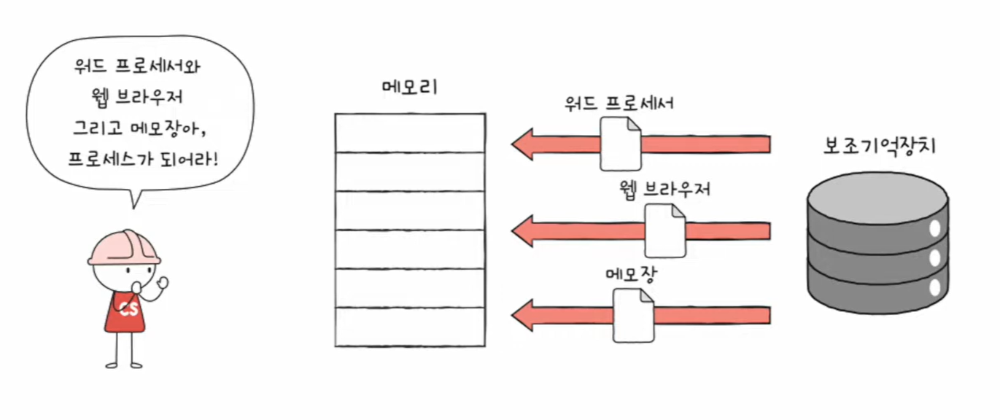
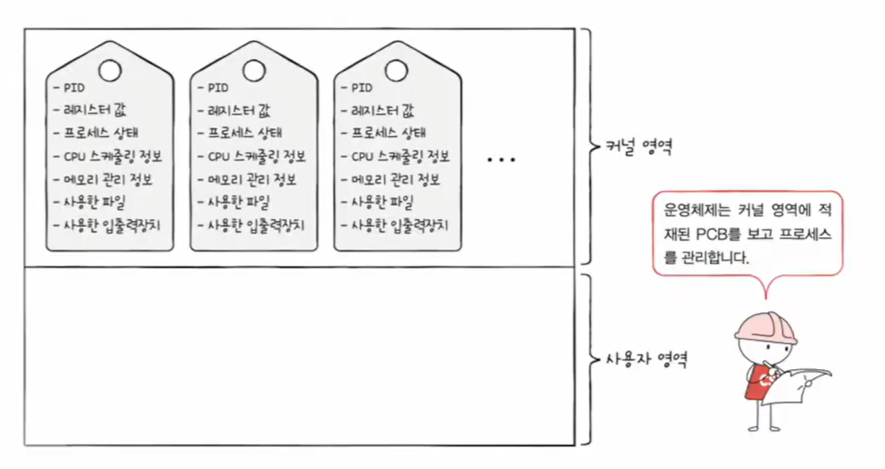
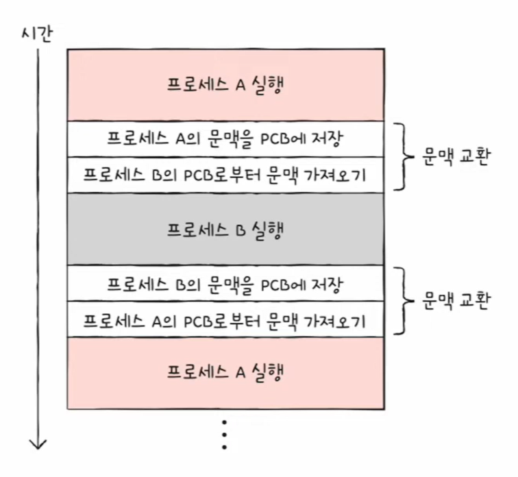
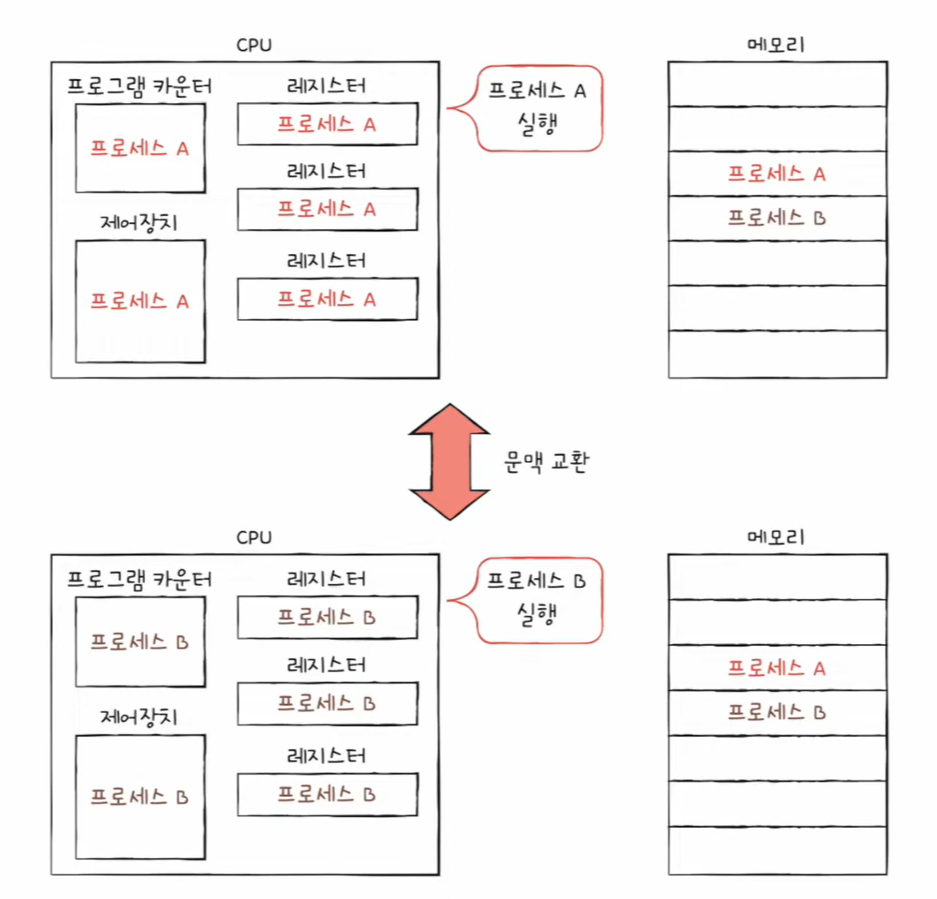
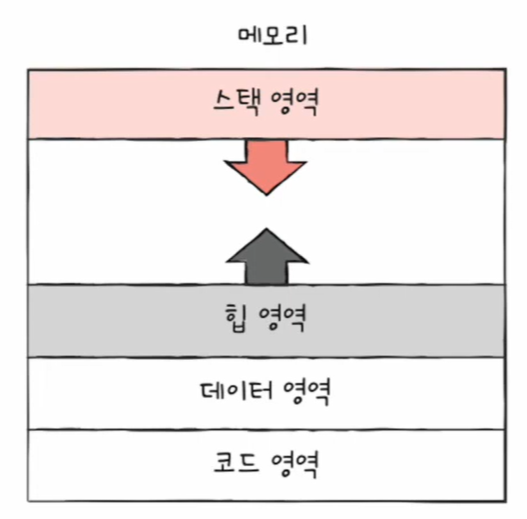
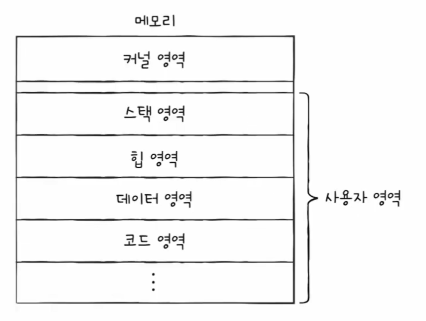

# 🧠 26강 프로세스 개요

> 운영체제는 동시에 실행되는 것처럼 보이는 여러 프로그램을 **프로세스(process)** 단위로 관리한다.  
> 이 문서에서는 “프로그램이 프로세스가 되는 순간”부터 **PCB**, **타이머 인터럽트 기반 CPU 분배**, **문맥 교환**, **메모리 구조(코드/데이터/힙/스택)** 까지 흐름대로 정리한다.

---

## 📌 목차
1. [프로그램이 프로세스가 되는 과정](#1-프로그램이-프로세스가-되는-과정)
2. [프로세스를 직접 확인하기](#2-프로세스를-직접-확인하기)
3. [CPU는 어떻게 여러 프로세스를 번갈아 실행할까?](#3-cpu는-어떻게-여러-프로세스를-번갈아-실행할까)
4. [프로세스 제어 블록(PCB)](#4-프로세스-제어-블록pcb)
5. [문맥 교환(Context Switch)](#5-문맥-교환context-switch)
6. [프로세스의 메모리 영역](#6-프로세스의-메모리-영역)
7. [정적 할당 vs 동적 할당](#7-정적-할당-vs-동적-할당)
8. [가비지 컬렉션과 메모리 누수](#8-가비지-컬렉션과-메모리-누수)
9. [핵심 요약](#9-핵심-요약)

---

## 1) 프로그램이 프로세스가 되는 과정

프로그램(워드/브라우저/메모장 등)은 보통 **보조기억장치(디스크)** 에 저장되어 있다가, 실행되는 순간 **메모리(RAM)** 로 올라오며 “프로세스”가 된다.

> 보조기억장치의 프로그램이 메모리에 적재(load)되면서 실행 가능한 **프로세스**로 변한다.

---

## 2) 프로세스를 직접 확인하기

프로세스는 “실행 중인 프로그램”이라고 흔히 설명한다.  
같은 프로그램이라도 **여러 번 실행하면 프로세스는 여러 개** 생길 수 있다.

### ✅ 포그라운드 프로세스 (Foreground Process)

- 사용자가 **직접 보고/조작하는 화면(터미널/GUI)** 에서 실행되는 프로세스
- 예) 터미널에서 실행한 `vim`, `python app.py` 등

### ✅ 백그라운드 프로세스 (Background Process)

- 사용자가 **직접 보지 않는 상태** 로 실행되는 프로세스

백그라운드 프로세스는 성격에 따라 나뉜다.

- **사용자와 상호작용 가능한 백그라운드**
  - 예) 백그라운드로 돌려놓고 필요 시 다시 포그라운드로 가져오는 작업
- **사용자와 상호작용하지 않고 정해진 일만 수행**
  - **데몬(daemon)** / **서비스(service)**
  - 예) 웹서버, DB서버, 스케줄러 등

---

## 3) CPU는 어떻게 여러 프로세스를 번갈아 실행할까?

- 모든 프로세스는 실행을 위해 **CPU** 가 필요하지만 CPU는 한정되어 있다.
- 그래서 운영체제는 프로세스에게 **아주 짧은 시간 단위로 CPU를 나눠** 준다.
- 시간 할당이 끝나면(주로 **타이머 인터럽트**) 현재 프로세스는 CPU를 양보하고 다음 프로세스로 넘어갈 수 있다.

> 타이머 인터럽트가 “시간 종료” 신호를 만들어 CPU 사용 순서를 바꿀 수 있게 한다.

---

## 4) 프로세스 제어 블록(PCB)

여러 프로세스가 빠르게 번갈아 실행되려면,
- “각 프로세스가 어디까지 실행했는지”
- “지금 상태가 무엇인지”
- “어떤 자원을 쓰고 있는지”
를 운영체제가 정확히 알고 있어야 한다.

이를 위해 커널은 프로세스마다 **PCB(Process Control Block)** 라는 자료구조를 만든다.

> PCB는 **커널 영역**에 적재되며, 운영체제는 PCB를 통해 프로세스를 관리한다.

### PCB에 담기는 대표 정보

- **PID**: 프로세스를 식별하는 고유 번호
- **레지스터 값**: 다음 차례에 이어서 실행하기 위한 값(예: PC, SP 등)
- **프로세스 상태**: Running / Ready / Waiting 등
- **CPU 스케줄링 정보**: 우선순위, 큐 정보 등
- **메모리 관리 정보**: 주소 변환/배치에 필요한 정보(예: 페이지 테이블 관련)
- **사용한 파일 / 입출력장치 정보**: 열린 파일, 할당된 장치 정보 등

---

## 5) 문맥 교환(Context Switch)

### 문맥(Context)이란?

프로세스가 중단된 시점에서 **나중에 그대로 이어서 실행하기 위해 필요한 중간 정보**  
(레지스터 값, 메모리 관련 정보, 파일/I/O 상태 등)

### 문맥 교환(Context Switch)이란?

프로세스 A에서 프로세스 B로 CPU 실행 주체가 바뀔 때,

1) **A의 문맥을 PCB에 저장(backup)**  
2) **B의 문맥을 PCB에서 복구(restore)**  

이 과정을 **문맥 교환(context switch)** 이라고 한다.

> A 실행 → A 문맥 저장 → B 문맥 복구 → B 실행 … 이런 흐름이 반복된다.

> 실행 중인 프로세스가 바뀌면, CPU의 **프로그램 카운터/레지스터 값**도 해당 프로세스 기준으로 바뀐다.

> 💡 핵심: “실행 문맥을 백업해두면 언제든 해당 프로세스의 실행을 재개할 수 있다.”

---

## 6) 프로세스의 메모리 영역

프로세스는 메모리에 적재되면 보통 다음과 같은 구조로 관리된다.

> 일반적인 구조: **코드/데이터는 아래**, **힙은 위로 증가(↑)**, **스택은 아래로 증가(↓)**

### ✅ 코드 영역(=텍스트 영역)

- 실행할 수 있는 코드(기계어 명령어) 저장
- 보통 **read-only(쓰기 금지)** 로 보호됨

### ✅ 데이터 영역

- 프로그램 실행 동안 유지할 데이터 저장
- 예) 전역 변수, static 변수

### ✅ 힙(Heap) 영역

- 프로그래머가 직접 할당하는 동적 공간
- 일반적으로 **낮은 주소 → 높은 주소(↑)** 로 확장

### ✅ 스택(Stack) 영역

- 함수 호출 과정의 일시 데이터 저장 공간
- 예) 매개변수, 지역 변수, 리턴 주소
- 일반적으로 **높은 주소 → 낮은 주소(↓)** 로 확장

추가로, 운영체제 관점에서는 메모리를 크게 **커널 영역 / 사용자 영역**으로 나눠서 이해하면 좋다.

> 사용자 프로세스의 코드/데이터/힙/스택은 보통 **사용자 영역**에서 실행되고, OS 핵심 자료(예: PCB)는 **커널 영역**에서 관리된다.

---

## 7) 정적 할당 vs 동적 할당

### 정적 할당 영역(크기 고정 성격)

- **코드 영역, 데이터 영역**
- 실행 중 크기가 크게 변하지 않는 편

### 동적 할당 영역(실행 중 크기 변화 가능)

- **힙 영역, 스택 영역**
- 실행 중 필요에 따라 늘었다 줄었다 할 수 있음

---

## 8) 가비지 컬렉션과 메모리 누수

### 가비지 컬렉션(Garbage Collection)

- 힙에 할당된 메모리를 언어/런타임이 자동으로 회수
- 예) Java, C#, JavaScript, Python 등

### 메모리 누수(Memory Leak)

- 더 이상 사용하지 않는 메모리가 반환되지 않아 사용량이 계속 증가하는 문제
- GC가 없는 언어(C 등)는 개발자가 해제 책임을 지므로 누수에 특히 주의해야 한다.

---

## 9) 핵심 요약

- 프로그램은 보조기억장치에 있다가 **메모리에 적재되며 프로세스가 된다.**
- CPU는 타이머 인터럽트로 시간을 쪼개 **여러 프로세스를 번갈아 실행**한다.
- OS는 프로세스마다 **PCB**를 커널에 두고 상태/자원을 관리한다.
- 실행 주체가 바뀌면 **문맥 교환(저장+복구)** 이 일어난다.
- 메모리 구조는 보통 **코드/데이터/힙/스택**, 힙↑ 스택↓ 형태로 이해한다.
