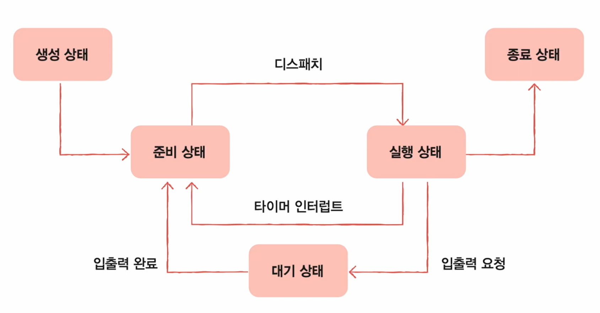
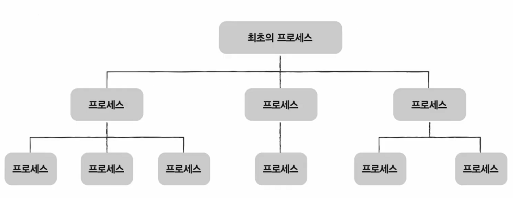
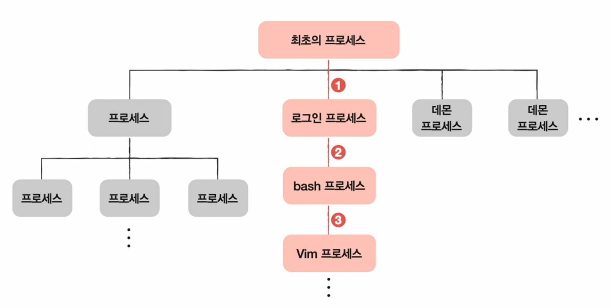
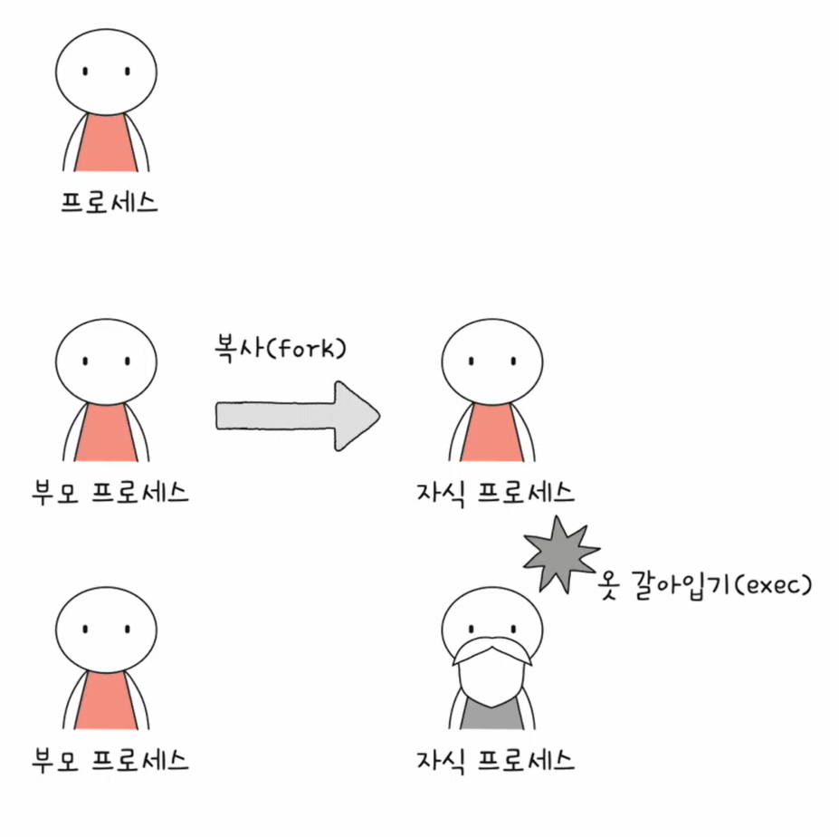
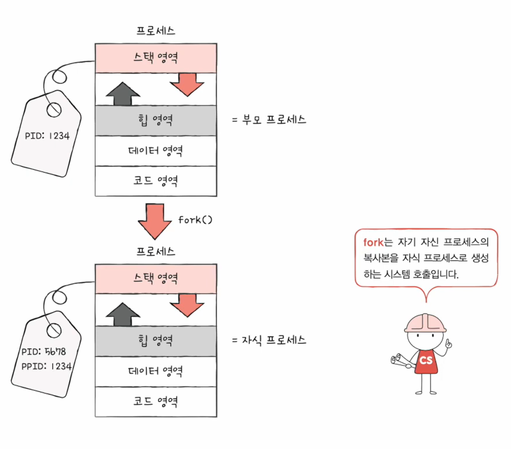
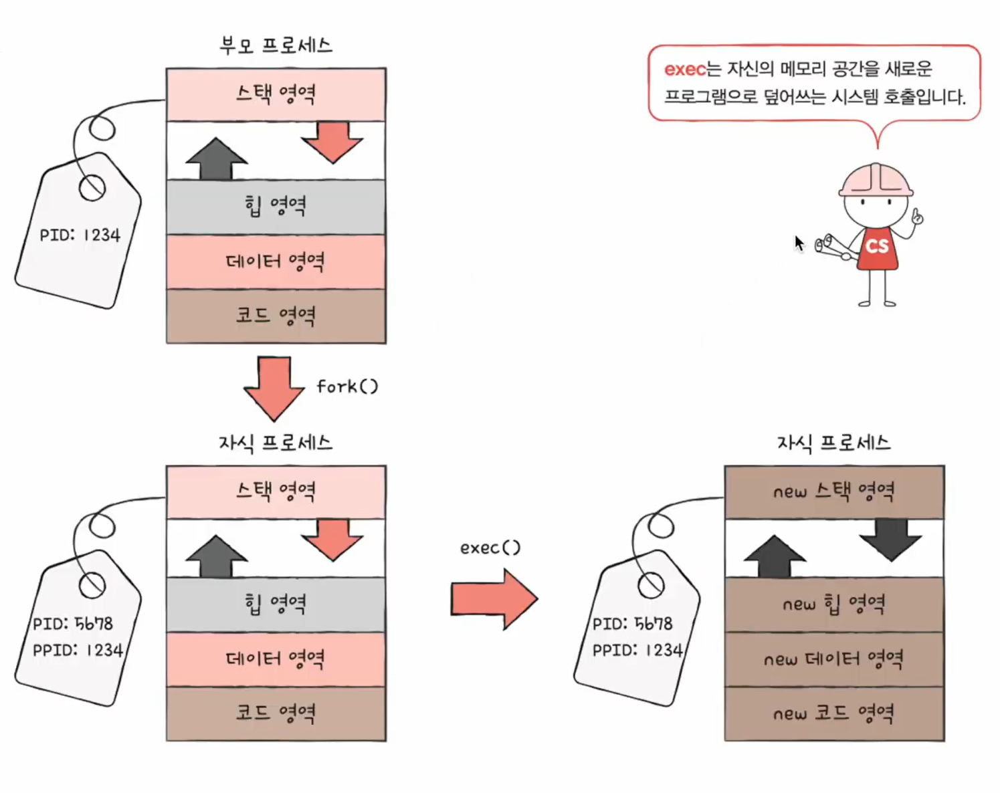

# 🧠 27강 프로세스 상태와 계층 구조

프로세스는 실행되는 동안 **상태(state)** 를 계속 바꾸고, 실행 중에 다른 프로세스를 만들면서 **부모-자식 관계(계층 구조)** 를 형성한다.  
이번 강의는 아래 2가지를 한 번에 잡는 게 핵심이다.

- **프로세스 상태**: 생성/준비/실행/대기/종료 + 상태 전이(왜/언제 바뀌는지)
- **프로세스 계층 구조**: 부모/자식(PID/PPID), 트리 구조, `pstree`로 확인
- **프로세스 생성 기법**: `fork()`(복제) + `exec()`(메모리 교체)

---

## 📚 목차
- [🧠 27강 프로세스 상태와 계층 구조](#-27강-프로세스-상태와-계층-구조)
  - [📚 목차](#-목차)
  - [🧭 한눈에 보기](#-한눈에-보기)
    - [프로세스 상태 전이 다이어그램](#프로세스-상태-전이-다이어그램)
  - [🧩 프로세스 상태(Process State)](#-프로세스-상태process-state)
    - [2.1 상태 종류](#21-상태-종류)
      - [✅ 생성 상태 (New)](#-생성-상태-new)
      - [✅ 준비 상태 (Ready)](#-준비-상태-ready)
      - [✅ 실행 상태 (Running)](#-실행-상태-running)
      - [✅ 대기 상태 (Waiting / Blocked)](#-대기-상태-waiting--blocked)
      - [✅ 종료 상태 (Terminated)](#-종료-상태-terminated)
    - [2.2 상태 전이(Transition)](#22-상태-전이transition)
    - [2.3 Ready vs Waiting 핵심 차이](#23-ready-vs-waiting-핵심-차이)
  - [🌳 프로세스 계층 구조(Process Hierarchy)](#-프로세스-계층-구조process-hierarchy)
    - [3.1 부모/자식 프로세스](#31-부모자식-프로세스)
    - [3.2 계층 구조 예시](#32-계층-구조-예시)
      - [(1) “최초의 프로세스 → 로그인 → 쉘 → 프로그램” 흐름 예시](#1-최초의-프로세스--로그인--쉘--프로그램-흐름-예시)
      - [(2) 일반적인 트리 형태(개념도)](#2-일반적인-트리-형태개념도)
    - [3.3 확인 명령어: pstree](#33-확인-명령어-pstree)
  - [🧬 프로세스 생성 기법: fork \& exec](#-프로세스-생성-기법-fork--exec)
    - [4.1 비유: 복제와 옷 갈아입기](#41-비유-복제와-옷-갈아입기)
    - [4.2 fork()](#42-fork)
    - [4.3 exec()](#43-exec)
    - [4.4 fork 후 exec를 하지 않는 경우](#44-fork-후-exec를-하지-않는-경우)
  - [✅ 정리](#-정리)

---

## 🧭 한눈에 보기

### 프로세스 상태 전이 다이어그램
> 생성 → 준비 → 실행 → (입출력 시 대기) → 준비 → … → 종료  
> 그리고 실행 중 타이머 인터럽트가 오면 다시 준비로 밀려난다(선점).

- **디스패치**: 준비(Ready) → 실행(Running) (CPU 할당)
- **타이머 인터럽트**: 실행(Running) → 준비(Ready) (할당 시간 소진)
- **입출력 요청**: 실행(Running) → 대기(Waiting)
- **입출력 완료**: 대기(Waiting) → 준비(Ready)

---

## 🧩 프로세스 상태(Process State)

운영체제는 프로세스를 관리하기 위해 **PCB(Process Control Block)** 를 두고, 프로세스는 상황에 따라 **상태를 전이**한다.

### 2.1 상태 종류

#### ✅ 생성 상태 (New)
- 이제 막 메모리에 적재되어 **PCB를 할당 받은 상태**
- 준비가 완료되면 **준비 상태(Ready)** 로 이동

#### ✅ 준비 상태 (Ready)
- **CPU만 받으면 바로 실행 가능**
- 하지만 **자기 차례가 아니어서 대기**하는 상태
- 스케줄러가 CPU를 주면 **실행 상태(Running)** 으로 (이 전이가 **디스패치**)

#### ✅ 실행 상태 (Running)
- **CPU를 할당 받아 실행 중**
- 다음 경우 상태 전이가 발생:
  - **할당된 시간 소진(타이머 인터럽트)** → 준비(Ready)
  - **입출력 장치 사용(I/O 요청)** → 대기(Waiting)

#### ✅ 대기 상태 (Waiting / Blocked)
- 실행 중 **입출력(I/O)을 요청**해 결과를 기다리는 상태
- I/O는 CPU보다 느리므로, CPU를 잡고 멈춰있지 않고 **대기 상태로 빠져서 CPU를 반납**
- **I/O 완료 인터럽트**를 받으면 다시 **준비(Ready)** 로

#### ✅ 종료 상태 (Terminated)
- 프로세스가 종료된 상태
- 운영체제가 **PCB 및 메모리 자원 정리(폐기)**

---

### 2.2 상태 전이(Transition)

대표적인 전이 흐름:

- **New → Ready** : 생성/적재/초기화 후 실행 준비 완료
- **Ready → Running** : CPU 할당(디스패치)
- **Running → Ready** : 타이머 인터럽트(할당 시간 끝)
- **Running → Waiting** : I/O 요청(디스크/네트워크/키보드 등)
- **Waiting → Ready** : I/O 완료 인터럽트
- **Running → Terminated** : 프로그램 종료

---

### 2.3 Ready vs Waiting 핵심 차이
- **Ready(준비)**: “CPU만 주면 지금 당장 실행 가능”
- **Waiting(대기)**: “CPU가 있어도 못 함(I/O 완료가 선행돼야 함)”

---

## 🌳 프로세스 계층 구조(Process Hierarchy)

프로세스는 실행 도중(시스템 호출을 통해) **다른 프로세스를 생성**할 수 있고, 그 결과 프로세스는 **트리 구조**를 이룬다.

### 3.1 부모/자식 프로세스
- 새 프로세스를 생성한 프로세스: **부모 프로세스(Parent)**
- 부모에 의해 생성된 프로세스: **자식 프로세스(Child)**
- 부모/자식은 **서로 다른 프로세스**이므로:
  - PID가 각각 다름
  - 일부 OS는 자식 PCB에 **PPID(부모 PID)** 를 기록

---

### 3.2 계층 구조 예시

#### (1) “최초의 프로세스 → 로그인 → 쉘 → 프로그램” 흐름 예시

- 로그인 프로세스에서 쉘(bash)이 뜨고,
- 그 쉘에서 vim 같은 프로그램을 실행하면 “부모-자식”이 이어져 트리가 된다.

#### (2) 일반적인 트리 형태(개념도)

---

### 3.3 확인 명령어: pstree
- 프로세스 계층 구조를 확인하는 대표 명령어: `pstree`

---

## 🧬 프로세스 생성 기법: fork & exec

부모 프로세스는 자식 프로세스를 **어떻게 만들고**, 자식은 **어떻게 자기 프로그램을 실행할까?**  
가장 대표적인 답이 **fork + exec** 조합이다.

### 4.1 비유: 복제와 옷 갈아입기

- `fork()` = **복사(복제)**: 부모를 복제해서 자식을 만든다.
- `exec()` = **옷 갈아입기**: 같은 프로세스(PID 유지)가 **메모리 내용을 새 프로그램으로 교체**한다.

---

### 4.2 fork()
`fork()`는 **부모 프로세스의 복사본을 자식 프로세스로 생성**한다.

- 부모와 자식은 **별개의 프로세스**
  - PID가 다름
  - 자식은 PPID로 “부모 PID”를 가진다
- `fork()` 직후에는 부모/자식이 매우 유사한 상태로 출발해서,
  “똑같은 코드를 각각 실행”하는 상황처럼 보일 수 있다.

---

### 4.3 exec()
`exec()`는 **자신의 메모리 공간을 새로운 프로그램으로 덮어쓰는 시스템 호출**이다.

- `exec()`는 “새 프로세스를 만드는 게 아니라”
  **현재 프로세스의 코드/데이터/힙/스택 등을 새 프로그램 기준으로 교체**한다.
- 그래서 `fork()`로 생성된 자식이 `exec()`를 하면
  **PID는 그대로인데(동일 프로세스)** 내부 메모리 내용이 바뀌는 게 포인트다.

---

### 4.4 fork 후 exec를 하지 않는 경우
- 자식이 `exec()`를 하지 않으면:
  - 부모의 복제본으로서 **부모와 같은 프로그램 흐름**을 그대로 이어갈 수 있다.
  - 결과적으로 “같은 일을 하는 프로세스가 병행 실행되는 구조”가 될 수 있다.

---

## ✅ 정리

- 프로세스는 **생성(New) → 준비(Ready) → 실행(Running) → (대기/준비 반복) → 종료(Terminated)** 로 움직인다.
- **Ready**는 “CPU만 필요”, **Waiting**은 “I/O가 필요”라는 점이 가장 중요하다.
- 프로세스는 부모가 자식을 만들며 **트리(계층 구조)** 를 형성한다(확인은 `pstree`).
- 프로세스 생성의 대표 패턴은:
  - `fork()`로 자식 생성(복제)
  - 자식이 `exec()`로 프로그램 교체(옷 갈아입기)
