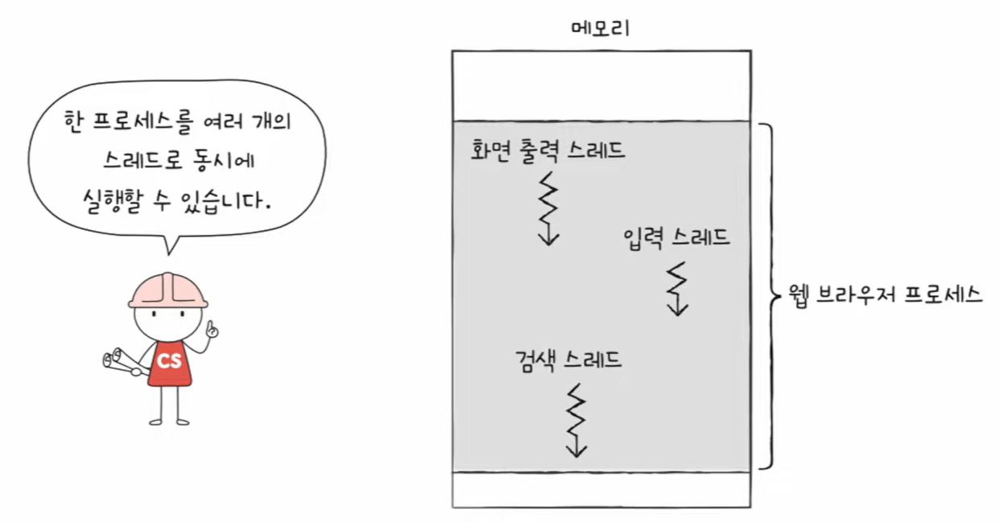
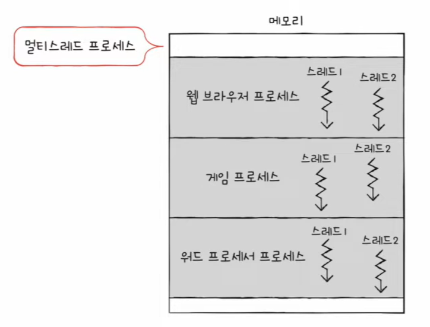
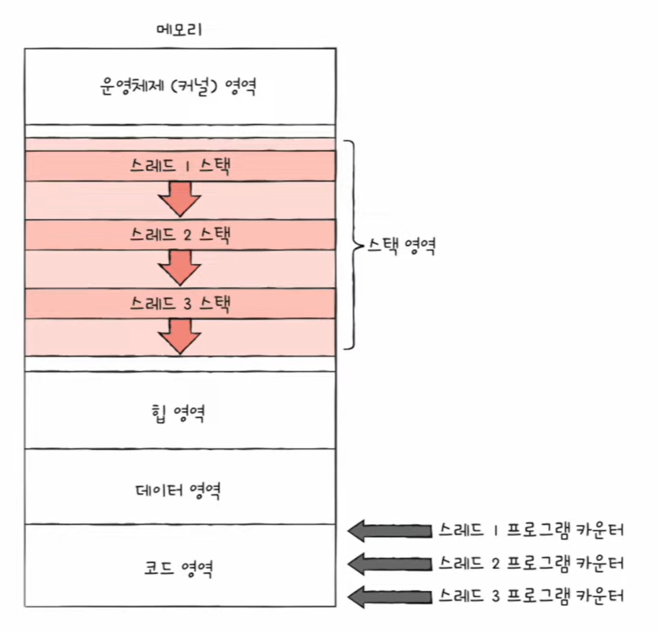
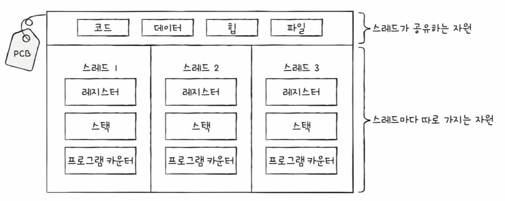
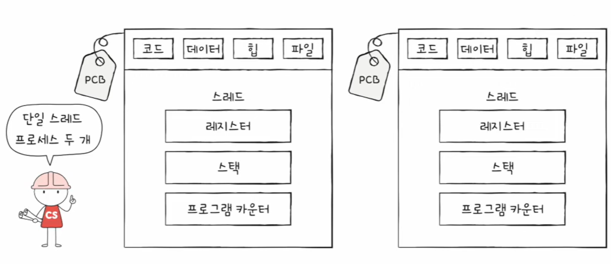
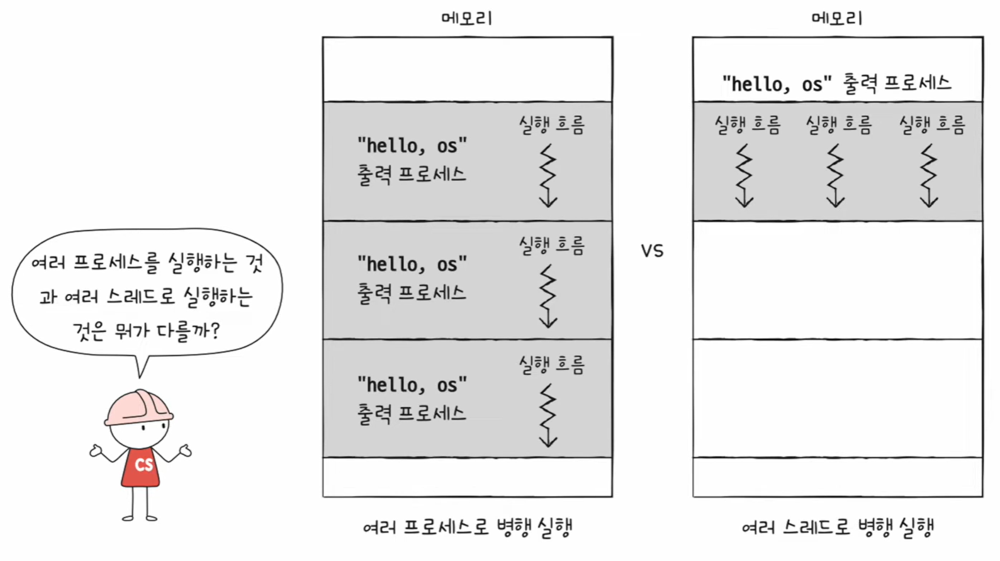

# 🧠 28강 스레드

> 스레드는 **프로세스 내부에서 실제로 실행되는 흐름(Execution Flow)의 단위**다.  
> 같은 프로세스 안의 스레드들은 **자원을 공유**할 수 있어 협력에 유리하지만, 그만큼 주의점도 생긴다.

---

## 📚 목차
- [🧠 28강 스레드](#-28강-스레드)
  - [📚 목차](#-목차)
  - [🧵 스레드란?](#-스레드란)
  - [🔀 단일 스레드 vs 멀티 스레드](#-단일-스레드-vs-멀티-스레드)
    - [단일 스레드 프로세스](#단일-스레드-프로세스)
    - [멀티 스레드 프로세스](#멀티-스레드-프로세스)
  - [🧩 스레드의 구성 요소](#-스레드의-구성-요소)
  - [📍 프로세스와 스레드의 자원 관계](#-프로세스와-스레드의-자원-관계)
  - [⚖️ 멀티 프로세스 vs 멀티 스레드](#️-멀티-프로세스-vs-멀티-스레드)
    - [1) 멀티 프로세스](#1-멀티-프로세스)
    - [2) 멀티 스레드](#2-멀티-스레드)
  - [⚠️ 멀티 스레드의 장점과 위험](#️-멀티-스레드의-장점과-위험)
    - [장점 (협력/통신에 유리)](#장점-협력통신에-유리)
    - [위험 (공유의 부작용)](#위험-공유의-부작용)
  - [✅ 핵심 요약](#-핵심-요약)

---

## 🧵 스레드란?

- **스레드(thread)** 는 **프로세스를 구성하는 실행 흐름의 단위**
- 하나의 프로세스는 **하나 이상의 스레드**를 가질 수 있다.
- 즉, 프로세스가 “프로그램이 올라가 있는 작업 공간”이라면, 스레드는 그 안에서 “실제로 돌아가는 실행 흐름”이다.

---

## 🔀 단일 스레드 vs 멀티 스레드

### 단일 스레드 프로세스
- 실행 흐름이 **1개**
- 한 번에 하나의 흐름으로 작업을 진행(논리적인 실행 흐름 기준)

### 멀티 스레드 프로세스
- 실행 흐름이 **여러 개**
- 하나의 프로세스 안에서 **여러 실행 흐름이 동시에 진행**될 수 있다(동시성/병렬성 관점)

---

## 🧩 스레드의 구성 요소

스레드는 “실행을 위해 필요한 최소한의 정보”를 각각 가지고 있다.

- **스레드 ID**
- **프로그램 카운터(PC)** 를 포함한 **레지스터 값**
- **스택(Stack)**

> ✅ 포인트: **PC/레지스터/스택**은 실행 흐름마다 달라야 하므로 스레드별로 따로 가진다.

---

## 📍 프로세스와 스레드의 자원 관계

- 같은 프로세스의 스레드들은 **각자 실행에 필요한 최소 정보(레지스터/스택/PC)** 를 따로 가진다.
- 대신, **프로세스 자원(코드/데이터/힙/파일 등)은 공유**한다.

정리하면:

- 스레드마다 따로: **레지스터 / 스택 / 프로그램 카운터(PC)**
- 프로세스 내에서 공유: **코드 / 데이터 / 힙 / 파일(열린 파일 등)**

---

## ⚖️ 멀티 프로세스 vs 멀티 스레드

같은 작업을 “여러 실행 흐름으로” 처리하는 방법은 크게 2가지다.

### 1) 멀티 프로세스
- 동일한 작업을 수행하는 **단일 스레드 프로세스를 여러 개 실행**
- 프로세스끼리는 기본적으로 **자원을 공유하지 않음**(서로 독립)

- 프로세스를 `fork()` 하면(전통적 설명 기준) **코드/데이터/힙 등 자원이 복제**되어 통째로 메모리에 적재될 수 있다.
- 참고: 실제 운영체제는 성능을 위해 **Copy-on-Write(COW)** 같은 최적화를 쓰기도 한다(“쓰기 발생 시점에 복사”).

### 2) 멀티 스레드
- **하나의 프로세스 안에서** 여러 스레드가 실행 흐름을 나눔
- 스레드들은 **프로세스 자원을 공유**하면서 실행

---

## ⚠️ 멀티 스레드의 장점과 위험

### 장점 (협력/통신에 유리)
- 같은 프로세스 자원을 공유하므로 **데이터 전달/협업이 상대적으로 쉬움**
- 프로세스 간 통신(IPC)보다 “같은 메모리 공유” 관점에서 편리한 경우가 많다

### 위험 (공유의 부작용)
- 자원을 공유하기 때문에 **한 스레드의 문제가 프로세스 전체로 번질 수 있음**
  - 예: 공유 데이터 꼬임, 동기화 문제, 충돌, 전체 프로세스 비정상 종료 등
- 반면 멀티 프로세스는 기본적으로 독립이라, 한 프로세스 문제가 다른 프로세스에 미치는 영향이 상대적으로 적다.

---

## ✅ 핵심 요약

- **스레드 = 프로세스 내부 실행 흐름의 단위**
- 스레드별로 따로 가지는 것: **레지스터 / 스택 / 프로그램 카운터(PC)**
- 프로세스 내에서 공유하는 것: **코드 / 데이터 / 힙 / 파일 등 자원**
- 멀티 프로세스: **자원 공유 X**, 격리/안정성 유리(대신 IPC 필요)
- 멀티 스레드: **자원 공유 O**, 협업/통신 유리(대신 공유로 인한 위험 존재)

---
