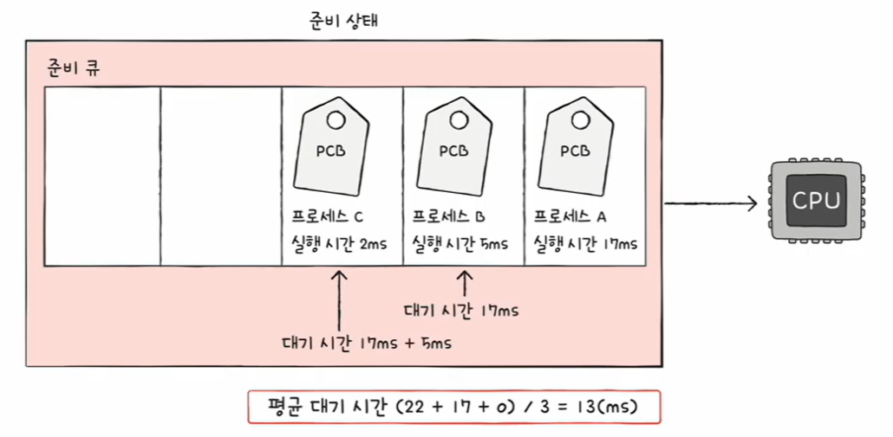
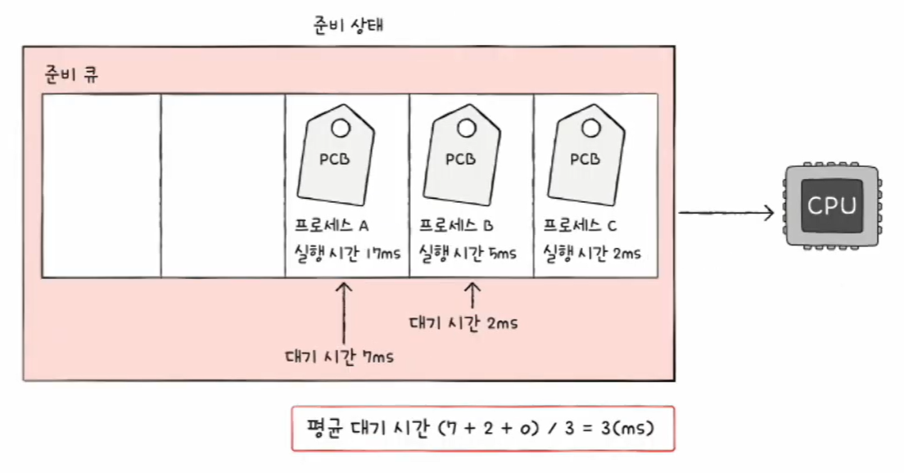
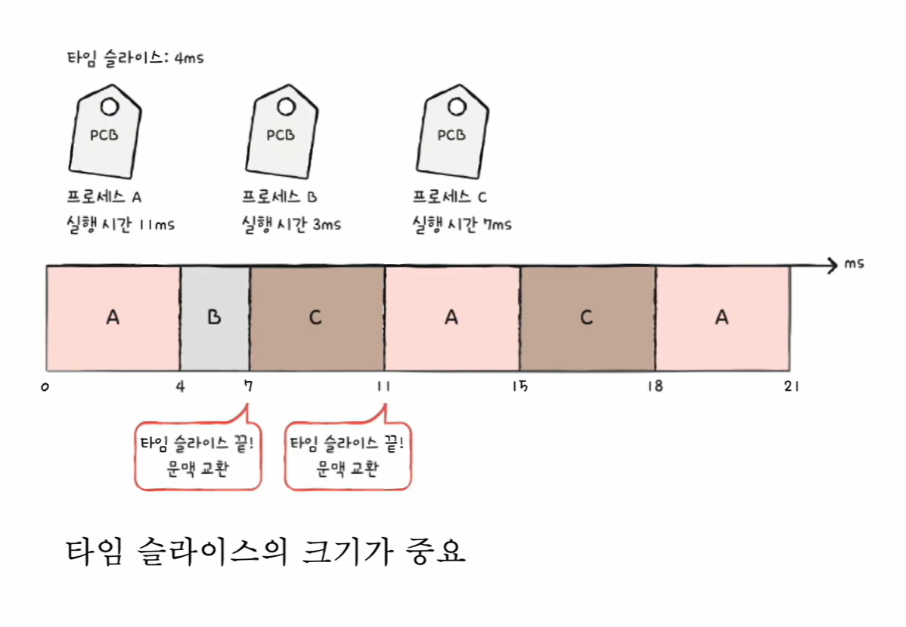
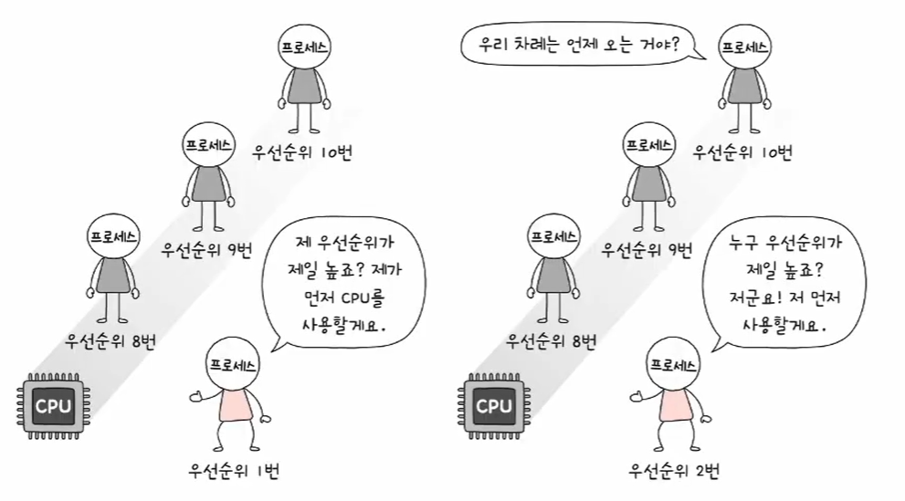
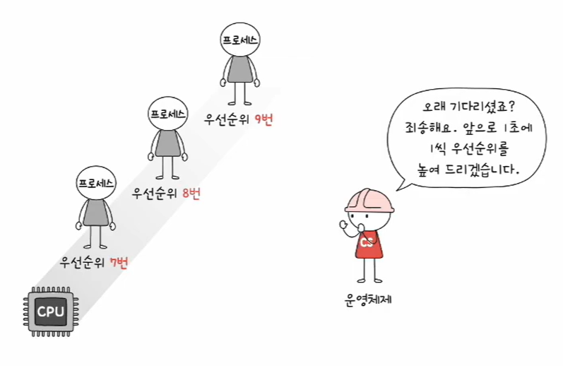
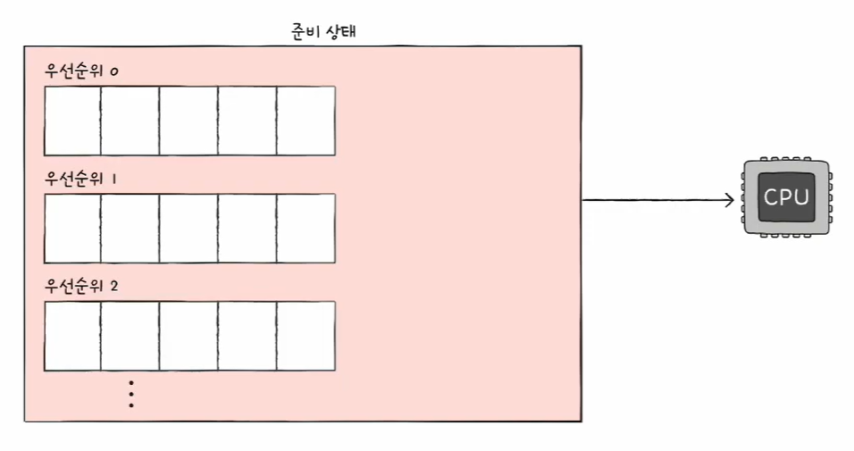
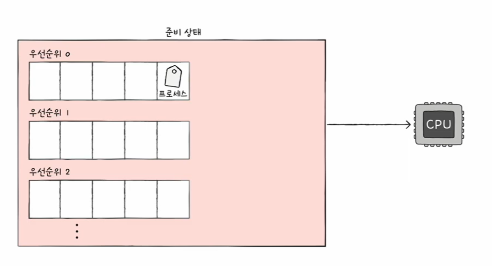
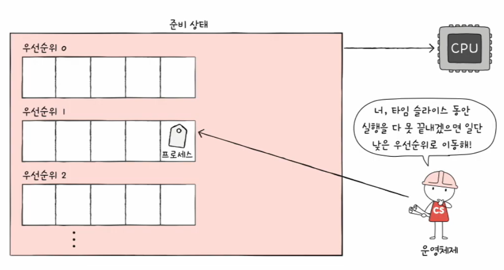
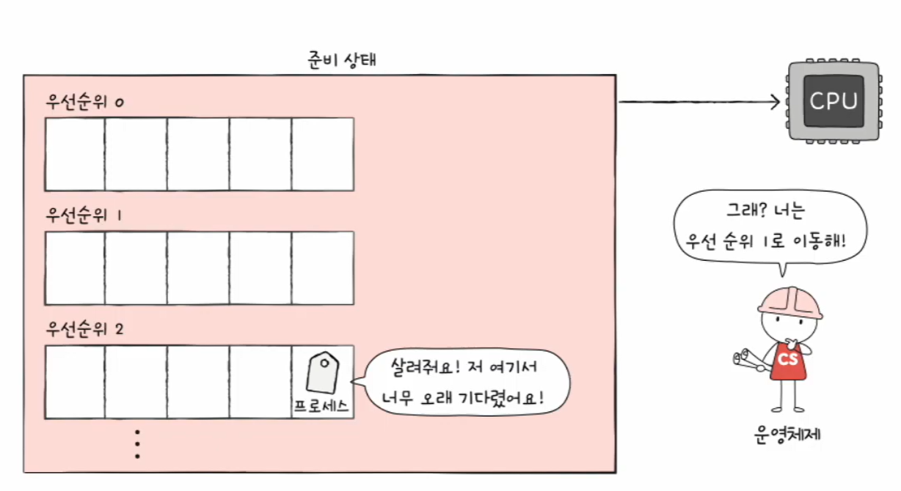
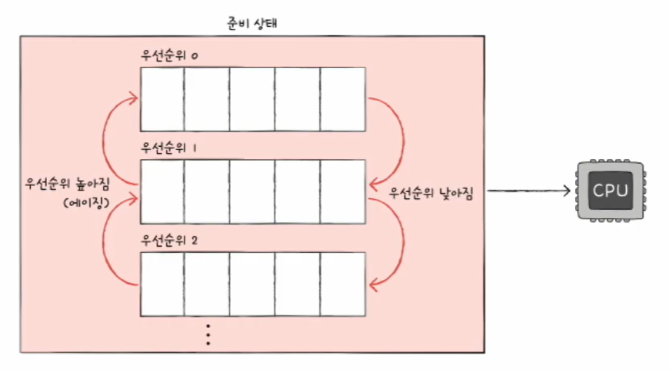

# 🧠 32강 CPU 스케줄링 알고리즘

CPU 스케줄링 알고리즘은 **준비 큐(Ready Queue)** 에 있는 프로세스들 중 **“다음에 누가 CPU를 쓸지”** 를 결정하는 규칙이다.  
알고리즘마다 **평균 대기 시간(Waiting Time)**, **응답 시간(Response Time)**, **처리량(Throughput)**, **공정성(Fairness)** 을 다르게 우선한다.

---

## 📚 목차
- [🧠 32강 CPU 스케줄링 알고리즘](#-32강-cpu-스케줄링-알고리즘)
  - [📚 목차](#-목차)
  - [🧩 스케줄링 기본 개념](#-스케줄링-기본-개념)
    - [선점형 vs 비선점형](#선점형-vs-비선점형)
    - [자주 나오는 부작용 용어](#자주-나오는-부작용-용어)
  - [🧱 FCFS (선입 선처리)](#-fcfs-선입-선처리)
    - [장점](#장점)
    - [단점](#단점)
  - [⏱️ SJF (최단 작업 우선)](#️-sjf-최단-작업-우선)
    - [장점](#장점-1)
    - [단점](#단점-1)
  - [🔄 RR (라운드 로빈)](#-rr-라운드-로빈)
    - [장점](#장점-2)
    - [단점](#단점-2)
  - [⏳ SRT (최소 잔여 시간 우선)](#-srt-최소-잔여-시간-우선)
    - [장점](#장점-3)
    - [단점](#단점-3)
  - [🏷️ 우선순위 스케줄링](#️-우선순위-스케줄링)
    - [근본적인 문제: 기아 현상(Starvation)](#근본적인-문제-기아-현상starvation)
    - [해결 기법: 에이징(Aging)](#해결-기법-에이징aging)
  - [🧺 다단계 큐 스케줄링](#-다단계-큐-스케줄링)
    - [핵심 특징(중요)](#핵심-특징중요)
    - [단점](#단점-4)
  - [🎚️ 다단계 피드백 큐 스케줄링](#️-다단계-피드백-큐-스케줄링)
    - [1) 기본 구조: “여러 큐 + 이동 가능”](#1-기본-구조-여러-큐--이동-가능)
    - [2) 새 프로세스는 보통 높은 우선순위 큐로](#2-새-프로세스는-보통-높은-우선순위-큐로)
    - [3) CPU를 오래 쓰면 아래 큐로(강등)](#3-cpu를-오래-쓰면-아래-큐로강등)
    - [4) 너무 오래 기다리면 에이징으로 위 큐로(승격)](#4-너무-오래-기다리면-에이징으로-위-큐로승격)
    - [핵심 요약](#핵심-요약)
  - [🧾 한눈에 비교](#-한눈에-비교)
    - [✅ 체크 포인트](#-체크-포인트)

---

## 🧩 스케줄링 기본 개념

### 선점형 vs 비선점형

- **비선점형(Non-preemptive)**  
  프로세스가 CPU를 잡으면 **작업이 끝나거나 I/O 등으로 CPU를 자발적으로 놓을 때까지** 계속 실행
- **선점형(Preemptive)**  
  OS가 필요하면 **진행 중인 프로세스의 CPU를 뺏어서** 다른 프로세스에 할당 가능  
  → 이때 보통 **문맥 교환(Context Switch)** 비용이 발생

### 자주 나오는 부작용 용어

- **호위 효과(Convoy Effect)**: 긴 작업이 앞에 있으면 뒤의 짧은 작업이 줄줄이 오래 기다리는 현상
- **기아 현상(Starvation)**: 우선순위가 낮아서 **계속 실행 기회를 못 얻는** 현상
- **에이징(Aging)**: 오래 기다린 프로세스의 우선순위를 **점진적으로 올려** 기아 현상을 완화하는 기법

---

## 🧱 FCFS (선입 선처리)

**FCFS(First Come First Served)**  
- 준비 큐에 **먼저 삽입된 순서대로** CPU를 할당하는 **비선점 스케줄링**
- 구현이 매우 단순함

> 준비 큐에 들어온 순서대로 처리되며, 앞에 긴 작업이 오면 뒤가 길게 대기할 수 있다.

### 장점

- 구현 쉬움
- 선점이 없어 문맥 교환이 상대적으로 적을 수 있음

### 단점

- **호위 효과(Convoy Effect)** 발생 가능  
  긴 작업이 맨 앞에 오면, 뒤의 짧은 작업들이 모두 지연된다.

---

## ⏱️ SJF (최단 작업 우선)

**SJF(Shortest Job First)**  
- CPU 사용 시간이 **가장 짧은** 프로세스부터 먼저 실행
- 호위 효과를 줄이기 위한 대표 방식
- **비선점형/선점형** 모두 가능  
  - 선점형으로 구현하면 보통 **SRT**로 부름

> 실행 시간이 짧은 작업부터 처리해 평균 대기 시간을 줄이려는 접근이다.

### 장점

- 평균 대기 시간 감소에 유리

### 단점

- “CPU 사용 시간(또는 다음 CPU 버스트)”을 **미리 정확히 예측하기 어려움**
- 긴 작업이 계속 뒤로 밀릴 수 있어 **기아 현상** 가능

---

## 🔄 RR (라운드 로빈)

**RR(Round Robin)**  
- FCFS + **타임 슬라이스(time slice / time quantum)** 를 결합한 **선점형** 스케줄링
- 각 프로세스는 **정해진 시간만큼만** CPU를 사용
- 시간이 끝났는데 작업이 남아 있으면 **큐의 맨 뒤로 이동** (문맥 교환 발생)

> 타임 슬라이스가 끝날 때마다 문맥 교환이 생길 수 있으며, **타임 슬라이스 크기**가 성능에 큰 영향을 준다.

### 장점

- 대화형 환경에서 **응답성**이 좋아지기 쉬움
- 특정 프로세스가 CPU를 독점하기 어려움(공정성↑)

### 단점

- 타임 슬라이스 설정에 따라 성능이 크게 달라짐
- 문맥 교환이 많아지면 오버헤드↑

---

## ⏳ SRT (최소 잔여 시간 우선)

**SRT(Shortest Remaining Time)**  
- SJF를 선점형으로 확장한 개념(자주 이렇게 설명됨)
- 다음으로 CPU를 줄 프로세스를 고를 때 **남은 시간이 가장 짧은 프로세스**를 선택
- 새로 들어온 프로세스의 남은 시간이 더 짧으면 **현재 실행 중이던 프로세스를 선점**할 수 있음

> 현재 제공된 이미지 목록에는 SRT 전용 그림이 없어, 텍스트로 개념만 정리했어.

### 장점

- 평균 대기 시간 측면에서 유리할 수 있음(짧은 작업이 빨리 끝남)

### 단점

- 남은 시간 예측이 어려움
- 선점이 잦으면 문맥 교환 오버헤드 증가
- 긴 작업이 계속 밀리면 기아 현상 가능

---

## 🏷️ 우선순위 스케줄링

- 프로세스마다 **우선순위(priority)** 를 부여
- **우선순위가 높은 프로세스부터 실행**
- 우선순위가 같다면 보통 **FCFS**로 처리

> 우선순위가 높은 프로세스가 먼저 CPU를 할당받는 흐름을 보여준다.

### 근본적인 문제: 기아 현상(Starvation)

- 우선순위가 낮은 프로세스는 계속 실행이 밀릴 수 있음

### 해결 기법: 에이징(Aging)

- 오래 기다린 프로세스의 우선순위를 점차 올려서, 결국 실행 기회를 주는 방식

> 에이징은 “오래 기다린 프로세스의 우선순위를 올려” 기아 현상을 완화한다.

---

## 🧺 다단계 큐 스케줄링

**Multilevel Queue Scheduling**  
- 준비 큐를 하나로 두지 않고, **우선순위/성격별로 여러 개의 큐**를 둠
- 스케줄러는 **우선순위가 가장 높은 큐부터** 확인해 실행

> 우선순위(레벨)별로 큐를 분리하고, 높은 우선순위 큐부터 처리한다.

### 핵심 특징(중요)

- **큐 간 이동이 기본적으로 불가능**
  - 한 번 낮은 큐로 분류되면 계속 낮은 큐에 남을 수 있음

### 단점

- 이동이 불가능하니, 낮은 큐에 있는 프로세스는 계속 밀려 **기아 현상**이 발생할 수 있음

---

## 🎚️ 다단계 피드백 큐 스케줄링

**Multilevel Feedback Queue Scheduling (MLFQ)**  
- 다단계 큐 스케줄링의 발전 형태
- **큐 간 이동이 가능(Feedback)** 하도록 설계

### 1) 기본 구조: “여러 큐 + 이동 가능”

> 다단계 큐 구조를 유지하되, 프로세스가 큐 사이를 이동할 수 있는 규칙이 추가된다.

### 2) 새 프로세스는 보통 높은 우선순위 큐로

> 새로 들어온 프로세스를 높은 우선순위 큐에 두어 빠르게 반응하도록 만든다.

### 3) CPU를 오래 쓰면 아래 큐로(강등)

> 타임 슬라이스 동안 끝내지 못하면 “CPU 집중” 성향으로 보고 낮은 큐로 이동(우선순위 하락)한다.

### 4) 너무 오래 기다리면 에이징으로 위 큐로(승격)

> 낮은 큐에서 오래 기다린 프로세스는 에이징으로 우선순위를 올려 기아 현상을 완화한다.

### 핵심 요약

- CPU 집중 프로세스 → 점점 아래로(우선순위 낮아짐)
- I/O/대화형 프로세스 → 위쪽 큐에 남기 쉬움(응답성↑)
- 오래 대기 → 에이징으로 위로(기아 완화)

---

## 🧾 한눈에 비교

| 알고리즘 | 선점 여부 | 핵심 기준 | 대표 장점 | 대표 단점 |
|---|---|---|---|---|
| FCFS | 비선점 | 먼저 온 순서 | 구현 단순 | 호위 효과 |
| SJF | 둘 다 가능 | 실행 시간이 짧은 작업 | 평균 대기 시간 개선 | 시간 예측 어려움 / 기아 가능 |
| RR | 선점 | 타임 슬라이스로 순환 | 응답성/공정성 | 문맥 교환 오버헤드 |
| SRT | 선점 | 남은 시간이 가장 짧음 | 짧은 작업 빨리 완료 | 예측 어려움 / 기아 가능 |
| 우선순위 | 둘 다 가능 | 우선순위 높음 | 정책적으로 제어 쉬움 | 기아(→ 에이징 필요) |
| 다단계 큐 | 보통 혼합 | 큐 우선순위 | 성격별 분리 | 큐 이동 불가 → 기아 가능 |
| MLFQ | 보통 혼합 | 피드백으로 큐 이동 | 현실적/응답성 좋게 설계 가능 | 규칙 설계가 복잡 |

---

### ✅ 체크 포인트

- FCFS의 대표 단점: **호위 효과**
- 우선순위 기반의 대표 문제: **기아 현상** → **에이징**
- RR: **타임 슬라이스 크기**가 성능/체감에 큰 영향
- MLFQ: **강등(우선순위 낮아짐) + 에이징(우선순위 높아짐)** 이 포인트
