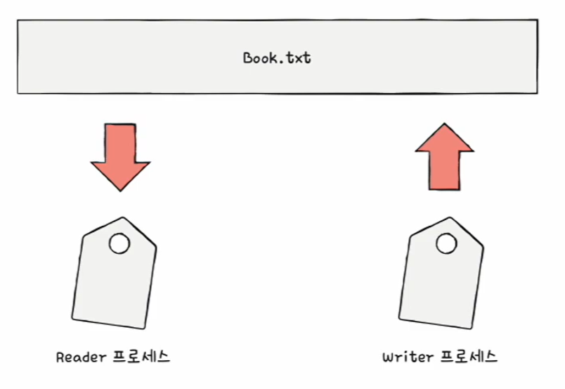
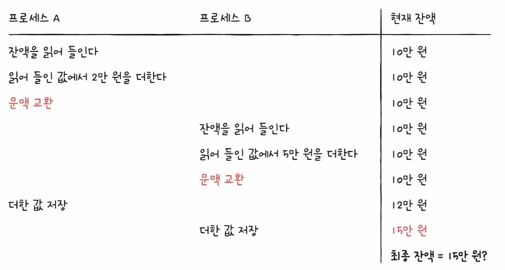
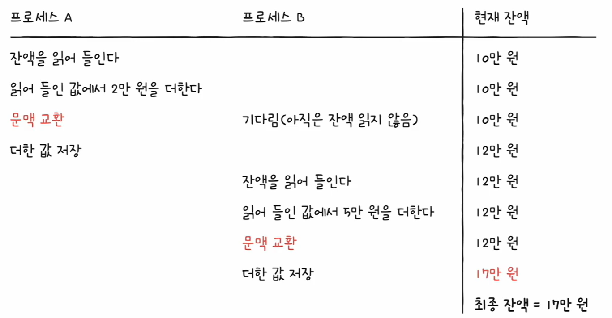
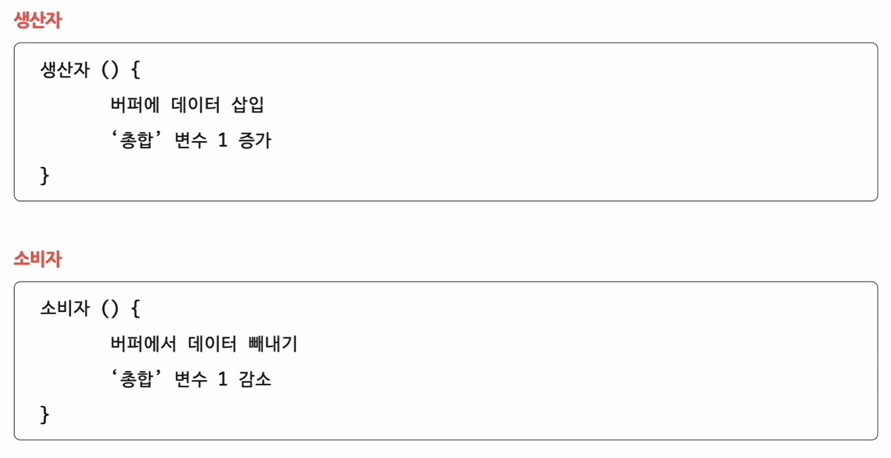
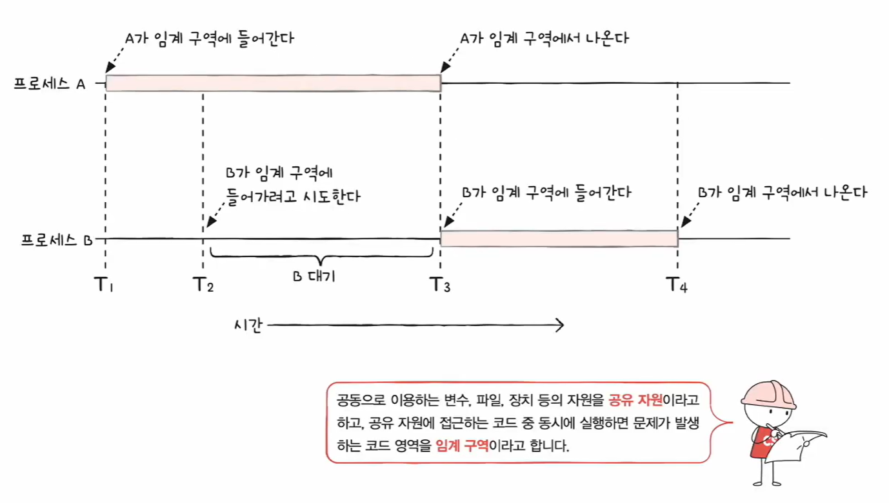
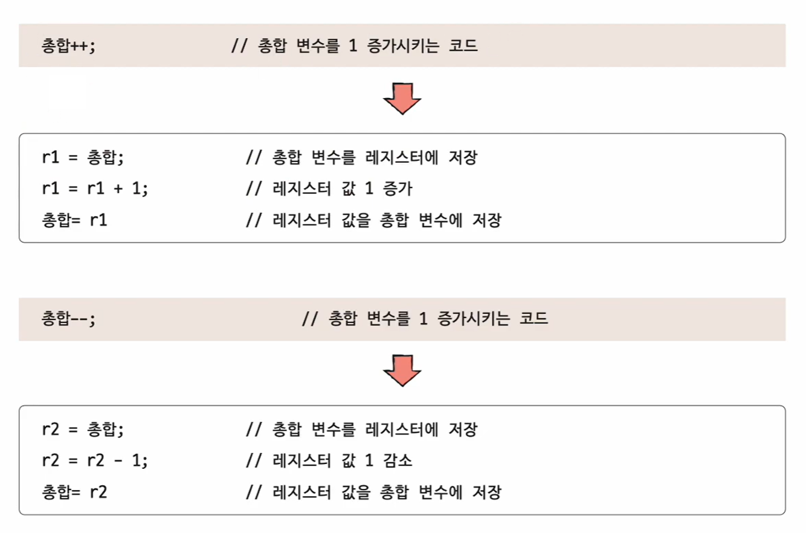
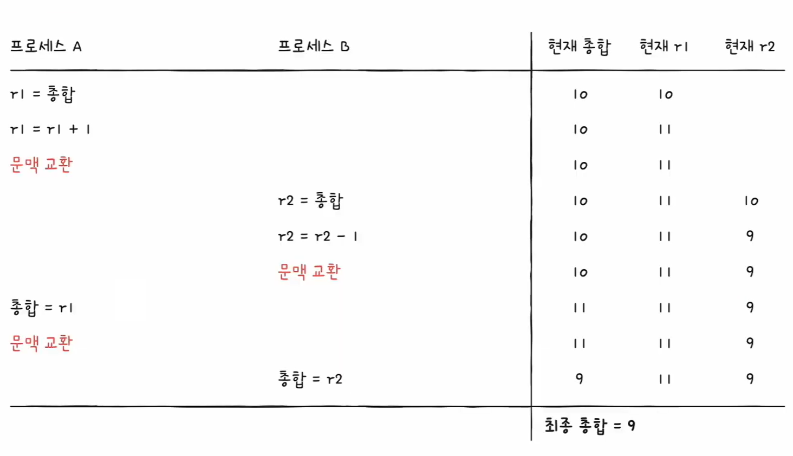

# 🧠 33강 프로세스 동기화란?

동시에 실행되는 **프로세스/스레드**는 서로 영향을 주고받습니다.  
이때 **공유 자원의 일관성(consistency)** 이 깨지지 않도록 **동기화(synchronization)** 가 필요합니다.

---

## 📚 목차

- [🧠 33강 프로세스 동기화란?](#-33강-프로세스-동기화란)
  - [📚 목차](#-목차)
  - [✅ 개요](#-개요)
  - [✅ 동기화의 의미](#-동기화의-의미)
    - [1) 실행 순서 제어 (Ordering)](#1-실행-순서-제어-ordering)
    - [2) 상호 배제 (Mutual Exclusion)](#2-상호-배제-mutual-exclusion)
  - [🔥 대표 예시](#-대표-예시)
  - [📌 Reader-Writer 문제 (실행 순서 제어)](#-reader-writer-문제-실행-순서-제어)
  - [📌 Bank Account 문제 (상호 배제)](#-bank-account-문제-상호-배제)
    - [✅ 문제 상황 (동기화 없음 → 꼬이면 틀린 결과)](#-문제-상황-동기화-없음--꼬이면-틀린-결과)
    - [✅ 우연히 맞는 경우도 있음 (하지만 보장되지 않음)](#-우연히-맞는-경우도-있음-하지만-보장되지-않음)
  - [📌 Producer-Consumer 문제 (상호 배제)](#-producer-consumer-문제-상호-배제)
  - [✅ 공유 자원과 임계 구역](#-공유-자원과-임계-구역)
    - [공유 자원 (Shared Resource)](#공유-자원-shared-resource)
    - [임계 구역 (Critical Section)](#임계-구역-critical-section)
  - [⚠️ Race Condition](#️-race-condition)
    - [✅ 왜 한 줄 코드가 위험할까?](#-왜-한-줄-코드가-위험할까)
    - [✅ 문맥 교환이 끼면 “덮어쓰기”가 발생](#-문맥-교환이-끼면-덮어쓰기가-발생)
  - [🧩 임계 구역 문제 해결 3원칙](#-임계-구역-문제-해결-3원칙)
  - [✨ 핵심 요약](#-핵심-요약)

---

## ✅ 개요

- 여러 프로세스(또는 스레드)가 **동시다발적으로 실행**되면 서로의 결과에 영향을 줄 수 있음  
- 이 과정에서 **공유 자원의 일관성**(예: 잔액, 총합, 파일 내용 등)을 보장해야 함  
- 이를 위해 **동기화**를 고려해야 함  
- 동기화 대상은 프로세스뿐 아니라 **실행 문맥(context)을 가진 모든 대상**, 즉 **스레드도 포함**

---

## ✅ 동기화의 의미

동기화란 단순히 “같이 실행한다”가 아니라,

> **프로세스/스레드가 올바르게 동작하도록 실행 시기와 접근을 조절하는 것**

동기화는 크게 두 가지 목적을 가짐:

### 1) 실행 순서 제어 (Ordering)

- 특정 조건이 만족되어야만 다음 작업이 실행되도록 **순서를 맞추는 동기화**
- 예) “Writer가 먼저 파일에 기록한 뒤 Reader가 읽어야 함”

✅ 아래 그림처럼, Reader는 `Book.txt`에 값이 “존재하는 상태”가 되어야 정상 동작합니다.  
즉 **Writer → Reader** 순서(조건)가 보장되어야 합니다.

---

### 2) 상호 배제 (Mutual Exclusion)

- 동시에 접근하면 문제가 생기는 자원에 대해  
  **한 번에 하나만 접근하도록 막는 동기화**
- 예) “잔액 변수”, “총합 변수”, “공유 버퍼” 등

---

## 🔥 대표 예시

## 📌 Reader-Writer 문제 (실행 순서 제어)

- **Writer**: `Book.txt` 파일에 값을 저장
- **Reader**: `Book.txt`에 저장된 값을 읽음

핵심:
- Reader는 `"Book.txt 안에 값이 존재한다"`라는 **조건이 만족될 때만 실행 가능**
- 둘이 동시에 실행되더라도 **Writer가 먼저 실행되어야** Reader가 안전함

---

## 📌 Bank Account 문제 (상호 배제)

공유 자원: **잔액(balance)**

- 초기 잔액: 10만원
- 프로세스 A: +2만원
- 프로세스 B: +5만원

### ✅ 문제 상황 (동기화 없음 → 꼬이면 틀린 결과)
문맥 교환 타이밍 때문에,
- A가 12만원을 만들었는데  
- B가 15만원으로 **덮어써서**
- 최종 잔액이 **15만원**이 되는 상황(원래 17만원이어야 함)

### ✅ 우연히 맞는 경우도 있음 (하지만 보장되지 않음)
A가 “저장”까지 끝낸 뒤 B가 읽으면 17만원이 되기도 합니다.  
하지만 이건 **운 좋게 스케줄이 그렇게 된 것**일 뿐, **항상 보장되지 않습니다.**

✅ 결론:  
`잔액`처럼 **공유 자원**에 접근하는 구간은  
**한 번에 하나만 접근하도록(상호 배제)** 보호해야 합니다.

---

## 📌 Producer-Consumer 문제 (상호 배제)

공유 자원: 전역 변수 **총합(sum)**

- Producer: 생산 후 `sum++`
- Consumer: 소비 후 `sum--`

아래는 Producer/Consumer가 각각 “버퍼 작업 + 총합 변경”을 수행하는 흐름입니다.

문제:
- Producer 100,000번, Consumer 100,000번 실행하면 합계가 0이 되어야 하지만
- 동기화가 없으면 0이 아닌 값이 나오거나 음수가 되는 등 **일관성이 깨질 수 있음**

---

## ✅ 공유 자원과 임계 구역

### 공유 자원 (Shared Resource)
여러 프로세스/스레드가 함께 사용하는 자원

- 전역 변수
- 파일
- 입출력 장치
- 보조기억장치
- 공유 메모리 등

### 임계 구역 (Critical Section)
공유 자원에 접근하는 코드 중,

> **동시에 실행되면 문제가 생길 수 있는 코드 영역**

✅ 아래 그림은 “A가 임계 구역에 들어간 동안 B가 들어가려다 대기”하는 모습을 보여줍니다.

---

## ⚠️ Race Condition

임계 구역을 보호하지 않으면,

- 실행 순서/타이밍에 따라 결과가 달라지는 상황이 발생함  
→ 이것을 **레이스 컨디션(race condition)** 이라고 합니다.

### ✅ 왜 한 줄 코드가 위험할까?
`sum++` 또는 `sum--` 같은 한 줄 코드는 보통 아래처럼 **여러 단계**로 쪼개집니다.

- 레지스터에 읽기(load)
- 레지스터에서 계산(add/sub)
- 메모리에 다시 쓰기(store)

### ✅ 문맥 교환이 끼면 “덮어쓰기”가 발생
아래 그림처럼 A와 B가 중간에 교차 실행되면,
최종 결과가 의도와 다르게 나올 수 있습니다.

---

## 🧩 임계 구역 문제 해결 3원칙

1. **상호 배제 (Mutual Exclusion)**  
   - 한 프로세스가 임계 구역에 들어가면 다른 프로세스는 들어올 수 없음

2. **진행 (Progress)**  
   - 임계 구역이 비어 있고, 진입하고자 하는 프로세스가 있다면 들어갈 수 있어야 함

3. **유한 대기 (Bounded Waiting)**  
   - 임계 구역에 들어가고 싶다면 언젠가는 반드시 들어갈 수 있어야 함 (무한 대기 금지)

---

## ✨ 핵심 요약

- 동기화 목적 2가지: **실행 순서 제어 / 상호 배제**
- 공유 자원에 접근하는 위험 구간이 **임계 구역**
- 임계 구역을 보호하지 않으면 **Race Condition** 발생
- 임계 구역 해결 원칙 3가지: **Mutual Exclusion / Progress / Bounded Waiting**
