# 🧠 34강 프로세스 동기화 기법

동기화(Synchronization)는 여러 프로세스/스레드가 동시에 실행될 때 **공유 자원(변수/메모리/파일/DB 등)** 을 안전하게 사용하도록 **접근을 제어**하는 기법입니다.  
대표 도구로 **뮤텍스 락, 세마포, 모니터**가 있습니다.

---

## 📚 목차
- [🧠 34강 프로세스 동기화 기법](#-34강-프로세스-동기화-기법)
  - [📚 목차](#-목차)
  - [✅ 임계 구역을 “아주 쉽게” 이해하기](#-임계-구역을-아주-쉽게-이해하기)
  - [🔥 임계 구역(Critical Section)이란?](#-임계-구역critical-section이란)
  - [🔒 뮤텍스 락(Mutex Lock)](#-뮤텍스-락mutex-lock)
    - [개념](#개념)
    - [단순 구현 코드 흐름](#단순-구현-코드-흐름)
      - [1) 임계 구역 앞/뒤로 acquire / release 호출](#1-임계-구역-앞뒤로-acquire--release-호출)
      - [2) acquire / release의 단순 형태(의미)](#2-acquire--release의-단순-형태의미)
    - [바쁜 대기(Busy Waiting)](#바쁜-대기busy-waiting)
    - [간단 코드 예시](#간단-코드-예시)
  - [🚦 세마포(Semaphore)](#-세마포semaphore)
    - [개념](#개념-1)
    - [단순 형태: wait / signal](#단순-형태-wait--signal)
      - [1) 임계 구역 전후로 wait / signal 사용](#1-임계-구역-전후로-wait--signal-사용)
      - [2) wait()의 단순 구현(바쁜 대기 버전)](#2-wait의-단순-구현바쁜-대기-버전)
      - [3) signal()의 단순 구현](#3-signal의-단순-구현)
    - [바쁜 대기(Busy Waiting)](#바쁜-대기busy-waiting-1)
    - [바쁜 대기 해결: 대기 큐(Blocking)](#바쁜-대기-해결-대기-큐blocking)
    - [실행 순서 동기화](#실행-순서-동기화)
    - [간단 코드 예시](#간단-코드-예시-1)
      - [1) 상호 배제(바이너리 세마포, S=1)](#1-상호-배제바이너리-세마포-s1)
      - [2) 실행 순서(P1 → P2)](#2-실행-순서p1--p2)
  - [🧱 모니터(Monitor)](#-모니터monitor)
    - [왜 모니터가 나왔나?](#왜-모니터가-나왔나)
    - [상호 배제(한 번에 하나)](#상호-배제한-번에-하나)
    - [조건 변수(Condition Variable)로 순서 제어](#조건-변수condition-variable로-순서-제어)
      - [wait(): 조건이 아직 안 됨 → 대기 큐로 이동](#wait-조건이-아직-안-됨--대기-큐로-이동)
      - [signal(): 조건 충족 → 대기 중인 스레드/프로세스 깨우기](#signal-조건-충족--대기-중인-스레드프로세스-깨우기)
    - [간단 코드 예시](#간단-코드-예시-2)
  - [🧾 한눈에 비교](#-한눈에-비교)

---

## ✅ 임계 구역을 “아주 쉽게” 이해하기

임계 구역(Critical Section)은 **“동시에 여러 명이 만지면 사고 나는 구간”** 입니다.

- 예를 들어 `sum = sum + 1` 같은 코드는 한 줄처럼 보이지만 실제로는  
  **읽기(read) → 더하기(add) → 쓰기(write)** 로 나뉘어 실행됩니다.
- 그래서 두 스레드가 동시에 들어오면,
  - 둘 다 같은 `sum` 값을 읽고,
  - 둘 다 1을 더한 다음,
  - 마지막에 누가 쓰느냐에 따라 **증가가 한 번만 반영되는 문제(레이스 컨디션)** 가 생깁니다.

👉 결론: **임계 구역은 “한 번에 한 명만” 들어오게 막아야 안전**합니다.

---

## 🔥 임계 구역(Critical Section)이란?

**임계 구역**은 “여러 실행 흐름이 동시에 들어오면 데이터가 꼬이거나 깨질 수 있는 코드 구간”입니다.

- 예) 공유 변수 증가(`sum++`), 같은 파일에 동시에 쓰기, 같은 잔액을 동시에 수정
- 그래서 임계 구역에는 **한 번에 한 프로세스/스레드만** 들어오도록 막아야 안전합니다.

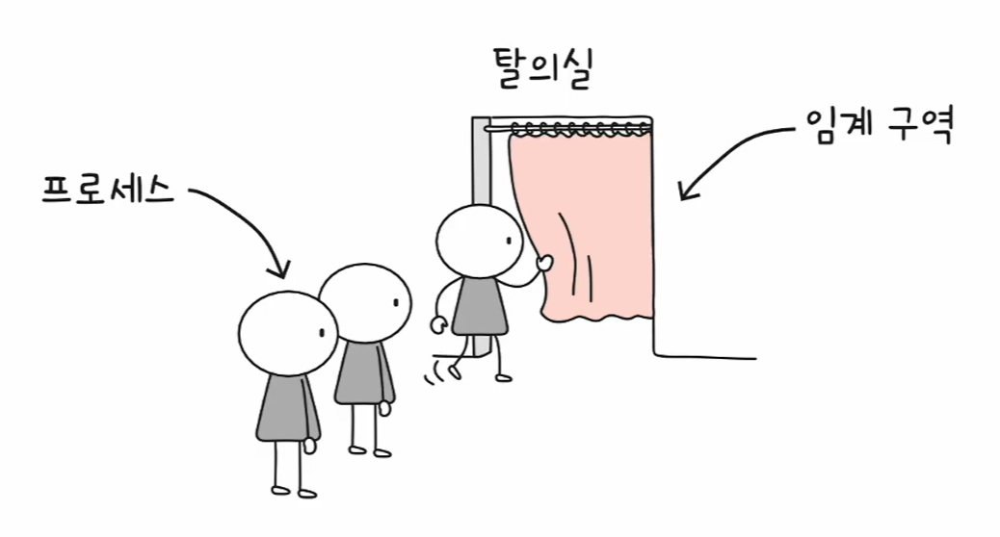

> 탈의실(공유 자원/임계 구역)에 한 명씩만 들어가야 안전한 것처럼,  
> 공유 데이터도 동시에 접근하면 문제가 생겨서 출입을 제어합니다.

---

## 🔒 뮤텍스 락(Mutex Lock)

### 개념
- **상호 배제(Mutual Exclusion)** 를 위한 대표 동기화 도구입니다.
- “임계 구역에 들어갈 수 있는 사람은 **무조건 1명**” 이라는 규칙을 강제합니다.
- 임계 구역에 들어가기 전 **lock을 획득(acquire)** 하고, 끝나면 **반납(release)** 합니다.

> ✅ 핵심 한 줄: **“자물쇠 1개를 열쇠로 빌려서 들어가고, 나올 때 반납한다.”**

### 단순 구현 코드 흐름

#### 1) 임계 구역 앞/뒤로 acquire / release 호출
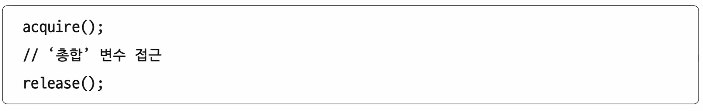

- `acquire()` : “자물쇠 잠금” 시도 (임계 구역 진입 전)
- 임계 구역 : 공유 데이터 접근 구간
- `release()` : “자물쇠 반환” (임계 구역 작업 후)

#### 2) acquire / release의 단순 형태(의미)
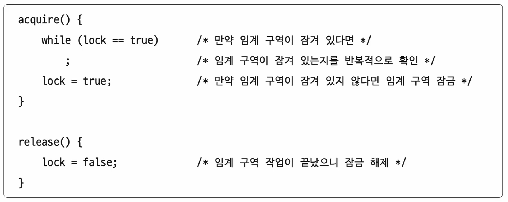  
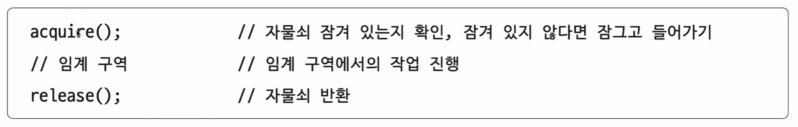

- `lock`이 **true면 잠김**, **false면 열림** 같은 방식으로 표현할 수 있습니다.

### 바쁜 대기(Busy Waiting)

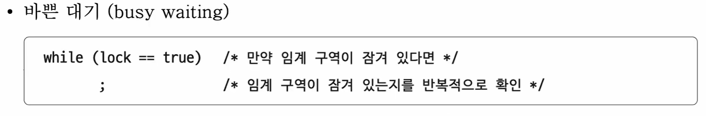

- `while(lock == true)`처럼 “잠금이 풀릴 때까지 계속 확인”하면
  - CPU를 쓰면서 계속 도는 **바쁜 대기**가 발생합니다.
- 실제 OS/라이브러리 구현은 보통 잠겨 있으면 **재우고(block)**, 풀리면 **깨우는 방식(wakeup)** 으로 개선합니다.

### 간단 코드 예시

```c
// 뮤텍스 사용 예(개념용)
mutex_lock(m);     // acquire
sum = sum + 1;     // ✅ 임계 구역: 공유 변수 접근
mutex_unlock(m);   // release
```

---

## 🚦 세마포(Semaphore)

### 개념
- 뮤텍스를 **일반화**한 도구입니다.
- “임계 구역에 동시에 들어갈 수 있는 개수”를 **정수 S**로 관리합니다.
  - `S = 1` : 뮤텍스처럼 동작(바이너리 세마포)
  - `S > 1` : 공유 자원이 여러 개일 때도 적용 가능(카운팅 세마포)

> ✅ 핵심 한 줄: **“입장권(S개)을 나눠주고, 입장하면 1장 쓰고, 나가면 1장 돌려준다.”**

  
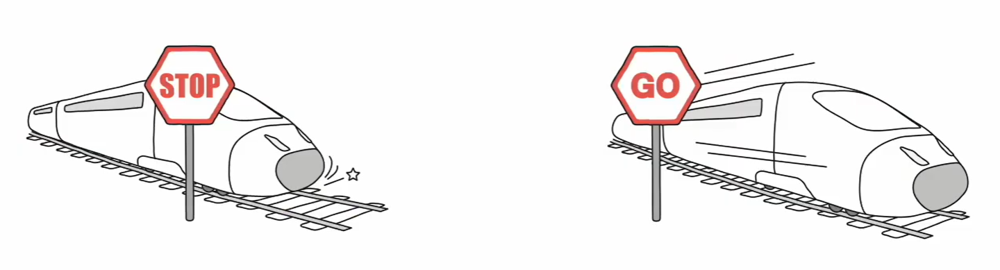

### 단순 형태: wait / signal

#### 1) 임계 구역 전후로 wait / signal 사용
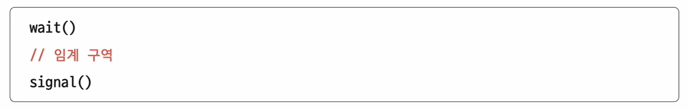

- `wait()` : 들어가도 되는지 확인(자원이 있으면 S 감소 후 진입)
- `signal()` : 임계 구역 사용 종료(자원을 반납하며 S 증가)

#### 2) wait()의 단순 구현(바쁜 대기 버전)
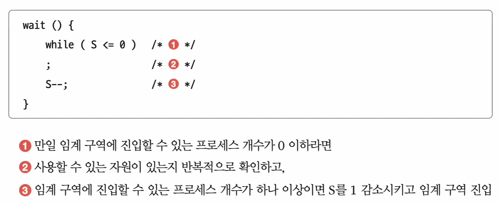

- (1) `S <= 0`이면 “자원이 없음”
- (2) 자원이 생길 때까지 반복 확인(= busy waiting)
- (3) 자원이 있으면 `S--` 하고 임계 구역 진입

#### 3) signal()의 단순 구현
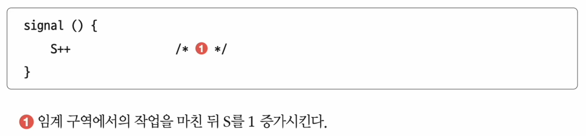

- 임계 구역 작업이 끝나면 `S++`로 자원을 반납합니다.

### 바쁜 대기(Busy Waiting)

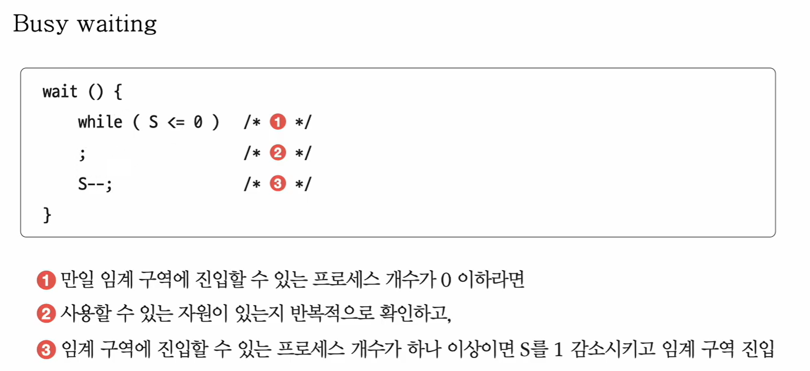

- 단순 구현은 `while(S <= 0)`처럼 **계속 확인**해서 CPU를 낭비합니다.
- 그래서 실전에서는 **대기 큐(Blocking)** 로 개선합니다.

### 바쁜 대기 해결: 대기 큐(Blocking)

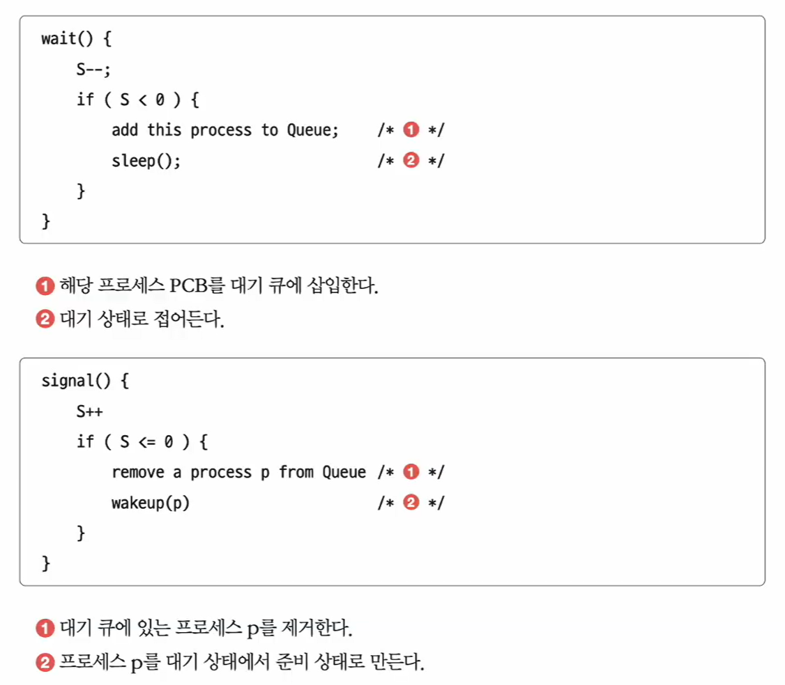

- 자원이 없으면 **PCB를 대기 큐에 넣고(sleep)** 프로세스를 **대기 상태**로 만듭니다.
- 자원이 생기면 대기 큐에서 하나를 꺼내 **깨워서(wakeup)** 준비 상태로 보냅니다.
- 즉, “계속 확인” 대신 **잠들게 했다가 깨우는 방식**이라 CPU를 낭비하지 않습니다.

### 실행 순서 동기화

세마포는 **상호 배제**뿐 아니라 **실행 순서**도 만들 수 있습니다.  
핵심은 **S를 0으로 두고**, “먼저 실행될 쪽은 signal”, “나중 실행될 쪽은 wait”를 배치하는 방식입니다.

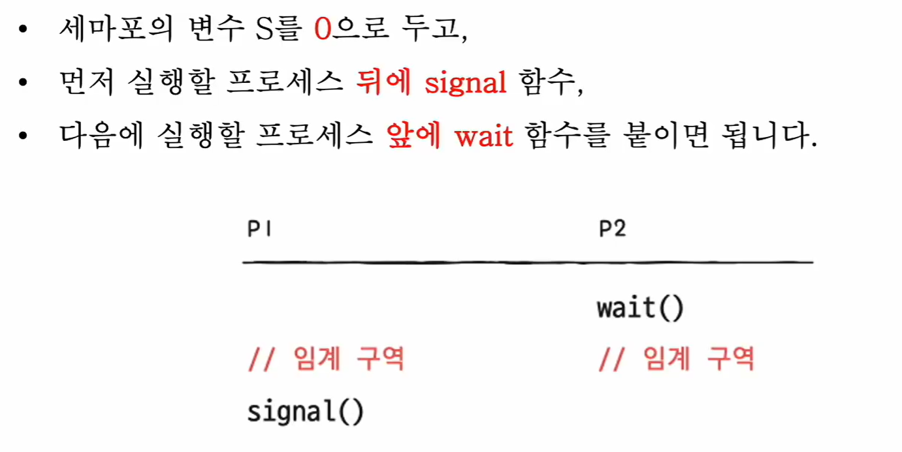

- 예) “P1이 끝나야 P2가 시작 가능”이면  
  - P1 끝에 `signal()`  
  - P2 시작에 `wait()`  
  → P2는 신호를 받기 전까지 자동으로 기다립니다.

또한 “자원 2개(S=2)” 같은 상황에서 여러 프로세스가 접근할 때,
자원이 부족하면 일부는 대기 큐로 이동하고, signal 시점에 깨어나는 흐름이 만들어집니다.

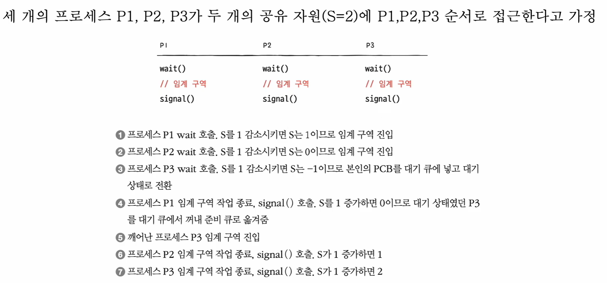

### 간단 코드 예시

#### 1) 상호 배제(바이너리 세마포, S=1)
```c
wait(S);           // S-- (없으면 대기)
sum = sum + 1;     // ✅ 임계 구역
signal(S);         // S++
```

#### 2) 실행 순서(P1 → P2)
```c
// S = 0 으로 시작

// P1
do_work();
signal(S);     // ✅ "이제 P2 실행해도 됨" 신호

// P2
wait(S);       // ✅ P1이 signal 해줄 때까지 대기
do_next_work();
```

---

## 🧱 모니터(Monitor)

### 왜 모니터가 나왔나?
뮤텍스/세마포는 개발자가 임계 구역 앞뒤로 `acquire/release`, `wait/signal`을 **직접** 정확히 붙여야 합니다.  
이때 **호출을 누락**하거나 **순서를 헷갈리면** 동기화 버그가 쉽게 발생합니다.

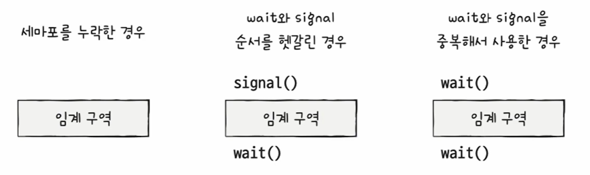

> ✅ 핵심 한 줄: **“동기화 코드를 개발자가 실수하지 않도록, 언어/런타임이 안전하게 감싸주는 방식”**

### 상호 배제(한 번에 하나)
모니터는 공유 자원 접근을 “모니터 내부 인터페이스(함수)”로만 하게 만들고,  
그 인터페이스에는 **동시에 한 명만** 들어오도록 보장합니다.

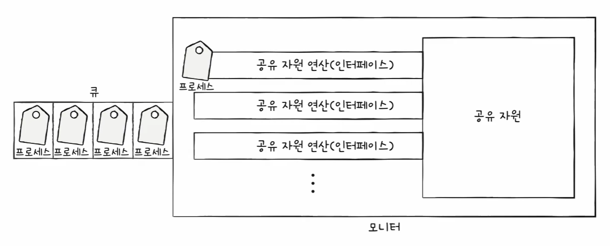

- 내부에 들어오는 순간 **자동으로 잠금**이 걸린다고 생각하면 이해가 쉽습니다.

### 조건 변수(Condition Variable)로 순서 제어
모니터는 “순서 제어”를 위해 **조건 변수(condition variable)** 를 제공합니다.

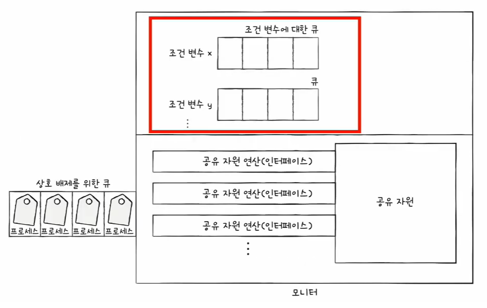

#### wait(): 조건이 아직 안 됨 → 대기 큐로 이동
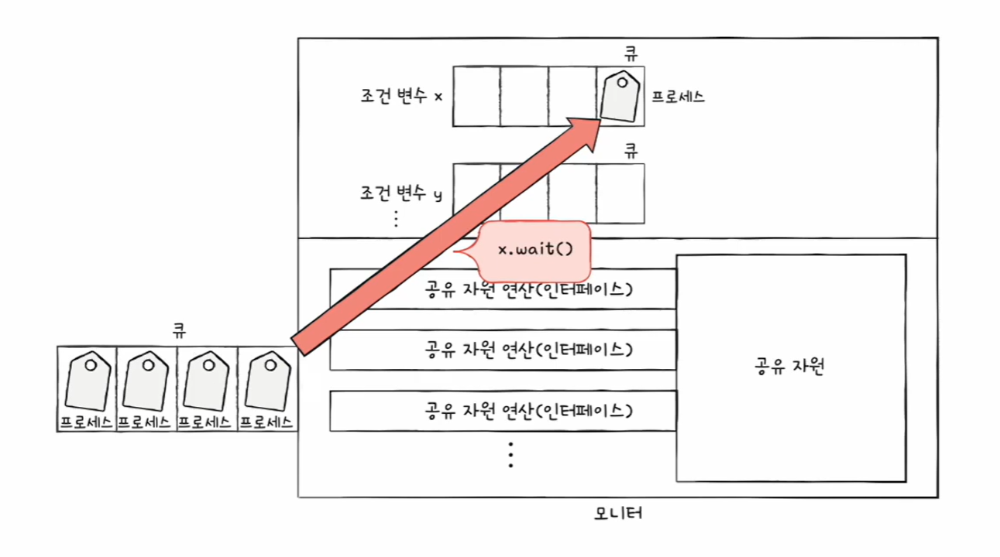

- `x.wait()` : 실행을 멈추고 “조건 변수 x의 큐”에서 기다립니다.

#### signal(): 조건 충족 → 대기 중인 스레드/프로세스 깨우기
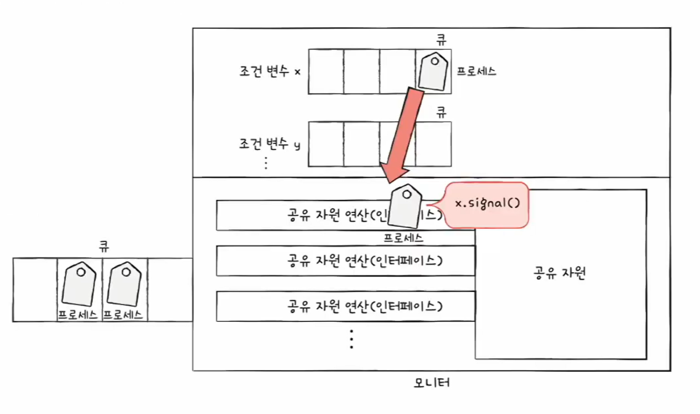

- `x.signal()` : x 큐에서 기다리던 대상에게 “이제 실행해도 돼”라고 알립니다.

### 간단 코드 예시

> Java 모니터(대표 예시): `synchronized` + `wait/notify`

```java
class Counter {
  private int sum = 0;

  public synchronized void inc() {
    sum++;               // ✅ 임계 구역 (자동 상호 배제)
  }
}
```

조건 변수를 쓰는 “대기/깨움” 예시는 아래처럼 생각하면 됩니다.

```java
class Box {
  private boolean ready = false;

  public synchronized void take() throws InterruptedException {
    while (!ready) wait();   // ✅ 조건이 될 때까지 대기
    // use resource
    ready = false;
  }

  public synchronized void put() {
    ready = true;
    notify();                // ✅ 기다리는 쪽 깨우기(signal 역할)
  }
}
```

---

## 🧾 한눈에 비교

| 구분 | 뮤텍스 락 | 세마포 | 모니터 |
|---|---|---|---|
| 핵심 목적 | 한 번에 1개만 진입 | “진입 가능 개수(S)”로 제어 | 상호 배제를 더 안전하게 제공 |
| 자원 개수 | 보통 1개 기준 | 1개도/여러 개도 가능 | 내부적으로 1개씩 처리 |
| busy waiting | 단순 구현 시 발생 가능 | 단순 구현 시 발생 가능 | 보통 조건 변수로 “대기/깨움” |
| 순서 제어 | 직접 구현해야 함 | 가능(S=0, wait/signal 배치) | 조건 변수(wait/signal)로 자연스럽게 |
| 대표 예 | mutex lock | wait/signal(S) | Java synchronized + wait/notify |

---
