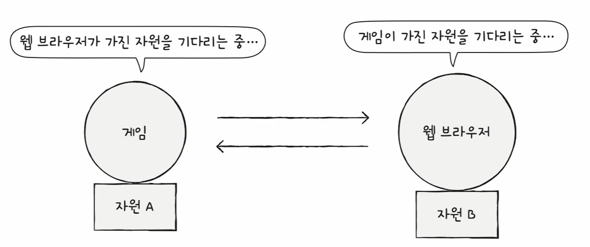
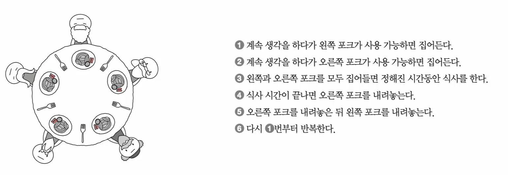
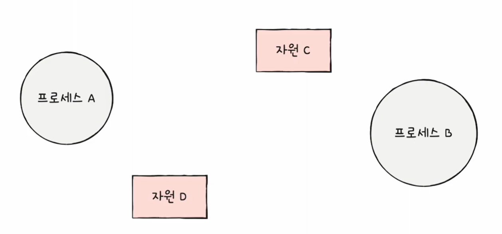
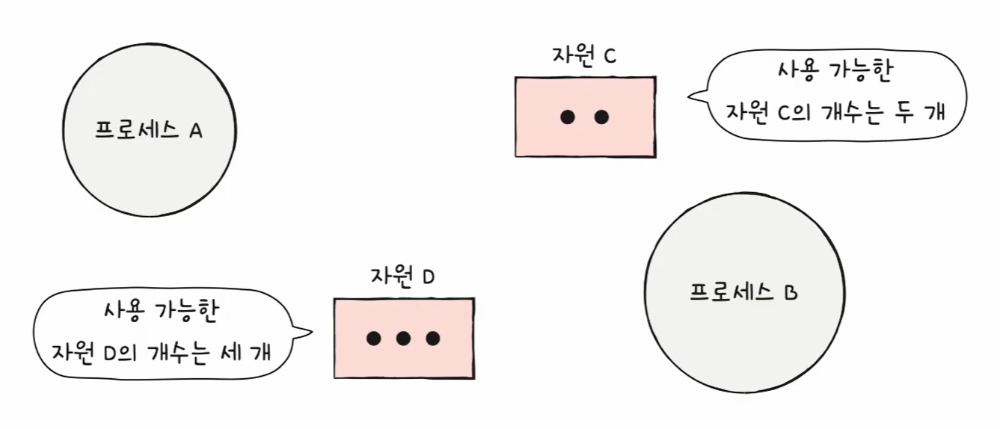
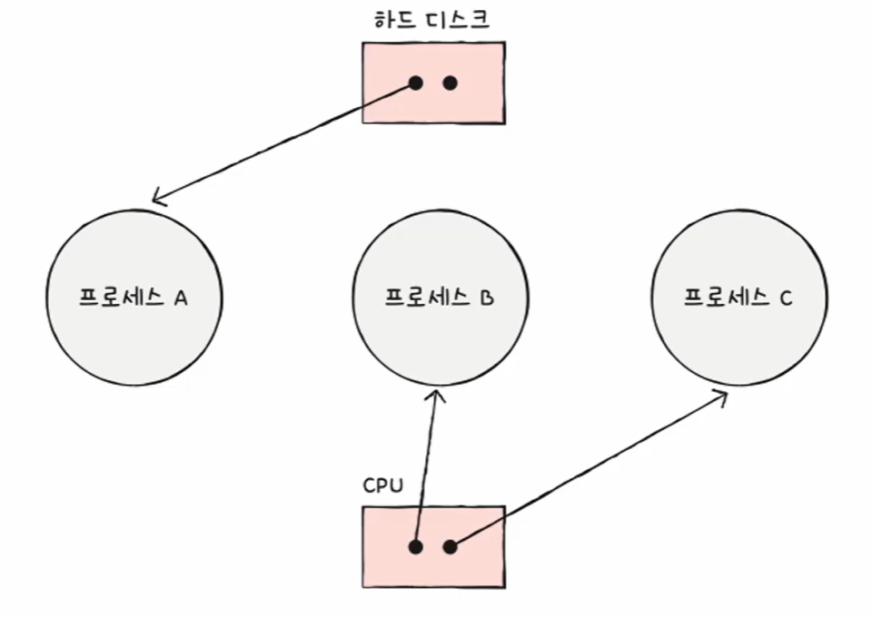
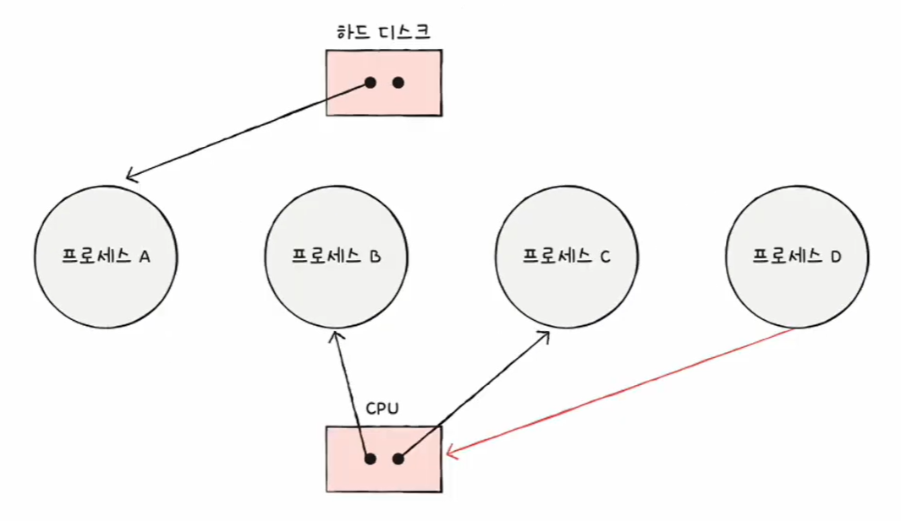
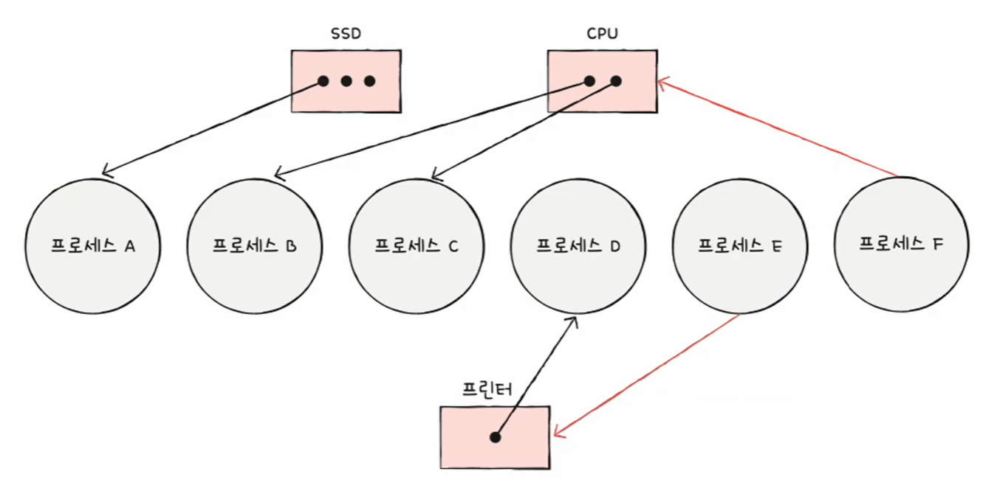
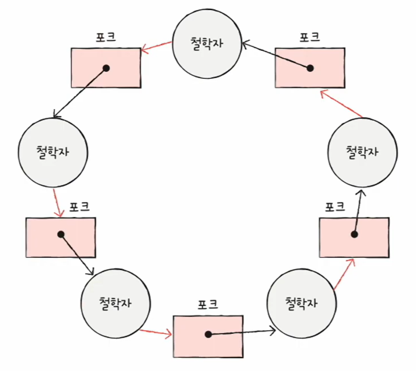
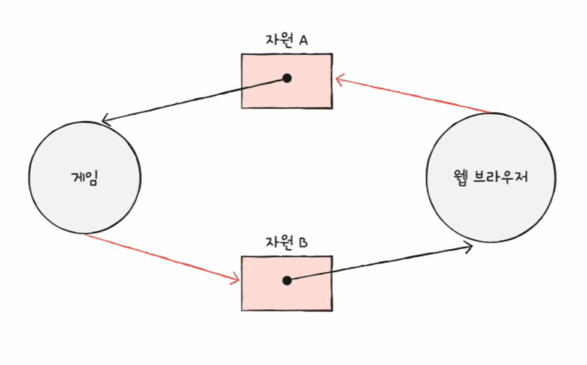

# 🧠 35강 교착 상태(Deadlock)란?

교착 상태(Deadlock)란 여러 프로세스/스레드가 **서로가 가진 자원(Resource)을 기다리며** 더 이상 진행하지 못하는 상태입니다.  
즉, “일어나지 않을 사건”을 **계속 기다리느라 실행이 멈춰버리는 현상**입니다.

> 위 그림처럼 **게임은 자원 A를 쥔 채 자원 B를 기다리고**,  
> **웹 브라우저는 자원 B를 쥔 채 자원 A를 기다리면**,  
> 서로가 서로를 기다리며 아무도 진행하지 못합니다.

---

## 📚 목차
- [교착 상태란?](#-교착-상태란)
- [식사하는 철학자 문제로 이해하기](#-식사하는-철학자-문제로-이해하기)
- [교착 상태를 표현하는 방법: 자원 할당 그래프](#-교착-상태를-표현하는-방법-자원-할당-그래프)
- [교착 상태 발생 조건 4가지](#-교착-상태-발생-조건-4가지)
- [핵심 정리](#-핵심-정리)

---

## ✅ 교착 상태란?

- 여러 프로세스/스레드가 실행에 필요한 자원을 **각자 일부 점유**한 채,
- 다른 자원을 **추가로 얻기 위해 대기**하다가,
- 결국 **서로가 서로를 기다리는 구조**가 되어 아무도 진행하지 못하는 상태

➡️ 결과적으로 **그 어떤 프로세스/스레드도 끝까지 실행되지 못하고 멈춰** 있게 됩니다.

---

## 🍽 식사하는 철학자 문제로 이해하기

식사하는 철학자 문제는 교착 상태를 가장 직관적으로 설명하는 대표 예시입니다.

- **철학자(Philosopher)**: 프로세스/스레드
- **포크(Fork)**: 실행에 필요한 자원(Resource)
- **식사(Eat)**: 자원을 사용하여 작업을 수행(실행)

### 왜 문제가 생길까?
모든 철학자가 동시에 다음 순서대로만 행동한다고 가정하면(그림의 1~6):

1. 계속 생각하다가 **왼쪽 포크가 가능하면 집는다**
2. 계속 생각하다가 **오른쪽 포크가 가능하면 집는다**
3. 왼쪽/오른쪽 포크를 모두 집으면 **정해진 시간 동안 식사**
4. 식사 후 **오른쪽 포크를 내려놓는다**
5. 그 다음 **왼쪽 포크를 내려놓는다**
6. 다시 1번부터 반복

그런데 **모든 철학자가 동시에 왼쪽 포크를 먼저 들어버리면**,  
각자 오른쪽 포크가 필요하지만 오른쪽 포크는 **옆 사람이 이미 들고 있음** → 전원 대기

➡️ 결국 **누구도 포크를 내려놓지 못하고, 누구도 식사를 못하는 상태(교착 상태)** 가 됩니다.

---

## 📈 교착 상태를 표현하는 방법: 자원 할당 그래프

교착 상태를 정확히 표현하기 위해 **자원 할당 그래프(Resource Allocation Graph)** 를 사용합니다.

### 표현 규칙
- **프로세스(Process)**: 원(○)
- **자원(Resource type)**: 사각형(□)
- **자원 개수(인스턴스 수)**: 사각형 안의 점(•)
- **할당(사용 중)**: 자원(□) → 프로세스(○)
- **요청(대기 중)**: 프로세스(○) → 자원(□)

> 아래 예시 이미지에서는  
> **검은 화살표 = 할당(자원 → 프로세스)**, **빨간 화살표 = 요청(프로세스 → 자원)** 으로 표현되어 있습니다.

---

### 1) 기본 구성: 프로세스와 자원 배치

- 프로세스 A/B(원), 자원 C/D(사각형)처럼 **등장 요소**를 배치합니다.

---

### 2) 자원 인스턴스(개수) 표현

- 자원 C는 점이 2개 → **동시에 2개까지 사용 가능**
- 자원 D는 점이 3개 → **동시에 3개까지 사용 가능**

---

### 3) “할당(사용 중)” 상태 예시

- 예: **하드 디스크(자원)** 가 프로세스 A에 할당됨(자원 → 프로세스)
- CPU(자원)가 프로세스 B, C에 할당됨(자원 → 프로세스)

➡️ 지금은 “각 프로세스가 자원을 사용 중”인 상태를 나타냅니다.

---

### 4) “요청(대기)”이 추가되면 문제가 시작될 수 있음

- 프로세스 D가 CPU를 **추가로 요청(대기)** 하는 화살표가 등장합니다.
- 이미 CPU는 다른 프로세스들이 점유 중이라면, D는 **기다리는 상태**가 됩니다.

---

### 5) 요청이 꼬이면서 원형 대기(cycle)로 이어질 수 있음

- 여러 프로세스가 각자 자원을 점유한 채, 다른 자원을 요청하면
- “대기 관계”가 연결되며 **원형 대기(cycle)** 구조가 만들어질 수 있습니다.

---

### 교착 상태 그래프의 핵심 특징

- 자원 할당 그래프가 **원(cycle)** 형태를 띌 수 있음
- **cycle이 있다고 무조건 교착 상태는 아님**
- 하지만 **교착 상태가 실제로 발생했다면**, 그래프에는 **원형 대기(cycle)** 가 존재합니다.

아래는 “원형 대기”가 어떤 모습인지 직관적으로 보여주는 예시입니다.

#### 예시 A) 식사하는 철학자에서의 원형 대기

- 각 철학자가 포크 하나는 **점유(검은 화살표)** 하고,
- 다른 포크 하나는 **요청(빨간 화살표)** 하면서
- 대기 관계가 원형으로 이어져 **누구도 진행하지 못하는** 상황을 만들 수 있습니다.

#### 예시 B) 게임/웹 브라우저의 교착 상태

- 게임은 자원 A를 **점유**한 채 자원 B를 **요청**
- 웹 브라우저는 자원 B를 **점유**한 채 자원 A를 **요청**
- 서로가 서로의 자원 반납을 기다리면서 **교착 상태**가 됩니다.

---

## 🔒 교착 상태 발생 조건 4가지

교착 상태는 아래 4가지 조건이 **모두 만족**될 때 발생할 수 있습니다.

### 1) 상호 배제 (Mutual Exclusion)
- 한 프로세스가 사용하는 자원을 **다른 프로세스가 동시에 사용할 수 없는** 상태  
  (예: 프린터, 파일 락, 뮤텍스 락)

### 2) 점유와 대기 (Hold and Wait)
- 어떤 자원을 **이미 점유한 상태**에서  
- **다른 자원을 추가로 요청하며 기다리는** 상태

### 3) 비선점 (No Preemption)
- 자원을 사용 중인 프로세스로부터  
- 다른 프로세스가 **강제로 자원을 빼앗을 수 없는** 상태  
  (자원은 **자발적으로 반납**되어야 함)

### 4) 원형 대기 (Circular Wait)
- 프로세스들이 원 형태로 자원을 대기하는 상태  
  (A는 B의 자원을, B는 C의 자원을, C는 A의 자원을 기다림)

> ✅ **4가지 중 하나라도 만족하지 않으면 교착 상태는 발생하지 않습니다.**  
> ⚠️ **4가지가 모두 만족하면 교착 상태가 발생할 수 있습니다.**

---

## 🧩 핵심 정리

- 교착 상태는 **서로가 가진 자원을 서로가 기다리며 멈추는 상태**
- 식사하는 철학자 문제는 교착 상태의 대표 예시
- 자원 할당 그래프는 “누가 무엇을 점유/대기 중인지”를 시각화하는 도구
- 교착 상태는 **상호 배제 / 점유와 대기 / 비선점 / 원형 대기**  
  **4조건이 모두 충족될 때 발생 가능**
