# 🧠 36강 교착 상태 해결 방법

교착 상태(Deadlock)는 여러 프로세스/스레드가 **서로가 가진 자원을 기다리느라 영원히 멈춰버리는 상태**입니다.  
운영체제(OS)는 이런 상황을 막거나(예방/회피), 터지면 처리하거나(검출/회복), 아예 무시하는 선택을 합니다.

---

## 📚 목차
- [1) 교착 상태 예방(Prevention)](#1-교착-상태-예방prevention)
  - [발생 조건 4가지](#발생-조건-4가지)
  - [조건을 깨는 방법](#조건을-깨는-방법)
- [2) 교착 상태 회피(Avoidance)](#2-교착-상태-회피avoidance)
  - [핵심 개념(안전 순서열/안전 상태)](#핵심-개념안전-순서열안전-상태)
  - [안전성 검사(Safety Algorithm) Step 1~14 (그림 + 쉬운 설명)](#안전성-검사safety-algorithm-step-114-그림--쉬운-설명)
  - [은행원 알고리즘(Banker’s Algorithm)과의 관계](#은행원-알고리즘bankers-algorithm과의-관계)
- [3) 교착 상태 검출 후 회복(Detection & Recovery)](#3-교착-상태-검출-후-회복detection--recovery)
- [4) 교착 상태 무시(Ignore)](#4-교착-상태-무시ignore)
- [✅ 한눈에 비교 요약](#-한눈에-비교-요약)

---

## 1) 교착 상태 예방(Prevention)

**애초에 교착 상태가 발생하지 않도록** 만드는 방식입니다.  
핵심은 교착 상태 발생 조건 4가지 중 **하나라도 제거(깨기)** 입니다.

### 발생 조건 4가지
- **상호 배제(Mutual Exclusion)**: 한 번에 한 프로세스만 자원을 사용할 수 있음  
  (예: 프린터 1대는 동시에 2명이 못 씀)
- **점유와 대기(Hold & Wait)**: 자원을 이미 쥔 채로 다른 자원을 더 기다림  
  (예: A가 프린터를 잡고 스캐너를 기다림)
- **비선점(No Preemption)**: 이미 준 자원을 강제로 빼앗을 수 없음  
  (예: 프린터 쓰는 사람에게 “그만 쓰고 내놔”를 못 함)
- **원형 대기(Circular Wait)**: 서로가 서로의 자원을 기다리며 원을 이룸  
  (A는 B의 자원, B는 C의 자원, C는 A의 자원 대기)

### 조건을 깨는 방법

#### ✅ (1) 상호 배제를 없애면?
- 모든 자원을 **공유 가능**하게 만들기
- 이론적으로 가능하나 현실적으로는 어려움 (프린터/파일 락 등)

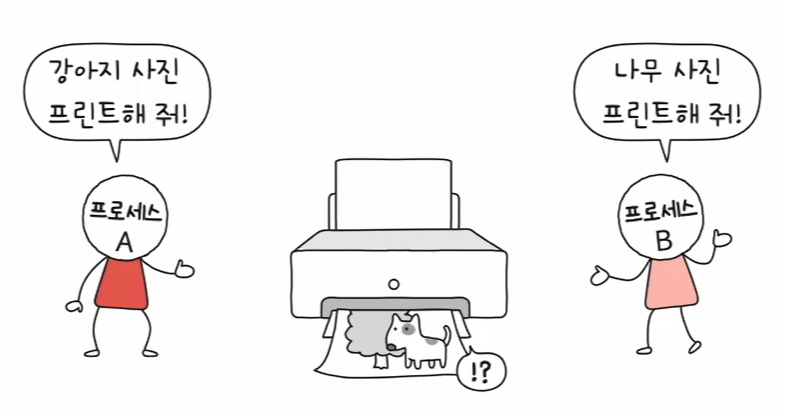

#### ✅ (2) 점유와 대기를 없애면?
- 프로세스에 자원을 **몽땅 주거나 / 아예 안 주는 방식**
- 부작용:
  - 자원 활용률이 크게 떨어질 수 있음 (미리 잡아두는 비효율)

#### ✅ (3) 비선점 조건을 없애면?
- 선점 가능한 자원(e.g. CPU)에 한해 효과적
- 모든 자원이 선점 가능한 것은 아니므로 범용적이지 않음

#### ✅ (4) 원형 대기 조건을 없애면?
- 모든 자원에 **번호를 부여**하고, **오름차순으로만 요청/할당**
- 원형 대기가 구조적으로 불가능해짐

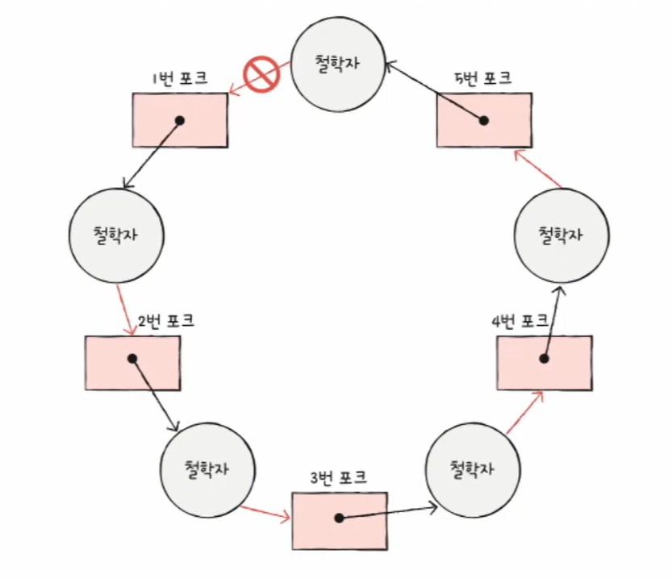
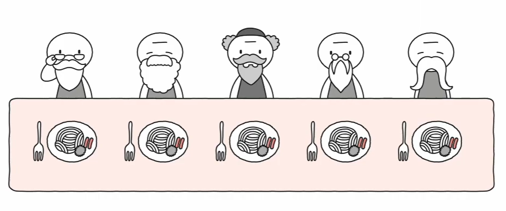

📌 정리  
예방은 **교착 상태 미발생을 보장**할 수 있으나, 현실에서는 **효율 저하/제약** 같은 부작용이 따릅니다.

---

## 2) 교착 상태 회피(Avoidance)

교착 상태를 “무분별한 자원 할당 때문에 생기는 문제”로 보고,  
**교착이 발생하지 않을 만큼만 조심해서 할당**하는 방식입니다.

### 핵심 개념(안전 순서열/안전 상태)
- **안전 순서열(Safe Sequence)**: “이 순서대로 처리하면 모두 무사히 끝난다”라는 프로세스 처리 순서
- **안전 상태(Safe State)**: 안전 순서열이 **존재하는 상태** (교착 없이 끝낼 수 있음)
- **불안전 상태(Unsafe State)**: 안전 순서열이 **없는 상태** (교착이 생길 수도 있음)

> 비개발자용 한 줄 비유  
> - **안전 상태**: “순서를 잘 잡으면 모두가 일을 마치고 자원을 돌려줄 수 있는 상황”  
> - **불안전 상태**: “누구부터 도와줘야 할지 답이 없어서, 잘못하면 다 같이 멈출 수 있는 상황”

---

## 교착 상태 회피 Step 1~14

> 운영체제가 확인하는 핵심 질문은 이것입니다.  
> ✅ “현재(또는 가상 할당 후) 상태에서 **안전 순서열이 존재하는가?**”  
>
> - **안전 순서열이 존재**하면 → 안전 상태(Safe State)  
> - **안전 순서열이 없으면** → 불안전 상태(Unsafe State, 교착 가능성)

---

### Step 1) 시스템에 자원이 총 몇 개인지 확인한다
- 그림처럼, 시스템에는 **자원(리소스)**이 여러 개 존재하고
- 프로세스들은 “자원 쓰고 싶어요”라고 요청합니다.
- 이 강의 예시에서는 **총 자원 = 12개**라고 가정합니다.

---

### Step 2) 현재 어떤 프로세스가 자원을 얼마나 쓰는지 본다(현재 사용량)
- P1은 5개, P2는 2개, P3는 2개를 이미 사용 중입니다.
- 즉, 현재 사용 중 총합은 **5 + 2 + 2 = 9개**입니다.

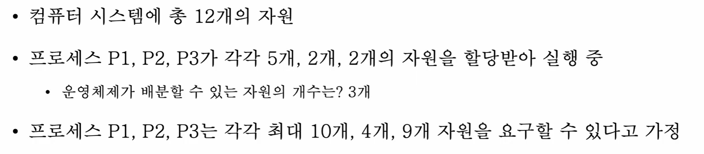

---

### Step 3) 지금 운영체제가 더 나눠줄 수 있는 “남은 자원(Available)”을 계산한다
- 전체 12개 중 9개가 이미 할당됨 → 남은 자원은 **12 - 9 = 3개**
- 이 “남은 자원”이 바로 **Available(가용 자원)** 입니다.

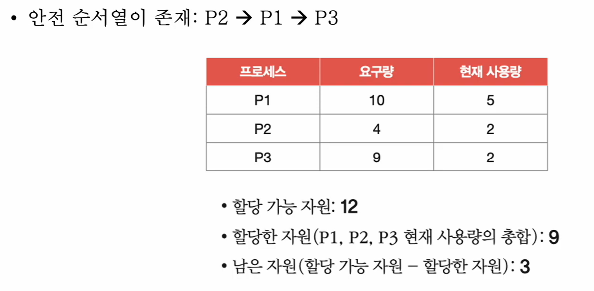

---

### Step 4) 각 프로세스가 최대로 필요로 할 수 있는 양(Max)을 정한다
- 예시에서는 다음처럼 가정합니다.
  - P1은 최대 10개
  - P2는 최대 4개
  - P3는 최대 9개

> 왜 Max가 필요할까?  
> 안전성 검사는 “앞으로 최대로 더 요청할 수 있는 양”을 기준으로  
> **끝까지 모두 완료 가능 여부**를 점검하기 때문입니다.

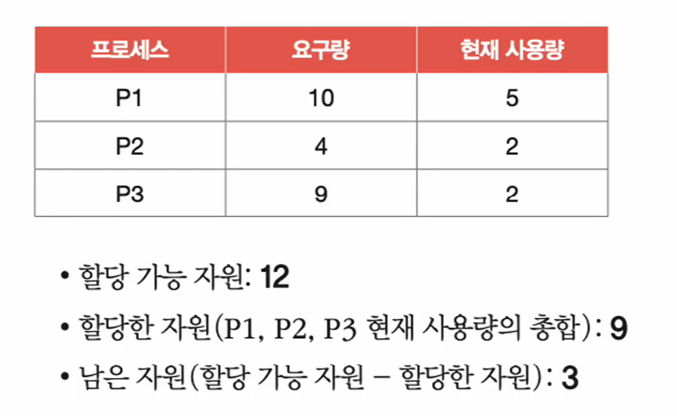

---

### Step 5) (현재) 안전 순서열이 있는지 확인한다
- 안전 순서열이란: “이 순서대로 자원을 배분하면 **모두 끝내고 반환**할 수 있는 순서”입니다.
- 예시에서는 안전 순서열이 **P2 → P1 → P3**로 존재합니다.

> 비개발자 포인트  
> “자원을 빨리 돌려줄 사람부터 먼저 끝내는 순서”가 보이면 안전합니다.

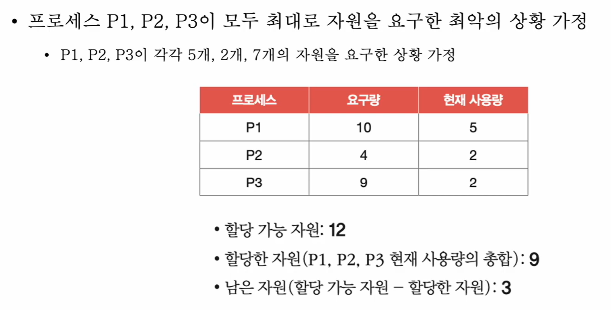

---

### Step 6) 최악 상황도 가정해본다(모두가 최대치에 가깝게 요청하면?)
- 운영체제는 “다들 갑자기 더 달라고 하면 어떡하지?”도 봅니다.
- 즉, **최악의 요청**에서도 안전 순서열이 유지되는지 점검합니다.

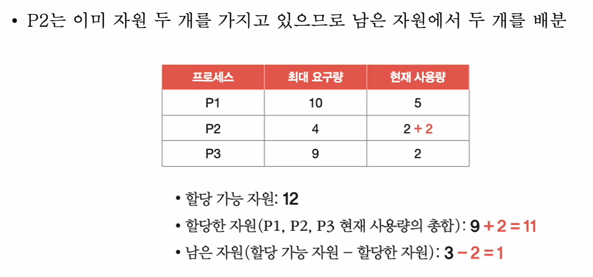

---

## ✅ 이제 안전 순서열(P2 → P1 → P3)을 실제로 따라가며 “가능함”을 증명하기

> 안전성 검사의 핵심은,  
> “현재 Available로 **어떤 프로세스 하나라도 완료 가능**하게 만들 수 있나?”를 찾고,  
> 완료되면 **자원 반환으로 Available이 늘어난다**는 점을 반복 확인하는 것입니다.

---

### Step 7) P2는 “2개만 더” 받으면 바로 끝낼 수 있다
- P2의 Max는 4개, 현재 2개 사용 중 → **2개만 더 받으면 완료**
- 남은 자원 Available=3이므로, P2에게 2개를 주는 것이 가능합니다.

> 핵심: **완료 가능한 프로세스를 먼저 완료시키면 자원이 돌아온다(반환).**

---

### Step 8) P2가 완료하면 자원을 반환한다 → Available이 늘어난다
- P2는 완료 후 자신이 사용한 자원을 반환합니다.
- 반환이 발생하면, 시스템의 여유 자원(Available)이 증가합니다.

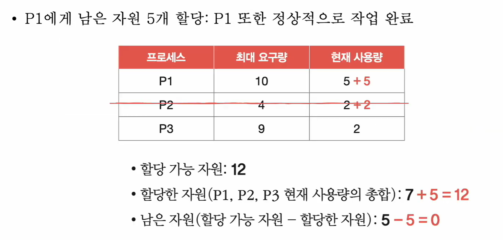

---

### Step 9) 이제 P1에게 필요한 자원을 줘서 P1도 완료시킬 수 있다
- P1의 Max는 10개, 현재 5개 사용 중 → **5개 더 필요**
- P2가 반환한 덕분에 P1을 완료시키는 방향으로 갈 수 있습니다.

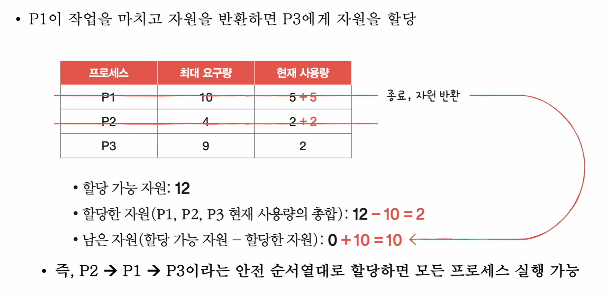

---

### Step 10) P1이 끝나면 더 큰 규모로 자원이 반환된다 → 이제 P3도 처리 가능
- P1은 많은 자원을 쓰던 프로세스라, 완료 후 반환량이 큽니다.
- 그 결과, 마지막 P3까지도 충분히 처리할 수 있는 여유가 생깁니다.

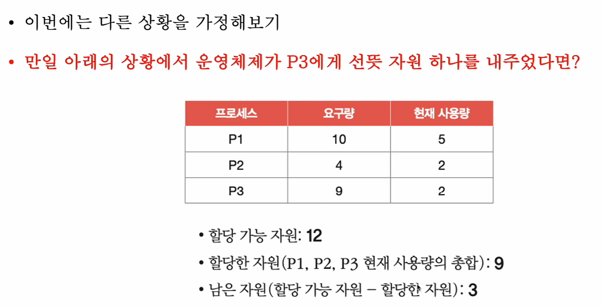

✅ 여기까지가 “안전 순서열이 존재한다”는 증명 흐름입니다.  
즉, 이 상태는 **안전 상태(Safe State)** 입니다.

---

## ⚠️ 이번엔 “잘못” 할당하면 어떻게 위험해지는지 보기(불안전 상태 예시)

### Step 11) 다른 선택: 운영체제가 P3에게 자원 1개를 먼저 줘버리면?
- 같은 시작 상황에서,
- “그냥 P3에게 먼저 조금 줘볼까?” 하고 1개를 줬다고 가정합니다.

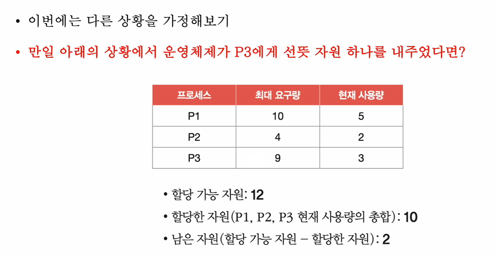

---

### Step 12) P3에 1개를 주는 순간, Available이 감소한다
- P3 사용량이 증가하면서,
- 운영체제가 당장 배분할 수 있는 여유 자원(Available)은 줄어듭니다.

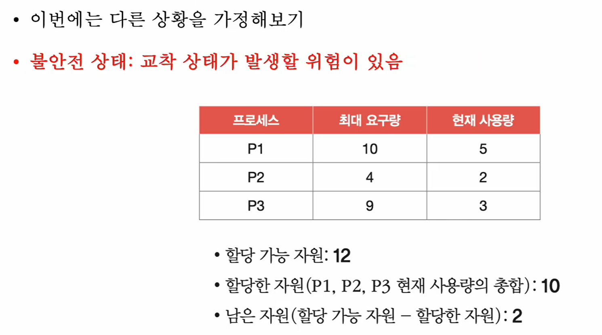

---

### Step 13) 이 상태는 “불안전 상태”가 될 수 있다(교착 위험 존재)
- 지금 당장 교착이 확정은 아니지만,
- “안전 순서열이 보장되지 않는 구간”으로 들어갈 수 있습니다.

> 불안전 상태 = “바로 멈춘다”가 아니라  
> “앞으로 교착이 날 수 있는 위험 구간”입니다.

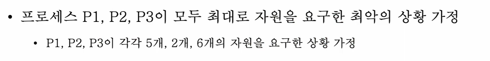

---

### Step 14) 최악 상황(모두 최대치 요청)을 다시 가정하면 위험이 더 커진다
- 이 상태에서 P1, P2, P3가 모두 더 요구하면
- 남은 자원으로는 누구도 완주를 못 시키는 상황이 될 수 있습니다.
- 즉, **자원이 반환되지 않아 서로 기다리는 교착 위험**이 커집니다.

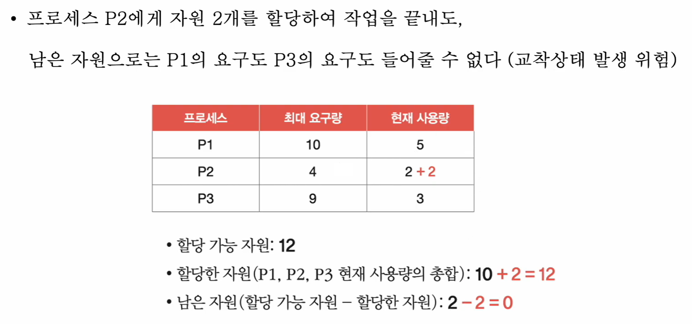

---

### “P2를 끝내도 P1/P3를 못 끝내는” 교착 위험 예시
- P2는 2개를 더 주면 끝내고 반환할 수 있어도,
- 그 이후 남은 자원으로는 P1이나 P3의 요구를 충족 못 하면,
- 결과적으로 교착 위험이 커집니다.

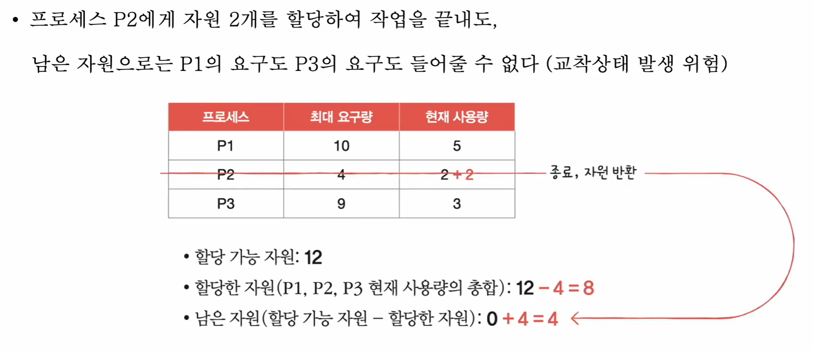

---

## 은행원 알고리즘(Banker’s Algorithm)과의 관계

> ✅ 결론: **은행원 알고리즘은 ‘안전성 검사(Safety Algorithm)’를 활용하는 “요청 승인 전략”**입니다.

- **안전성 검사(Safety Algorithm)**  
  - 현재(또는 가상 할당 후) 상태에서 **안전 순서열이 존재하는지 검사**하는 절차  
  - 이 README의 Step 1~14는 바로 이 “안전성 검사 예시”를 단계화한 것

- **은행원 알고리즘(Banker’s Algorithm)**  
  - 어떤 프로세스가 자원을 “추가로 요청”하면,
    1) 요청을 **가상으로 반영해본 뒤(pretend allocate)**  
    2) **안전성 검사**로 안전 순서열 존재 여부를 확인하고  
    3) 안전하면 승인 / 아니면 거절(보류)  
  - 즉, 은행원 알고리즘은 **안전성 검사를 포함하는 더 큰 절차**입니다.

---

## 3) 교착 상태 검출 후 회복(Detection & Recovery)

교착 상태의 발생을 인정하고, **사후 조치**하는 방식입니다.

- 프로세스가 자원을 요구하면 **일단 할당**
- 이후 교착 상태가 **검출되면 회복(Recovery)**

### ✅ 선점을 통한 회복
- 교착 상태가 해결될 때까지 **한 프로세스씩 자원을 몰아주는 방식**
- (선점 가능한 자원일수록 적용이 쉬움)

### ✅ 프로세스 강제 종료를 통한 회복
- 교착 상태 프로세스를 모두 종료 (빠르지만 작업 손실 위험)
- 교착이 풀릴 때까지 하나씩 종료 (손실 감소 가능하지만 오버헤드 증가)

---

## 4) 교착 상태 무시(Ignore)

교착 상태가 **매우 드물게 발생**한다면,  
잠재적 문제를 그냥 무시하자는 방식입니다.

### 🦩 타조 알고리즘(Ostrich Algorithm)
- “드문 문제를 막기 위해 항상 비용을 치르는 게 더 손해 아닌가?”
- 문제가 생겨도 대처하지 않고 모른 척하는 전략(유머적 비유)

---

## ✅ 한눈에 비교 요약

| 접근 | 핵심 아이디어 | 장점 | 단점 |
|---|---|---|---|
| 예방(Prevention) | 발생 조건 중 하나 제거 | 교착 미발생 보장 가능 | 효율 저하/현실적 제약 |
| 회피(Avoidance) | 안전 상태만 유지하며 할당 | 비교적 현실적 | 검사 비용/복잡도 증가 |
| 검출 후 회복(Detection & Recovery) | 일단 할당 후 교착이면 해결 | 운영 단순 | 손실/오버헤드 위험 |
| 무시(Ignore) | 드물면 그냥 무시 | 비용 최소 | 발생 시 큰 장애 |

---

### ✅ 기억 포인트
- **예방**: “교착 상태가 절대 생기지 않게(조건 제거)”
- **회피**: “안전할 때만 배분(안전성 검사 / 은행원 알고리즘)”
- **검출/회복**: “일단 주고, 터지면 처리”
- **무시**: “드물면 그냥 넘어가자(타조)”
