# 🧠 37강 연속 메모리 할당

프로세스가 실행되기 위해 **메인 메모리(RAM)의 “연속된(끊기지 않은) 빈 공간”** 에 올라가야 하는 방식들을 정리합니다.  
구조는 단순하지만 시간이 지나면 **외부 단편화(External Fragmentation)** 로 인해 메모리가 낭비될 수 있습니다.

---

## 📚 목차
- [🧠 37강 연속 메모리 할당](#-37강-연속-메모리-할당)
  - [📚 목차](#-목차)
  - [1. 개요](#1-개요)
    - [✅ 연속 메모리 할당이란?](#-연속-메모리-할당이란)
    - [✅ 커널 영역 vs 사용자 영역](#-커널-영역-vs-사용자-영역)
  - [2. 스와핑(Swapping)](#2-스와핑swapping)
    - [✅ 스와핑이란?](#-스와핑이란)
  - [3. 연속 메모리 할당이란?](#3-연속-메모리-할당이란)
  - [4. 빈 공간 선택 전략 3가지](#4-빈-공간-선택-전략-3가지)
    - [4.1 최초 적합(First-fit)](#41-최초-적합first-fit)
    - [4.2 최적 적합(Best-fit)](#42-최적-적합best-fit)
    - [4.3 최악 적합(Worst-fit)](#43-최악-적합worst-fit)
  - [5. 외부 단편화(External Fragmentation)](#5-외부-단편화external-fragmentation)
    - [✅ 외부 단편화란?](#-외부-단편화란)
  - [5.1 외부 단편화 “스토리”로 이해하기(예시 01~10)](#51-외부-단편화-스토리로-이해하기예시-0110)
  - [6. 외부 단편화 해결 방법](#6-외부-단편화-해결-방법)
    - [6.1 메모리 압축(Compaction)](#61-메모리-압축compaction)
    - [6.2 가상 메모리 기법: 페이징(Paging)](#62-가상-메모리-기법-페이징paging)
  - [7. 한 줄 요약](#7-한-줄-요약)

---

## 1. 개요

### ✅ 연속 메모리 할당이란?
- 프로세스에 **연속적인 메모리 공간**(하나로 이어진 구간)을 할당하는 방식
- 프로세스는 실행되기 위해 메모리의 “빈 공간(hole)”에 올라가야 하며,
  그 빈 공간은 **반드시 연속된 덩어리**여야 합니다.

### ✅ 커널 영역 vs 사용자 영역
- 메모리는 보통 **커널 영역(운영체제)** 과 **사용자 영역(프로세스들)** 로 나뉘어 관리됩니다.
- 프로세스 A/B/C/D 같은 사용자 프로세스들은 **사용자 영역**에 적재됩니다.

📷 그림: 커널/사용자 영역 구조(개요)

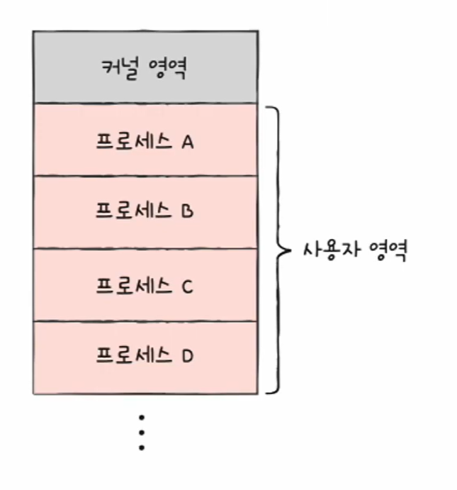

**이미지 설명**
- 위쪽의 회색 영역이 **커널 영역**(운영체제 영역)입니다.
- 아래의 분홍색 블록들이 **사용자 프로세스**(A, B, C, D)입니다.
- “연속 메모리 할당”에서는 각 프로세스가 **연속된 하나의 블록**으로 배치됩니다.

---

## 2. 스와핑(Swapping)

메모리가 부족할 때 사용하는 대표 기법입니다.

### ✅ 스와핑이란?
- 당장 사용되지 않는 프로세스를 **보조기억장치(디스크)의 스왑 영역**으로 내보냄(**swap-out**)
- 그로 인해 생긴 빈 공간에 실행할 프로세스를 올림(**swap-in**)

📷 그림: 스와핑 개념(swap-in / swap-out)

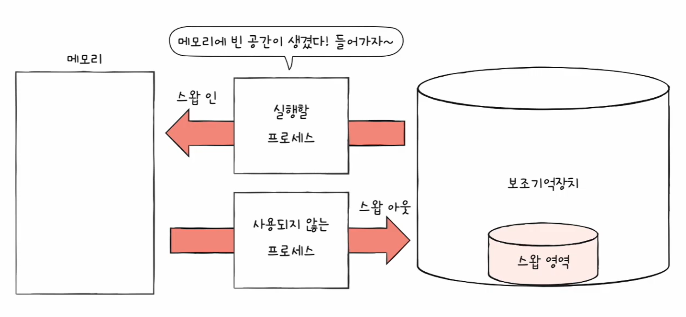

**이미지 설명**
- 왼쪽은 **메모리(RAM)**, 오른쪽은 **보조기억장치(디스크)** 입니다.
- “사용되지 않는 프로세스”는 디스크의 **스왑 영역**으로 이동(**swap-out**)합니다.
- 메모리에 빈 공간이 생기면 “실행할 프로세스”가 메모리로 올라옵니다(**swap-in**).

📷 그림: 시간 흐름에 따른 스와핑/적재 변화

**이미지 설명**
- 시간 흐름에 따라 프로세스를 스왑 아웃/인 하면서 메모리 구성이 바뀝니다.

---

## 3. 연속 메모리 할당이란?

프로세스는 실행되기 전에 메모리의 **빈 공간(hole)** 에 적재되어야 합니다.

- 빈 공간이 여러 개라면 “어디에 올릴지”를 정해야 합니다.
- 대표 전략: **First-fit / Best-fit / Worst-fit**

📷 그림: 빈 공간이 여러 개인 기본 상황

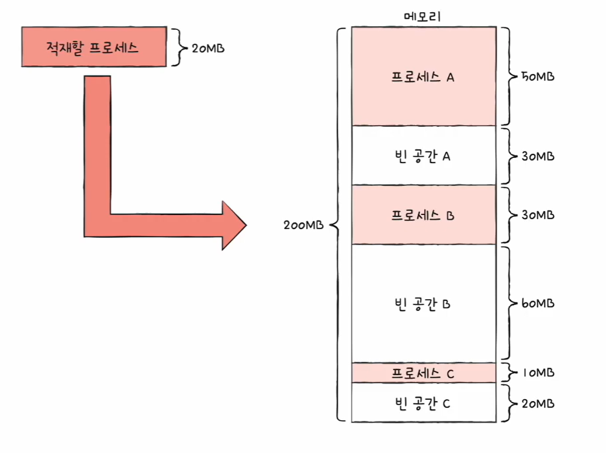

**이미지 설명**
- 전체 메모리 200MB 가정
- 이미 A(50MB), B(30MB), C(10MB)가 적재
- 빈 공간이 A(30MB), B(60MB), C(20MB)처럼 **여러 조각**으로 나뉨

---

## 4. 빈 공간 선택 전략 3가지

### 4.1 최초 적합(First-fit)
- 위에서부터 빈 공간을 찾다가 **처음 들어갈 수 있는 곳**에 즉시 할당

📷 그림: First-fit 예시

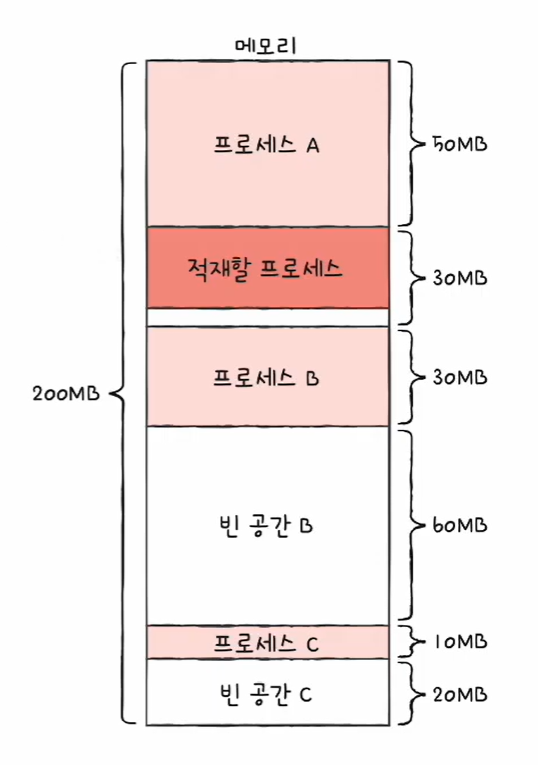

**이미지 설명**
- 빈 공간 A(30MB)를 먼저 발견 → 20MB 프로세스를 **바로 그곳에 적재**
- 장점: 빠름(검색 최소)

### 4.2 최적 적합(Best-fit)
- 전체 빈 공간을 모두 확인한 뒤, 적재 가능한 곳 중 **가장 작은 공간** 선택

📷 그림: Best-fit 예시

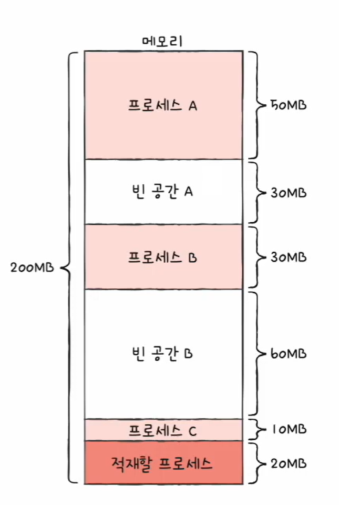

**이미지 설명**
- 후보 중 20MB에 가장 “딱 맞는” 공간을 선택 → 낭비 최소

### 4.3 최악 적합(Worst-fit)
- 전체 빈 공간을 모두 확인한 뒤, 적재 가능한 곳 중 **가장 큰 공간** 선택

📷 그림: Worst-fit 예시

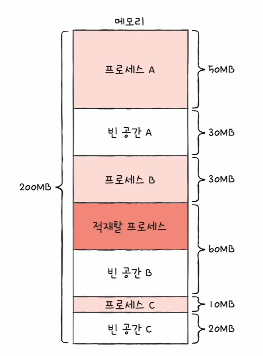

**이미지 설명**
- 가장 큰 빈 공간을 선택해 적재 → 이후를 대비한다는 의도

---

## 5. 외부 단편화(External Fragmentation)

연속 메모리 할당의 대표적인 문제입니다.

### ✅ 외부 단편화란?
- 실행/종료 반복 → 빈 공간이 **조각조각** 생김
- 총 빈 공간 합은 충분해도, **연속된 큰 공간이 없어서** 새 프로세스를 못 올리는 현상

---

## 5.1 외부 단편화 “스토리”로 이해하기(예시 01~10)

📷 외부 단편화 예시 01~10 (단계별)

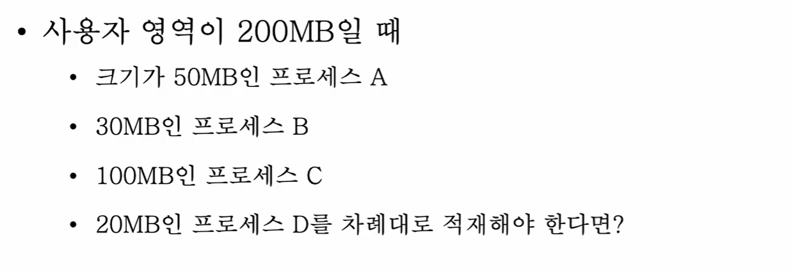
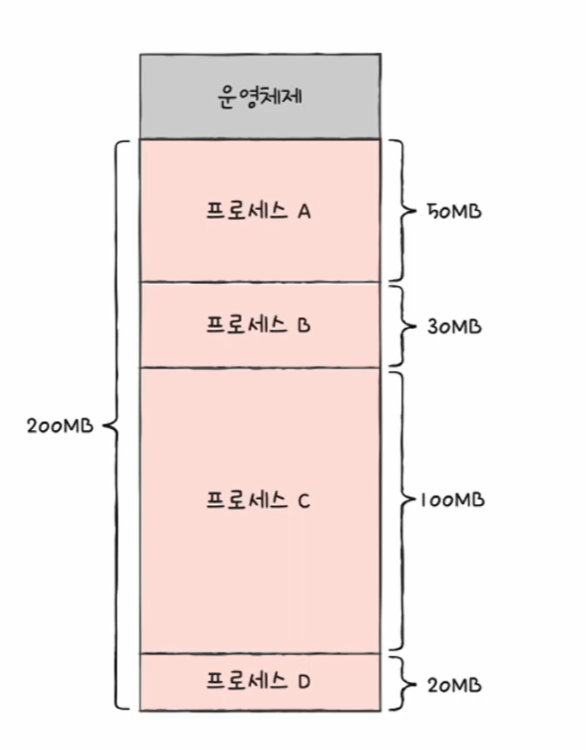
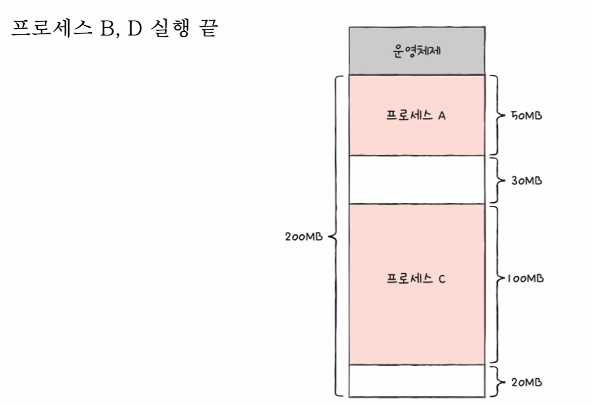
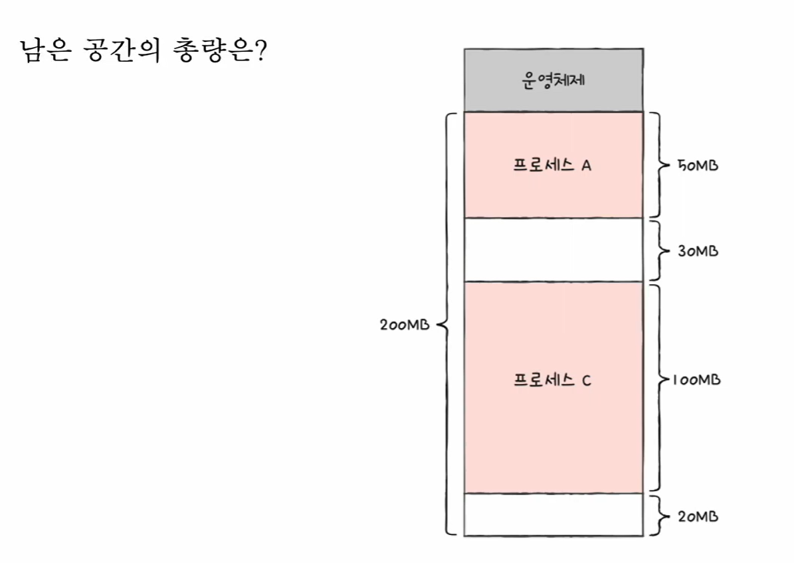
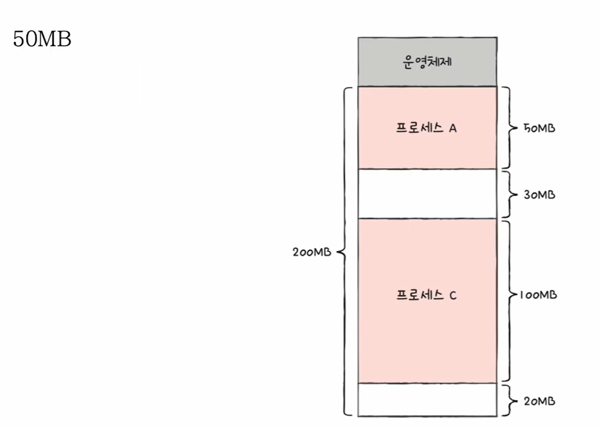
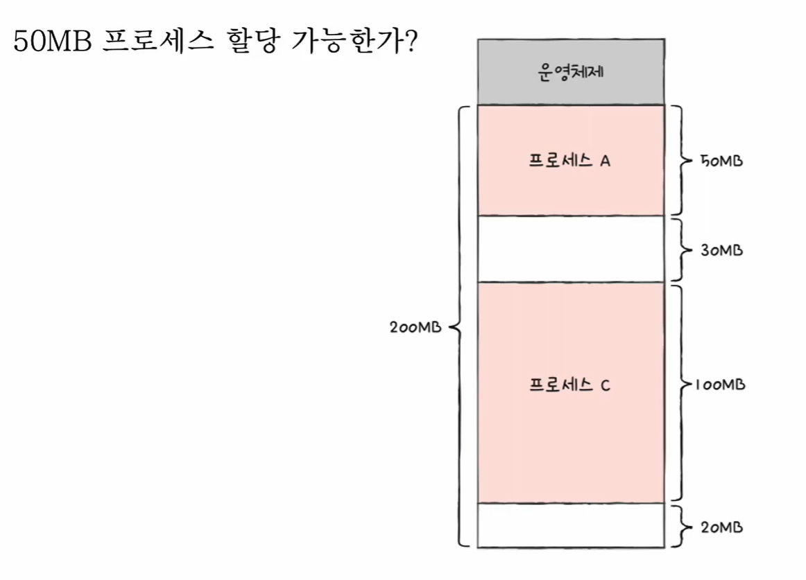
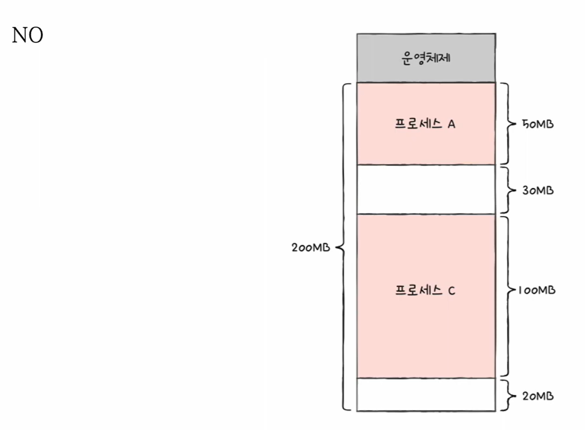
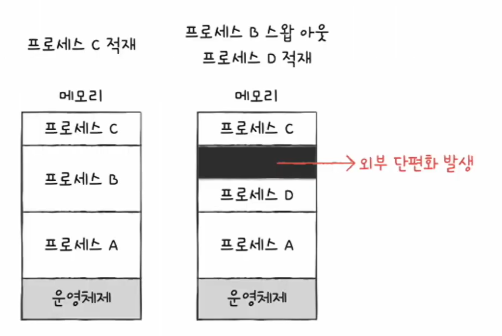
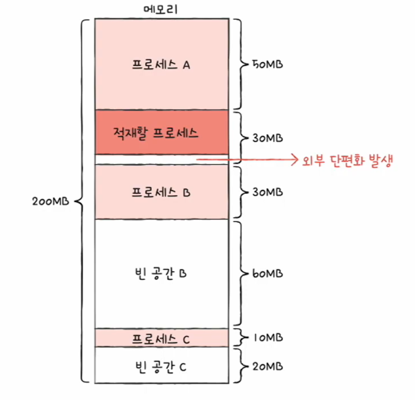

**이미지 설명(핵심)**
- 시간이 지날수록 빈 공간이 “총합”은 남아도, “연속된 한 덩어리”가 부족해집니다.
- 그래서 50MB가 남아있어도 30MB+20MB로 쪼개져 있으면 50MB 프로세스는 못 들어갑니다.

---

## 6. 외부 단편화 해결 방법

### 6.1 메모리 압축(Compaction)
- 흩어진 빈 공간들을 **한쪽으로 몰아 큰 연속 공간**을 만드는 방법

📷 그림: Compaction(메모리 압축) 전/후

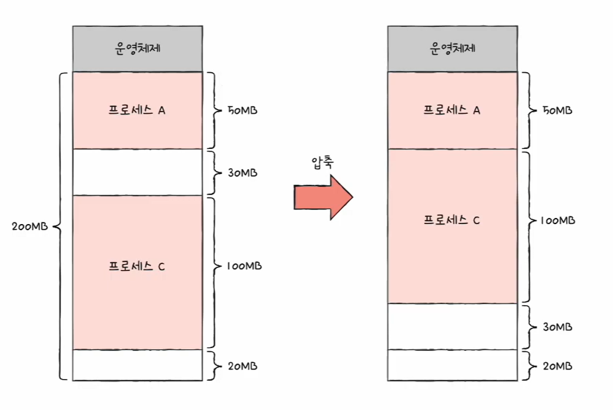

**이미지 설명**
- 프로세스를 한쪽으로 “붙여 이동”시키면 빈 공간을 한 덩어리로 만들 수 있습니다.
- 단점: 이동 비용(오버헤드)이 큼

### 6.2 가상 메모리 기법: 페이징(Paging)
- “연속된 공간”이 꼭 필요하지 않게 만드는 방식
- 프로세스를 나눠 여러 곳에 분산 적재 → 외부 단편화 완화

---

## 7. 한 줄 요약
- 연속 메모리 할당은 단순하지만 **외부 단편화** 문제가 생김
- 해결: Compaction(비용 큼) 또는 Paging(현대 OS의 일반적 해법)