# 🧠 38강 페이징을 통한 가상 메모리 관리

> **핵심 한 줄 요약**  
> 프로세스를 **고정 크기(페이지)** 로 쪼개고, 메모리를 **고정 크기(프레임)** 로 나눈 뒤 **불연속적으로 배치**해서  
> ✅ 외부 단편화를 줄이고  
> ✅ 물리 메모리(RAM)보다 큰 프로세스도 실행 가능하게 만드는 방식이 **페이징**이다.

---

## 📚 목차
- [🧠 38강 페이징을 통한 가상 메모리 관리](#-38강-페이징을-통한-가상-메모리-관리)
  - [📚 목차](#-목차)
  - [연속 메모리 할당의 한계](#연속-메모리-할당의-한계)
    - [1) 물리 메모리보다 큰 프로세스 실행이 어렵다](#1-물리-메모리보다-큰-프로세스-실행이-어렵다)
    - [2) 외부 단편화(External Fragmentation)](#2-외부-단편화external-fragmentation)
    - [페이징이 왜 필요할까?](#페이징이-왜-필요할까)
  - [가상 메모리와 페이징](#가상-메모리와-페이징)
  - [페이징(Paging) 기본 개념](#페이징paging-기본-개념)
  - [페이징 예시로 감 잡기](#페이징-예시로-감-잡기)
  - [페이징에서의 스와핑(페이지 인/아웃)](#페이징에서의-스와핑페이지-인아웃)
  - [페이지 테이블(Page Table)](#페이지-테이블page-table)
    - [단점: 내부 단편화(Internal Fragmentation)](#단점-내부-단편화internal-fragmentation)
  - [PTBR과 “메모리 접근 2번” 문제](#ptbr과-메모리-접근-2번-문제)
    - [문제: 페이지 테이블이 메모리에 있으면 접근 시간이 늘어난다](#문제-페이지-테이블이-메모리에-있으면-접근-시간이-늘어난다)
  - [TLB로 해결하기](#tlb로-해결하기)
  - [페이징에서의 주소 변환](#페이징에서의-주소-변환)
    - [논리 주소(Logical Address)](#논리-주소logical-address)
    - [물리 주소(Physical Address)로 변환](#물리-주소physical-address로-변환)
    - [주소 변환 전체 흐름](#주소-변환-전체-흐름)
    - [주소 변환 예시(숫자로 이해하기)](#주소-변환-예시숫자로-이해하기)
  - [페이지 테이블 엔트리(PTE)와 추가 비트들](#페이지-테이블-엔트리pte와-추가-비트들)
    - [유효 비트(Valid Bit)](#유효-비트valid-bit)
    - [보호 비트(Protection Bit)](#보호-비트protection-bit)
    - [참조 비트(Reference Bit)](#참조-비트reference-bit)
    - [수정 비트(Dirty Bit)](#수정-비트dirty-bit)
  - [정리](#정리)

---

## 연속 메모리 할당의 한계

연속 메모리 할당(Contiguous Allocation)은 프로세스를 **한 덩어리로 “연속된 공간”에** 올리는 방식이다.  
이 방식은 구현이 직관적이지만, 실제로는 다음과 같은 한계 때문에 **가상 메모리(페이징)** 가 필요해진다.

---

### 1) 물리 메모리보다 큰 프로세스 실행이 어렵다

아래 상황을 떠올려보자.

- 실행하고 싶은 프로세스(예: 4GB)가 있다.  
- 그런데 물리 메모리에는 이미 운영체제가 상주해 있고, 남은 공간이 충분하지 않다.  
- **연속 메모리 할당 방식**이라면 프로세스를 “통째로” 메모리에 올려야 하므로  
  **물리 메모리가 부족하면 실행 자체가 막힌다.**

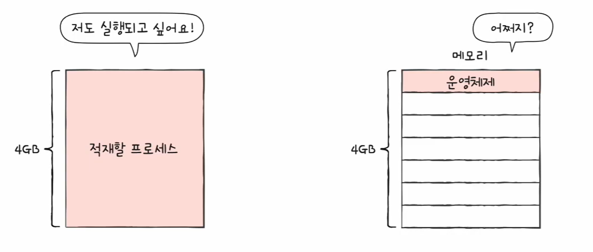

> ✅ 핵심: “프로세스를 전부 올려야 실행된다”는 전제 때문에,  
> 물리 메모리(RAM)보다 큰 프로그램은 실행이 어려워진다.

---

### 2) 외부 단편화(External Fragmentation)

연속 메모리 할당에서는 프로세스를 메모리에 올릴 때 **반드시 연속된 빈 공간**이 필요하다.  
그런데 프로세스가 생성/종료를 반복하면 빈 공간이 **조각조각 흩어지는 현상**이 발생한다.

- 빈 공간의 “총합”은 충분해도  
- **연속으로 붙어 있는 큰 공간이 없으면** 새 프로세스를 배치하지 못한다.

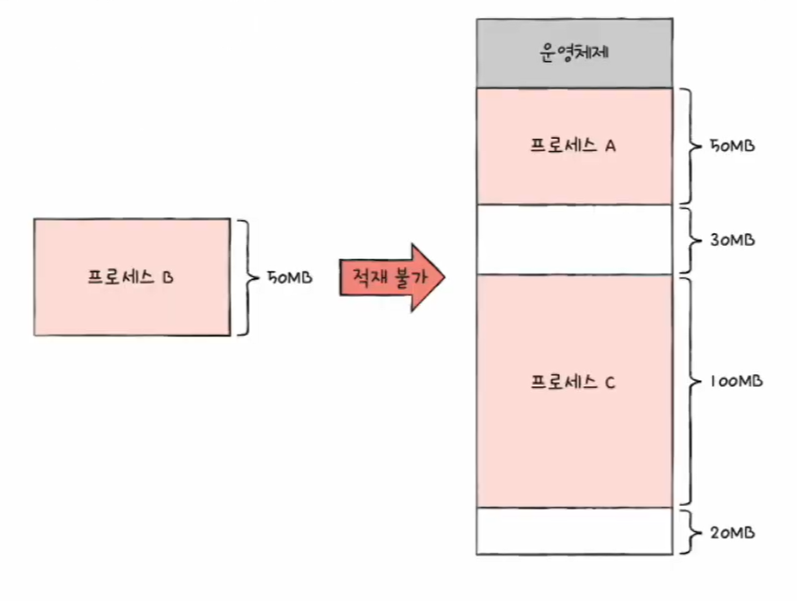

> ✅ 핵심: “빈 공간이 없어서가 아니라, **연속된 빈 공간이 없어서**” 배치가 실패한다.  
> 이것이 외부 단편화다.

---

### 페이징이 왜 필요할까?

연속 메모리 할당은 결국 아래 두 문제를 만든다.

1) **물리 메모리보다 큰 프로세스 실행 불가(또는 매우 어려움)**  
2) **외부 단편화로 인해, 빈 공간이 있어도 연속 공간 부족으로 배치 실패**

그래서 운영체제는 프로세스를 “통째로 연속 배치”하는 대신,

- 프로세스를 **고정 크기 단위로 쪼개고(페이지)**  
- 메모리를 **같은 크기의 칸으로 나눈 뒤(프레임)**  
- **불연속적으로 배치**할 수 있도록 관리한다.

이 방식이 바로 **페이징(Paging)** 이다.

---

## 가상 메모리와 페이징

**가상 메모리(Virtual Memory)** 는 프로그램을 **일부만 메모리에 적재**해서  
✅ **RAM보다 큰 프로세스 실행**을 가능하게 하는 기술이다.

- 필요한 부분만 RAM에 두고
- 나머지는 보조기억장치(디스크)에 둔다

가상 메모리를 구현하는 대표 기법:
- **페이징(Paging)**
- **세그멘테이션(Segmentation)**

---

## 페이징(Paging) 기본 개념

외부 단편화가 발생했던 근본 원인은:

> 크기가 제각각인 프로세스를 “연속 공간”에 억지로 넣으려 했기 때문

페이징은 이 문제를 이렇게 바꾼다.

- 프로세스의 논리 주소 공간을 **페이지(Page)** 라는 고정 크기로 자른다.
- 물리 메모리도 같은 크기의 **프레임(Frame)** 으로 자른다.
- 각 페이지를 빈 프레임에 **불연속적으로 할당**할 수 있게 한다.

> ✅ 핵심: “연속 공간이 아니라도 된다”가 페이징의 본질이다.

---

## 페이징 예시로 감 잡기

- 논리 주소 공간(프로세스)은 **페이지** 단위로 나뉜다.
- 물리 메모리(메모리)는 **프레임** 단위로 나뉜다.
- 각 페이지는 빈 프레임에 **불연속적으로** 배치될 수 있다.

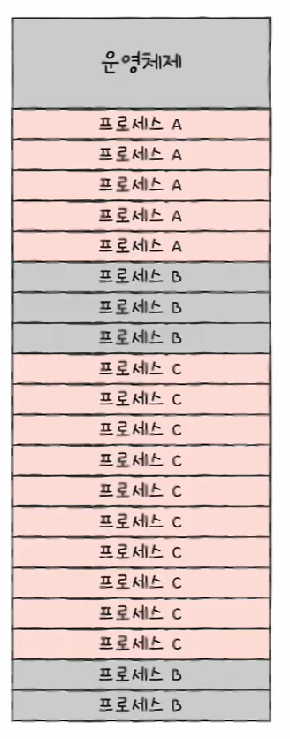

불연속 배치를 더 직관적으로 보면:

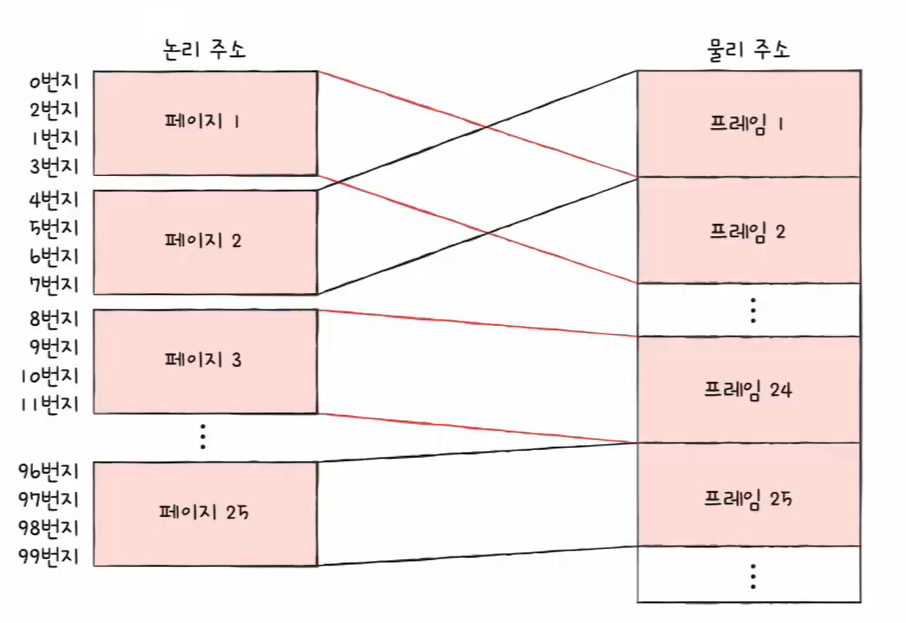

> ✅ 포인트: 프로세스가 메모리에서 여기저기 흩어져 있어도(불연속) 실행될 수 있다.

---

## 페이징에서의 스와핑(페이지 인/아웃)

연속 할당에서는 보통 “프로세스 단위”로 스왑 인/아웃을 떠올리지만,  
페이징에서는 **페이지 단위**로 스왑 인/아웃이 일어난다.

- **페이지 인(Page-in)**: 필요한 페이지를 디스크(스왑 영역) → 메모리로 가져옴
- **페이지 아웃(Page-out)**: 당장 필요 없는 페이지를 메모리 → 디스크(스왑 영역)로 내림

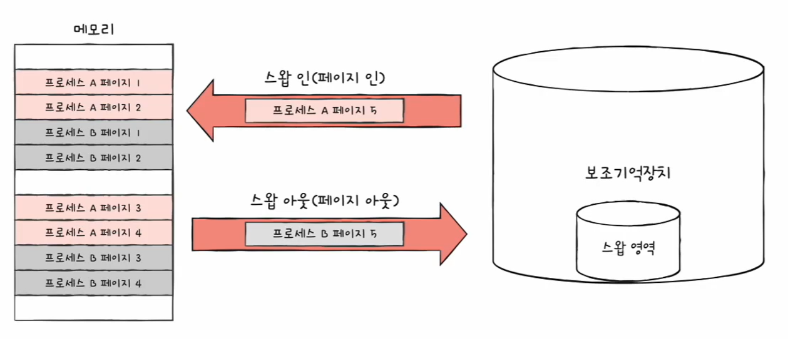

페이지가 왔다 갔다 하는 상황을 한 번 더 보면:

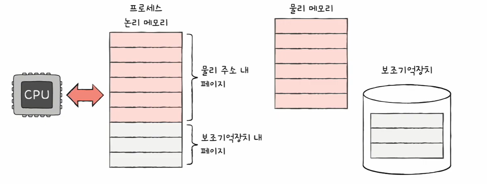

> ✅ 결론: 프로세스를 실행하기 위해 **모든 페이지가 메모리에 있을 필요가 없다.**  
> 그래서 **물리 메모리보다 큰 프로세스도 실행 가능**해진다.

---

## 페이지 테이블(Page Table)

페이지를 불연속적으로 배치할 수 있으면 좋은데, CPU 입장에서는 문제가 생긴다.

- 프로세스를 이루는 페이지가 **어느 프레임에 적재되어 있는지** CPU가 일일이 알기 어렵다.
- 불연속 배치라면 CPU 입장에서 이를 순차적으로 실행할 수가 없다.
- CPU 입장에서 “다음에 실행할 명령어 위치”를 찾기가 어려워진다.

이 문제를 해결하기 위해 **페이지 테이블(Page Table)** 을 사용한다.

- 물리 주소에 불연속적으로 배치되더라도
- 논리 주소에서는 연속적으로 보이도록 만드는 방법
- 페이지 번호와 프레임 번호를 짝지어주는 “이정표”
- 프로세스마다 페이지 테이블이 존재한다.
- 물리적으로 흩어져 있어도 CPU가 바라보는 논리 주소는 연속처럼 보인다.
- CPU는 논리 주소를 순서대로 실행하면 된다.

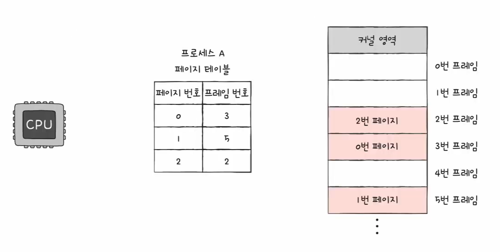
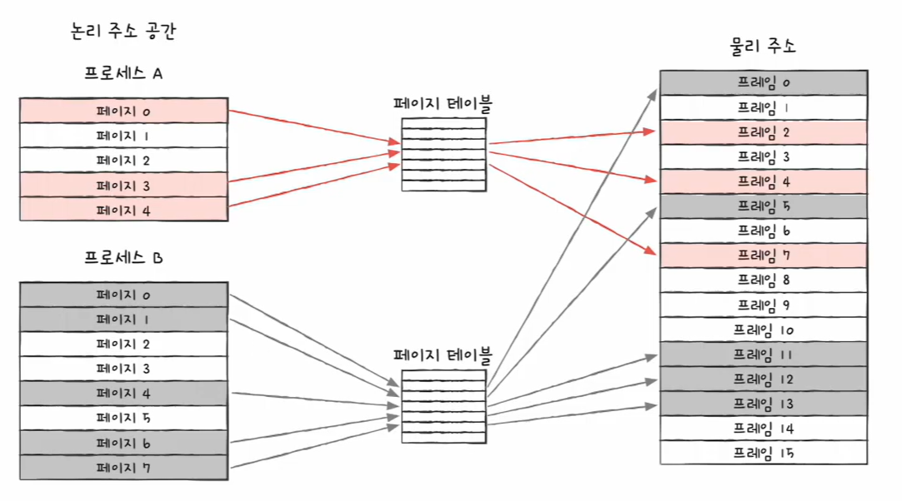
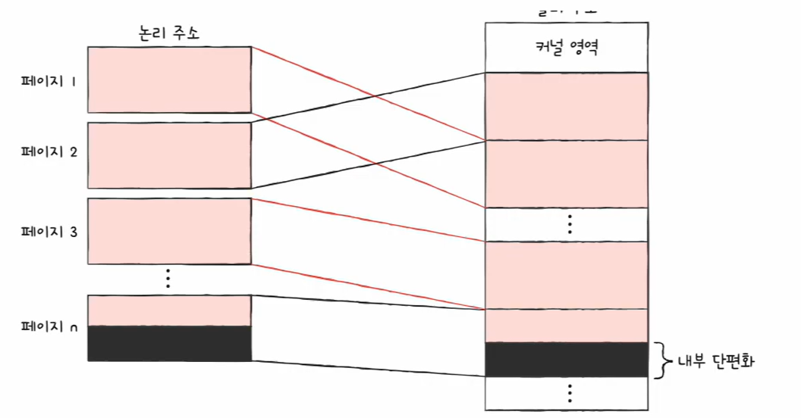

### 단점: 내부 단편화(Internal Fragmentation)

페이지 크기가 고정되어 있기 때문에, 마지막 페이지가 “딱 맞지” 않으면 남는 공간이 생긴다.

예)
- 페이지 크기: 10KB
- 프로세스 크기: 108KB

→ 11페이지(110KB) 필요  
→ 마지막 페이지에 2KB가 남음 = **내부 단편화**

> ✅ 내부 단편화는 **페이지 하나보다 작은 크기**로 발생한다.  
> 보통 외부 단편화보다 낭비가 “작은 편”인 경우가 많다.

---

## PTBR과 “메모리 접근 2번” 문제

프로세스마다 페이지 테이블이 있고, CPU에는 **PTBR(Page Table Base Register)** 이 있다.

- PTBR은 “현재 실행 중인 프로세스의 페이지 테이블이 메모리에 적재된 주소”를 가리킨다.

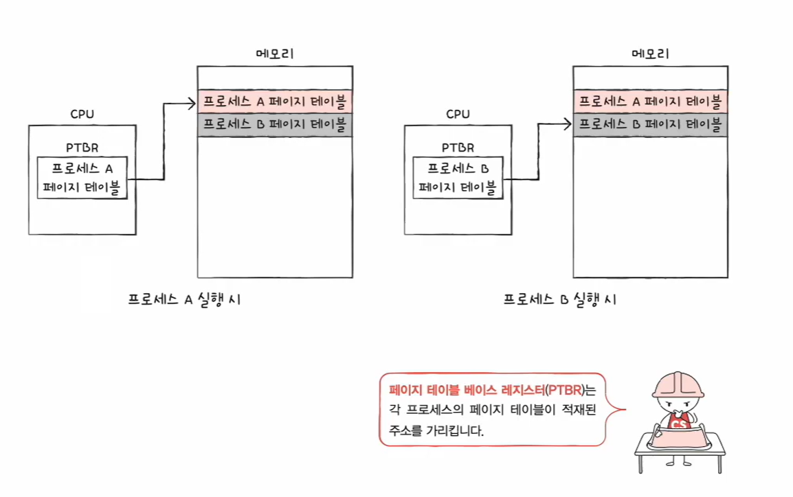

### 문제: 페이지 테이블이 메모리에 있으면 접근 시간이 늘어난다

주소 변환 시 메모리 접근이 2번 발생한다.

1) 페이지 테이블 참조(프레임 번호 얻기) → 메모리 접근 1번  
2) 프레임(실제 데이터/명령어) 참조 → 메모리 접근 1번  

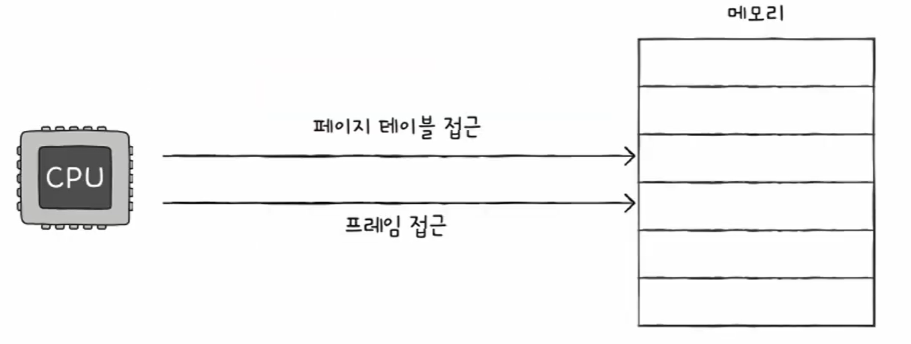

---

## TLB로 해결하기

그래서 CPU 곁에 **TLB(Translation Lookaside Buffer)** 라는 캐시를 둔다.

- TLB는 페이지 테이블의 일부를 가져와 저장한다.
- 주소 변환을 빠르게 하기 위한 캐시다.

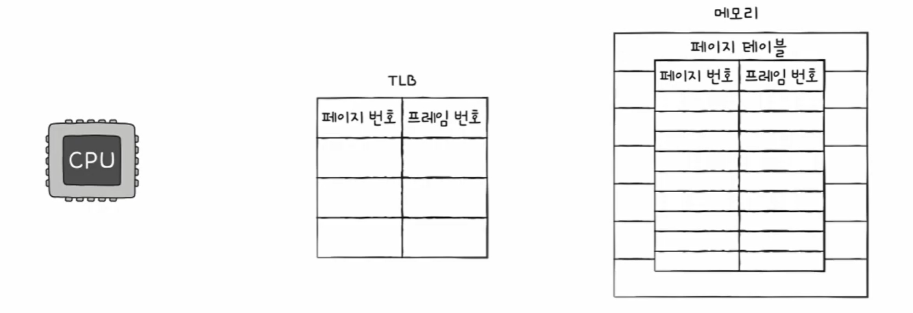

- CPU가 접근하려는 논리 주소의 매핑이 TLB에 있으면 → **TLB 히트**
  - 페이지 테이블을 보러 갈 필요가 줄어듦 → 메모리 접근 1번(유리)
- TLB에 없으면 → **TLB 미스**
  - 페이지 테이블도 보고, 프레임도 봐야 함 → 메모리 접근 2번

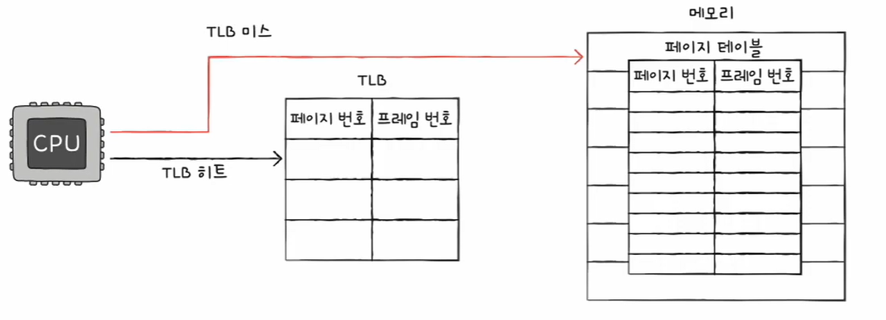

---

## 페이징에서의 주소 변환

특정 주소에 접근하려면 두 가지 정보가 필요하다.

1) 어떤 페이지/프레임에 접근할지  
2) 그 페이지/프레임 내부에서 얼마나 떨어진 위치(변위, offset)인지

### 논리 주소(Logical Address)

페이징 시스템에서 논리 주소는 보통 다음 두 부분으로 구성된다.

- 페이지 번호(Page Number)
- 변위(Offset)

즉,

> 논리 주소 = `<페이지 번호, 변위>`

### 물리 주소(Physical Address)로 변환

페이지 테이블을 통해 페이지 번호는 프레임 번호로 바뀐다.

> 물리 주소 = `<프레임 번호, 변위>`

이때 변위는 **그대로 유지**된다.

- 논리 주소 상의 변위 = 물리 주소 상의 변위
- 이유: 페이지 크기 = 프레임 크기(동일)

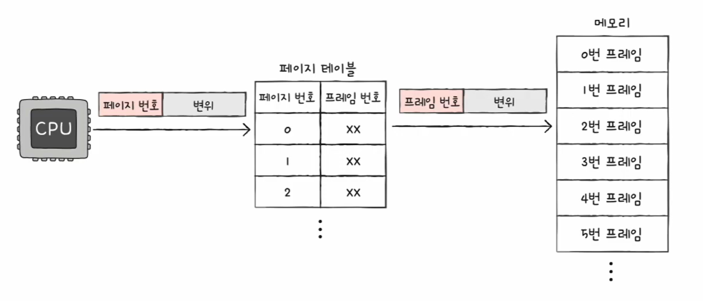

### 주소 변환 전체 흐름

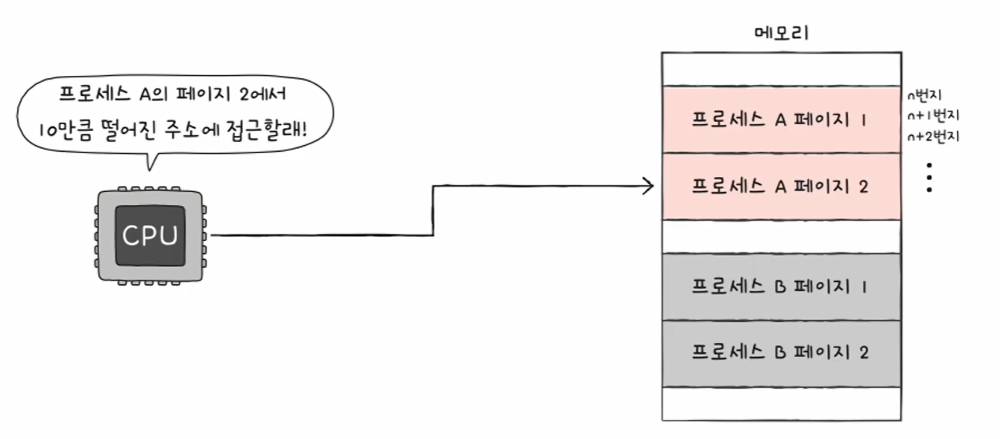

### 주소 변환 예시(숫자로 이해하기)

---

## 페이지 테이블 엔트리(PTE)와 추가 비트들

페이지 테이블의 각 행을 **페이지 테이블 엔트리(PTE: Page Table Entry)** 라고 한다.

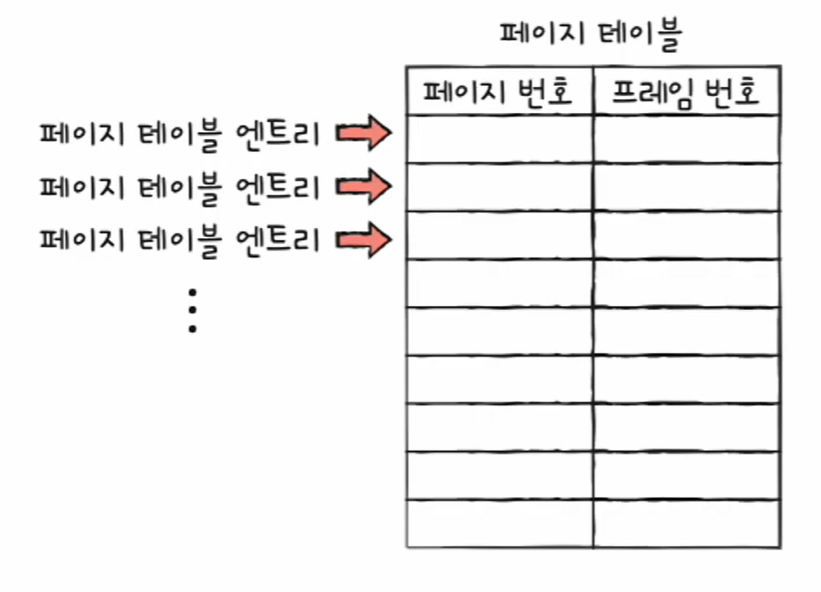

PTE에는 기본적으로 “페이지 번호 ↔ 프레임 번호” 매핑 정보가 들어가며,  
추가로 다음과 같은 관리용 비트들이 함께 들어간다.

---

### 유효 비트(Valid Bit)

- 현재 해당 페이지에 접근 가능한지 여부
- 유효 비트가 0인 페이지에 접근하려 하면 → **페이지 폴트(Page Fault)** 인터럽트 발생

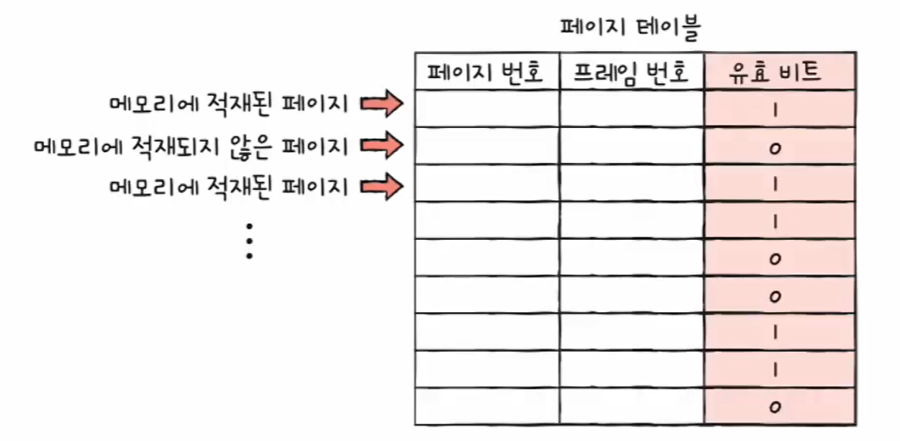

페이지 폴트 처리 흐름(개념)
1) CPU는 기존 작업 내역을 백업한다.
2) 페이지 폴트 처리 루틴을 실행한다.
3) 원하는 페이지를 메모리로 가져온다(페이지 인).
4) 유효 비트를 1로 변경한다.
5) 이제 CPU는 해당 페이지에 접근할 수 있다.

---

### 보호 비트(Protection Bit)

- 페이지 보호를 위한 비트
- 읽기/쓰기/실행 권한을 분리해서 설정할 수 있다.

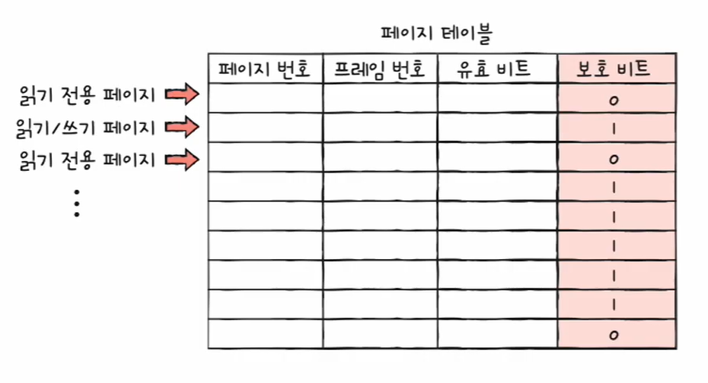
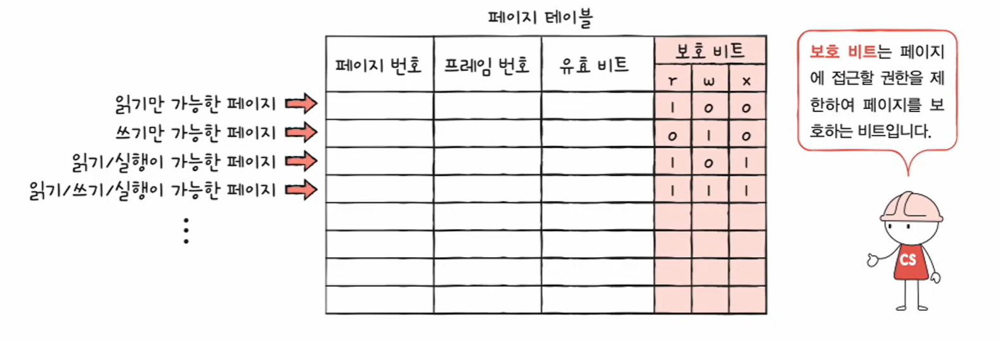

---

### 참조 비트(Reference Bit)

- CPU가 이 페이지에 접근한 적이 있는지 여부

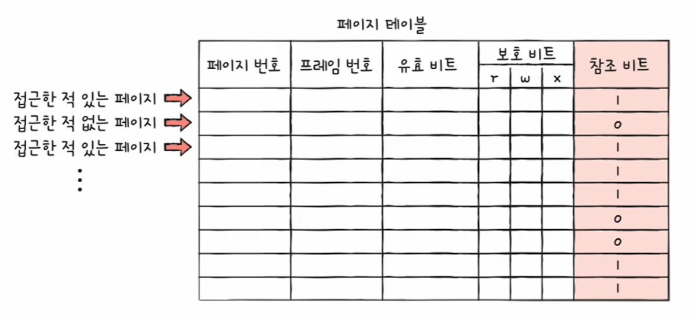

---

### 수정 비트(Dirty Bit)

- CPU가 이 페이지에 데이터를 쓴 적(수정)이 있는지 여부

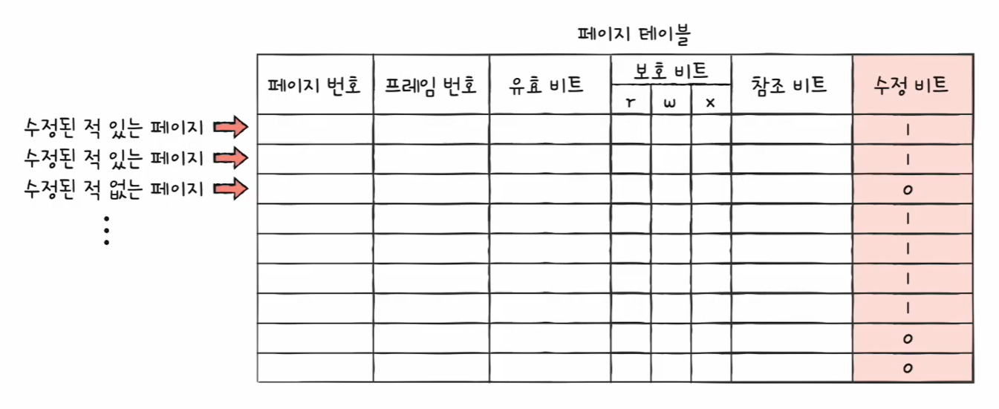

수정 비트가 존재하는 이유는 “스왑 아웃할 때 디스크에 다시 써야 하는지” 판단하기 위해서다.

- Dirty = 1(수정됨)  
  → 메모리에서 내려갈 때 디스크에도 반영(쓰기 작업 필요)
- Dirty = 0(수정 안 됨)  
  → 디스크 쓰기 생략 가능(그대로 버려도 됨)

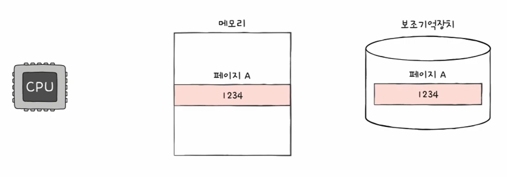
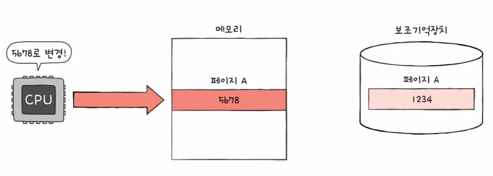

---

## 정리

- 페이징은 **페이지/프레임(고정 크기)** 로 나눠 불연속 배치가 가능해져 **외부 단편화**를 줄인다.
- 페이징에서는 스왑도 **페이지 단위(페이지 인/아웃)** 로 일어난다.
  - 필요한 페이지만 메모리에 올리므로 **RAM보다 큰 프로세스 실행 가능**
- 페이지가 흩어져 있으므로 **페이지 테이블**이 필요하다.
- PTBR로 페이지 테이블을 가리키지만, 페이지 테이블이 메모리에 있으면 **접근 2번** 문제가 생긴다.
- 이를 완화하기 위해 **TLB**로 주소 변환을 캐싱한다.
- 논리 주소 `<페이지 번호, 변위>` → 물리 주소 `<프레임 번호, 변위>`  
  ✅ **변위(Offset)는 동일**
- PTE에는 프레임 번호 외에도
  - 유효 비트(Valid), 보호 비트(Protection), 참조 비트(Reference), 수정 비트(Dirty) 등이 포함되어
  - “접근 가능/권한/사용 흔적/수정 여부”를 관리한다.
