# 🧠 39강 페이지 교체와 프레임 할당

## 🎯 개요

페이징(Paging)을 사용하면 **물리 메모리보다 큰 프로세스**도 실행할 수 있습니다.  
하지만 **물리 메모리(프레임)의 크기는 한정**되어 있기 때문에 운영체제는 다음 두 문제를 반드시 해결해야 합니다.

- ✅ **페이지 교체(Page Replacement)**  
  → 이미 적재된 페이지 중 **불필요한 페이지를 골라** 보조기억장치로 내보내기
- ✅ **프레임 할당(Frame Allocation)**  
  → 프로세스에게 **적절한 수의 프레임을 배분**하여 성능 유지하기

<details>
<summary>🖼️ 개요 그림</summary>

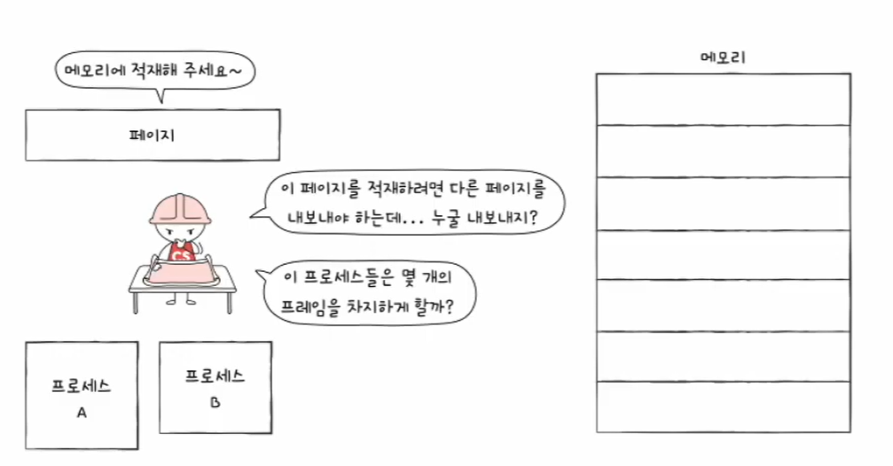

- “메모리에 적재해 주세요~” 상황에서 OS가 고민해야 하는 2가지  
  1) **어떤 페이지를 내보낼지(페이지 교체)**  
  2) **프로세스에 프레임을 몇 개 줄지(프레임 할당)**

</details>

---

## 📚 목차

- [🧠 39강 페이지 교체와 프레임 할당](#-39강-페이지-교체와-프레임-할당)
  - [🎯 개요](#-개요)
  - [📚 목차](#-목차)
  - [📌 요구 페이징 (Demand Paging)](#-요구-페이징-demand-paging)
  - [🔁 페이지 교체 알고리즘](#-페이지-교체-알고리즘)
    - [✅ 좋은 페이지 교체 알고리즘이란?](#-좋은-페이지-교체-알고리즘이란)
  - [📌 페이지 폴트와 페이지 참조열](#-페이지-폴트와-페이지-참조열)
    - [페이지 참조열(Page Reference String)](#페이지-참조열page-reference-string)
  - [🧺 FIFO 페이지 교체](#-fifo-페이지-교체)
  - [🪪 FIFO 보완: 2차 기회(Second-Chance)](#-fifo-보완-2차-기회second-chance)
  - [🏆 최적 페이지 교체(Optimal)](#-최적-페이지-교체optimal)
    - [왜 ‘하한선(기준)’으로 쓰나?](#왜-하한선기준으로-쓰나)
  - [⏱ LRU(Least Recently Used)](#-lruleast-recently-used)
  - [🔥 스래싱과 프레임 할당](#-스래싱과-프레임-할당)
  - [💥 스래싱(Thrashing)이란?](#-스래싱thrashing이란)
  - [🧱 프레임 할당(Frame Allocation)](#-프레임-할당frame-allocation)
  - [🧱 정적 할당(Static Allocation)](#-정적-할당static-allocation)
  - [📈 동적 할당(Dynamic Allocation)](#-동적-할당dynamic-allocation)
  - [🧠 작업 집합 모델(Working Set Model)](#-작업-집합-모델working-set-model)
  - [📉 페이지 폴트 빈도(Page Fault Frequency, PFF)](#-페이지-폴트-빈도page-fault-frequency-pff)
  - [✅ 한 줄 요약](#-한-줄-요약)

---

## 📌 요구 페이징 (Demand Paging)

**요구 페이징**은 프로세스 실행 시 **처음부터 모든 페이지를 메모리에 올리지 않고**,  
실제로 **필요해진 페이지만** 메모리에 적재하는 방식입니다.

- “필요할 때만 가져온다”
- 메모리를 효율적으로 사용 가능

다만, 요구 페이징이 안정적으로 동작하려면 아래 두 가지를 반드시 해결해야 합니다.

- ✅ **페이지 교체**: 메모리가 가득 찼을 때 무엇을 내보낼지?
- ✅ **프레임 할당**: 프로세스에 프레임을 얼마씩 줄지?

<details>
<summary>🖼️ 요구 페이징 동작 흐름(페이지 폴트가 발생하는 순간)</summary>

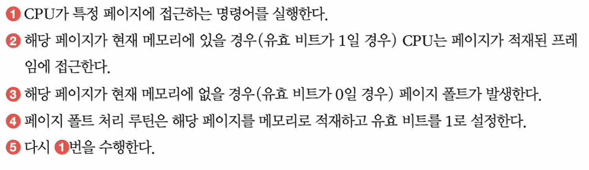

이미지 흐름 요약:
1) CPU가 특정 페이지에 접근하는 명령 실행  
2) **유효 비트=1**이면(메모리에 있음) → 해당 프레임 접근  
3) **유효 비트=0**이면(메모리에 없음) → **페이지 폴트 발생**  
4) OS의 페이지 폴트 처리 루틴이 페이지를 메모리에 적재하고 유효 비트를 1로 설정  
5) 다시 1) 수행(이제는 메모리에 있어서 정상 실행)

</details>

---

## 🔁 페이지 교체 알고리즘

요구 페이징으로 페이지를 계속 올리다 보면 **언젠가는 메모리가 가득 찹니다.**  
그러면 당장 필요한 페이지를 적재하기 위해 **기존 페이지를 하나 이상 내보내야** 합니다.

> “어떤 페이지를 내보낼까?”  
이 결정을 하는 규칙(알고리즘)이 **페이지 교체 알고리즘**입니다.

### ✅ 좋은 페이지 교체 알고리즘이란?

- **페이지 폴트(Page Fault)가 적게 발생하는 알고리즘**
- 페이지 폴트가 발생하면 **보조기억장치 접근(I/O)** 이 필요해서 성능이 크게 떨어집니다.

---

## 📌 페이지 폴트와 페이지 참조열

페이지 폴트 횟수를 비교하려면, CPU가 어떤 페이지들을 참조했는지 알아야 합니다.

### 페이지 참조열(Page Reference String)

- CPU가 참조한 페이지들 중 **연속해서 반복되는 페이지를 생략한 “페이지열”**

예시:

```text
2 2 2 3 5 5 5 3 3 7
```

연속 중복을 생략하면:

```text
2 3 5 3 7
```

---

## 🧺 FIFO 페이지 교체

가장 단순한 페이지 교체 방식입니다.

- ✅ 메모리에 **가장 먼저 올라온 페이지부터** 내보내는 방식
- 핵심 문장: **“오래 있었으면 나가라”**

<details>
<summary>🖼️ FIFO 예시(시간 흐름/프레임 상태/페이지 폴트 표시)</summary>

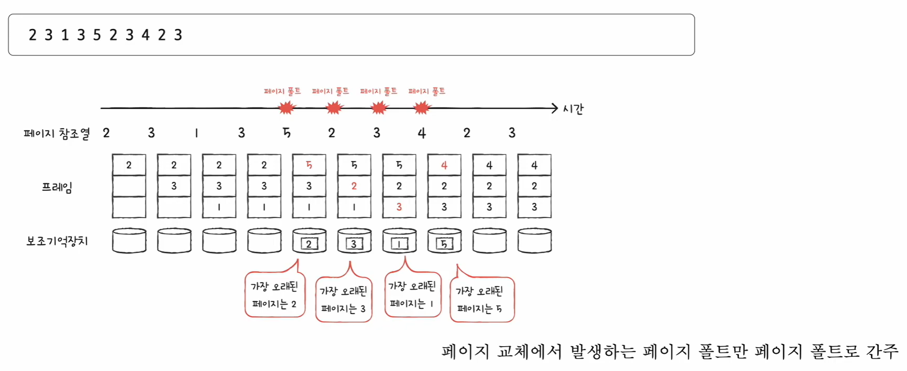

- 프레임이 꽉 찼을 때 **가장 오래전에 들어온 페이지**부터 교체
- 말풍선이 “가장 오래된 페이지는 X”로 교체 근거를 보여줌

</details>

---

## 🪪 FIFO 보완: 2차 기회(Second-Chance)

FIFO의 단점을 보완한 방식입니다.  
페이지마다 **참조 비트(Reference Bit)** 를 두고, “진짜로 안 쓰는 페이지인지” 한 번 더 확인합니다.

- **참조 비트 1**: CPU가 한 번이라도 참조한 적 있음  
  → 바로 내쫓지 않고 **한 번 더 기회 부여**
- **참조 비트 0**: 참조된 적 없음  
  → **교체 대상**

<details>
<summary>🖼️ 2차 기회 예시(참조 비트로 교체 대상을 고르는 과정)</summary>

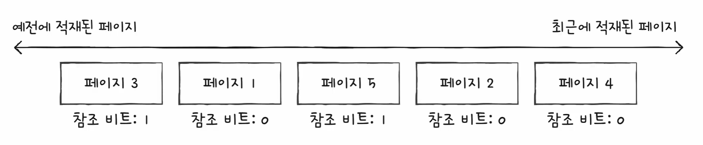

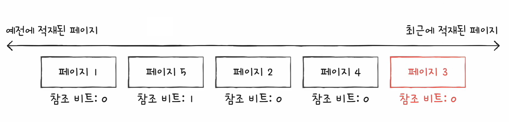

- 참조 비트가 1이면 “최근에 한 번은 썼다” → 즉시 교체하지 않음(2차 기회)
- 참조 비트가 0인 페이지가 “진짜 후보”로 남아 교체됨

</details>

---

## 🏆 최적 페이지 교체(Optimal)

- “앞으로 가장 오랫동안 사용되지 않을 페이지”를 내보내는 방식
- **가장 낮은 페이지 폴트율을 보장**합니다.

### 왜 ‘하한선(기준)’으로 쓰나?

- 미래의 참조를 알아야 해서 현실 구현은 어렵지만,
- “이론적으로 제일 좋다”는 기준점이 되기 때문입니다.

<details>
<summary>🖼️ 최적 페이지 교체 예시(미래를 보고 ‘가장 나중에 쓰일 페이지’를 교체)</summary>

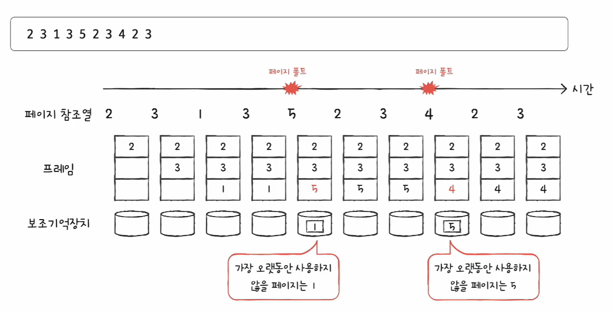

이미지 해설 포인트:
- 페이지 참조열을 “앞으로”까지 같이 보면서,
- 지금 프레임에서 **가장 나중에 다시 참조될 페이지**를 교체 대상으로 선택
- 그래서 페이지 폴트 수가 가장 적게 나올 수밖에 없음(이론 최강)

</details>

---

## ⏱ LRU(Least Recently Used)

LRU는 최적(Optimal)을 “현실적으로 흉내”내려는 대표 알고리즘입니다.

- 최적: 앞으로 가장 오래 안 쓸 페이지 교체
- LRU: **가장 오래 사용하지 않은 페이지** 교체

핵심 직관:

> “최근에 안 쓴 페이지는 앞으로도 안 쓰지 않을까?”

<details>
<summary>🖼️ LRU 예시(‘가장 오랫동안 사용하지 않은 페이지’를 교체)</summary>

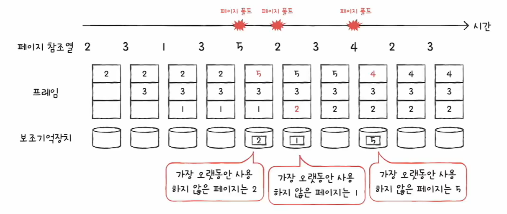

- 그림 말풍선이 “가장 오랫동안 사용하지 않은 페이지는 X”로 교체 근거를 보여줌

</details>

---

## 🔥 스래싱과 프레임 할당

페이지 폴트가 자주 발생하는 이유는 보통 두 가지입니다.

- ❌ 나쁜 페이지 교체 알고리즘을 사용해서
- ❌ 프로세스가 사용할 수 있는 **프레임 자체가 부족해서**

---

## 💥 스래싱(Thrashing)이란?

스래싱은 다음 상황을 말합니다.

- 프로세스가 “실행”하는 시간보다  
  **페이지 교체/페이징(I/O)** 에 더 많은 시간을 쓰는 문제
- 결과: **CPU 이용률이 오히려 떨어짐**

<details>
<summary>🖼️ 스래싱의 직관(그래프/상황 그림)</summary>

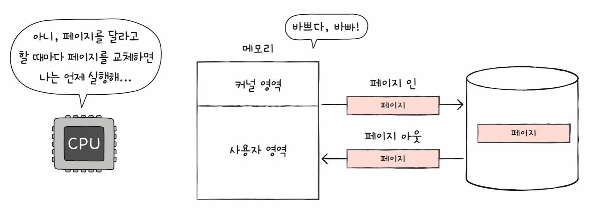

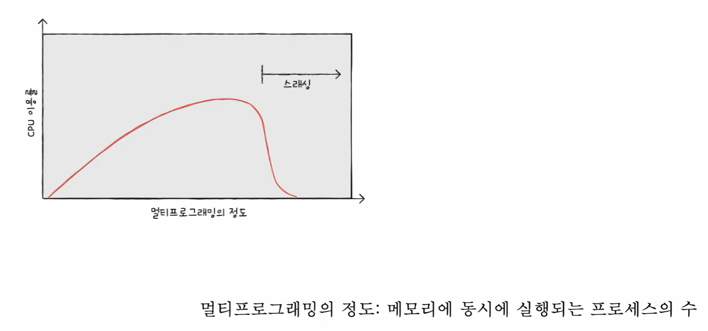

- 멀티프로그래밍 정도가 증가하면 CPU 이용률이 오르다가,
- 어느 순간 이후 페이지 폴트/교체가 폭증해 **CPU 이용률이 급락**(스래싱 구간)

</details>

---

## 🧱 프레임 할당(Frame Allocation)

스래싱을 막으려면 프로세스에게 **“최소한 필요한 프레임 수”** 가 보장되도록 배분해야 합니다.

프레임 할당 방식은 크게 두 가지입니다.

- **정적 할당(Static Allocation)**: 실행 전/초기에 미리 배분(크기 등 기준)
- **동적 할당(Dynamic Allocation)**: 실행 중 관찰 결과를 기반으로 조절

<details>
<summary>🖼️ “프레임이 부족하면 왜 교체가 바빠지는가?” 직관 그림</summary>

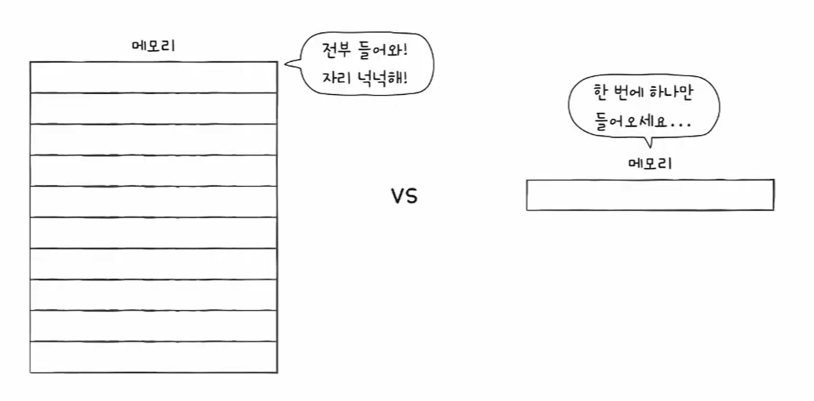

- 메모리가 넉넉하면 여러 페이지를 올려두고 여유 있게 실행
- 메모리가 부족하면 계속 페이지 인/아웃 → 성능 저하(스래싱으로 연결)

</details>

---

## 🧱 정적 할당(Static Allocation)

정적 할당은 **“실행 중 관찰 없이”** 미리 프레임을 배분하는 방식입니다.

- ⚖️ **균등 할당(Equal Allocation)**: 모든 프로세스에게 동일 프레임 배분  
  → 단순하지만 필요량이 다른 프로세스들에겐 비합리적일 수 있음
- 📏 **비례 할당(Proportional Allocation)**: 프로세스 크기에 비례해 배분  
  → 크기만으로 “실제 필요 프레임 수”를 정확히 맞추긴 어려움(실행해봐야 아는 경우가 많음)

---

## 📈 동적 할당(Dynamic Allocation)

동적 할당은 프로세스가 실행되는 동안 **관찰 결과**를 기반으로 프레임을 조절합니다.

- 🧠 **작업 집합 모델(Working Set Model)**  
- 📉 **페이지 폴트 빈도(Page Fault Frequency, PFF)**

---

## 🧠 작업 집합 모델(Working Set Model)

핵심 아이디어:
- 스래싱은 “빈번한 페이지 교체” 때문에 생김
- 그렇다면 프로세스가 **최근 일정 시간(Δt)** 동안 실제로 참조한 페이지 수만큼 프레임을 주면,
  불필요한 교체가 줄어 스래싱을 완화할 수 있음

작업 집합(Working Set):
- **“시간 구간 Δt 동안 참조한 페이지들의 집합”**

<details>
<summary>🖼️ 작업 집합을 구하는 방법(Δt 윈도우로 페이지 집합 만들기)</summary>

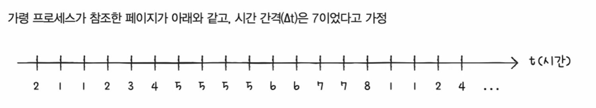

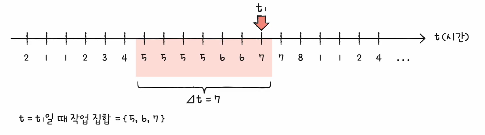

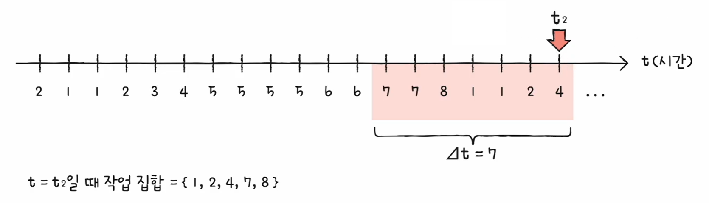

이미지 해설 포인트:
- (예시) 시간 간격 Δt = 7로 두고,
- 특정 시점 t1에서 “최근 7구간” 동안 등장한 페이지가 작업 집합이 됨  
  → **t=t1일 때 작업 집합 = {5, 6, 7}**
- 다음 시점 t2에서는 윈도우가 오른쪽으로 이동하면서 작업 집합이 바뀜  
  → **t=t2일 때 작업 집합 = {1, 2, 4, 7, 8}**
- 결론: 작업 집합 크기만큼 프레임을 주면 “지금 자주 쓰는 페이지”가 메모리에 남아 교체가 줄어듦

</details>

---

## 📉 페이지 폴트 빈도(Page Fault Frequency, PFF)

핵심 아이디어(두 가지 가정):
1) 페이지 폴트율이 너무 높다 → **프레임이 부족하다**  
2) 페이지 폴트율이 너무 낮다 → **프레임이 과하다**

방법:
- 페이지 폴트율에 **상한선/하한선**을 정해 두고,
- 그 범위 안으로 들어오도록 프레임을 **늘리거나/줄이는** 방식

<details>
<summary>🖼️ PFF 그래프(상한선/하한선으로 프레임을 조절하는 기준)</summary>

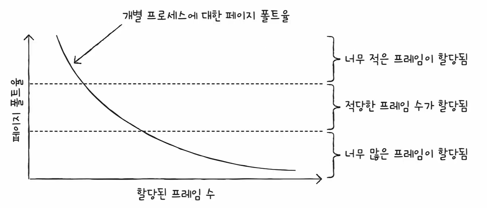

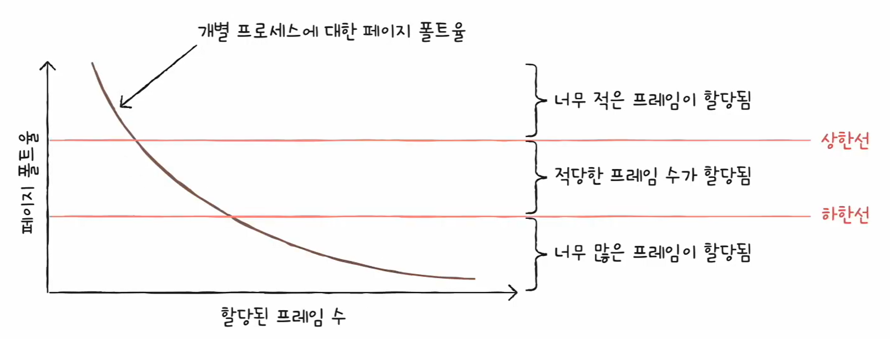

이미지 해설 포인트:
- 가로축: **할당된 프레임 수** / 세로축: **페이지 폴트율**
- 프레임이 늘면 보통 페이지 폴트율이 감소(곡선이 내려감)
- **상한선 위**(폴트율 너무 높음) = “프레임이 너무 적다” → 프레임을 늘려야 함
- **하한선 아래**(폴트율 너무 낮음) = “프레임이 너무 많다” → 프레임을 줄여 다른 프로세스에 나눠줄 여지가 있음
- **상/하한선 사이** = “적절한 프레임 수가 할당됨”

</details>

---

## ✅ 한 줄 요약

- **요구 페이징**: “필요한 페이지만 올리고, 없으면 페이지 폴트로 가져온다”
- **페이지 교체**: “메모리가 꽉 찼을 때 누구를 내보낼까?”
- **좋은 교체 알고리즘**: “페이지 폴트가 적을수록 좋다”
- **FIFO**: “가장 먼저 들어온 페이지부터 내보낸다”
- **2차 기회**: “참조 비트로 한 번 더 살펴보고(기회), 0인 애를 내보낸다”
- **최적(Optimal)**: “미래를 보고 가장 나중에 다시 쓸 페이지를 교체(이론 하한선)”
- **LRU**: “가장 오래 ‘사용하지 않은’ 페이지를 내보낸다”
- **스래싱**: “실행보다 페이징이 더 바빠져 CPU 효율이 급락하는 상태”
- **작업 집합**: “최근 Δt 동안 자주 참조한 페이지 집합 크기만큼 프레임을 준다”
- **PFF**: “페이지 폴트율을 상/하한선 사이로 맞추도록 프레임을 조절한다”
