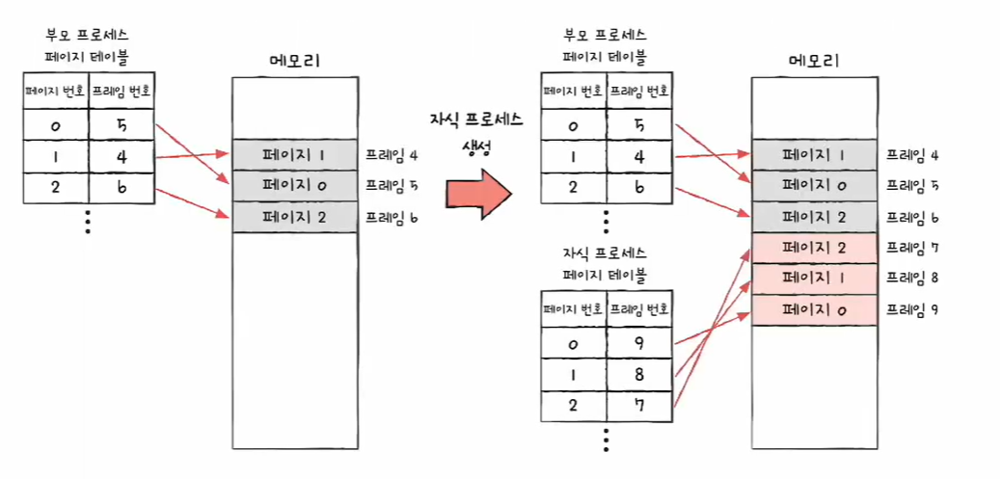
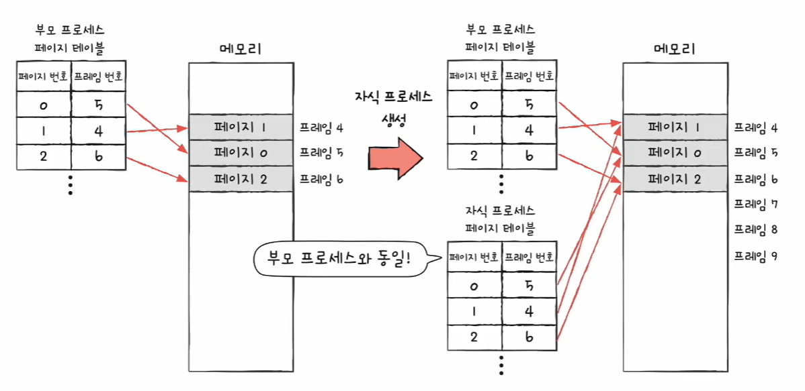
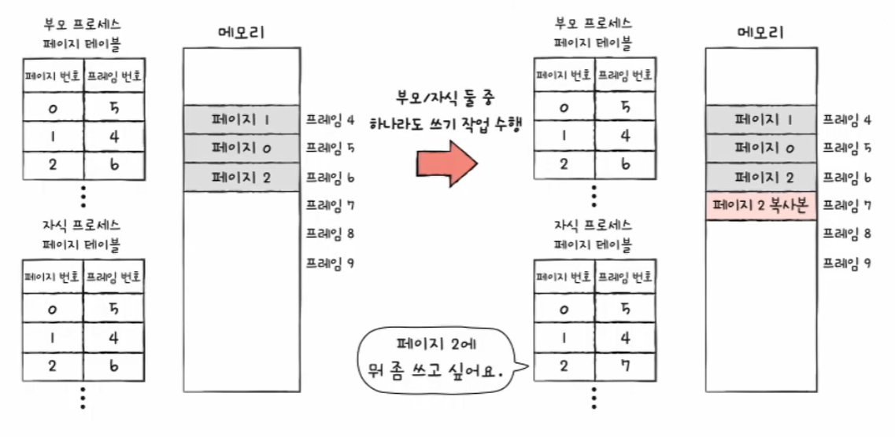
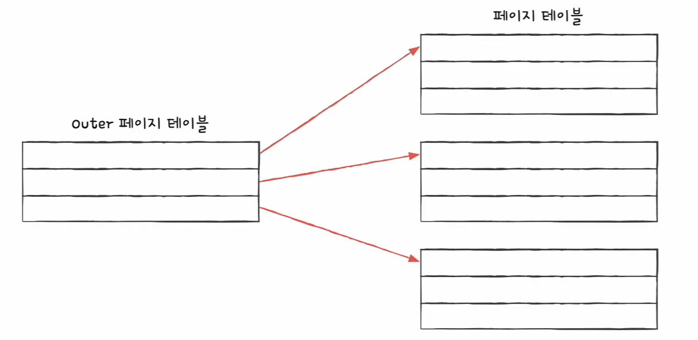
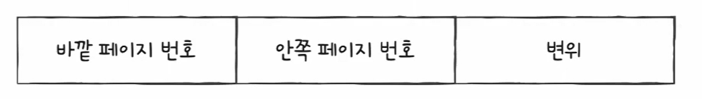
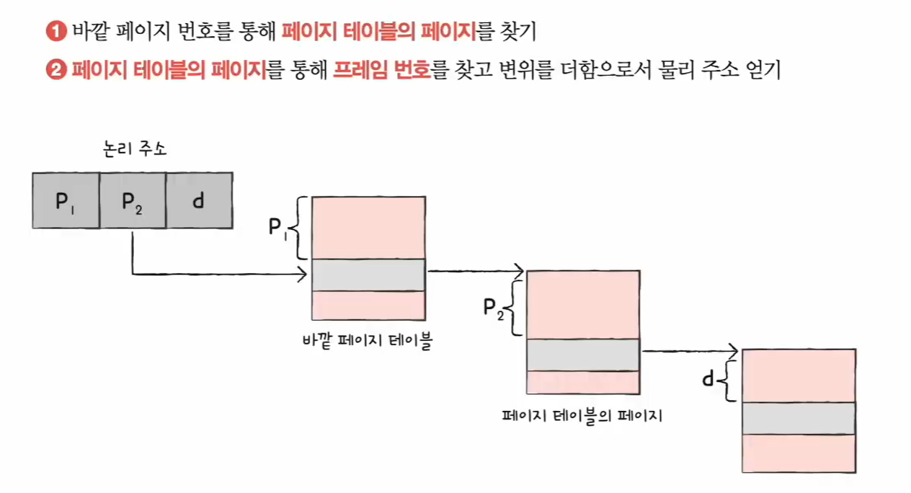

# 🧠 40강 페이징의 이점과 계층적 페이징

페이징 환경에서는

- **프로세스 생성 비용을 줄이는 기법**: `쓰기 시 복사(Copy-on-Write, COW)`
- **페이지 테이블 메모리 낭비를 줄이는 구조**: `계층적 페이징(Multi-level / Hierarchical Paging)`

이 두 가지가 핵심으로 등장한다.  
둘 다 공통적으로 “**필요할 때만 메모리를 더 쓰자**”는 철학을 가진다.

---

## 📚 목차
- [🧠 40강 페이징의 이점과 계층적 페이징](#-40강-페이징의-이점과-계층적-페이징)
  - [📚 목차](#-목차)
  - [🧬 쓰기 시 복사(Copy-on-Write, COW)](#-쓰기-시-복사copy-on-write-cow)
    - [✅ 이론적인 fork()의 문제점](#-이론적인-fork의-문제점)
    - [✅ COW 핵심 아이디어](#-cow-핵심-아이디어)
    - [✅ COW 동작 흐름](#-cow-동작-흐름)
      - [1) fork 직후: “부모와 동일한 프레임을 공유”](#1-fork-직후-부모와-동일한-프레임을-공유)
      - [2) 쓰기 발생: “쓰기하려는 페이지만 복사”](#2-쓰기-발생-쓰기하려는-페이지만-복사)
    - [✅ 정리: COW의 장점](#-정리-cow의-장점)
  - [🏗 계층적 페이징(Hierarchical Paging)](#-계층적-페이징hierarchical-paging)
    - [✅ 왜 페이지 테이블이 문제인가?](#-왜-페이지-테이블이-문제인가)
    - [✅ 계층적 페이징 핵심 구조](#-계층적-페이징-핵심-구조)
    - [✅ 계층적 페이징에서의 논리 주소](#-계층적-페이징에서의-논리-주소)
    - [✅ 논리 주소로 실제 프레임 찾는 과정](#-논리-주소로-실제-프레임-찾는-과정)
    - [✅ 계층이 많아질수록 좋은가?](#-계층이-많아질수록-좋은가)
  - [✅ 한 줄 요약](#-한-줄-요약)

---

## 🧬 쓰기 시 복사(Copy-on-Write, COW)

### ✅ 이론적인 fork()의 문제점
`fork()`를 “이론적으로” 단순 구현하면 다음과 같은 방식이 된다.

- 프로세스는 기본적으로 자원을 공유하지 않는다.
- 따라서 부모 프로세스 전체를 복제해서 **자식 프로세스를 별도 공간에 통째로 적재**한다.
- 결과:
  - ❌ **프로세스 생성 시간이 느려짐** (복제 비용)
  - ❌ **메모리 낭비가 큼** (전체 복제)

📌 **이론적인 fork() (전체 복제)**  
부모가 쓰던 페이지(0,1,2)를 자식이 **새 프레임(7,8,9 등)** 으로 통째로 복사해 갖는 모습을 보여준다.

---

### ✅ COW 핵심 아이디어
쓰기 시 복사(COW)는 위 fork 비용을 줄이기 위해 이렇게 바꾼다.

- `fork()` 직후에는 **복사하지 않는다**
- 대신 부모/자식이 **같은 프레임을 같이 가리키며 공유**한다
- 그러다가 **누군가가 쓰기(write)** 를 하려는 순간에만
  - 해당 **페이지 하나만** 새 공간으로 복제하고(write 수행)

즉,

> ✅ “처음엔 공유, **쓰기 순간에만 복사**”

---

### ✅ COW 동작 흐름

#### 1) fork 직후: “부모와 동일한 프레임을 공유”
부모/자식의 페이지 테이블 엔트리가 **같은 프레임(4,5,6)** 을 가리키고 있는 상태를 보여준다.

- 이 상태에서는 **추가 메모리 복제가 없음**
- 읽기만 한다면 **계속 공유 유지**

#### 2) 쓰기 발생: “쓰기하려는 페이지만 복사”
부모/자식 중 하나가 특정 페이지(예: 페이지 2)에 쓰기 작업을 수행하려고 하면,
그 **페이지 2만** 새 프레임으로 복제하고 페이지 테이블을 새 프레임으로 갱신한다.

- ✅ 실제로 바뀌는 페이지(쓰기 대상)만 복사하므로 메모리 절약
- ✅ fork 직후 “통째 복제”를 안 하니 생성도 빠름

---

### ✅ 정리: COW의 장점
- ⏱️ **프로세스 생성 시간 절약**: fork 시점에 전체 복제를 하지 않음
- 💾 **메모리 절약**: 실제로 변경되는 페이지에 대해서만 추가 메모리 사용
- 🎯 특히 “fork 후 곧바로 exec” 같은 패턴에서 효과가 매우 큼

---

## 🏗 계층적 페이징(Hierarchical Paging)

### ✅ 왜 페이지 테이블이 문제인가?
페이징을 쓰면 주소 변환을 위해 **페이지 테이블(Page Table)** 이 필요하다.  
그런데 페이지 테이블은 생각보다 크다.

- 프로세스의 가상 주소 공간이 크면
- 그에 비례해서 **페이지 테이블 엔트리(PTE)** 도 많아짐
- 모든 PTE를 항상 메모리에 올려두면:
  - ❌ 메모리 낭비가 커짐 (실제로 안 쓰는 영역 PTE도 포함)

---

### ✅ 계층적 페이징 핵심 구조
해결 방법은 간단하다.

> ✅ “**페이지 테이블도 페이징**하자”

- 페이지 테이블을 여러 페이지로 쪼갠다
- 그리고 그 “페이지 테이블의 페이지들”을 가리키는
  - **Outer 페이지 테이블(상위 페이지 테이블)** 을 둔다
- 그래서 **다단계 페이징(Multi-level Paging)** 이라고도 부른다

📌 **Outer 페이지 테이블 → (여러) 페이지 테이블 페이지** 구조

- Outer 페이지 테이블은 “어느 페이지 테이블 페이지를 볼지”를 안내
- 실제 페이지 테이블은 여러 조각으로 나뉘어 필요할 때만 메모리에 올릴 수 있음

---

### ✅ 계층적 페이징에서의 논리 주소
계층적 페이징에서는 논리 주소가 보통 다음처럼 나뉜다.

- **바깥 페이지 번호**: Outer 페이지 테이블에서 인덱싱할 값
- **안쪽 페이지 번호**: 선택된 “페이지 테이블의 페이지”에서 인덱싱할 값
- **변위(offset)**: 프레임 내부에서의 위치

---

### ✅ 논리 주소로 실제 프레임 찾는 과정
논리 주소가 `P1 | P2 | d` 형태라고 할 때, 변환 과정은 다음 순서로 진행된다.

1) `P1`로 **Outer 페이지 테이블**에서 “페이지 테이블의 페이지”를 찾는다  
2) 그 페이지에서 `P2`로 **프레임 번호**를 찾는다  
3) 마지막으로 `d(변위)`를 더해 최종 물리 주소를 만든다

---

### ✅ 계층이 많아질수록 좋은가?
계층적 페이징은 2단계뿐 아니라 3단계, 4단계… 더 늘릴 수도 있다.

- ✅ 장점: 주소 공간이 커져도 페이지 테이블을 “필요한 부분만” 메모리에 올릴 수 있음
- ❗ 단점: 계층이 깊어질수록 주소 변환 시 **참조 단계가 늘어** 성능 비용이 커질 수 있음  
  (특히 페이지 폴트가 걸리면 추가 접근/로딩 비용이 더 커짐)

> 결론: “계층이 많아질수록 무조건 좋은 것”이 아니라, **메모리 절약 vs 주소 변환 비용**을 균형 있게 설계해야 한다.

---

## ✅ 한 줄 요약
- **쓰기 시 복사(COW)**: fork 직후엔 **공유**, 쓰기 순간에만 **해당 페이지만 복사**
- **계층적 페이징**: 페이지 테이블을 쪼개고 **Outer 테이블로 필요한 조각만 로딩**
