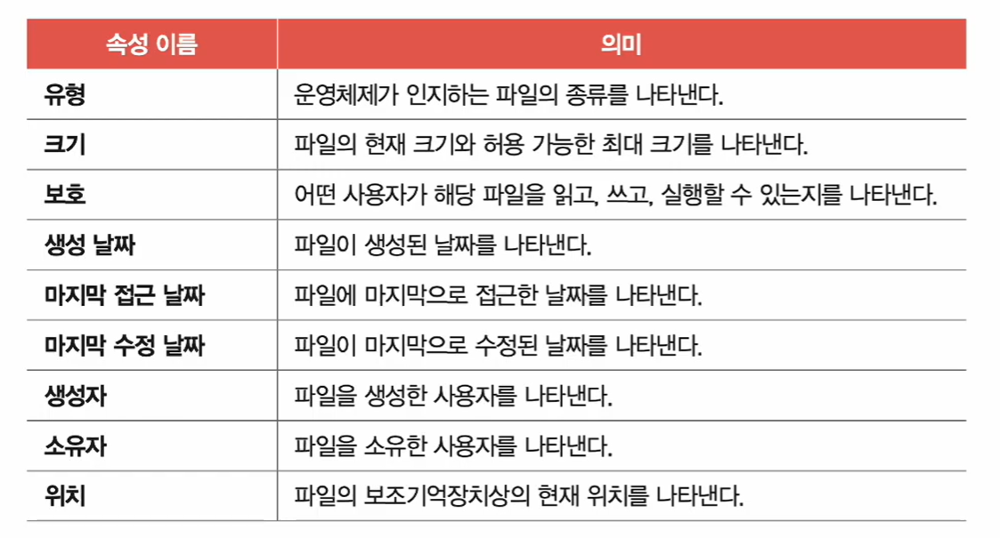
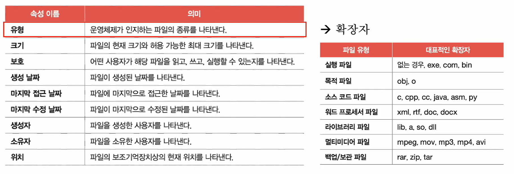
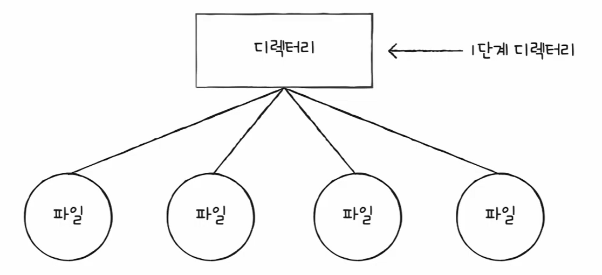
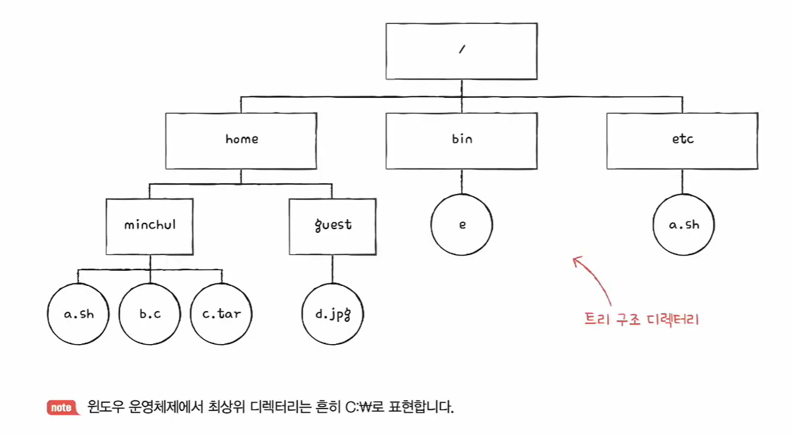
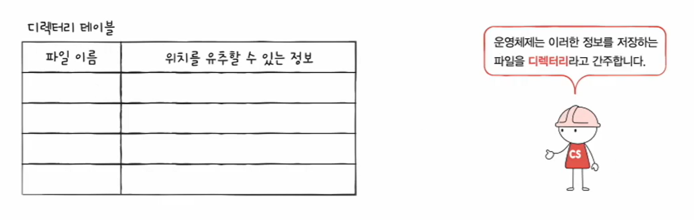
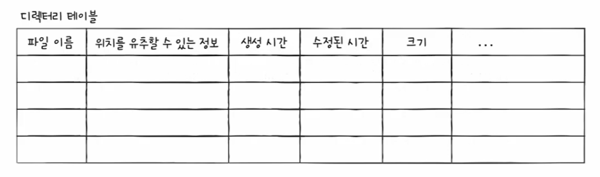
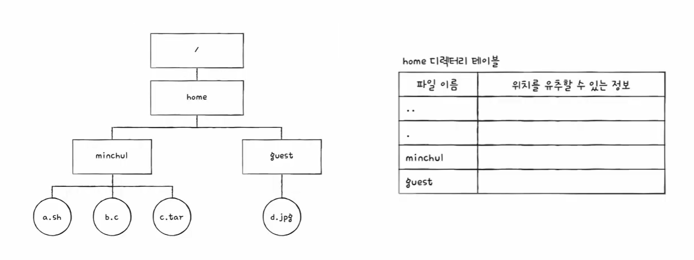
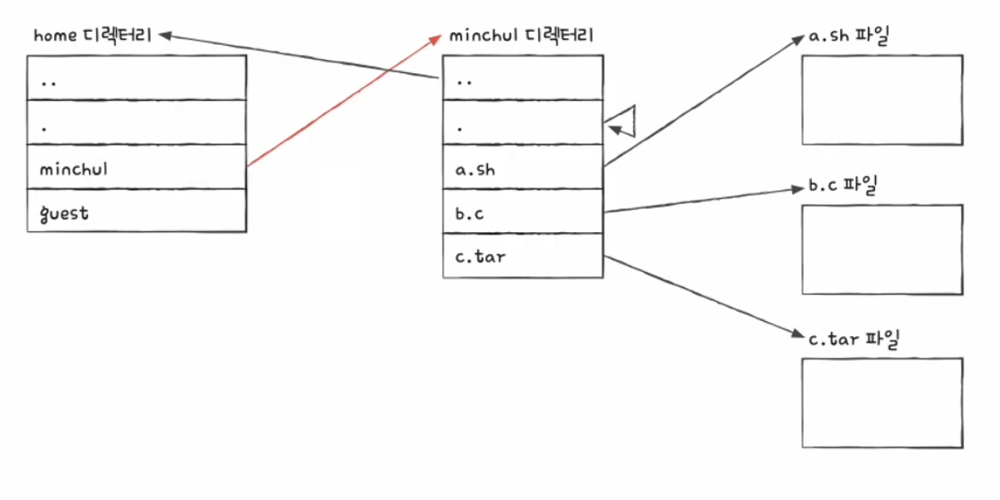

# 🧠 41강 파일과 디렉터리

운영체제는 보조기억장치(디스크/SSD)에 저장된 데이터를 **파일(file)** 과 **디렉터리(directory)** 형태로 관리합니다.  
이 장에서는 “파일이 무엇인지”, “디렉터리가 어떻게 파일을 찾게 해주는지”, 그리고 이를 다루기 위한 **시스템 호출(system call)** 을 정리합니다.

---

## 📚 목차
- [🧠 41강 파일과 디렉터리](#-41강-파일과-디렉터리)
  - [📚 목차](#-목차)
  - [🗂 파일 시스템(file system)](#-파일-시스템file-system)
  - [📦 파일과 디렉터리](#-파일과-디렉터리)
  - [📄 파일(file)](#-파일file)
    - [🧩 파일의 구성](#-파일의-구성)
    - [🏷 파일의 속성(메타데이터)](#-파일의-속성메타데이터)
      - [🖼 그림: 파일 속성(메타데이터) 예시](#-그림-파일-속성메타데이터-예시)
      - [🖼 그림: “유형”을 확장자로 이해하는 예시(대표 확장자)](#-그림-유형을-확장자로-이해하는-예시대표-확장자)
    - [☎️ 파일 연산 시스템 호출](#️-파일-연산-시스템-호출)
  - [📁 디렉터리(directory)](#-디렉터리directory)
    - [📌 1단계 디렉터리](#-1단계-디렉터리)
      - [🖼 그림: 1단계 디렉터리 개념](#-그림-1단계-디렉터리-개념)
    - [🌳 트리 구조(계층적) 디렉터리](#-트리-구조계층적-디렉터리)
      - [🖼 그림: 트리 구조 디렉터리 예시](#-그림-트리-구조-디렉터리-예시)
    - [🧭 경로(Path): 절대 경로 vs 상대 경로](#-경로path-절대-경로-vs-상대-경로)
      - [✅ 절대 경로(Absolute Path)](#-절대-경로absolute-path)
      - [✅ 상대 경로(Relative Path)](#-상대-경로relative-path)
      - [📌 중요한 규칙](#-중요한-규칙)
    - [☎️ 디렉터리 연산 시스템 호출](#️-디렉터리-연산-시스템-호출)
  - [🧾 디렉터리 엔트리(Directory Entry)](#-디렉터리-엔트리directory-entry)
    - [🖼 그림: 디렉터리 엔트리 “기본 형태”](#-그림-디렉터리-엔트리-기본-형태)
    - [🖼 그림: 디렉터리 엔트리에 속성까지 포함되는 경우](#-그림-디렉터리-엔트리에-속성까지-포함되는-경우)
    - [🖼 그림: “트리 구조”와 “디렉터리 테이블(엔트리)”의 연결](#-그림-트리-구조와-디렉터리-테이블엔트리의-연결)
    - [🖼 그림: “엔트리를 따라가며 파일에 도달”하는 과정](#-그림-엔트리를-따라가며-파일에-도달하는-과정)
  - [✅ 한 줄 요약](#-한-줄-요약)

---

## 🗂 파일 시스템(file system)

**파일 시스템(file system)** 은 운영체제 내부에서  
**파일과 디렉터리를 생성/삭제/탐색/보호/저장** 할 수 있도록 관리해주는 구성 요소(프로그램)입니다.

- 파일/디렉터리를 다루는 “규칙 + 자료구조 + 기능”의 집합
- 사용자는 **경로(path)** 로 파일을 찾지만,
  실제로는 파일 시스템이 그 경로를 따라가며 **디스크의 실제 위치** 를 찾아줍니다.

---

## 📦 파일과 디렉터리

- 파일과 디렉터리는 모두 **보조기억장치에 저장되는 데이터 덩어리**
- 운영체제는 이를 “이름”과 “경로”로 다룰 수 있도록 구조화해줍니다.

---

## 📄 파일(file)

**파일(file)** 은 보조기억장치에 저장된 **의미 있고 관련 있는 정보의 집합**입니다.  
즉, 사람이 보기에 “하나의 논리적 단위”가 되도록 데이터를 묶어 놓은 형태입니다.

---

### 🧩 파일의 구성
파일을 이루는 정보는 크게 두 가지로 볼 수 있습니다.

1) **실제 데이터(내용)**  
2) **부가 정보(속성/메타데이터)**  
   - 실행 파일이라면 “실행을 위한 정보”도 포함될 수 있음

---

### 🏷 파일의 속성(메타데이터)
파일에는 내용 외에도 다양한 “설명 정보(속성)”가 붙습니다.

- 유형(type) / 크기(size) / 보호(protection, 권한)
- 생성 날짜 / 마지막 접근 날짜 / 마지막 수정 날짜
- 생성자 / 소유자
- 위치(location) 등

#### 🖼 그림: 파일 속성(메타데이터) 예시

> 파일에 붙는 대표적인 속성(메타데이터) 항목들: 유형, 크기, 보호, 생성/접근/수정 시간, 생성자/소유자, 위치 등

#### 🖼 그림: “유형”을 확장자로 이해하는 예시(대표 확장자)

> 운영체제가 인지하는 파일 “유형”을 사용자는 확장자(.exe, .jpg, .c, .zip 등)로 직관적으로 구분하는 경우가 많음  
> (단, 실제 파일 시스템/OS마다 “유형을 판단하는 방식”은 다를 수 있음)

---

### ☎️ 파일 연산 시스템 호출
운영체제가 파일을 다룰 때 제공하는 대표적인 시스템 호출(기능)은 다음과 같습니다.

1. 파일 생성(Create)
2. 파일 삭제(Delete)
3. 파일 열기(Open)
4. 파일 닫기(Close)
5. 파일 읽기(Read)
6. 파일 쓰기(Write)
7. 기타(이름 변경, 권한 변경, 속성 조회 등)

---

## 📁 디렉터리(directory)

- 윈도우에서는 **폴더(folder)** 라고 부릅니다.
- 디렉터리는 파일/폴더를 “정리해서 담는” 용도이며,
  현대 OS는 보통 **계층적(트리) 구조**로 디렉터리를 구성합니다.
- 최상위 디렉터리를 **루트 디렉터리(root directory, `/`)** 라고 합니다.

---

### 📌 1단계 디렉터리
과거(또는 개념 설명)에서는 **1단계(단일 레벨) 디렉터리**를 예로 들 수 있습니다.

#### 🖼 그림: 1단계 디렉터리 개념

> “디렉터리 하나 아래에 파일들이 쭉 달리는” 단순 구조(1단계 디렉터리)  
> 단점: 파일이 많아질수록 정리/검색이 어렵고, 이름 충돌 문제가 커짐

---

### 🌳 트리 구조(계층적) 디렉터리
현대 운영체제는 파일/디렉터리를 **여러 계층으로 관리하는 트리 구조**를 사용합니다.

#### 🖼 그림: 트리 구조 디렉터리 예시

> 루트(`/`) 아래에 `home`, `bin`, `etc` 같은 디렉터리가 있고  
> 각 디렉터리 아래에 하위 디렉터리/파일이 이어지는 “계층적” 구조  
> (윈도우에서는 루트를 보통 `C:\` 같은 드라이브로 표현하기도 함)

---

### 🧭 경로(Path): 절대 경로 vs 상대 경로

**경로(path)** 는 디렉터리를 따라가며 파일/디렉터리의 위치(이름 포함)를 특정하는 정보입니다.

#### ✅ 절대 경로(Absolute Path)
- **루트(`/`)부터 시작**하는 고유한 경로
- 예: `/home/minchul/a.sh`

#### ✅ 상대 경로(Relative Path)
- **현재 디렉터리 기준으로 시작**하는 경로
- 예: 현재 디렉터리가 `/home` 라면 `guest/d.jpg`

#### 📌 중요한 규칙
- 같은 디렉터리 안에서는 동일한 이름의 파일이 공존할 수 없음
- 다른 디렉터리라면 같은 이름의 파일이 존재할 수 있음  
  → 그래서 경로(path)가 중요

---

### ☎️ 디렉터리 연산 시스템 호출
디렉터리도 운영체제가 관리하는 대상이므로 관련 호출이 존재합니다.

1. 디렉터리 생성(Create)
2. 디렉터리 삭제(Delete)
3. 디렉터리 열기(Open)
4. 디렉터리 닫기(Close)
5. 디렉터리 읽기(Read)
6. 기타(이름 변경, 이동, 권한 변경 등)

---

## 🧾 디렉터리 엔트리(Directory Entry)

많은 운영체제에서는 디렉터리를 **“특별한 형태의 파일”** 로 간주합니다.  
즉, 디렉터리도 파일처럼 내부에 데이터가 있는데, 그 데이터가 “목록 정보”라는 점이 특별합니다.

- **일반 파일 내부**: 실제 내용 데이터
- **디렉터리 내부**: “이 디렉터리에 무엇이 들어있는지”를 나타내는 **테이블(표)**

디렉터리 엔트리(표의 한 행)는 보통 다음을 담습니다.
- 포함된 대상의 **이름**
- 대상이 보조기억장치에 저장된 **위치를 유추할 수 있는 정보**
  (예: inode 번호, 포인터, 클러스터 정보 등 / 파일 시스템마다 다름)
- 경우에 따라 생성/수정 시간, 크기 같은 속성을 함께 저장하기도 함

---

### 🖼 그림: 디렉터리 엔트리 “기본 형태”

> 디렉터리는 “파일 이름”과 “위치를 유추할 수 있는 정보”를 표 형태로 저장하며  
> 운영체제는 이런 정보를 저장하는 파일을 **디렉터리**로 취급한다는 핵심 메시지

### 🖼 그림: 디렉터리 엔트리에 속성까지 포함되는 경우

> 디렉터리 엔트리가 단순히 이름/위치만이 아니라  
> 생성 시간, 수정 시간, 크기 등 추가 속성을 함께 가질 수도 있음(파일 시스템마다 차이)

---

### 🖼 그림: “트리 구조”와 “디렉터리 테이블(엔트리)”의 연결

> 왼쪽은 `/home` 아래에 `minchul`, `guest`가 있는 트리 구조 예시  
> 오른쪽은 `home 디렉터리 테이블`(엔트리)로, 내부에 `minchul`, `guest` 같은 항목이 기록됨  
> 특히 `.`(현재 디렉터리), `..`(부모 디렉터리) 같은 특수 엔트리가 등장할 수 있음

### 🖼 그림: “엔트리를 따라가며 파일에 도달”하는 과정

> `home 디렉터리`의 엔트리에서 `minchul`을 찾고 →  
> `minchul 디렉터리`의 엔트리에서 `a.sh`, `b.c`, `c.tar`를 찾고 →  
> 각 파일의 실제 데이터(내용)로 연결되는 흐름을 보여줌  
> ✅ 결론: 운영체제는 “이름”을 바로 디스크에서 찾는 게 아니라, **디렉터리 엔트리를 단계적으로 따라가며 위치를 해석**한다.

---

## ✅ 한 줄 요약
- **파일**: “의미 있는 데이터 묶음 + 메타데이터(속성)”
- **디렉터리**: “(이름 → 위치정보) 목록을 표(엔트리)로 저장하는 특별한 파일”
- **경로(path)**: “디렉터리 엔트리를 따라가며 대상을 찾는 주소”
- 운영체제는 시스템 호출로 파일/디렉터리를 생성/삭제/열기/읽기/쓰기 등으로 다룬다.
